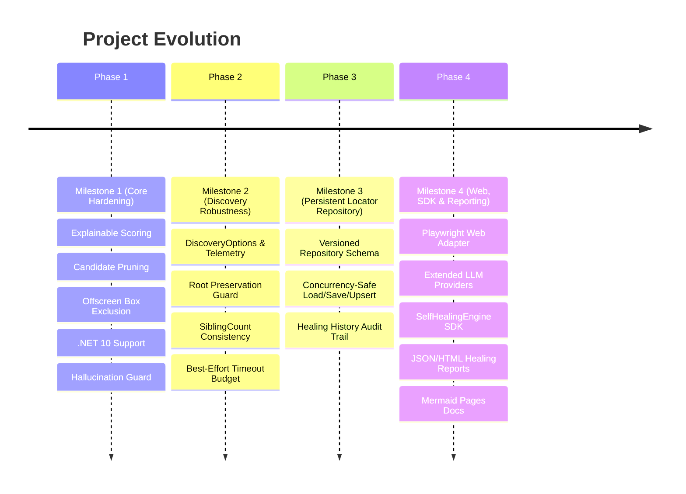
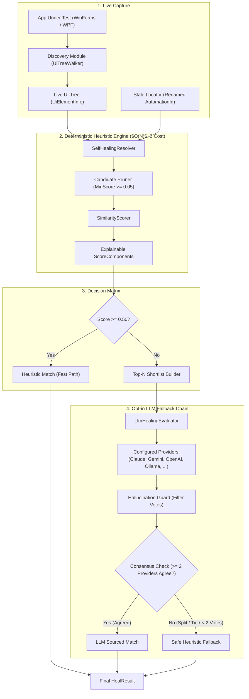
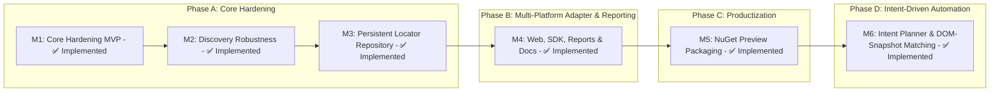
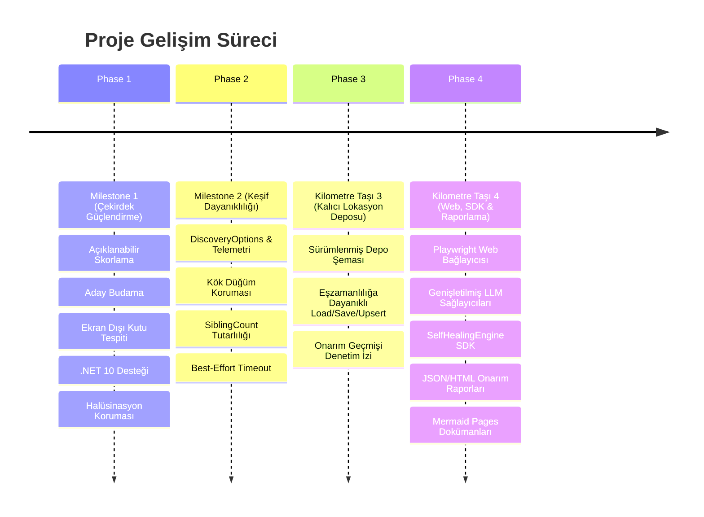
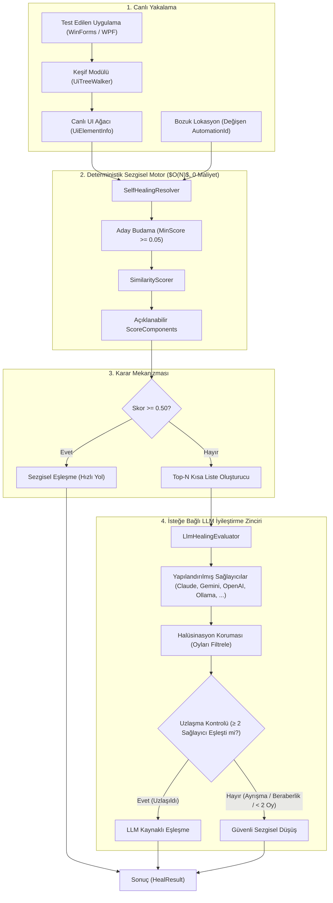
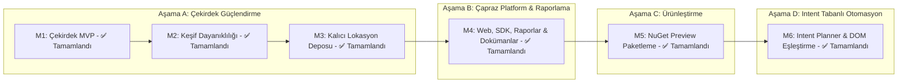

# 🚀 Automation Sandbox — Project Showcase & Architecture Presentation
### *A Transparent, Explainable, and Self-Healing Test Automation Engine*

> 💡 **Language Selection / Dil Seçimi:** Select below to toggle between English and Turkish presentations.

---

<details open>
<summary><h2>🇬🇧 View English Presentation (Click to Collapse)</h2></summary>

## 📌 Executive Summary

| Metric | Value | Notes |
| :--- | :---: | :--- |
| **Heuristic Speed** | **Sub-50ms (Indicative)** | For 3,000+ UI controls ($O(N)$ complexity, 0 cost), measured on developer hardware (~23ms) — see `SyntheticTreeBenchmarkTests`. |
| **Target Frameworks** | `.NET Standard 2.0`, `.NET 8`, `.NET 10`, `.NET 4.8` | Cross-platform core + Windows UIA FlaUI connectors. |
| **Healing Accuracy** | **Multi-Signal Organic Benchmark** | 100% on bundled demo apps; empirically evaluated across 176 multi-signal scenarios on HandBrake 1.8.2 — see [docs/benchmark-calibration.md](docs/benchmark-calibration.md). |
| **LLM Guard Safety** | **Hallucination Guard** | Verifies candidate IDs against shortlist before applying match. |

Commercial test automation suites (such as Ranorex or Tosca) keep object repositories and locator self-healing algorithms inside proprietary black boxes. **Automation Sandbox** is an open alternative to the black-box locator recovery in those tools. It combines deterministic structural similarity scoring with an opt-in LLM fallback chain, resolving standard layout changes in tens of milliseconds for 3,000+ controls (developer hardware, $O(N)$) without incurring AI API costs.

---

## 🏆 Key Milestones Accomplished



### 1️⃣ Milestone 1: Core Hardening MVP
* **Explainable Scoring:** Breakdown of similarity score into 5 independent components (`ControlType`, `ParentControlType`, `SiblingPosition`, `Name`, `Position`).
* **Unusable Rectangle Handling:** Dynamic exclusion of offscreen `(0,0,0,0)` bounding boxes from position weights.
* **Candidate Pruning & Shortlist:** Filtering out low-scoring decoys ($Score < 0.05$) to construct a concise Top-N shortlist ($N \le 20$) for LLMs.
* **Hallucination Guard:** Strict validation ensuring LLM response returns a `candidateId` present in the shortlist before accepting the match.

### 2️⃣ Milestone 2: Discovery Robustness & Telemetry
* **`DiscoveryOptions` & `DiscoveryResult`:** Traversal parameters (`MaxDepth`, `MaxElements`, `Timeout`, `IncludeOffscreen`, `IgnoredControlTypes`, `IgnoredClassNames`) and full diagnostic telemetry counters.
* **Root Preservation Guard (`depth > 0`):** Ensuring the anchor root element is never filtered out by control filters.
* **`SiblingCount` Consistency:** Calculating sibling count based on valid captured tree nodes to preserve mathematical ratios for similarity scoring.

### 3️⃣ Milestone 3: Persistent Locator Repository
* **Versioned Repository Schema:** JSON storage (`LocatorRepositoryDocument`), thread-safe file lock synchronization, and healing history audit trail (`LocatorHealingHistoryEntry`).

### 4️⃣ Milestone 4: Web Playwright Adapter, Extended LLM Providers, Reports & Docs
* **Playwright Web Adapter:** `PlaywrightDomCaptureScript` supporting Shadow DOM, iframe traversal, and hidden/offscreen CSS detection; `PlaywrightApplicationConnector` for JSON tree parsing.
* **Extended LLM Providers:** Added `OpenAiHealingProvider` (`gpt-4o-mini`) and offline, zero-cost `OllamaHealingProvider` (`llama3.2`) alongside Claude and Gemini.
* **High-Level `SelfHealingEngine` SDK:** Unified wrapper connecting `LocatorRepository`, `SelfHealingResolver`, and LLM providers with an automatic repository update only after the healed action retry succeeds (`ExecuteWithHealingAsync`), guarded by an opt-in `shouldHeal` exception-classification policy (default: locator-resolution failures only).
* **Healing Reports & CI Artifacts:** Schema-v7 JSON and HTML reports capture every resolution attempt, including accepted, ambiguous, no-consensus, provider-error, and retry-failed outcomes, while retaining an accepted-only compatibility view.
* **GitHub Pages Documentation:** Jekyll-based documentation site with Mermaid diagram rendering for architecture, workflow, and roadmap diagrams.


---

## 🏛️ System Architecture



---

## 📊 Mathematical Scoring Breakdown

$$\text{TotalScore} = \frac{\sum (S_i \cdot W_i)}{\sum W_i} \quad \text{where } S_i \in [0.0, 1.0]$$

| Component | Default Weight | Calculation Logic |
| :--- | :---: | :--- |
| **`ControlTypeScore`** | `0.20` | Exact match on UIA control type (`1.0` if equal, else `0.0`). |
| **`ParentControlTypeScore`** | `0.20` | Parent container type similarity (`1.0` if equal, else `0.0`). |
| **`SiblingPositionScore`** | `0.15` | Proportional index distance: $1.0 - \frac{\|idx_{exp} - idx_{cand}\|}{\max(cnt_{exp}, cnt_{cand})}$. |
| **`NameScore`** | `0.20` | Normalized Levenshtein distance on control label text: $1.0 - \frac{\text{Levenshtein}(a,b)}{\max(\text{len}_a, \text{len}_b)}$. |
| **`PositionScore`** | `0.25` | Euclidean center-point distance score within `PositionToleranceRadius` ($300\text{px}$). |

> [!NOTE]
> **Missing signals score `null`, not `1.0`:** when both sides lack a signal (empty `Name`, empty `ParentControlType`, zero sibling metadata, unusable bounding box), the signal drops out of the weighted average entirely. A heuristic match is `IsConfident` only when `Score >= MinimumConfidence` **and** `EvidenceCoverage >= MinimumEvidenceWeight` ($0.40$), so a ControlType-only $1.0$ (coverage $0.20$) is never accepted as confident.

---

## 🔬 Framework Case Studies

### 1️⃣ WinForms (`net48`): The Auto-Generated `panel1` Issue
* **Problem:** WinForms surfaces `Control.Name` as `AutomationId`. Auto-generated names like `panel1` are often left unrenamed in legacy code bases and break easily.
* **Solution:** `SelfHealingResolver` ignores `AutomationId` during scoring and successfully matches `panel1` using parent context, sibling index, and bounding rectangle bounds.

### 2️⃣ WPF (`net8`/`net10`): The Missing `AutomationId` Issue
* **Problem:** WPF does **not** infer `AutomationId` from `x:Name`. Controls without explicit `AutomationProperties.AutomationId` return empty strings.
* **Solution:** `SelfHealingResolver` identifies `CompanyPanel` using `ControlType.Group`, parent/sibling position, and header label text.

---

## 💻 Showcase Code Examples

### 1. Robust Discovery with Options & Telemetry
```csharp
using Discovery;
using System.Threading;

var options = new DiscoveryOptions
{
    MaxDepth = 15,
    MaxElements = 3000,
    Timeout = TimeSpan.FromSeconds(5),
    IncludeOffscreen = false,
    IgnoredControlTypes = new HashSet<string> { "Custom", "ScrollBar" }
};

using var cts = new CancellationTokenSource(TimeSpan.FromSeconds(5));

DiscoveryResult result = UiTreeWalker.Discover(window, options, cts.Token);

Console.WriteLine($"Captured {result.CapturedCount} controls in {result.Elapsed.TotalMilliseconds:F0}ms");
Console.WriteLine($"Visited: {result.VisitedCount}, Skipped: {result.SkippedCount}, Errors: {result.ErrorCount}");
```

### 2. Heuristic Resolution & Explainability
```csharp
using UiModel;
using SelfHealing;

var expected = UiElementSnapshot.FromJson(File.ReadAllText("Snapshots/txtEmail.json"));
var liveTree = UiTreeWalker.BuildTree(window);

var result = SelfHealingResolver.Resolve(expected, liveTree);

if (result.IsConfident)
{
    Console.WriteLine($"[Healed] Matched '{result.Matched!.AutomationId}' with score {result.Score:F2}");
}
```

---

## 🗺️ Roadmap & Future Phases



</details>

---

<details open>
<summary><h2>🇹🇷 Türkçe Sunumu Görüntüle (Kapatmak İçin Tıklayın)</h2></summary>

## 📌 Üst Düzey Özet

| Metrik | Değer | Notlar |
| :--- | :---: | :--- |
| **Sezgisel Hız** | **50ms Altı (Gösterge)** | 3.000+ UI kontrolü için ($O(N)$ karmaşıklık, 0 maliyet); geliştirici donanımında ölçüldü (~23ms) — bkz. `SyntheticTreeBenchmarkTests`. |
| **Hedef Platformlar** | `.NET Standard 2.0`, `.NET 8`, `.NET 10`, `.NET 4.8` | Çapraz platform çekirdek + Windows UIA FlaUI bağlayıcıları. |
| **İyileştirme Doğruluğu** | **Çoklu Sinyal Organik Benchmark** | Demo takımında %100; gerçek organik uygulamada (HandBrake 1.8.2, 176 senaryo) çoklu sinyal drifti ile kalibre edildi — bkz. [docs/benchmark-calibration.md](docs/benchmark-calibration.md). |
| **LLM Güvenlik Koruması** | **Hallucination Guard** | Eşleşmeyi uygulamadan önce aday kimliğini kısa listede doğrular. |

Ranorex ve Tosca gibi ticari otomasyon araçları, nesne depolarını ve kendi kendini iyileştirme (self-healing) algoritmalarını kapalı kutu (black box) olarak sunarlar. **Automation Sandbox**, bu araçlardaki kapalı kutu locator kurtarmaya açık kaynaklı bir alternatiftir. Deterministik yapısal benzerlik skorlamasını isteğe bağlı LLM (Claude/Gemini) zinciriyle birleştirir; standart arayüz değişikliklerini API maliyeti yaratmadan, 3.000+ kontrol için onlarca milisaniye içinde (geliştirici donanımı, $O(N)$) çözer.

---

## 🏆 Tamamlanan Kilometre Taşları



### 1️⃣ Milestone 1: Çekirdek Güçlendirme MVP
* **Açıklanabilir Skorlama:** Benzerlik skorunun 5 bağımsız bileşene (`ControlType`, `ParentControlType`, `SiblingPosition`, `Name`, `Position`) ayrıştırılması.
* **Ekran Dışı Kutu Yönetimi:** Görünmeyen `(0,0,0,0)` kutularının konum ağırlığından dinamik olarak çıkarılması.
* **Aday Budama & Kısa Liste:** Düşük skorlu elemanların ($Score < 0.05$) elenerek LLM için yaklaşık 500 token'lık Top-N kısa liste hazırlanması.
* **Halüsinasyon Koruması:** LLM cevabının kısa listede var olan bir `candidateId` içerdiğini doğrulayan güvenlik mekanizması.

### 2️⃣ Milestone 2: Keşif Dayanıklılığı & Telemetri
* **`DiscoveryOptions` & `DiscoveryResult`:** Taramayı sınırlayan parametreler (`MaxDepth`, `MaxElements`, `Timeout`, `IncludeOffscreen`, `IgnoredControlTypes`, `IgnoredClassNames`) ve detaylı teşhis sayaçları.
* **Kök Düğüm Koruması (`depth > 0`):** Ana pencerenin (`Root`) filtreler tarafından silinmesini önleyen koruma katmanı.
* **`SiblingCount` Tutarlılığı:** Kardeş eleman sayısının filtrelenmiş geçerli elemanlar üzerinden hesaplanarak konum skor oranının korunması.

### 3️⃣ Milestone 3: Kalıcı Lokasyon Deposu
* **Sürümlenmiş Depo Şeması:** `LocatorRepositoryDocument`, eşzamanlı dosya kilidi ve `LocatorHealingHistoryEntry` ile denetlenebilir onarım geçmişi.

### 4️⃣ Milestone 4: Web, SDK, Raporlama & Dokümantasyon
* **Playwright Web Bağlayıcısı:** Shadow DOM, iframe ve hidden/offscreen CSS tespitiyle web DOM ağacını ortak `UiElementInfo` modeline taşır.
* **Genişletilmiş LLM Sağlayıcıları:** Claude ve Gemini yanında OpenAI ve yerel/offline Ollama desteği.
* **SelfHealingEngine SDK:** Locator repository, resolver ve LLM sağlayıcılarını tek yüksek seviyeli API ile birleştirir; önerilen locator'ı yalnızca iyileştirilmiş eylem denemesi başarılı olduktan sonra repository'ye kaydeder.
* **Onarım Raporları:** Şema-v7 JSON + HTML raporları kabul edilen, belirsiz, uzlaşmasız, sağlayıcı hatalı ve retry başarısız tüm çözüm denemelerini kaydeder; yalnızca kabul edilenler için geriye uyumlu görünümü korur.
* **GitHub Pages Dokümanları:** Mermaid diyagramlarını render eden Jekyll tabanlı dokümantasyon sitesi.

---

## 🏛️ Sistem Mimarisi



---

## 📊 Matematiksel Skorlama Mantığı

$$\text{ToplamSkor} = \frac{\sum (S_i \cdot W_i)}{\sum W_i} \quad \text{burada } S_i \in [0.0, 1.0]$$

| Bileşen | Varsayılan Ağırlık | Hesaplama Mantığı |
| :--- | :---: | :--- |
| **`ControlTypeScore`** | `0.20` | UIA kontrol tipi tam eşleşmesi (Eşitse `1.0`, değilse `0.0`). |
| **`ParentControlTypeScore`** | `0.20` | Üst kapsayıcı tipi benzerliği (Eşitse `1.0`, değilse `0.0`). |
| **`SiblingPositionScore`** | `0.15` | Oransal indeks mesafesi: $1.0 - \frac{\|idx_{exp} - idx_{cand}\|}{\max(cnt_{exp}, cnt_{cand})}$. |
| **`NameScore`** | `0.20` | Etiket metni üzerindeki normalize Levenshtein mesafesi: $1.0 - \frac{\text{Levenshtein}(a,b)}{\max(\text{len}_a, \text{len}_b)}$. |
| **`PositionScore`** | `0.25` | `PositionToleranceRadius` ($300\text{px}$) içinde Öklid merkez noktası mesafesi. |

> [!NOTE]
> **Eksik sinyal `1.0` değil `null` döner:** her iki tarafta da sinyal yoksa (boş `Name`, boş `ParentControlType`, sıfır kardeş metadata'sı, kullanılamaz çerçeve) sinyal ağırlıklı ortalamadan tamamen çıkarılır. Bir heuristic eşleşme ancak `Skor >= MinimumConfidence` **ve** `EvidenceCoverage >= MinimumEvidenceWeight` ($0.40$) ise `IsConfident` olur — bu yüzden yalnızca ControlType'a dayanan bir $1.0$ (kapsam $0.20$) asla güvenilir sayılmaz.

---

## 🔬 Canlı Örnek Senaryolar

### 1️⃣ WinForms (`net48`): Otomatik Üretilen `panel1` İsim Sorunu
* **Problem:** WinForms `Control.Name` değerini `AutomationId` olarak sunar. Eski kodlarda `panel1` gibi otomatik isimler değiştirilmeden bırakılır ve testleri kolayca bozar.
* **Çözüm:** `SelfHealingResolver` skorlama sırasında `AutomationId` değerini yok sayarak `panel1` elemanını üst kapsayıcı, kardeş indeksi ve ekran koordinatları ile %100 eşleştirir.

### 2️⃣ WPF (`net8`/`net10`): Eksik `AutomationId` Sorunu
* **Problem:** WPF `x:Name` değerini `AutomationId` olarak **aktarmaz**. Açıkça `AutomationProperties.AutomationId` tanımlanmamış elemanlar boş string döner.
* **Çözüm:** `SelfHealingResolver` `CompanyPanel` elemanını `ControlType.Group`, kardeş pozisyonu ve başlık etiket metninden tespit eder.

---

## 💻 Örnek Kod Kullanımları

### 1. Detaylı Ağaç Keşfi ve Telemetri
```csharp
using Discovery;
using System.Threading;

var options = new DiscoveryOptions
{
    MaxDepth = 15,
    MaxElements = 3000,
    Timeout = TimeSpan.FromSeconds(5),
    IncludeOffscreen = false,
    IgnoredControlTypes = new HashSet<string> { "Custom", "ScrollBar" }
};

using var cts = new CancellationTokenSource(TimeSpan.FromSeconds(5));

DiscoveryResult result = UiTreeWalker.Discover(window, options, cts.Token);

Console.WriteLine($"Yakalanan kontrol: {result.CapturedCount} ({result.Elapsed.TotalMilliseconds:F0}ms)");
Console.WriteLine($"Ziyaret Edilen: {result.VisitedCount}, Atlanan: {result.SkippedCount}, Hata: {result.ErrorCount}");
```

### 2. Sezgisel İyileştirme ve Açıklanabilirlik
```csharp
using UiModel;
using SelfHealing;

var expected = UiElementSnapshot.FromJson(File.ReadAllText("Snapshots/txtEmail.json"));
var liveTree = UiTreeWalker.BuildTree(window);

var result = SelfHealingResolver.Resolve(expected, liveTree);

if (result.IsConfident)
{
    Console.WriteLine($"[İyileştirildi] '{result.Matched!.AutomationId}' eşleşti (Skor: {result.Score:F2})");
}
```

---

## 🗺️ Gelecek Yol Haritası



</details>

---
*Created with ❤️ by **Mustafa Sercan SAK** & **Antigravity AI Pair Programmer***
