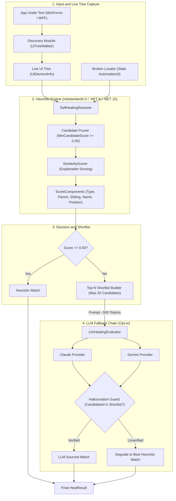
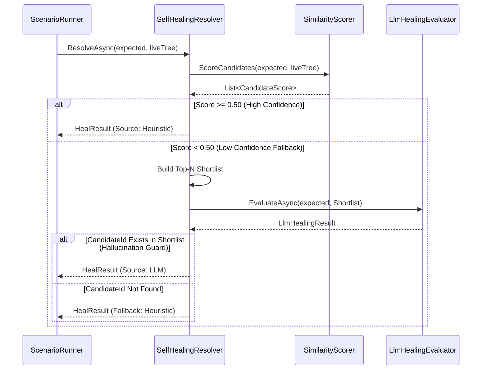
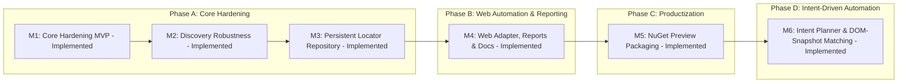

# Automation Sandbox


A transparent, **explainable**, and **self-healing UI test automation engine** built on top of [FlaUI](https://github.com/FlaUI/FlaUI) (.NET, Microsoft UI Automation) for Windows desktop (WinForms & WPF) applications.

Commercial test automation tools (e.g. Ranorex, Tosca) hide object repositories and locator recovery behind proprietary black boxes. **Automation Sandbox** provides an open, modular alternative centered on a **pure-heuristic structural similarity engine** ($12\text{ms}$ for 3,000 controls, 0 cost), supplemented by an **explainable component scorer** and an opt-in **LLM shortlist fallback chain**.

---

> 📚 **Documentation Hub & GitHub Pages:** For complete guides, detailed architecture, JSON schemas, and API references, visit our [**Documentation Hub**](docs/index.md).

> 📦 **Milestone 5 Preview Packaging:** NuGet artifact generation is available through the manual [Pack workflow](.github/workflows/pack.yml), and preview package files can be attached to GitHub Releases through [Release Preview Packages](.github/workflows/release.yml). See the [NuGet Packaging Guide](docs/nuget-packaging.md).

> 🎤 **Project Showcase:** For a bilingual (EN/TR) architecture presentation and executive summary, see [PROJECT_SHOWCASE.md](PROJECT_SHOWCASE.md).

---

## 📌 Implementation Status

| Feature / Module | Status | Description |
| :--- | :---: | :--- |
| **Heuristic Self-Healing** | ✅ Implemented | Pure C# structural similarity scoring ($O(N)$ execution, zero-cost, deterministic). |
| **Explainable Scoring** | ✅ Implemented | `ScoreComponents` breakdown (ControlType, Parent, Sibling, Name, Position). |
| **Offscreen Rectangle Handling** | ✅ Implemented | Dynamic exclusion of unusable `(0,0,0,0)` bounding boxes from position weights. |
| **Candidate Pruning & Shortlist** | ✅ Implemented | `MinCandidateScore` filtering and Top-N shortlist assembly (~500 token LLM prompt). |
| **LLM Fallback & Guard** | ✅ Implemented | Gemini, Claude, OpenAI, and offline Ollama providers with **Hallucination Guard**. |
| **Offline AI Healing (Ollama)** | ✅ Implemented | 100% offline, zero-cost local LLM healing with `llama3.2` via `OllamaHealingProvider`. |
| **High-Level `SelfHealingEngine`** | ✅ Implemented | Automatic repository load, healing resolution, repository auto-upsert, and policy-guarded action retry (`shouldHeal`; default heals exact locator-resolution exception types only, reducing the risk that non-idempotent actions are blindly re-run). |
| **Intent-Aware Healing** | ✅ Implemented | `TestIntent` metadata guiding LLM providers for refactoring-resilient healing. |
| **Healing Reports & CI Artifacts** | ✅ Implemented | JSON + HTML report artifacts for accepted healing events, including before/after snapshots, confidence, source, and review status. |
| **Synthetic Benchmarks** | ✅ Implemented | Pure logic benchmark tests on 3,000+ control trees; core targets `netstandard2.0` so these can run on Linux/macOS, though CI itself currently only runs on Windows. |
| **WinForms & WPF Live Tests** | ✅ Implemented | Real UIA scenario tests against `WinFormsApp` and `WpfApp` on Windows CI. |
| **Discovery Options & Telemetry** | ✅ Implemented | `DiscoveryOptions` (MaxDepth, MaxElements, Timeout, CancellationToken, IgnoredFilters). |
| **Locator Repository JSON** | ✅ Implemented | Versioned repository DTOs/serializer, stable `LocatorKey`, healing history contract, and thread-safe file locking. |
| **Playwright Web Automation** | ✅ Implemented | `WebDiscovery` DOM snapshot model, Shadow DOM / iframe traversal, `PlaywrightApplicationConnector`, and Playwright locator emitter. |
| **NuGet Preview Packaging** | ✅ Implemented | Seven validated `AutomationSandbox.*` packages with README/license/repository metadata, symbol packages, manual artifact packaging, and GitHub prerelease assets. |
| **Intent-Driven Automation** | ✅ Implemented | `AutomationSandbox.IntentAutomation` includes intent contracts, both a deterministic and an opt-in LLM-backed (`LlmIntentPlanner`, guarded with fallback) planner, DOM matching against captured `WebDiscovery` snapshots, locator recording, Playwright C#/TypeScript generation, intent flow reports, and an end-to-end pipeline API. See [Intent-Driven Automation guide](docs/intent-driven-automation.md#current-capability). |
| **Desktop Intent Automation** | ✅ Implemented | `IntentDesktopAutomationPipeline` mirrors the web intent pipeline for Windows desktop apps: matches intent steps against a live `UiElementInfo` tree (`IntentDesktopExplorationBridge`), records accepted locators, and generates an xUnit + FlaUI test skeleton (`FlaUiCSharpTestGenerator`) built on this project's own `Discovery.ApplicationConnector`. |
| **Live Page Exploration** | ✅ Implemented | `PlaywrightLiveExplorer` (`AutomationSandbox.PlaywrightLiveExploration`) launches a browser, navigates to a URL, and captures a `WebElementInfo` DOM snapshot directly via the Microsoft.Playwright .NET SDK — no hand-written Playwright test, and (deliberately) no Node.js-based MCP server. See [why](docs/intent-driven-automation.md#3-live-page-exploration). |

---

## 🏛️ System Architecture

The core logic (`UiModel`, `SelfHealing`, `LlmHealing`) targets `netstandard2.0`, `.NET 8`, and `.NET 10` with **zero FlaUI/Windows dependency**, allowing the heuristic engine, scoring, and unit tests to execute cross-platform (including Linux CI).



---

## 🔄 Self-Healing Resolution Flow

When an `AutomationId` breaks due to a UI refactor or missing XAML property, `SelfHealingResolver` executes the following multi-stage pipeline:



---

## 📊 Explainable Scoring System

`SimilarityScorer` calculates a weighted sum of independent structural signals and returns a detailed `ScoreComponents` breakdown:

$$\text{TotalScore} = \frac{\sum (S_i \cdot W_i)}{\sum W_i} \quad \text{where } S_i \in [0.0, 1.0]$$

| Component | Default Weight | Description & Calculation Logic |
| :--- | :---: | :--- |
| **`ControlTypeScore`** | `0.20` | `1.0` if `expected.ControlType == candidate.ControlType`, else `0.0`. (Weighted, not a hard zero-filter). |
| **`ParentControlTypeScore`** | `0.20` | `1.0` if parent container `ControlType` matches, else `0.0`. |
| **`SiblingPositionScore`** | `0.15` | Proportional index distance: $1.0 - \frac{\|idx_{exp} - idx_{cand}\|}{\max(cnt_{exp}, cnt_{cand})}$. |
| **`NameScore`** | `0.20` | Levenshtein distance similarity on `Name` property: $1.0 - \frac{\text{Levenshtein}(a,b)}{\max(\text{len}_a, \text{len}_b)}$. |
| **`PositionScore`** | `0.25` | Euclidean center-point distance score within `PositionToleranceRadius` ($300\text{px}$). |

> [!NOTE]
> **Missing Signal Handling:** Every signal is nullable. When *both* sides lack a signal (empty `Name`, empty `ParentControlType`, zero sibling metadata, or an unusable bounding box), that signal scores `null` — it is excluded from the weighted average entirely, never treated as a perfect $1.0$ match. Two elements sharing only `ControlType` can still reach $\text{TotalScore} = 1.0$, but with `EvidenceCoverage` of only $0.20$.
>
> **`EvidenceCoverage` & `MinimumEvidenceWeight`:** `EvidenceCoverage` is the fraction of the total signal weight backed by non-null evidence. A heuristic match is `IsConfident` only when `Score >= MinimumConfidence` **and** `EvidenceCoverage >= MinimumEvidenceWeight` ($0.40$ by default) — a ControlType-only match is therefore never confident, regardless of its score.
>
> **Unusable Rectangle Handling:** If a control has a `(0,0,0,0)` bounding box (e.g. offscreen, unrendered, or collapsed), `PositionScore` evaluates to `null` — the same missing-signal rule, so offscreen controls are neither penalized nor erroneously awarded $1.0$ center-point matches.

> [!IMPORTANT]
> **`MinimumConfidence` vs. `MinimumLlmConfidence`:**
> - `MinimumConfidence` ($0.50$): Threshold for accepting a heuristic match before falling back to LLM.
> - `MinimumLlmConfidence` ($0.50$): Threshold for accepting an LLM's self-reported confidence. Because an LLM's confidence rating is not calibrated identically to structural scores, a low-confidence LLM pick (e.g. $0.3$) is rejected and degrades safely back to the top heuristic candidate.

---

## 💡 Quick Start Code Examples

### 1. Basic Heuristic Resolution (Deterministic, 0 Cost)
```csharp
using UiModel;
using SelfHealing;

// Load expected locator snapshot
var expected = UiElementSnapshot.FromJson(File.ReadAllText("Snapshots/txtEmail.json"));

// Capture live tree via FlaUI / Discovery
var liveTree = UiTreeWalker.BuildTree(window);

// Run pure heuristic resolution
var result = SelfHealingResolver.Resolve(expected, liveTree);

if (result.IsConfident)
{
    Console.WriteLine($"[Healed] Matched '{result.Matched!.AutomationId}' with score {result.Score:F2}");
    Console.WriteLine($"  Evidence Coverage: {result.EvidenceCoverage:F2}");
    Console.WriteLine($"  Name Score: {result.ScoreBreakdown?.NameScore}"); // null when both sides lack a Name - no evidence, not a match
    Console.WriteLine($"  Position Score: {result.ScoreBreakdown?.PositionScore}");
}
```

### 2. Controlled Tree Discovery with Options & Telemetry
Configure traversal bounds, timeouts, cancellation tokens, and control filters:

```csharp
using Discovery;
using System.Threading;

var options = new DiscoveryOptions
{
    MaxDepth = 15,
    MaxElements = 3000,
    Timeout = TimeSpan.FromSeconds(5),
    IncludeOffscreen = false,
    IgnoredControlTypes = new HashSet<string> { "Custom", "ScrollBar" }
};

using var cts = new CancellationTokenSource(TimeSpan.FromSeconds(5));

// Run robust discovery
DiscoveryResult result = UiTreeWalker.Discover(window, options, cts.Token);

Console.WriteLine($"Captured {result.CapturedCount} controls in {result.Elapsed.TotalMilliseconds:F0}ms");
Console.WriteLine($"Visited: {result.VisitedCount}, Skipped: {result.SkippedCount}, Errors: {result.ErrorCount}");
if (result.HitMaxElements) Console.WriteLine("Max element limit reached!");
if (result.TimedOut) Console.WriteLine("Discovery timed out gracefully with partial tree.");
if (result.WasCancelled) Console.WriteLine("Discovery was cancelled gracefully with partial tree.");
```

> [!NOTE]
> **Discovery Timeout & Filtering Semantics:**
> - `Timeout`: Operates as a best-effort traversal budget between nodes, returning a usable partial tree (`TimedOut = true`) rather than throwing an exception.
> - `CancellationToken`: Stops traversal gracefully at the next checkpoint and returns partial result with `WasCancelled = true`.
> - `IncludeOffscreen`: When set to `false` (default), controls with zero bounding boxes `(0,0,0,0)` or `IsOffscreen = true` are skipped and excluded from `node.Children` (`SkippedCount` incremented).
> - `IgnoredControlTypes` & `IgnoredClassNames`: Matching descendant nodes and their subtrees are excluded from `node.Children`. The requested root remains the traversal anchor and is never removed by filters (`depth > 0`).
> - `SiblingCount` Integrity: `SiblingCount` is calculated over actual captured non-filtered siblings in the tree, ensuring mathematical consistency for `SiblingPositionScore`.
> - `Fail-Fast Validation`: `UiTreeWalker.Discover` validates options before traversal, throwing `ArgumentNullException` or `ArgumentOutOfRangeException` for invalid parameters (`MaxDepth < 0`, `MaxElements < 1`, `Timeout <= 0`).

### 3. Tuning Weights & Thresholds
Customize scoring behavior for applications with unstable positions or static control names:

```csharp
var customWeights = new SimilarityWeights
{
    NameWeight = 0.40,                // Give higher priority to Name match
    PositionWeight = 0.10,            // Reduce sensitivity to layout shifts
    PositionToleranceRadius = 500.0,  // Expand distance radius for high-res displays
    MinimumConfidence = 0.60,         // Raise heuristic confidence bar before LLM fallback
    MinimumLlmConfidence = 0.50,      // Minimum LLM self-reported confidence accepted
    MinCandidateScore = 0.10,         // Aggressively prune low-scoring candidates
    MaxCandidatesForLlm = 10,         // Limit shortlist size
};

var result = SelfHealingResolver.Resolve(expected, liveTree, customWeights);
```

`SimilarityWeights` are validated before scoring so persisted/configured values fail fast
when thresholds are outside `0.0..1.0`, weights are negative, or the LLM shortlist size is
less than one.

### 4. Persistent Locator Repository
Use a caller-owned key for persisted locators. `AutomationId` remains part of the
snapshot, but it should not be the repository identity because it may be empty,
duplicated, or stale. `LocatorRepository` owns a single `.locator.json` file and
guards its load-modify-save cycle with an exclusive file lock, so concurrent callers
(e.g. parallel test collections healing against the same file) don't race:

```csharp
var repository = new LocatorRepository("locators.json");

var snapshot = UiElementSnapshot.CaptureFirst(liveTree, node =>
    node.ControlType == "Group" && node.Name == "Company");

repository.Upsert("CustomerForm.Company", snapshot!, applicationName: "CustomerApp", platform: "windows-uia");
```

When a heal actually happens, bridge the `HealResult` into a `LocatorHealingHistoryEntry`
and pass it to `Upsert` so the repository keeps an audit trail of what changed and why:

```csharp
var healResult = SelfHealingResolver.Resolve(staleExpected, liveTree);
if (healResult.IsConfident)
{
    var entry = LocatorHealingHistoryEntryFactory.FromHealResult(healResult, previousSnapshot: staleExpected);
    repository.Upsert("CustomerForm.Email", healResult.Matched!, entry);
}
```

### 5. Self-Healing JSON Reports
`SelfHealingEngine` can emit append-only JSON and HTML reports whenever it accepts a
healed locator. Set `SELF_HEALING_REPORT_PATH` to enable this without changing test code:

```powershell
$env:SELF_HEALING_REPORT_PATH = "TestResults/healing-report.json"
dotnet test TestAutomation/ScenarioRunner/ScenarioRunner.csproj --configuration Debug --no-build
```

By default, the HTML report is written next to the JSON file as
`healing-report.html`. Override it with `SELF_HEALING_REPORT_HTML_PATH` when needed.

Each report event includes:

- `LocatorKey`
- `Source` (`heuristic` or the LLM provider name)
- `ReviewStatus` (`accepted`, `accepted-with-llm`, or `manual-review`)
- `Score`, `ConfidenceThreshold`, `CandidateCount`
- `PreviousSnapshot` and `AcceptedSnapshot`
- LLM fields such as `LlmConfidence`, `LlmProviderName`, and `LlmReasoning` when applicable

GitHub Actions uploads both `healing-report.json` and `healing-report.html` as the
`self-healing-report` artifact when healing events occur during CI.

### 6. Web DOM Mapping & Playwright Locator Suggestions
`WebDiscovery` maps a Playwright-captured DOM snapshot into the same `UiElementInfo`
shape used by the desktop engine, so the existing self-healing scorer can work across
web and desktop trees:

```csharp
using PlaywrightLiveExploration;
using WebDiscovery;

// PlaywrightLiveExplorer owns the browser + capture round-trip (see Quick Start #8 below).
// If you're inside your own Playwright test instead, capture the DOM with:
//   var json = await page.EvaluateAsync<string>($"() => JSON.stringify(({PlaywrightDomCaptureScript.JavaScript})())");
//   var dom = JsonSerializer.Deserialize<WebElementInfo>(json, new JsonSerializerOptions { PropertyNameCaseInsensitive = true });
// (page.EvaluateAsync<WebElementInfo>(...) directly does NOT work - Playwright's own
// deserializer can't populate UiModel.BoundingRectangle, a readonly struct with no setters.)
var liveTree = WebElementMapper.ToUiElementTree(dom);
var result = SelfHealingResolver.Resolve(expectedWebSnapshot, liveTree);

if (result.IsConfident)
{
    var healedDomElement = dom.Children.First(e => e.TestId == result.Matched!.AutomationId);
    var suggestions = PlaywrightLocatorEmitter.Suggest(healedDomElement);
    Console.WriteLine(suggestions[0].Expression); // page.GetByTestId("...")
}
```

The capture script walks regular DOM children, open Shadow DOM roots, and same-origin
iframe documents. Hidden or offscreen web elements are marked and mapped with a zero
bounding rectangle, which makes the existing position scorer exclude that signal instead
of treating invisible layout data as reliable.

### 7. Intent Automation Pipeline
`IntentAutomationPipeline` ties the M6 flow together: plan intent steps, match them
against a `WebDiscovery` DOM snapshot, record accepted locators, generate Playwright
C# and TypeScript test skeletons, and expose a JSON/HTML-ready intent flow report.

```csharp
using IntentAutomation;
using UiModel;
using WebDiscovery;

var request = new IntentPlanningRequest
{
    Name = "Create customer",
    Goal = "Create a customer record with valid email",
    TargetUrl = "https://example.test/customers",
    TestData = new Dictionary<string, string>
    {
        ["email"] = "jane.doe@example.com",
    },
};

// In a Playwright test, capture this with PlaywrightDomCaptureScript.JavaScript.
WebElementInfo dom = CaptureDomSnapshotSomehow();
var repository = new LocatorRepository("web.locators.json");

var pipeline = new IntentAutomationPipeline(options: new IntentAutomationPipelineOptions
{
    Recording = new IntentLocatorRecordingOptions { ApplicationName = "CustomerPortal" },
    Generation = new PlaywrightCSharpTestGenerationOptions { Namespace = "CustomerPortal.Generated" },
});

var result = pipeline.Run(request, dom, repository);

File.WriteAllText("GeneratedCustomerTest.cs", result.PlaywrightCSharpTestCode);
File.WriteAllText("generated-customer.spec.ts", result.PlaywrightTypeScriptTestCode);
new IntentFlowReportFileSink("intent-flow-report.json").Write(result.Report);
```

By default the pipeline plans steps with `DeterministicIntentPlanner`, which matches a
fixed vocabulary of verbs (save/submit/create/...) in the goal text. Pass
`LlmIntentPlanner` instead to plan from the goal's natural language directly - it reads
its API key the same way `ClaudeHealingProvider` does (`ANTHROPIC_API_KEY` /
`ANTHROPIC_MODEL`) and degrades safely back to `DeterministicIntentPlanner` if the key
is missing, the request fails, or the model's response isn't a well-formed step list:

```csharp
var pipeline = new IntentAutomationPipeline(planner: new LlmIntentPlanner());
```

### 8. Desktop Intent Automation Pipeline
`IntentDesktopAutomationPipeline` is the Windows desktop counterpart to
`IntentAutomationPipeline`: it plans intent steps with the same `IIntentPlanner`, matches
them against a live `UiElementInfo` tree (as captured by `Discovery.UiTreeWalker`) instead
of a `WebDiscovery` DOM snapshot, records accepted locators, and generates an xUnit +
FlaUI test skeleton built on this project's own `Discovery.ApplicationConnector`.

```csharp
using IntentAutomation;
using UiModel;

var request = new IntentPlanningRequest
{
    Name = "Create customer",
    Goal = "Create a customer record with valid email",
    TestData = new Dictionary<string, string>
    {
        ["email"] = "jane.doe@example.com",
    },
};

UiElementInfo window = UiTreeWalker.BuildTree(connector.GetMainWindow());
var repository = new LocatorRepository("desktop.locators.json");

var pipeline = new IntentDesktopAutomationPipeline(options: new IntentDesktopAutomationPipelineOptions
{
    Recording = new IntentDesktopLocatorRecordingOptions { ApplicationName = "CustomerApp" },
    Generation = new FlaUiCSharpTestGenerationOptions
    {
        Namespace = "CustomerApp.Generated",
        ApplicationExecutablePath = @"CustomerApp\bin\Debug\net48\CustomerApp.exe",
    },
});

var result = pipeline.Run(request, window, repository);
File.WriteAllText("GeneratedCustomerDesktopTest.cs", result.FlaUiCSharpTestCode);
```

Matching favors `AutomationId` when the recorded snapshot has one, falling back to `Name`
and then bare `ControlType` - the same tiering `MainFormScenarioTests` uses by hand for
`panel1`, whose `AutomationId` is deliberately meaningless. The generated code uses direct
FlaUI locators rather than `SelfHealingEngine`, matching how `PlaywrightCSharpTestGenerator`
generates direct Playwright locators for the web pipeline: self-healing is a separate,
already-implemented concern (see [Quick Start #5](#5-self-healing-json-reports)), not
something codegen output should wrap every call in.

### 9. Live Page Exploration
`PlaywrightLiveExplorer` closes the gap the "MCP Exploration" docs originally described as
Planned: it launches a browser, navigates to a URL, and captures a `WebElementInfo`
snapshot directly via the Microsoft.Playwright .NET SDK — no hand-written Playwright test
required to feed a snapshot into `IntentAutomationPipeline`, `IntentExplorationBridge`, or
any of the other Quick Start examples above:

```csharp
using PlaywrightLiveExploration;

await using var explorer = await PlaywrightLiveExplorer.LaunchAsync();
WebElementInfo dom = await explorer.CaptureAsync("https://example.test/customers");

var pipeline = new IntentAutomationPipeline();
var result = pipeline.Run(request, dom, repository);
```

This deliberately uses the Playwright .NET SDK rather than a real Model Context Protocol
bridge: the canonical Playwright MCP server is a Node.js process, and connecting to it
would have made this the first JavaScript/Node.js runtime dependency in an otherwise pure
C#/.NET codebase (see AGENTS.md). `Microsoft.Playwright` reaches the same functional
outcome as a fully managed .NET client, no Node.js required at runtime. See
[Live Page Exploration](docs/intent-driven-automation.md#3-live-page-exploration) for the
full rationale.

### 10. LLM Fallback Resolution (Opt-In)
```csharp
using LlmHealing;
using System.Net.Http;

using var httpClient = new HttpClient();
var providers = new ILlmHealingProvider[]
{
    new ClaudeHealingProvider(httpClient),
    new GeminiHealingProvider(httpClient),
    new OpenAiHealingProvider(httpClient),
    new OllamaHealingProvider(httpClient)
};

// Falls back to LLM only if heuristic score < MinimumConfidence (0.50)
var result = await SelfHealingResolver.ResolveAsync(expected, liveTree, providers);

if (result.Source == HealSource.Llm)
{
    Console.WriteLine($"[LLM Healed] {result.LlmProviderName} matched '{result.Matched!.AutomationId}'");
    Console.WriteLine($"  Reasoning: {result.LlmReasoning}");
}
```

Claude, Gemini, and OpenAI read their API key from an environment variable
(`ANTHROPIC_API_KEY` / `GEMINI_API_KEY` / `OPENAI_API_KEY`) and are no-ops
(`IsAvailable == false`) without one - safe to leave configured everywhere. They
default to their cheapest/fastest tier (`ClaudeHealingProvider`:
`claude-haiku-4-5-20251001`; `GeminiHealingProvider`: `gemini-3.6-flash`;
`OpenAiHealingProvider`: `gpt-4o-mini`) since this is a small structured-pick task,
not one that benefits from a flagship model. Override via environment variable
(`ANTHROPIC_MODEL` / `GEMINI_MODEL` / `OPENAI_MODEL`) or the constructor's `model`
parameter if a stronger model is ever warranted.

`OllamaHealingProvider` is the offline/local option: it targets `llama3.2` against
`http://localhost:11434` by default and is only available (`IsAvailable == true`)
when `OLLAMA_HOST`, `OLLAMA_MODEL`, or `OLLAMA_ENABLED=true` is explicitly set, so it
stays a no-op everywhere else. Override the host/model via `OLLAMA_HOST` /
`OLLAMA_MODEL` or the constructor parameters.

---

## 🧪 Test Coverage & Code Metrics

The test suite in `ScenarioRunner` covers all core layers with automated assertions and cross-platform verification:

| Target Component | Covered Behaviors | Test File |
| :--- | :--- | :--- |
| **Heuristic Scorer** | Structural similarity, weight tuning, unusable `(0,0,0,0)` bounds | [SelfHealingResolverTests](file:///home/m/projects/automation-sandbox/TestAutomation/ScenarioRunner/SelfHealingResolverTests.cs), [SelfHealingResolverExplainabilityTests](file:///home/m/projects/automation-sandbox/TestAutomation/ScenarioRunner/SelfHealingResolverExplainabilityTests.cs) |
| **Candidate Pruner** | Candidate score filtering (`MinCandidateScore`), Top-N shortlist assembly | [SelfHealingResolverExplainabilityTests](file:///home/m/projects/automation-sandbox/TestAutomation/ScenarioRunner/SelfHealingResolverExplainabilityTests.cs) |
| **Discovery Robustness** | `DiscoveryOptions`, `DiscoveryResult` telemetry, filters & limits | [DiscoveryRobustnessTests](file:///home/m/projects/automation-sandbox/TestAutomation/ScenarioRunner/DiscoveryRobustnessTests.cs) |
| **Locator Repository & Snapshots** | Versioned JSON persistence, file locking, `LocatorKey` stability, `UiElementSnapshot` round-tripping | [LocatorRepositoryTests](file:///home/m/projects/automation-sandbox/TestAutomation/ScenarioRunner/LocatorRepositoryTests.cs), [UiElementSnapshotTests](file:///home/m/projects/automation-sandbox/TestAutomation/ScenarioRunner/UiElementSnapshotTests.cs) |
| **Self-Healing Engine & Intent Metadata** | Repository auto-upsert, action retry, `TestIntent`-guided healing, JSON/HTML report emission | [SelfHealingEngineTests](file:///home/m/projects/automation-sandbox/TestAutomation/ScenarioRunner/SelfHealingEngineTests.cs), [TestIntentHealingTests](file:///home/m/projects/automation-sandbox/TestAutomation/ScenarioRunner/TestIntentHealingTests.cs) |
| **LLM Providers & Guard** | Mocked Anthropic/Gemini/OpenAI/Ollama HTTP responses, confidence evaluation, Hallucination Guard | [LlmHealingProviderTests](file:///home/m/projects/automation-sandbox/TestAutomation/ScenarioRunner/LlmHealingProviderTests.cs), [LlmHealingEvaluationTests](file:///home/m/projects/automation-sandbox/TestAutomation/ScenarioRunner/LlmHealingEvaluationTests.cs), [OpenAiAndOllamaHealingProviderTests](file:///home/m/projects/automation-sandbox/TestAutomation/ScenarioRunner/OpenAiAndOllamaHealingProviderTests.cs) |
| **Web Discovery** | DOM snapshot mapping, Shadow DOM / iframe traversal, hidden/offscreen handling | [WebDiscoveryTests](file:///home/m/projects/automation-sandbox/TestAutomation/ScenarioRunner/WebDiscoveryTests.cs) |
| **Intent Automation (Web)** | Deterministic + LLM-backed planning (with guarded fallback), DOM candidate matching/exploration, locator recording, Playwright C#/TypeScript generation, and flow reports | [IntentAutomationPipelineTests](file:///home/m/projects/automation-sandbox/TestAutomation/ScenarioRunner/IntentAutomationPipelineTests.cs), [IntentPlannerTests](file:///home/m/projects/automation-sandbox/TestAutomation/ScenarioRunner/IntentPlannerTests.cs), [LlmIntentPlannerTests](file:///home/m/projects/automation-sandbox/TestAutomation/ScenarioRunner/LlmIntentPlannerTests.cs), [IntentExplorationBridgeTests](file:///home/m/projects/automation-sandbox/TestAutomation/ScenarioRunner/IntentExplorationBridgeTests.cs), [IntentLocatorRepositoryRecorderTests](file:///home/m/projects/automation-sandbox/TestAutomation/ScenarioRunner/IntentLocatorRepositoryRecorderTests.cs), [IntentFlowReportTests](file:///home/m/projects/automation-sandbox/TestAutomation/ScenarioRunner/IntentFlowReportTests.cs), [PlaywrightCSharpTestGeneratorTests](file:///home/m/projects/automation-sandbox/TestAutomation/ScenarioRunner/PlaywrightCSharpTestGeneratorTests.cs), [PlaywrightTypeScriptTestGeneratorTests](file:///home/m/projects/automation-sandbox/TestAutomation/ScenarioRunner/PlaywrightTypeScriptTestGeneratorTests.cs) |
| **Intent Automation (Desktop)** | `UiElementInfo` candidate matching/exploration, locator recording, xUnit + FlaUI test skeleton generation, and pipeline orchestration | [IntentDesktopExplorationBridgeTests](file:///home/m/projects/automation-sandbox/TestAutomation/ScenarioRunner/IntentDesktopExplorationBridgeTests.cs), [IntentDesktopLocatorRepositoryRecorderTests](file:///home/m/projects/automation-sandbox/TestAutomation/ScenarioRunner/IntentDesktopLocatorRepositoryRecorderTests.cs), [FlaUiCSharpTestGeneratorTests](file:///home/m/projects/automation-sandbox/TestAutomation/ScenarioRunner/FlaUiCSharpTestGeneratorTests.cs), [IntentDesktopAutomationPipelineTests](file:///home/m/projects/automation-sandbox/TestAutomation/ScenarioRunner/IntentDesktopAutomationPipelineTests.cs) |
| **Synthetic Benchmarks** | 3,000+ control tree performance, $O(N)$ execution scaling | [SyntheticTreeBenchmarkTests](file:///home/m/projects/automation-sandbox/TestAutomation/ScenarioRunner/SyntheticTreeBenchmarkTests.cs) |
| **Live UIA Scenarios** | End-to-end FlaUI testing against WinForms (`net48`) and WPF (`net8`/`net10`) apps | [MainFormScenarioTests](file:///home/m/projects/automation-sandbox/TestAutomation/ScenarioRunner/MainFormScenarioTests.cs), [WpfMainWindowScenarioTests](file:///home/m/projects/automation-sandbox/TestAutomation/ScenarioRunner/WpfMainWindowScenarioTests.cs), [EndToEndDemoScenarioTests](file:///home/m/projects/automation-sandbox/TestAutomation/ScenarioRunner/EndToEndDemoScenarioTests.cs) |
| **Live Page Exploration** | Real headless-Chromium browser launch, navigation, and DOM capture via `PlaywrightLiveExplorer` against a local HTML fixture | [PlaywrightLiveExplorerTests](file:///home/m/projects/automation-sandbox/TestAutomation/ScenarioRunner/PlaywrightLiveExplorerTests.cs) |

### Running Code Coverage Locally

To collect cross-platform code coverage (`coverage.cobertura.xml`):

```powershell
dotnet test TestAutomation/ScenarioRunner/ScenarioRunner.csproj --collect:"XPlat Code Coverage"
```

---

## 🔬 Framework Case Studies: WinForms vs. WPF

Both test applications (`WinFormsApp` and `WpfApp`) implement the same customer registration form, each intentionally embedding a realistic framework-specific locator issue:

| Application | Problematic Control | Cause / Framework Behavior | How Self-Healing Solves It |
| :--- | :--- | :--- | :--- |
| **WinForms** (`net48`) | `panel1` | WinForms automatically surfaces `Control.Name` as UIA `AutomationId`. Auto-generated names (e.g. `panel1`) are frequently left unrenamed in legacy codebases. | `SelfHealingResolver` ignores `AutomationId` during scoring and matches the panel using parent context, child count, and screen bounding box. |
| **WPF** (`net8.0-windows` / `net10.0-windows`) | `CompanyPanel` (`GroupBox`) | WPF **never** infers `AutomationId` from `x:Name`. Unless `AutomationProperties.AutomationId` is set explicitly in XAML, `AutomationId` comes back empty. | `SelfHealingResolver` matches `CompanyPanel` using `ControlType.Group`, parent/sibling position, and header label text. |

---

## 📂 Repository Structure

```
AutomationSandbox.sln
├── WinFormsApp/            .NET Framework 4.8 WinForms application under test
├── WpfApp/                 .NET 8 / .NET 10 WPF application under test
└── TestAutomation/
    ├── UiModel/            Shared UiElementInfo, CandidateScore, ScoreComponents & UiElementSnapshot (netstandard2.0, net8.0, net10.0)
    ├── Discovery/          Live UI tree walker via FlaUI.Core & FlaUI.UIA3 with DiscoveryOptions/Result (net48)
    ├── SelfHealing/        Heuristic resolver, explainable scoring & shortlist logic (netstandard2.0, net8.0, net10.0)
    ├── LlmHealing/         Claude, Gemini, OpenAI & offline Ollama providers behind ILlmHealingProvider (netstandard2.0, net8.0, net10.0)
    ├── WebDiscovery/       Playwright DOM snapshot mapping, iframe/shadow DOM capture & locator suggestions
    ├── IntentAutomation/   Cross-platform intent pipeline & Playwright/FlaUI test generators (netstandard2.0, net8.0, net10.0)
    ├── PlaywrightLiveExploration/  Live browser page capture via Microsoft.Playwright .NET SDK (netstandard2.0, net8.0, net10.0)
    └── ScenarioRunner/     xUnit test suite: live UIA, self-healing, web discovery, intent automation & live browser coverage (net48)
```

---

## 🚀 Synthetic Benchmark Performance

The core logic operates purely on `netstandard2.0` / `.NET 8` / `.NET 10` in-memory trees without requiring Windows UIA COM hooks.

`SyntheticTreeBenchmarkTests` exercises the heuristic engine against a synthetic UI tree containing **3,000+ candidate controls**:

```powershell
[Benchmark] 3000 candidates scored in 12ms - best score=0.98, candidateCount=1.
```

- **Time Complexity:** $O(N)$ tree traversal and candidate scoring.
- **Memory Footprint:** Allocation-optimized `Flatten` enumeration and fast Levenshtein matrix.
- **Cross-Platform:** Benchmark unit tests run natively on Linux, macOS, and Windows.

---

## 🗺️ Roadmap



---

## 💻 Running Locally & CI

### Requirements
- **Windows** (for FlaUI.UIA3 / WinForms live scenario execution).
- **.NET SDK 8.0 / .NET SDK 10.0** and .NET Framework 4.8 Developer Pack.

### Execution Commands

```powershell
# Build entire solution
dotnet build AutomationSandbox.sln --configuration Debug

# Run all test suites
dotnet test TestAutomation/ScenarioRunner/ScenarioRunner.csproj --configuration Debug --no-build
```

---

## 📄 License

This project is licensed under the **MIT License**.
