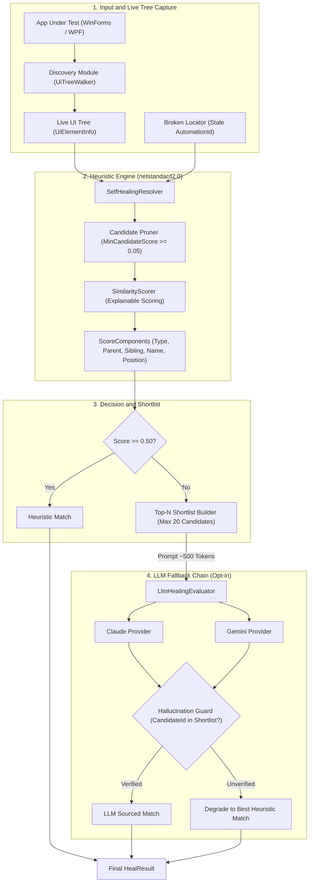
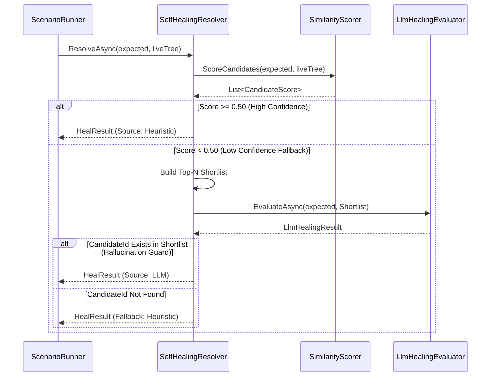
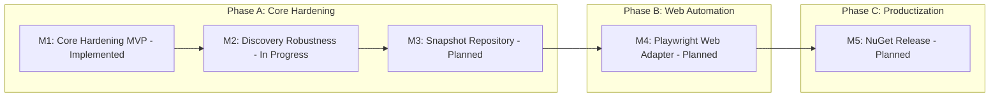

# Automation Sandbox


A transparent, **explainable**, and **self-healing UI test automation engine** built on top of [FlaUI](https://github.com/FlaUI/FlaUI) (.NET, Microsoft UI Automation) for Windows desktop (WinForms & WPF) applications.

Commercial test automation tools (e.g. Ranorex, Tosca) hide object repositories and locator recovery behind proprietary black boxes. **Automation Sandbox** provides an open, modular alternative centered on a **pure-heuristic structural similarity engine** ($12\text{ms}$ for 3,000 controls, 0 cost), supplemented by an **explainable component scorer** and an opt-in **LLM shortlist fallback chain**.

---

## 📌 Implementation Status

| Feature / Module | Status | Description |
| :--- | :---: | :--- |
| **Heuristic Self-Healing** | ✅ Implemented | Pure C# structural similarity scoring ($O(N)$ execution, zero-cost, deterministic). |
| **Explainable Scoring** | ✅ Implemented | `ScoreComponents` breakdown (ControlType, Parent, Sibling, Name, Position). |
| **Offscreen Rectangle Handling** | ✅ Implemented | Dynamic exclusion of unusable `(0,0,0,0)` bounding boxes from position weights. |
| **Candidate Pruning & Shortlist** | ✅ Implemented | `MinCandidateScore` filtering and Top-N shortlist assembly (~500 token LLM prompt). |
| **LLM Fallback & Guard** | ✅ Implemented | Parallel Claude/Gemini provider integration with shortlist `candidateId` **Hallucination Guard**. |
| **Synthetic Benchmarks** | ✅ Implemented | Pure logic benchmark tests on 3,000+ control trees running on Linux CI. |
| **WinForms & WPF Live Tests** | ✅ Implemented | Real UIA scenario tests against `WinFormsApp` and `WpfApp` on Windows CI. |
| **Discovery Options & Telemetry** | ⏳ In Progress | `DiscoveryOptions` (MaxDepth, MaxElements, Timeout, CancellationToken). |
| **Locator Repository JSON** | 📋 Planned | Persistent `.locator.json` repository schema with auto-learning history. |
| **Playwright Web Automation** | 📋 Planned | Web DOM tree walker and Playwright `GetByRole`/`GetByTestId` locator emitter. |

---

## 🏛️ System Architecture

The core logic (`UiModel`, `SelfHealing`, `LlmHealing`) targets `netstandard2.0` with **zero FlaUI/Windows dependency**, allowing the heuristic engine, scoring, and unit tests to execute cross-platform (including Linux CI).



---

## 🔄 Self-Healing Resolution Flow

When an `AutomationId` breaks due to a UI refactor or missing XAML property, `SelfHealingResolver` executes the following multi-stage pipeline:



---

## 📊 Explainable Scoring System

`SimilarityScorer` calculates a weighted sum of independent structural signals and returns a detailed `ScoreComponents` breakdown:

$$\text{TotalScore} = \frac{\sum (S_i \cdot W_i)}{\sum W_i} \quad \text{where } S_i \in [0.0, 1.0]$$

| Component | Default Weight | Description & Calculation Logic |
| :--- | :---: | :--- |
| **`ControlTypeScore`** | `0.20` | `1.0` if `expected.ControlType == candidate.ControlType`, else `0.0`. (Weighted, not a hard zero-filter). |
| **`ParentControlTypeScore`** | `0.20` | `1.0` if parent container `ControlType` matches, else `0.0`. |
| **`SiblingPositionScore`** | `0.15` | Proportional index distance: $1.0 - \frac{\|idx_{exp} - idx_{cand}\|}{\max(cnt_{exp}, cnt_{cand})}$. |
| **`NameScore`** | `0.20` | Levenshtein distance similarity on `Name` property: $1.0 - \frac{\text{Levenshtein}(a,b)}{\max(\text{len}_a, \text{len}_b)}$. |
| **`PositionScore`** | `0.25` | Euclidean center-point distance score within `PositionToleranceRadius` ($300\text{px}$). |

> [!NOTE]
> **Unusable Rectangle Handling:** If a control has a `(0,0,0,0)` bounding box (e.g. offscreen, unrendered, or collapsed), `PositionScore` evaluates to `null`. Its weight is dynamically excluded from the denominator so that offscreen controls are neither penalized nor erroneously awarded $1.0$ center-point matches.

> [!IMPORTANT]
> **`MinimumConfidence` vs. `MinimumLlmConfidence`:**
> - `MinimumConfidence` ($0.50$): Threshold for accepting a heuristic match before falling back to LLM.
> - `MinimumLlmConfidence` ($0.50$): Threshold for accepting an LLM's self-reported confidence. Because an LLM's confidence rating is not calibrated identically to structural scores, a low-confidence LLM pick (e.g. $0.3$) is rejected and degrades safely back to the top heuristic candidate.

---

## 💡 Quick Start Code Examples

### 1. Basic Heuristic Resolution (Deterministic, 0 Cost)
```csharp
using UiModel;
using SelfHealing;

// Load expected locator snapshot
var expected = UiElementSnapshot.FromJson(File.ReadAllText("Snapshots/txtEmail.json"));

// Capture live tree via FlaUI / Discovery
var liveTree = UiTreeWalker.BuildTree(window);

// Run pure heuristic resolution
var result = SelfHealingResolver.Resolve(expected, liveTree);

if (result.IsConfident)
{
    Console.WriteLine($"[Healed] Matched '{result.Matched!.AutomationId}' with score {result.Score:F2}");
    Console.WriteLine($"  Name Score: {result.ScoreBreakdown?.NameScore}");
    Console.WriteLine($"  Position Score: {result.ScoreBreakdown?.PositionScore}");
}
```

### 2. Tuning Weights & Thresholds
Customize scoring behavior for applications with unstable positions or static control names:

```csharp
var customWeights = new SimilarityWeights
{
    NameWeight = 0.40,                // Give higher priority to Name match
    PositionWeight = 0.10,            // Reduce sensitivity to layout shifts
    PositionToleranceRadius = 500.0,  // Expand distance radius for high-res displays
    MinimumConfidence = 0.60,         // Raise heuristic confidence bar before LLM fallback
    MinimumLlmConfidence = 0.50,      // Minimum LLM self-reported confidence accepted
    MinCandidateScore = 0.10,         // Aggressively prune low-scoring candidates
    MaxCandidatesForLlm = 10,         // Limit shortlist size
};

var result = SelfHealingResolver.Resolve(expected, liveTree, customWeights);
```

### 3. LLM Fallback Resolution (Opt-In)
```csharp
using LlmHealing;
using System.Net.Http;

using var httpClient = new HttpClient();
var providers = new ILlmHealingProvider[]
{
    new ClaudeHealingProvider(httpClient),
    new GeminiHealingProvider(httpClient)
};

// Falls back to LLM only if heuristic score < MinimumConfidence (0.50)
var result = await SelfHealingResolver.ResolveAsync(expected, liveTree, providers);

if (result.Source == HealSource.Llm)
{
    Console.WriteLine($"[LLM Healed] {result.LlmProviderName} matched '{result.Matched!.AutomationId}'");
    Console.WriteLine($"  Reasoning: {result.LlmReasoning}");
}
```

---

## 🧪 Test Coverage & Code Metrics

The test suite in `ScenarioRunner` covers all core layers with automated assertions and cross-platform verification:

| Target Component | Covered Behaviors | Test File |
| :--- | :--- | :--- |
| **Heuristic Scorer** | Structural similarity, weight tuning, unusable `(0,0,0,0)` bounds | [SelfHealingResolverExplainabilityTests](file:///home/m/projects/automation-sandbox/TestAutomation/ScenarioRunner/SelfHealingResolverExplainabilityTests.cs) |
| **Candidate Pruner** | Candidate score filtering (`MinCandidateScore`), Top-N shortlist assembly | [SelfHealingResolverExplainabilityTests](file:///home/m/projects/automation-sandbox/TestAutomation/ScenarioRunner/SelfHealingResolverExplainabilityTests.cs) |
| **LLM Providers & Guard** | Mocked Anthropic/Gemini HTTP responses, Hallucination Guard | [LlmHealingProviderTests](file:///home/m/projects/automation-sandbox/TestAutomation/ScenarioRunner/LlmHealingProviderTests.cs) |
| **Synthetic Benchmarks** | 3,000+ control tree performance, $O(N)$ execution scaling | [SyntheticTreeBenchmarkTests](file:///home/m/projects/automation-sandbox/TestAutomation/ScenarioRunner/SyntheticTreeBenchmarkTests.cs) |
| **Live UIA Scenarios** | End-to-end FlaUI testing against WinForms (`net48`) and WPF (`net8`) apps | [MainFormScenarioTests](file:///home/m/projects/automation-sandbox/TestAutomation/ScenarioRunner/MainFormScenarioTests.cs), [WpfMainWindowScenarioTests](file:///home/m/projects/automation-sandbox/TestAutomation/ScenarioRunner/WpfMainWindowScenarioTests.cs) |

### Running Code Coverage Locally

To collect cross-platform code coverage (`coverage.cobertura.xml`):

```powershell
dotnet test TestAutomation/ScenarioRunner/ScenarioRunner.csproj --collect:"XPlat Code Coverage"
```

---

## 🔬 Framework Case Studies: WinForms vs. WPF

Both test applications (`WinFormsApp` and `WpfApp`) implement the same customer registration form, each intentionally embedding a realistic framework-specific locator issue:

| Application | Problematic Control | Cause / Framework Behavior | How Self-Healing Solves It |
| :--- | :--- | :--- | :--- |
| **WinForms** (`net48`) | `panel1` | WinForms automatically surfaces `Control.Name` as UIA `AutomationId`. Auto-generated names (e.g. `panel1`) are frequently left unrenamed in legacy codebases. | `SelfHealingResolver` ignores `AutomationId` during scoring and matches the panel using parent context, child count, and screen bounding box. |
| **WPF** (`net8.0-windows`) | `CompanyPanel` (`GroupBox`) | WPF **never** infers `AutomationId` from `x:Name`. Unless `AutomationProperties.AutomationId` is set explicitly in XAML, `AutomationId` comes back empty. | `SelfHealingResolver` matches `CompanyPanel` using `ControlType.Group`, parent/sibling position, and header label text. |

---

## 📂 Repository Structure

```
AutomationSandbox.sln
├── WinFormsApp/            .NET Framework 4.8 WinForms application under test
├── WpfApp/                 .NET 8 WPF application under test
└── TestAutomation/
    ├── UiModel/            Shared UiElementInfo, CandidateScore, ScoreComponents & UiElementSnapshot (netstandard2.0)
    ├── Discovery/          Live UI tree walker via FlaUI.Core & FlaUI.UIA3 (net48)
    ├── SelfHealing/        Heuristic resolver, explainable scoring & shortlist logic (netstandard2.0)
    ├── LlmHealing/         Claude & Gemini HTTP providers behind ILlmHealingProvider (netstandard2.0)
    └── ScenarioRunner/     xUnit test suite: live UIA scenarios, explainability tests & synthetic benchmarks (net48)
```

---

## 🚀 Synthetic Benchmark Performance

The core logic operates purely on `netstandard2.0` in-memory trees without requiring Windows UIA COM hooks.

`SyntheticTreeBenchmarkTests` exercises the heuristic engine against a synthetic UI tree containing **3,000+ candidate controls**:

```powershell
[Benchmark] 3000 candidates scored in 12ms - best score=0.98, candidateCount=1.
```

- **Time Complexity:** $O(N)$ tree traversal and candidate scoring.
- **Memory Footprint:** Allocation-optimized `Flatten` enumeration and fast Levenshtein matrix.
- **Cross-Platform:** Benchmark unit tests run natively on Linux, macOS, and Windows.

---

## 🗺️ Roadmap



---

## 💻 Running Locally & CI

### Requirements
- **Windows** (for FlaUI.UIA3 / WinForms live scenario execution).
- **.NET SDK 8.0** and .NET Framework 4.8 Developer Pack.

### Execution Commands

```powershell
# Build entire solution
dotnet build AutomationSandbox.sln --configuration Debug

# Run all test suites
dotnet test TestAutomation/ScenarioRunner/ScenarioRunner.csproj --configuration Debug --no-build
```

---

## 📄 License

This project is licensed under the **MIT License**.
