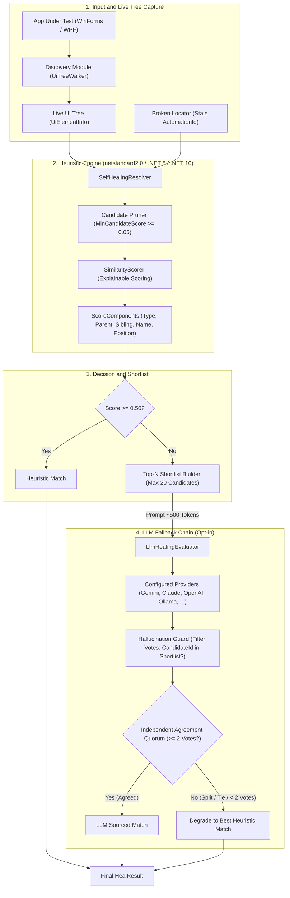
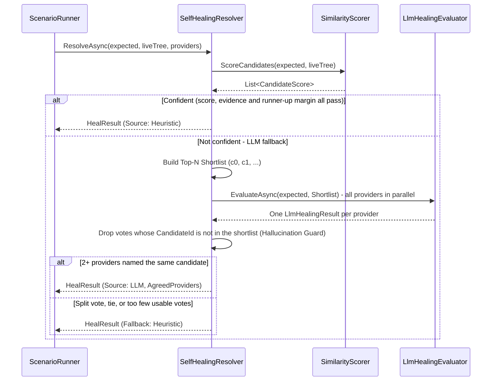

# Automation Sandbox


An open-source **locator healing** and **intent-driven test generation** engine for Windows desktop and web.

**Automation Sandbox** is an open alternative to the black-box locator recovery in commercial tools, centered on a **pure-heuristic structural similarity engine** (~$12\text{ms}$ for 3,000 controls on developer hardware, 0 cost; see `SyntheticTreeBenchmarkTests`), supplemented by an **explainable component scorer**, an opt-in **multi-provider LLM fallback with an independent-agreement quorum**, and an **intent-driven test generation pipeline**. Desktop support is built on [FlaUI](https://github.com/FlaUI/FlaUI) (Microsoft UI Automation); web support on the Microsoft.Playwright .NET SDK.

## A Broken Locator, in 30 Seconds

Yesterday the checkout test stored this locator; today a UI refactor changed both its ID and label:

| Stored snapshot | Live candidate after refactor |
| :--- | :--- |
| `#btn-submit` · “Submit order” | `#checkout-confirm` · “Confirm order” |

The original lookup fails. `SelfHealingEngine` captures the live tree, scores candidates from
control type, parent, sibling position, name, and geometry, then retries the same action only
when the confidence, evidence, and ambiguity gates pass:

```diff
- click #btn-submit        // locator not found
+ click #checkout-confirm // selected candidate; retry succeeded
```

Only that successful retry updates the locator repository. The same decision is written to an
auditable healing report; an illustrative excerpt looks like this:

```json
{
  "LocatorKey": "Checkout.Submit",
  "Outcome": "accepted",
  "Source": "heuristic",
  "Score": 0.86,
  "PreviousSnapshot": { "AutomationId": "btn-submit", "Name": "Submit order" },
  "AcceptedSnapshot": { "AutomationId": "checkout-confirm", "Name": "Confirm order" }
}
```

If the evidence is weak, candidates are tied, or the retried action fails, the engine records
that outcome for review and does not persist the proposed locator.

---

> 🚀 **First run:** Go from `dotnet add package AutomationSandbox.SelfHealing` to a successful persisted heal with the [Published Package Quickstart](docs/consumer-quickstart.md) and its maintained [runnable sample](samples/HeuristicHealingQuickstart/README.md).

> 📚 **Documentation Hub & GitHub Pages:** For complete guides, detailed architecture, JSON schemas, and API references, visit our [**Documentation Hub**](docs/index.md).

> 📦 **Preview Packages:** The latest prerelease is [`v0.2.0-beta.3`](https://github.com/mustafasercansak/automation-sandbox/releases/tag/v0.2.0-beta.3). All seven `AutomationSandbox.*` packages are available from [nuget.org](https://www.nuget.org/profiles/mustafasercansak) and as GitHub Release assets. The manual [Release workflow](.github/workflows/release.yml) publishes through Trusted Publishing (OIDC, without a stored API key); the separate [Pack workflow](.github/workflows/pack.yml) remains artifact-only. See the [NuGet Packaging Guide](docs/nuget-packaging.md).

> 🎤 **Project Showcase:** For a bilingual (EN/TR) architecture presentation and executive summary, see [PROJECT_SHOWCASE.md](PROJECT_SHOWCASE.md).

---

## 🎯 Scope: What This Is / What This Isn't

| What it is | What it isn't |
| :--- | :--- |
| A **locator healing engine**: when an `AutomationId` or DOM locator breaks, it re-resolves the element from structural evidence and explains the decision component by component. | **Not a monolithic test suite.** There is no IDE, visual recorder, execution grid, or scheduler — Ranorex Studio and Tricentis Tosca solve a much wider problem. |
| An **intent-driven test generation pipeline**: plan steps from a goal, match them to a live page or window, record locators, and emit Playwright or FlaUI test skeletons. | **Not a closed runtime or proprietary object repository.** Locators live in readable JSON you own; every healing decision is auditable from the recorded report. |
| A **modular .NET library set** that plugs into the runners you already use (xUnit, NUnit, Playwright, FlaUI). | **Not a test framework replacement.** It does not run your tests, assert for you, or own your test lifecycle. |
| A **deterministic-first** design: a zero-token heuristic scorer decides on its own, with an opt-in LLM fallback that is guarded against hallucinated picks. | **Not a blind AI wrapper.** No screenshots or full DOM dumps are shipped to a model on every step; the LLM sees a bounded top-N shortlist, only when the heuristic is not confident. |

---

## 📌 Implementation Status

| Feature / Module | Status | Description |
| :--- | :---: | :--- |
| **Heuristic Self-Healing** | ✅ Implemented | Pure C# structural similarity scoring ($O(N)$ execution, zero-cost, deterministic). |
| **Explainable Scoring** | ✅ Implemented | `ScoreComponents` breakdown (ControlType, Parent, Sibling, Name, Position). |
| **Offscreen Rectangle Handling** | ✅ Implemented | Dynamic exclusion of unusable `(0,0,0,0)` bounding boxes from position weights. |
| **LLM Fallback & Guard** | ✅ Implemented | Gemini, Claude, OpenAI-compatible cloud providers (including Groq, Kimi, OpenRouter, and Cloudflare Workers AI), and offline Ollama behind `HttpLlmHealingProvider` with `LlmProviderFactory` auto-discovery and **Hallucination Guard**. |
| **Independent Model Agreement** | ✅ Implemented | A quorum rule (`MinimumConsensusVotes`, default $2$), attempt telemetry, nightly multi-model evaluation, and a gating live Groq + Mistral assertion on one known ground-truth candidate. Agreement permits an LLM pick; it is not evidence that the pick is correct. |
| **Joint Locator Reconciliation** | ✅ Implemented | Opt-in `ResolveBatch` / `ResolveBatchAsync` ownership guard prevents independently accepted locators from claiming the same live element; it is a targeted collision guard, not an absence detector. |
| **Offline AI Healing (Ollama)** | ✅ Implemented | 100% offline, zero-cost local LLM healing with `llama3.2` via `OllamaHealingProvider`. |
| **High-Level `SelfHealingEngine`** | ✅ Implemented | Automatic repository load, healing resolution, and policy-guarded action retry (`shouldHeal`; default heals exact locator-resolution exception types only). A proposed locator is persisted and reported as accepted only after the retried action succeeds. |
| **Intent-Aware Healing** | ✅ Implemented | `TestIntent` metadata guiding LLM providers for refactoring-resilient healing. |
| **Healing Reports & CI Artifacts** | ✅ Implemented | Schema-v8 JSON + HTML telemetry for every resolution attempt, including accepted, ambiguous, ownership-conflict, no-consensus, provider-error, and retry-failed outcomes. `AcceptedEvents` preserves an accepted-only compatibility view. |
| **Synthetic Benchmarks** | ✅ Implemented | Pure logic benchmark tests on 3,000+ control trees; core targets `netstandard2.0` / `net8.0` and runs cross-platform across Windows and Linux CI. |
| **WinForms & WPF Live Tests** | ✅ Implemented | Real UIA scenario tests against `WinFormsApp` and `WpfApp` on Windows CI. |
| **Discovery Options & Telemetry** | ✅ Implemented | `DiscoveryOptions` (MaxDepth, MaxElements, Timeout, CancellationToken, IgnoredFilters). |
| **Locator Repository JSON** | ✅ Implemented | Versioned repository DTOs/serializer, stable `LocatorKey`, healing history contract, and thread-safe file locking. |
| **Playwright Web Automation** | ✅ Implemented | `WebDiscovery` DOM snapshot model, Shadow DOM / iframe traversal, `PlaywrightApplicationConnector`, and Playwright locator emitter. |
| **NuGet Preview Packaging** | ✅ Implemented | Seven validated `AutomationSandbox.*` packages with README/license/repository metadata, symbol packages, manual artifact packaging, and GitHub prerelease assets. |
| **Published-Package Consumer Sample** | ✅ Implemented | Cross-platform, API-key-free quickstart consumes `AutomationSandbox.SelfHealing` from nuget.org (no project reference), runs a persisted heuristic heal, and is verified from a clean package directory in CI. |
| **Intent-Driven Automation** | ✅ Implemented | `AutomationSandbox.IntentAutomation` includes intent contracts, both a deterministic and an opt-in LLM-backed (`LlmIntentPlanner`, guarded with fallback) planner, DOM matching against captured `WebDiscovery` snapshots, locator recording, Playwright C#/TypeScript generation, intent flow reports, and an end-to-end pipeline API. See [Intent-Driven Automation guide](docs/intent-driven-automation.md#current-capability). |
| **Desktop Intent Automation** | ✅ Implemented | `IntentDesktopAutomationPipeline` mirrors the web intent pipeline for Windows desktop apps: matches intent steps against a live `UiElementInfo` tree (`IntentDesktopExplorationBridge`), records accepted locators, and generates an xUnit + FlaUI test skeleton (`FlaUiCSharpTestGenerator`) built on this project's own `Discovery.ApplicationConnector`. |
| **Live Page Exploration** | ✅ Implemented | `PlaywrightLiveExplorer` (`AutomationSandbox.PlaywrightLiveExploration`) launches a browser, navigates to a URL, and captures a `WebElementInfo` DOM snapshot directly via the Microsoft.Playwright .NET SDK — no hand-written Playwright test, and (deliberately) no Node.js-based MCP server. See [why](docs/intent-driven-automation.md#3-live-page-exploration). |
| **Organic Benchmark & Calibration** | ✅ Implemented | Controlled multi-signal locator ablation on organic application trees (`HandBrake 1.8.2`), empirical score distribution overlap findings, and threshold trade-off analysis. See [Benchmark & Calibration Guide](docs/benchmark-calibration.md). |

---

## 🏛️ System Architecture

**Platform breakdown:** Core heuristic engine: cross-platform. Desktop automation: Windows-only (FlaUI). Web automation: cross-platform (Playwright).

The core logic (`UiModel`, `SelfHealing`, `LlmHealing`, `WebDiscovery`, `IntentAutomation`, `PlaywrightLiveExploration`) targets `netstandard2.0`, `.NET 8`, and `.NET 10` with **zero FlaUI/Windows dependency**, allowing the heuristic engine, scoring, intent planning, and cross-platform unit tests to execute on Linux, macOS, and Windows. CI runs on a matrix across both Windows (`windows-latest` for full suite including FlaUI) and Linux (`ubuntu-latest` for cross-platform core and web suite).



---

## 🔄 Self-Healing Resolution Flow

When an `AutomationId` breaks due to a UI refactor or missing XAML property, `SelfHealingResolver` executes the following multi-stage pipeline:



> The hallucination guard runs **before** the vote is counted, so a provider naming a candidate outside its shortlist forfeits only its own vote. Self-reported confidence is recorded but never compared across providers. Independent agreement is the quorum rule that permits a pick; it is not a correctness guarantee. See [Independent Model Agreement](docs/llm-providers.md#-independent-model-agreement-consensus-api).
>
> [!CAUTION]
> DOM/UI text and `TestIntent` are untrusted input. The Top-N prompt still sends target metadata plus candidate names and automation IDs to every configured provider; there is no automatic PII/secret redaction or prompt-injection defence. See the [LLM Healing Security Model](docs/llm-security-model.md) before enabling cloud providers.

---

## 📊 Explainable Scoring System

`SimilarityScorer` calculates a weighted sum of independent structural signals and returns a detailed `ScoreComponents` breakdown:

$$\text{TotalScore} = \frac{\sum (S_i \cdot W_i)}{\sum W_i} \quad \text{where } S_i \in [0.0, 1.0]$$

| Component | Default Weight | Description & Calculation Logic |
| :--- | :---: | :--- |
| **`ControlTypeScore`** | `0.20` | `1.0` if `expected.ControlType == candidate.ControlType`, else `0.0`. (Weighted, not a hard zero-filter). |
| **`ParentControlTypeScore`** | `0.20` | `1.0` if parent container `ControlType` matches, else `0.0`. |
| **`SiblingPositionScore`** | `0.15` | Proportional index distance: $1.0 - \frac{\|idx_{exp} - idx_{cand}\|}{\max(cnt_{exp}, cnt_{cand})}$. |
| **`NameScore`** | `0.20` | Levenshtein distance similarity on `Name` property: $1.0 - \frac{\text{Levenshtein}(a,b)}{\max(\text{len}_a, \text{len}_b)}$. |
| **`PositionScore`** | `0.25` | Euclidean center-point distance score within `PositionToleranceRadius` ($300\text{px}$). |

> [!NOTE]
> **Missing Signal Handling:** Every signal is nullable. When *both* sides lack a signal (empty `Name`, empty `ParentControlType`, zero sibling metadata, or an unusable bounding box), that signal scores `null` — it is excluded from the weighted average entirely, never treated as a perfect $1.0$ match. Two elements sharing only `ControlType` can still reach $\text{TotalScore} = 1.0$, but with `EvidenceCoverage` of only $0.20$.
>
> **`EvidenceCoverage` & `MinimumEvidenceWeight`:** `EvidenceCoverage` is the fraction of the total signal weight backed by non-null evidence. A heuristic match is `IsConfident` only when `Score >= MinimumConfidence` **and** `EvidenceCoverage >= MinimumEvidenceWeight` ($0.40$ by default) — a ControlType-only match is therefore never confident, regardless of its score.
>
> **`RunnerUpScore` & `MinimumCandidateMargin`:** a heuristic match additionally requires $best - runnerUp \ge$ `MinimumCandidateMargin` ($0.05$ by default). Two near-identical candidates mean "I don't know" — the resolver falls back to LLM/manual review instead of silently picking the tie-break winner. The margin gate does not apply to LLM picks (they use the independent-agreement quorum).
>
> **Unusable Rectangle Handling:** If a control has a `(0,0,0,0)` bounding box (e.g. offscreen, unrendered, or collapsed), `PositionScore` evaluates to `null` — the same missing-signal rule, so offscreen controls are neither penalized nor erroneously awarded $1.0$ center-point matches.

> [!IMPORTANT]
> **How a heuristic match is accepted vs. how an LLM pick is accepted:**
> - `MinimumConfidence` ($0.50$): Threshold for accepting a heuristic match before falling back to LLM.
> - **LLM picks use independent model agreement, not confidence.** At least `MinimumConsensusVotes` providers ($2$ by default) must independently name the same candidate. This is a quorum rule, not evidence of correctness: all 34 unanimous deleted-element verdicts in the measured runs were false heals. Self-reported confidence is recorded but never compared or thresholded — one model's $0.72$ and another's $0.95$ are not on the same scale. A single configured provider therefore never has its pick accepted, and disagreement (including a tie) falls back to the top heuristic candidate. See [docs/llm-providers.md](docs/llm-providers.md#-independent-model-agreement-consensus-api).
> - `MinimumLlmConfidence` ($0.50$) remains on `SimilarityWeights` and is still recorded on results, but since the agreement quorum replaced confidence-based acceptance it no longer gates anything.

---

## 💡 Quick Start Code Examples

### 1. Basic Heuristic Resolution (Deterministic, 0 Cost)
```csharp
using UiModel;
using SelfHealing;

// Load expected locator snapshot
var expected = UiElementSnapshot.FromJson(File.ReadAllText("Snapshots/txtEmail.json"));

// Capture live tree via FlaUI / Discovery
var liveTree = UiTreeWalker.BuildTree(window);

// Run pure heuristic resolution
var result = SelfHealingResolver.Resolve(expected, liveTree);

if (result.IsConfident)
{
    Console.WriteLine($"[Healed] Matched '{result.Matched!.AutomationId}' with score {result.Score:F2}");
    Console.WriteLine($"  Evidence Coverage: {result.EvidenceCoverage:F2}");
    Console.WriteLine($"  Name Score: {result.ScoreBreakdown?.NameScore}"); // null when both sides lack a Name - no evidence, not a match
    Console.WriteLine($"  Position Score: {result.ScoreBreakdown?.PositionScore}");
}
```

### 2. Controlled Tree Discovery with Options & Telemetry
Configure traversal bounds, timeouts, cancellation tokens, and control filters:

```csharp
using Discovery;
using System.Threading;

using var connector = ApplicationConnector.Launch(@"C:\apps\MyApp.exe");
var window = connector.GetMainWindow();

var options = new DiscoveryOptions
{
    MaxDepth = 15,
    MaxElements = 3000,
    Timeout = TimeSpan.FromSeconds(5),
    IncludeOffscreen = false,
    IgnoredControlTypes = new HashSet<string> { "Custom", "ScrollBar" }
};

using var cts = new CancellationTokenSource(TimeSpan.FromSeconds(5));

// Run robust discovery
DiscoveryResult result = UiTreeWalker.Discover(window, options, cts.Token);

Console.WriteLine($"Captured {result.CapturedCount} controls in {result.Elapsed.TotalMilliseconds:F0}ms");
Console.WriteLine($"Visited: {result.VisitedCount}, Skipped: {result.SkippedCount}, Errors: {result.ErrorCount}");
if (result.HitMaxElements) Console.WriteLine("Max element limit reached!");
if (result.TimedOut) Console.WriteLine("Discovery timed out gracefully with partial tree.");
if (result.WasCancelled) Console.WriteLine("Discovery was cancelled gracefully with partial tree.");
```

`GetMainWindow()` allows 30 seconds by default for a desktop application to become
UIA-ready. It fails immediately if the process exits, and its timeout exception
classifies the failure as slow startup, UIA attachment failure, or ambiguous top-level
windows. If the native main-window handle is temporarily unavailable, the connector can
use the application's sole same-process UIA top-level window; it never guesses when
multiple windows are present. Pass an explicit `TimeSpan` to override the default.

> [!NOTE]
> **Discovery Timeout & Filtering Semantics:**
> - `Timeout`: Operates as a best-effort traversal budget between nodes, returning a usable partial tree (`TimedOut = true`) rather than throwing an exception.
> - `CancellationToken`: Stops traversal gracefully at the next checkpoint and returns partial result with `WasCancelled = true`.
> - `IncludeOffscreen`: When set to `false` (default), controls with zero bounding boxes `(0,0,0,0)` or `IsOffscreen = true` are skipped and excluded from `node.Children` (`SkippedCount` incremented).
> - `IgnoredControlTypes` & `IgnoredClassNames`: Matching descendant nodes and their subtrees are excluded from `node.Children`. The requested root remains the traversal anchor and is never removed by filters (`depth > 0`).
> - `SiblingCount` Integrity: `SiblingCount` is calculated over actual captured non-filtered siblings in the tree, ensuring mathematical consistency for `SiblingPositionScore`.
> - `Fail-Fast Validation`: `UiTreeWalker.Discover` validates options before traversal, throwing `ArgumentNullException` or `ArgumentOutOfRangeException` for invalid parameters (`MaxDepth < 0`, `MaxElements < 1`, `Timeout <= 0`).

### 3. Tuning Weights & Thresholds
Customize scoring behavior for applications with unstable positions or static control names:

```csharp
var customWeights = new SimilarityWeights
{
    NameWeight = 0.40,                // Give higher priority to Name match
    PositionWeight = 0.10,            // Reduce sensitivity to layout shifts
    PositionToleranceRadius = 500.0,  // Expand distance radius for high-res displays
    MinimumConfidence = 0.60,         // Raise heuristic confidence bar before LLM fallback
    MinimumConsensusVotes = 2,        // Providers that must agree before an LLM pick is accepted
    MinCandidateScore = 0.10,         // Aggressively prune low-scoring candidates
    MaxCandidatesForLlm = 10,         // Limit shortlist size
};

var result = SelfHealingResolver.Resolve(expected, liveTree, customWeights);
```

`SimilarityWeights` are validated before scoring so persisted/configured values fail fast
when thresholds are outside `0.0..1.0`, weights are negative, or the LLM shortlist size is
less than one.

### 4. Persistent Locator Repository
Use a caller-owned key for persisted locators. `AutomationId` remains part of the
snapshot, but it should not be the repository identity because it may be empty,
duplicated, or stale. `LocatorRepository` owns a single `.locator.json` file and
guards its load-modify-save cycle with an exclusive file lock, so concurrent callers
(e.g. parallel test collections healing against the same file) don't race:

```csharp
var repository = new LocatorRepository("locators.json");

var snapshot = UiElementSnapshot.CaptureFirst(liveTree, node =>
    node.ControlType == "Group" && node.Name == "Company");

repository.Upsert("CustomerForm.Company", snapshot!, applicationName: "CustomerApp", platform: "windows-uia");
```

When a heal actually happens, bridge the `HealResult` into a `LocatorHealingHistoryEntry`
and pass it to `Upsert` so the repository keeps an audit trail of what changed and why:

```csharp
var healResult = SelfHealingResolver.Resolve(staleExpected, liveTree);
if (healResult.IsConfident)
{
    var entry = LocatorHealingHistoryEntryFactory.FromHealResult(healResult, previousSnapshot: staleExpected);
    repository.Upsert("CustomerForm.Email", healResult.Matched!, entry);
}
```

### 5. Self-Healing JSON Reports
`SelfHealingEngine` can emit append-only JSON and HTML reports whenever it accepts a
healed locator. Set `SELF_HEALING_REPORT_PATH` to enable this without changing test code:

```powershell
$env:SELF_HEALING_REPORT_PATH = "TestResults/healing-report.json"
dotnet test TestAutomation/ScenarioRunner/ScenarioRunner.csproj --configuration Debug --no-build
```

By default, the HTML report is written next to the JSON file as
`healing-report.html`. Override it with `SELF_HEALING_REPORT_HTML_PATH` when needed.
Updates to an existing JSON report are committed with an atomic same-directory file
replacement: a failed or interrupted commit leaves the previously recorded history in
place instead of deleting it first. The HTML file is derived output written afterward.

Each report event includes:

- `LocatorKey`
- `Source` (`heuristic` or the LLM provider name)
- `ReviewStatus` (`accepted`, `accepted-with-llm`, or `manual-review`)
- `Score`, `ConfidenceThreshold`, `CandidateCount`
- `PreviousSnapshot` and `AcceptedSnapshot`
- LLM fields such as `LlmConfidence`, `LlmProviderName`, `LlmReasoning`, and `AgreedProviders` (which providers supplied the agreeing votes) when applicable

GitHub Actions uploads both `healing-report.json` and `healing-report.html` as the
`self-healing-report` artifact when healing events occur during CI.

### 6. Web DOM Mapping & Playwright Locator Suggestions
`WebDiscovery` maps a Playwright-captured DOM snapshot into the same `UiElementInfo`
shape used by the desktop engine, so the existing self-healing scorer can work across
web and desktop trees:

```csharp
using PlaywrightLiveExploration;
using WebDiscovery;

// PlaywrightLiveExplorer owns the browser + capture round-trip (see Quick Start #8 below).
// If you're inside your own Playwright test instead, capture the DOM with:
//   var json = await page.EvaluateAsync<string>($"() => JSON.stringify(({PlaywrightDomCaptureScript.JavaScript})())");
//   var dom = JsonSerializer.Deserialize<WebElementInfo>(json, new JsonSerializerOptions { PropertyNameCaseInsensitive = true });
// (page.EvaluateAsync<WebElementInfo>(...) directly does NOT work - Playwright's own
// deserializer can't populate UiModel.BoundingRectangle, a readonly struct with no setters.)
var liveTree = WebElementMapper.ToUiElementTree(dom);
var result = SelfHealingResolver.Resolve(expectedWebSnapshot, liveTree);

if (result.IsConfident)
{
    var healedDomElement = dom.Children.First(e => e.TestId == result.Matched!.AutomationId);
    var suggestions = PlaywrightLocatorEmitter.Suggest(healedDomElement);
    Console.WriteLine(suggestions[0].Expression); // page.GetByTestId("...")
}
```

The capture script walks regular DOM children, open Shadow DOM roots, and same-origin
iframe documents (capturing hierarchical `FrameAncestry` and emitting chained `Page.FrameLocator`
locators). Offscreen elements retain their geometry, while hidden elements are mapped with a zero
bounding rectangle. For cross-origin iframes (where browser Same-Origin Policy blocks parent
DOM inspection), evaluate `PlaywrightDomCaptureScript.JavaScript` directly inside the target
`IFrame` context via `frame.EvaluateAsync` — see [Web Automation Guide](docs/web-automation.md) for details.
Locator string values are emitted as valid C# source literals: quotes, backslashes, and
CR/LF/tab characters are escaped before the suggestions flow into generated tests. CSS
attribute-string values keep their separate CSS escaping inside that C# literal.
The TypeScript generator decodes those C# literal escapes before re-emitting a locator,
preserving complete accessible names even when they contain double quotes.

### 7. Intent Automation Pipeline
`IntentAutomationPipeline` ties the M6 flow together: plan intent steps, match them
against a `WebDiscovery` DOM snapshot, record accepted locators, generate Playwright
C# and TypeScript test skeletons, and expose a JSON/HTML-ready intent flow report.

```csharp
using IntentAutomation;
using UiModel;
using WebDiscovery;

var request = new IntentPlanningRequest
{
    Name = "Create customer",
    Goal = "Create a customer record with valid email",
    TargetUrl = "https://example.test/customers",
    TestData = new Dictionary<string, string>
    {
        ["email"] = "jane.doe@example.com",
    },
};

// In a Playwright test, capture this with PlaywrightDomCaptureScript.JavaScript.
WebElementInfo dom = CaptureDomSnapshotSomehow();
var repository = new LocatorRepository("web.locators.json");

var pipeline = new IntentAutomationPipeline(options: new IntentAutomationPipelineOptions
{
    Recording = new IntentLocatorRecordingOptions { ApplicationName = "CustomerPortal" },
    Generation = new PlaywrightCSharpTestGenerationOptions { Namespace = "CustomerPortal.Generated" },
});

var result = pipeline.Run(request, dom, repository);

File.WriteAllText("GeneratedCustomerTest.cs", result.PlaywrightCSharpTestCode);
File.WriteAllText("generated-customer.spec.ts", result.PlaywrightTypeScriptTestCode);
new IntentFlowReportFileSink("intent-flow-report.json").Write(result.Report);
```

By default the pipeline plans steps with `DeterministicIntentPlanner`, which matches a
fixed vocabulary of verbs (save/submit/create/...) in the goal text. Pass
`LlmIntentPlanner` instead to plan from the goal's natural language directly - it reads
its API key the same way `ClaudeHealingProvider` does (`ANTHROPIC_API_KEY` /
`ANTHROPIC_MODEL`) and degrades safely back to `DeterministicIntentPlanner` if the key
is missing, the request fails, or the model's response isn't a well-formed step list:

```csharp
var pipeline = new IntentAutomationPipeline(planner: new LlmIntentPlanner());
```

#### Exploration Safety Gates & Manual Review
Both Web (`IntentExplorationBridge`) and Desktop (`IntentDesktopExplorationBridge`) exploration bridges protect against unrelated and ambiguous matches:
- **Semantic Overlap Gate (`MinimumSemanticScore = 0.01`):** Action compatibility alone (e.g. any button) cannot match an intent step without textual/semantic overlap — unrelated elements (e.g. "Delete customer" matching "Export Report") are flagged with `RequiresReview = true`.
- **Runner-Up Margin Check (`MinimumCandidateMargin = 0.05`):** Competing candidates within margin $< 0.05$ are marked ambiguous for human review rather than guessing.
- **Unreviewed Persistence Guard:** Steps requiring review are excluded from automatic locator repository persistence by default, while retaining full candidate telemetry and runner-up diagnostics in the intent flow report.

#### Structured Assertions (No False-Green Tests)
Generated `Assert` steps are emitted from a structured contract, never from a bare presence check:

- **`AssertionKind` + `ExpectedValue` on `IntentStep`:** `Visible`, `NotVisible`, `TextEquals`, `TextContains`, `ValueEquals`, `UrlEquals`, `UrlContains`. Planners produce the contract; the three generators emit code *only* from it, so an intent like *"Order total should be \$125"* becomes `await Expect(total).ToHaveTextAsync("$125")` instead of a visibility check that passes regardless of the value.
- **`AssertGenerationMode` (`Strict` by default):** when an outcome cannot be mapped to a known kind, `Strict` emits a review marker (`Assert.Inconclusive` / `test.skip` / `Assert.True(false, ...)` depending on the target framework) rather than silently degrading to a check that always passes. `Lenient` emits a presence check with a `// TODO` review comment; `Fallback` emits the presence check alone.
- **Conservative derivation:** `DeterministicIntentPlanner.DeriveAssertion` only produces a value assertion when the outcome carries a value-shaped token (quoted text, currency, number). Generic phrasing such as *"the result is visible"* stays `Visible` — a wrong assertion is worse than a weak one. Defaults ship as estimates and are revisited under benchmark issue #15.

### 8. Desktop Intent Automation Pipeline
`IntentDesktopAutomationPipeline` is the Windows desktop counterpart to
`IntentAutomationPipeline`: it plans intent steps with the same `IIntentPlanner`, matches
them against a live `UiElementInfo` tree (as captured by `Discovery.UiTreeWalker`) instead
of a `WebDiscovery` DOM snapshot, records accepted locators, and generates an xUnit +
FlaUI test skeleton built on this project's own `Discovery.ApplicationConnector`.

```csharp
using IntentAutomation;
using UiModel;

var request = new IntentPlanningRequest
{
    Name = "Create customer",
    Goal = "Create a customer record with valid email",
    TestData = new Dictionary<string, string>
    {
        ["email"] = "jane.doe@example.com",
    },
};

UiElementInfo window = UiTreeWalker.BuildTree(connector.GetMainWindow());
var repository = new LocatorRepository("desktop.locators.json");

var pipeline = new IntentDesktopAutomationPipeline(options: new IntentDesktopAutomationPipelineOptions
{
    Recording = new IntentDesktopLocatorRecordingOptions { ApplicationName = "CustomerApp" },
    Generation = new FlaUiCSharpTestGenerationOptions
    {
        Namespace = "CustomerApp.Generated",
        ApplicationExecutablePath = @"CustomerApp\bin\Debug\net48\CustomerApp.exe",
    },
});

var result = pipeline.Run(request, window, repository);
File.WriteAllText("GeneratedCustomerDesktopTest.cs", result.FlaUiCSharpTestCode);
```

> **Note on Report Parity:** `IntentDesktopAutomationPipelineResult` produces `FlaUiCSharpTestCode`, but does not currently emit an `IntentFlowReportDocument` — intent flow report rendering is web-pipeline only for now (unlike the unified healing reports which cover both desktop and web).

Matching favors `AutomationId` when the recorded snapshot has one, falling back to `Name`
and then bare `ControlType` - the same tiering `MainFormScenarioTests` uses by hand for
`panel1`, whose `AutomationId` is deliberately meaningless. The generated code uses direct
FlaUI locators rather than `SelfHealingEngine`, matching how `PlaywrightCSharpTestGenerator`
generates direct Playwright locators for the web pipeline: self-healing is a separate,
already-implemented concern (see [Quick Start #5](#5-self-healing-json-reports)), not
something codegen output should wrap every call in.

### 9. Live Page Exploration
`PlaywrightLiveExplorer` closes the gap the "MCP Exploration" docs originally described as
Planned: it launches a browser, navigates to a URL, and captures a `WebElementInfo`
snapshot directly via the Microsoft.Playwright .NET SDK — no hand-written Playwright test
required to feed a snapshot into `IntentAutomationPipeline`, `IntentExplorationBridge`, or
any of the other Quick Start examples above:

```csharp
using PlaywrightLiveExploration;

await using var explorer = await PlaywrightLiveExplorer.LaunchAsync();
WebElementInfo dom = await explorer.CaptureAsync("https://example.test/customers");

var pipeline = new IntentAutomationPipeline();
var result = pipeline.Run(request, dom, repository);
```

This deliberately uses the Playwright .NET SDK rather than a real Model Context Protocol
bridge: the canonical Playwright MCP server is a Node.js process, and connecting to it
would have made this the first JavaScript/Node.js runtime dependency in an otherwise pure
C#/.NET codebase (see AGENTS.md). `Microsoft.Playwright` reaches the same functional
outcome as a fully managed .NET client, no Node.js required at runtime. See
[Live Page Exploration](docs/intent-driven-automation.md#3-live-page-exploration) for the
full rationale.

### 10. LLM Fallback Resolution (Opt-In)
```csharp
using LlmHealing;
using System.Net.Http;

// Option A: Auto-discover all configured providers from environment variables (recommended)
var providers = LlmProviderFactory.CreateConfiguredProviders();

// Option B: Explicit provider instantiation
using var httpClient = new HttpClient();
var manualProviders = new ILlmHealingProvider[]
{
    new ClaudeHealingProvider(httpClient),
    new GeminiHealingProvider(httpClient),
    new OpenAiHealingProvider(httpClient),
    new OllamaHealingProvider(httpClient)
};

// Falls back to LLM only if heuristic score < MinimumConfidence (0.50), and accepts the
// LLM's answer only if at least two providers independently pick the same candidate.
// Optional platform ("windows-uia", "web-playwright", etc.) tailors the prompt to the target environment.
var result = await SelfHealingResolver.ResolveAsync(expected, liveTree, providers, platform: "web-playwright");

if (result.Source == HealSource.Llm)
{
    Console.WriteLine($"[LLM Healed] {string.Join(" + ", result.AgreedProviders)} agreed on '{result.Matched!.AutomationId}'");
    Console.WriteLine($"  Reasoning: {result.LlmReasoning}");
}
```

All cloud providers share the `HttpLlmHealingProvider` base architecture with automatic exponential backoff, per-attempt timeout (`15s`), and overall operation timeout (`35s`).

`LlmProviderFactory` auto-discovers configured models from environment variables:
- `ANTHROPIC_API_KEY` (+ `ANTHROPIC_MODEL`) $\rightarrow$ Claude (`claude-haiku-4-5-20251001`)
- `GEMINI_API_KEY` (+ `GEMINI_MODEL`) $\rightarrow$ Gemini (`gemini-3.6-flash`)
- `OPENAI_API_KEY` (+ `OPENAI_MODEL`, `OPENAI_ENDPOINT`) $\rightarrow$ OpenAI (`gpt-4o-mini`)
- `GROK_API_KEY` (+ `GROK_MODEL`, `GROK_ENDPOINT`) $\rightarrow$ Grok (`grok-2-latest`)
- `KIMI_API_KEY` (+ `KIMI_MODEL`, `KIMI_ENDPOINT`) $\rightarrow$ Kimi (`moonshot-v1-8k`)
- `CLOUDFLARE_API_TOKEN` + `CLOUDFLARE_ACCOUNT_ID` + `CLOUDFLARE_MODEL` $\rightarrow$ Cloudflare Workers AI (no guessed model)
- `OLLAMA_HOST` / `OLLAMA_MODEL` / `OLLAMA_ENABLED=true` $\rightarrow$ Ollama (`llama3.2`)
- `LLM_CUSTOM_PROVIDERS` JSON array $\rightarrow$ Custom OpenAI-compatible endpoints (DeepSeek, Cerebras, Groq, etc.); every entry requires an explicit `Name`, `Endpoint`, `Model`, and API key source. Malformed JSON or a missing endpoint/model is skipped with a credential-safe diagnostic instead of falling back to OpenAI defaults or disabling the built-in providers. Use the three-argument `CreateConfiguredProviders` overload to route diagnostics to an application logger; the existing overload writes them to standard error.

See [docs/llm-providers.md](docs/llm-providers.md) for full configuration and agreement-quorum details, and the [LLM Healing Security Model](docs/llm-security-model.md) for disclosed fields, provider retention, and report-handling requirements.

### 11. Joint Locator Reconciliation (Opt-In)

When several stale locators are resolved against the same captured tree, use the batch API
to prevent two independently accepted heals from taking ownership of one live element:

```csharp
var batch = await SelfHealingResolver.ResolveBatchAsync(
    new[]
    {
        new BatchHealingRequest("checkout.submit", staleSubmit),
        new BatchHealingRequest("checkout.cancel", staleCancel),
    },
    liveTree,
    providers);

foreach (var item in batch.Items.Where(item => item.Result.IsConfident))
{
    Console.WriteLine($"{item.Request.LocatorKey} -> {item.CandidateIdentity}");
}
```

The API reconciles only candidates the existing heuristic or LLM agreement-quorum gates already
accepted; it never promotes runner-ups. Candidate ownership uses a snapshot-local tree path,
not `AutomationId`, so empty and duplicate IDs remain distinguishable. Uncontested false
heals are preserved by design: this is a collision guard, not an absence detector. See the
[Joint Locator Reconciliation guide](docs/joint-locator-reconciliation.md).

---

## 🧪 Test Coverage & Code Metrics

The test suite in `ScenarioRunner` covers all core layers with automated assertions and cross-platform verification:

| Target Component | Covered Behaviors | Test File |
| :--- | :--- | :--- |
| **Heuristic Scorer** | Structural similarity, weight tuning, unusable `(0,0,0,0)` bounds | [SelfHealingResolverTests](TestAutomation/ScenarioRunner/SelfHealingResolverTests.cs), [SelfHealingResolverExplainabilityTests](TestAutomation/ScenarioRunner/SelfHealingResolverExplainabilityTests.cs) |
| **Candidate Pruner** | Candidate score filtering (`MinCandidateScore`), Top-N shortlist assembly | [SelfHealingResolverExplainabilityTests](TestAutomation/ScenarioRunner/SelfHealingResolverExplainabilityTests.cs) |
| **Discovery Robustness** | `DiscoveryOptions`, `DiscoveryResult` telemetry, filters and limits, plus actionable application-startup failure classification | [DiscoveryRobustnessTests](TestAutomation/ScenarioRunner/DiscoveryRobustnessTests.cs) |
| **Locator Repository & Snapshots** | Versioned JSON persistence, file locking, `LocatorKey` stability, `UiElementSnapshot` round-tripping | [LocatorRepositoryTests](TestAutomation/ScenarioRunner/LocatorRepositoryTests.cs), [UiElementSnapshotTests](TestAutomation/ScenarioRunner/UiElementSnapshotTests.cs) |
| **Self-Healing Engine & Intent Metadata** | Repository auto-upsert, action retry, `TestIntent`-guided healing, JSON/HTML report emission | [SelfHealingEngineTests](TestAutomation/ScenarioRunner/SelfHealingEngineTests.cs), [TestIntentHealingTests](TestAutomation/ScenarioRunner/TestIntentHealingTests.cs) |
| **LLM Providers & Guard** | Mocked Anthropic/Gemini/OpenAI/Ollama HTTP responses, Hallucination Guard, and provider resilience: retry on transient 429/5xx, fail-fast on 4xx, `Retry-After` quota ceiling, per-attempt and total timeout budgets, attempt telemetry | [LlmHealingProviderTests](TestAutomation/ScenarioRunner/LlmHealingProviderTests.cs), [LlmHealingEvaluationTests](TestAutomation/ScenarioRunner/LlmHealingEvaluationTests.cs), [OpenAiAndOllamaHealingProviderTests](TestAutomation/ScenarioRunner/OpenAiAndOllamaHealingProviderTests.cs) |
| **Independent Model Agreement** | Quorum acceptance (not a correctness guarantee), split votes and ties treated as disagreement, single-provider rejection, hallucinated votes dropped before counting, `AgreedProviders` ordering, `LlmProviderFactory` discovery, non-confident evaluation fixtures | [SelfHealingResolverTests](TestAutomation/ScenarioRunner/SelfHealingResolverTests.cs), [ConsensusEvaluationTests](TestAutomation/ScenarioRunner/ConsensusEvaluationTests.cs), [EvaluationScenarios](TestAutomation/ScenarioRunner/EvaluationScenarios.cs) |
| **Joint Locator Reconciliation** | Stronger ownership, ambiguous ties, empty-ID identity, uncontested limitation, provider partial failure, report telemetry, single-locator compatibility | [BatchHealingResolverTests](TestAutomation/ScenarioRunner/BatchHealingResolverTests.cs), [JointAssignmentGeneralizationTests](TestAutomation/ScenarioRunner/JointAssignmentGeneralizationTests.cs) |
| **Real-Tree Locator Ablation** | Versioned single- and multi-locator mutation recipes, per-locator ground truth, threshold sweeps, and frozen cross-application joint top-claim evaluation | [LocatorAblationTests](TestAutomation/ScenarioRunner/LocatorAblationTests.cs), [ShareXAblationTests](TestAutomation/ScenarioRunner/ShareXAblationTests.cs), [JointAssignmentGeneralizationTests](TestAutomation/ScenarioRunner/JointAssignmentGeneralizationTests.cs) |
| **Web Discovery** | DOM snapshot mapping, Shadow DOM / iframe traversal, hidden/offscreen handling | [WebDiscoveryTests](TestAutomation/ScenarioRunner/WebDiscoveryTests.cs) |
| **Intent Automation (Web)** | Deterministic + LLM-backed planning (with guarded fallback), DOM candidate matching/exploration, locator recording, Playwright C#/TypeScript generation, and flow reports | [IntentAutomationPipelineTests](TestAutomation/ScenarioRunner/IntentAutomationPipelineTests.cs), [IntentPlannerTests](TestAutomation/ScenarioRunner/IntentPlannerTests.cs), [LlmIntentPlannerTests](TestAutomation/ScenarioRunner/LlmIntentPlannerTests.cs), [IntentExplorationBridgeTests](TestAutomation/ScenarioRunner/IntentExplorationBridgeTests.cs), [IntentLocatorRepositoryRecorderTests](TestAutomation/ScenarioRunner/IntentLocatorRepositoryRecorderTests.cs), [IntentFlowReportTests](TestAutomation/ScenarioRunner/IntentFlowReportTests.cs), [PlaywrightCSharpTestGeneratorTests](TestAutomation/ScenarioRunner/PlaywrightCSharpTestGeneratorTests.cs), [PlaywrightTypeScriptTestGeneratorTests](TestAutomation/ScenarioRunner/PlaywrightTypeScriptTestGeneratorTests.cs) |
| **Intent Automation (Desktop)** | `UiElementInfo` candidate matching/exploration, locator recording, xUnit + FlaUI test skeleton generation, and pipeline orchestration | [IntentDesktopExplorationBridgeTests](TestAutomation/ScenarioRunner/IntentDesktopExplorationBridgeTests.cs), [IntentDesktopLocatorRepositoryRecorderTests](TestAutomation/ScenarioRunner/IntentDesktopLocatorRepositoryRecorderTests.cs), [FlaUiCSharpTestGeneratorTests](TestAutomation/ScenarioRunner/FlaUiCSharpTestGeneratorTests.cs), [IntentDesktopAutomationPipelineTests](TestAutomation/ScenarioRunner/IntentDesktopAutomationPipelineTests.cs) |
| **Synthetic Benchmarks** | 3,000+ control tree performance, $O(N)$ execution scaling | [SyntheticTreeBenchmarkTests](TestAutomation/ScenarioRunner/SyntheticTreeBenchmarkTests.cs) |
| **Live UIA Scenarios** | End-to-end FlaUI testing against WinForms (`net48`) and WPF (`net8`/`net10`) apps | [MainFormScenarioTests](TestAutomation/ScenarioRunner/MainFormScenarioTests.cs), [WpfMainWindowScenarioTests](TestAutomation/ScenarioRunner/WpfMainWindowScenarioTests.cs), [EndToEndDemoScenarioTests](TestAutomation/ScenarioRunner/EndToEndDemoScenarioTests.cs) |
| **Live Page Exploration** | Real headless-Chromium browser launch, navigation, and DOM capture via `PlaywrightLiveExplorer` against a local HTML fixture | [PlaywrightLiveExplorerTests](TestAutomation/ScenarioRunner/PlaywrightLiveExplorerTests.cs) |
| **CI Coverage Visibility** | Separate Windows `net48` and Linux `net8.0` step summaries, overall and per-assembly rows, missing-report handling, artifact retention | [CoverageSummaryWorkflowTests](TestAutomation/ScenarioRunner/CoverageSummaryWorkflowTests.cs) |

### Running Code Coverage Locally

To collect cross-platform code coverage (`coverage.cobertura.xml`):

```powershell
dotnet test TestAutomation/ScenarioRunner/ScenarioRunner.csproj --collect:"XPlat Code Coverage"
```

CI renders the collected Cobertura data into each matrix job's GitHub Step Summary. Windows
`net48` and Linux `net8.0` are labelled and reported separately, with overall and per-assembly
line/branch coverage. The figures are visibility aids only: they are never combined into one
headline percentage, published as a badge, or used as a threshold that can fail the build.

---

## 🔬 Framework Case Studies: WinForms vs. WPF

Both test applications (`WinFormsApp` and `WpfApp`) implement the same customer registration form, each intentionally embedding a realistic framework-specific locator issue:

| Application | Problematic Control | Cause / Framework Behavior | How Self-Healing Solves It |
| :--- | :--- | :--- | :--- |
| **WinForms** (`net48`) | `panel1` | WinForms automatically surfaces `Control.Name` as UIA `AutomationId`. Auto-generated names (e.g. `panel1`) are frequently left unrenamed in legacy codebases. | `SelfHealingResolver` ignores `AutomationId` during scoring and matches the panel using parent context, child count, and screen bounding box. |
| **WPF** (`net8.0-windows` / `net10.0-windows`) | `CompanyPanel` (`GroupBox`) | WPF **never** infers `AutomationId` from `x:Name`. Unless `AutomationProperties.AutomationId` is set explicitly in XAML, `AutomationId` comes back empty. | `SelfHealingResolver` matches `CompanyPanel` using `ControlType.Group`, parent/sibling position, and header label text. |

---

## 📂 Repository Structure

```
AutomationSandbox.sln
├── WinFormsApp/            .NET Framework 4.8 WinForms application under test
├── WpfApp/                 .NET 8 / .NET 10 WPF application under test
└── TestAutomation/
    ├── UiModel/            Shared UiElementInfo, CandidateScore, ScoreComponents & UiElementSnapshot (netstandard2.0, net8.0, net10.0)
    ├── Discovery/          Live UI tree walker via FlaUI.Core & FlaUI.UIA3 with DiscoveryOptions/Result (net48)
    ├── SelfHealing/        Heuristic/batch resolver, explainable scoring & shortlist logic (netstandard2.0, net8.0, net10.0)
    ├── LlmHealing/         HttpLlmHealingProvider base, LlmProviderFactory, Claude, Gemini, OpenAI-compatible cloud providers (including Cloudflare) & offline Ollama (netstandard2.0, net8.0, net10.0)
    ├── WebDiscovery/       Playwright DOM snapshot mapping, iframe/shadow DOM capture & locator suggestions (netstandard2.0, net8.0, net10.0)
    ├── IntentAutomation/   Cross-platform intent pipeline & Playwright/FlaUI test generators (netstandard2.0, net8.0, net10.0)
    ├── PlaywrightLiveExploration/  Live browser page capture via Microsoft.Playwright .NET SDK (netstandard2.0, net8.0, net10.0)
    └── ScenarioRunner/     xUnit test suite: live UIA, self-healing, web discovery, intent automation & live browser coverage (net48 + net8.0 on Windows, net8.0 on Linux)
```

---

## 🚀 Synthetic Benchmark Performance

The core logic operates purely on `netstandard2.0` / `.NET 8` / `.NET 10` in-memory trees without requiring Windows UIA COM hooks.

`SyntheticTreeBenchmarkTests` exercises the heuristic engine against a synthetic UI tree containing **3,000+ candidate controls**:

```powershell
[Benchmark] 3000 candidates scored in 23ms - best score=1.00, candidateCount=3031.
```

- **Execution Scaling:** $O(N)$ tree traversal and candidate scoring (indicative ~23ms on developer hardware; execution time is hardware-dependent while candidate counts and score outputs are deterministic).
- **Memory Footprint:** Allocation-optimized `Flatten` enumeration and fast Levenshtein matrix.
- **Cross-Platform:** Benchmark unit tests run natively on Linux, macOS, and Windows.

---

## 🔬 Real-World Multi-Signal Benchmark & Calibration

While synthetic benchmarks measure tree scaling, self-healing quality must be measured on real, organically evolved applications with known ground truth. Every figure below names the application, the sample size, and the threshold it was measured at — a number without that context is not trustworthy, and this project has retracted headline claims before for exactly that reason.

We benchmark against two real application trees using controlled **multi-signal locator ablation**: a WPF app (**HandBrake 1.8.2**, 42 authored locators, 176 scenarios) and a WinForms app (**ShareX v21.0.0**, 29 authored locators, 131 scenarios), across 5 perturbation tiers — pure rename, text drift, position shift, compound drift, and element removal (see [full methodology](docs/benchmark-calibration.md#2-multi-signal-locator-ablation-methodology)).

### Key Finding: The Heuristic's Accuracy Is a Range, Not a Number
A single application cannot tell "this is how the engine behaves" from "this is how one app's structure happens to behave." Measured on two:

| Metric (default weights, $\text{MinimumConfidence}=0.50$) | HandBrake | ShareX¹ |
| :--- | ---: | ---: |
| Precision | $84.4\%$ | $73.2\%$ |
| Auto-heal recall | $76.9\%$ | $71.4\%$ |
| **False heal rate on removed elements** | $40.5\%$ | $57.1\%$ |
| Manual review rate | $30.7\%$ | $26.8\%$ |

¹ ShareX figures exclude 15 `DataItem` grid-row locators from a settings table that are structurally near-identical to their siblings and correctly decline regardless of threshold — see [§8](docs/benchmark-calibration.md#8-a-second-application-sharex-v2100-99-134) for why, and for the unfiltered numbers.

**The false-heal rate did not improve on a second application — it got worse.** No static score threshold separates every relocated control from every deleted one whose neighbour looks structurally similar (HandBrake: false heals on removed elements score $0.665$–$0.955$, true compound drifts score $0.749$–$0.874$ — the distributions overlap). Raising `MinimumConfidence` trades this down at the cost of recall; see the [full threshold sweep](docs/benchmark-calibration.md#4-the-false-heal-downarrow-vs-manual-review-uparrow-trade-off) for both applications, since the same threshold buys a different result on each ($7.6\%$–$9.6\%$ false heals on HandBrake vs. $20\%$–$23\%$ on ShareX at $0.75$–$0.80$).

### Does Independent Model Agreement Fix This? Measured, Not Assumed
Four live runs across up to seven independent LLM providers (2026-08-16 to 2026-08-18, $n=133$ usable scenarios — [full results](docs/benchmark-calibration.md#6-multi-provider-llm-consensus-as-an-absence-detector-97)): agreement separates surviving elements from deleted ones better than any heuristic signal tested ($94.5\%$ vs. $43.6\%$ unanimous agreement) — but **every unanimous verdict on a deleted element across all four runs (34 of 34) was a false heal**, including cases where three independently-sourced model families agreed on the same wrong answer. The useful signal in those rejection cases is provider *disagreement*, not any model recognising that the element is gone. The shipped agreement quorum therefore limits single-model decisions but does not establish correctness or protect against this false-heal mode; widening the provider pool from 3 to 7 did not reduce the failure rate.

For complete methodologies, component breakdowns, and configuration guidance, see the [**Benchmark & Calibration Guide**](docs/benchmark-calibration.md).

---

## 🗺️ Roadmap

```mermaid
graph LR
    subgraph PhaseA [Phase A: Core Hardening]
        M1[M1: Core Hardening MVP - Implemented]
        M2[M2: Discovery Robustness - Implemented]
        M3[M3: Persistent Locator Repository - Implemented]
        M1 --> M2 --> M3
    end
    subgraph PhaseB [Phase B: Web Automation & Reporting]
        M4[M4: Web Adapter, Reports & Docs - Implemented]
    end
    subgraph PhaseC [Phase C: Productization]
        M5[M5: NuGet Preview Packaging - Implemented]
    end
    subgraph PhaseD [Phase D: Intent-Driven Automation]
        M6[M6: Intent Planner & DOM-Snapshot Matching - Implemented]
    end
    subgraph PhaseE [Phase E: Beta Correctness & Hardening]
        P1[Phase 1: Beta Blockers - Closed]
        P2[Phase 2: Beta Hardening - Closed]
        P1 --> P2
    end
    subgraph PhaseF [Phase F: Measurement & Adoption]
        P3[Phase 3: Calibration & Multi-Model Data - Closed]
        P4[Phase 4: Adoption & Consumer Validation - In Progress]
        P3 --> P4
    end
    M3 --> M4 --> M5 --> M6 --> P1
    P2 --> P3
```



Work is now tracked through GitHub milestones rather than the original M1–M6 sequence:

- **Phase 1 — Beta Blockers** *(closed)*: the correctness gates that had to exist before anything shipped — exception-scoped healing retry, the evidence gate, the runner-up ambiguity margin, the intent semantic gate, LLM divergence tracking, and structured assertions.
- **Phase 2 — Beta Hardening** *(closed)*: the independent-agreement quorum for LLM picks (named `Consensus` in the API), provider resilience (retry, backoff, dual timeouts, `Retry-After` quota guard), attempt telemetry, cross-platform Linux CI, and packaging parity across all seven libraries. Shipped as [`v0.2.0-beta.2`](https://github.com/mustafasercansak/automation-sandbox/releases/tag/v0.2.0-beta.2).
- **Phase 3 — Post-Beta Measurement** *(closed)*: the heuristic and LLM agreement paths were measured against two real applications (HandBrake, ShareX) and four independent multi-provider runs. The #141/#143 frozen study led to #144's opt-in production batch guard: joint top-claim ownership preserved all 79 correct survivor heals and eliminated all 4 observed collisions, but its explicit limit is that 15 uncontested removed-element false heals remain unchanged. The nightly Groq + Mistral ground-truth scenario remains a failing gate rather than collection-only telemetry.
- **Phase 4 — Adoption & Consumer Validation** *(in progress)*: validate the published packages from a consumer's perspective, tighten installation and quick-start guidance, and use external integration feedback to prioritize the next product work. Linux desktop discovery remains a separate research track under #17 rather than an assumed release commitment.

---

## 💻 Running Locally & CI

### Requirements
- **Windows** (for FlaUI.UIA3 / WinForms live scenario execution).
- **.NET SDK 8.0 / .NET SDK 10.0** and .NET Framework 4.8 Developer Pack.

### Execution Commands

```powershell
# Build entire solution
dotnet build AutomationSandbox.sln --configuration Debug

# Run all test suites
dotnet test TestAutomation/ScenarioRunner/ScenarioRunner.csproj --configuration Debug --no-build
```

---

## 📄 License

This project is licensed under the **MIT License**.
