# 🔬 Real-World False-Positive Benchmark & Threshold Calibration / Gerçek Dünya Benchmarkı ve Eşik Kalibrasyonu

This guide provides a comprehensive technical overview of the real-world false-positive benchmark on organically evolved applications (HandBrake 1.8.2 WPF UI tree), the multi-signal locator ablation methodology, the empirical score distribution overlap findings, and the **"False Heal $\downarrow$ vs. Manual Review $\uparrow$"** trade-off dynamics.

> 💡 **Select Language / Dil Seçin:**
> - [🇬🇧 English Guide](#-english-guide)
> - [🇹🇷 Türkçe Kılavuz](#-türkçe-kılavuz)

---

## 🇬🇧 English Guide

### 1. Problem: Why Synthetic Speed Benchmarks Are Not Enough
Synthetic benchmarks (such as `SyntheticTreeBenchmarkTests`) measure tree traversal performance and scoring latency. The latest local run scored 3,000 candidates in 20ms and 10,000 candidates in 27ms; both figures are environment-dependent, while the 10,000-control case has a CI-safe 5-second bound. Resolution remains $O(N \log N)$ (scoring is linear; the dominant cost is sorting the scored candidates), so working memory grows linearly with the flattened candidate list rather than with a quadratic pairwise matrix. However, a production-grade locator self-healing engine cannot be validated on execution speed alone:
1. **False-Positive Risk:** A healing engine that indiscriminately accepts incorrect elements produces "false green" tests that pass while exercising unintended UI components.
2. **Overfit in Bundled Case Studies:** Bundled demo apps (`WinFormsApp`, `WpfApp`) contain hand-crafted refactoring scenarios, creating a high risk of overfitting heuristics to specific known edge cases.
3. **The Disappearance Problem:** When a UI refactor completely deletes an element, the engine must decline and prompt a human for review rather than latching onto an adjacent button or container.

To establish ground-truth empirical metrics without relying on subjective human labelling, we apply **controlled multi-signal locator ablation** on real, organically evolved applications.

---

### 2. Multi-Signal Locator Ablation Methodology

Natural locator drift across production releases is sparse (e.g. dozens of version releases may yield zero or few accidental locator renames). **Controlled ablation** inverts the problem: we systematically mutate locators on a real captured application tree (`HandBrake_1.8.2.tree.json`, 149 nodes, 42 unique authored locators) across 5 distinct perturbation tiers:

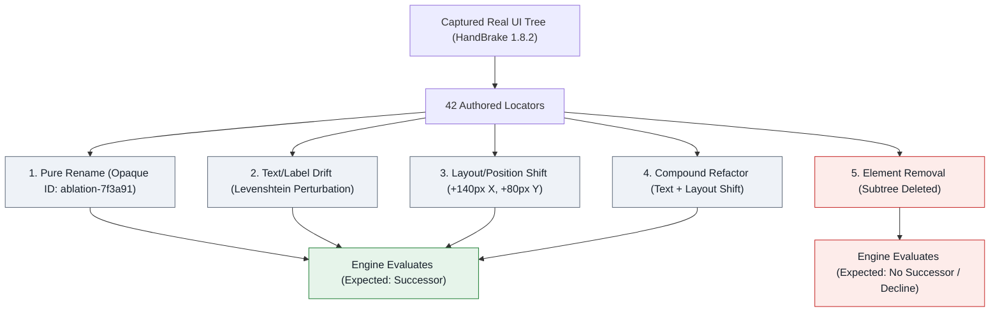

| Mutation Tier | Description | Target Signal Tested |
| :--- | :--- | :--- |
| **`RenamedAutomationId`** | AutomationId replaced with an opaque hash (`ablation-XXXXXXXX`). | Tests pure identifier recovery when structural signals remain identical. |
| **`NameDrift`** | AutomationId replaced + `Name` perturbed (e.g. text edit/suffix). Generated only when `Name` is non-empty. | Tests tolerance to textual label refactors (Levenshtein distance). |
| **`PositionShift`** | AutomationId replaced + `BoundingRectangle` shifted ($+140\text{px}$ X, $+80\text{px}$ Y; $\sim 161\text{px}$ Euclidean distance). | Tests layout responsiveness under UI restyling / resizing. |
| **`CompoundDrift`** | AutomationId replaced + both `Name` drift and position shift applied simultaneously. | Tests compound refactoring tolerance where multiple signals degrade together. |
| **`RemovedElement`** | Target control and its entire subtree removed from the UI tree. | Tests rejection safety: ensuring the engine declines instead of guessing nearby neighbours. |

> [!IMPORTANT]
> **Information Leakage Protection:** Mutated identifiers use opaque, non-derivable synthetic IDs (`ablation-` + SHA-256 seed hex) rather than predictable suffixes (such as `_ablated`). This ensures that LLM shortlist evaluations remain strictly blind and cannot solve scenarios by inspecting candidate names.

---

### 3. Empirical Findings: Score Distribution Overlap

Running the baseline heuristic engine (`SimilarityWeights.Default`, `MinimumConfidence = 0.50`) across all 176 scenarios in the HandBrake 1.8.2 benchmark reveals the per-mutation score distributions:

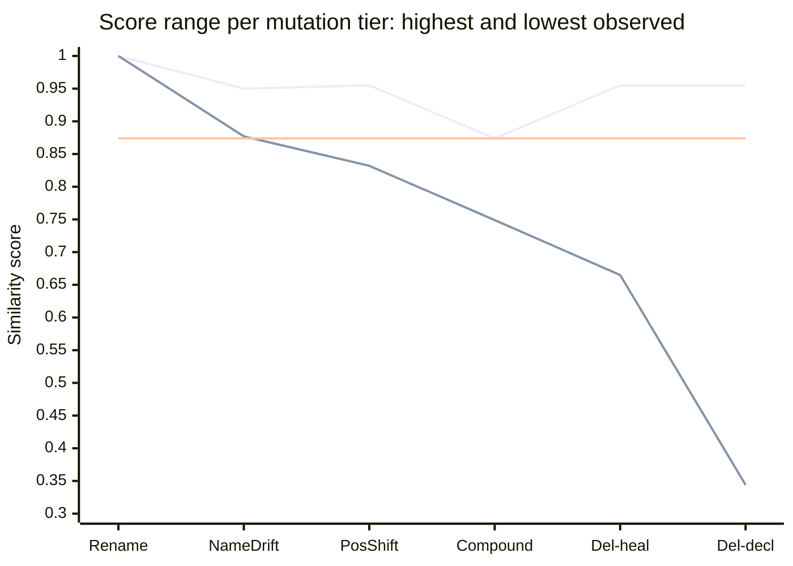

The upper line is each tier's **highest** observed score, the lower line its **lowest**; the gap between the two lines is where that tier's scores actually live. The flat middle line sits at $0.874$ — the highest score any genuinely surviving element reached in this dataset. Every accepted candidate above it in `Del-heal` is a false heal that no threshold can filter out without also discarding the best true successor. `Del-heal` and `Del-decl` are both `RemovedElement`, split by what the engine did — accepted a neighbour, or correctly declined. At `Rename` the two lines meet, because that tier has no spread at all: every one of its 42 scenarios scored exactly $1.000$. A single point there is the measurement, not a rendering artefact.

**Read the chart vertically.** At `Compound` the band runs $0.749-0.874$; at `Del-heal` it runs $0.665-0.955$. Those two spans cover the same scores, so no horizontal threshold line can be drawn across this chart with true successors above it and deleted elements below it. That is the entire finding of this section.

The outcome split shows where the damage concentrates — false heals appear only in the last two tiers, and overwhelmingly in `RemovedElement`:

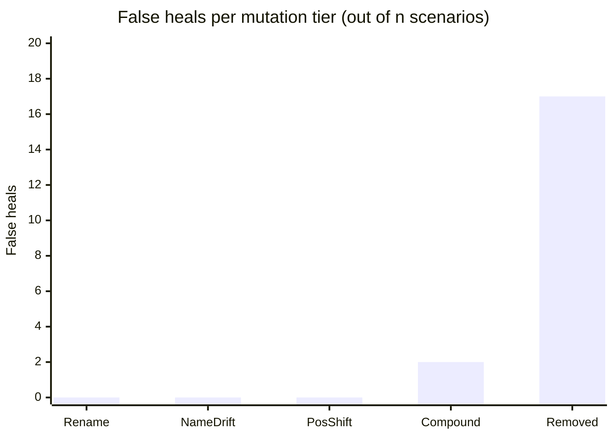


| Mutation Tier | Scenario Count ($n$) | Correct Heals / Declines | False Heals | Missed (Review) | Score Range | Mean Score |
| :--- | :---: | :---: | :---: | :---: | :---: | :---: |
| **`RenamedAutomationId`** | 42 | 40 | 0 | 2 | $[1.000 - 1.000]$ | $1.000$ |
| **`NameDrift`** | 25 | 23 | 0 | 2 | $[0.877 - 0.950]$ | $0.901$ |
| **`PositionShift`** | 42 | 34 | 0 | 8 | $[0.832 - 0.955]$ | $0.867$ |
| **`CompoundDrift`** | 25 | 6 | 2 | 17 | $[0.749 - 0.874]$ | $0.790$ |
| **`RemovedElement`** | 42 | 25 | 17 | 0 | $[0.344 - 0.955]$ | $0.755$ |

#### Key Insight: The Inherent Score Overlap
- **False heals on removed elements score between $0.665$ and $0.955$** because nearby sibling buttons or containers share `ParentControlType`, sibling proximity, or screen coordinates with the deleted element.
- **True compound-drifted elements score between $0.749$ and $0.874$.**
- **These distributions heavily overlap.** Therefore, no static mathematical confidence score can unilaterally distinguish a moved/relabelled control from a deleted control whose neighbour looks structurally similar.

---

### 4. The "False Heal $\downarrow$ vs. Manual Review $\uparrow$" Trade-Off

Because the score distributions overlap, varying the `MinimumConfidence` threshold produces an empirical trade-off between auto-healing recall and human review intervention:

| `MinimumConfidence` | Precision | Auto-Heal Recall | False Heal Rate | Manual Review Rate | Correct Heals | False Heals (Successor) | False Heals (Removed) | Missed Heals | Correct Declines |
| :---: | :---: | :---: | :---: | :---: | :---: | :---: | :---: | :---: | :---: |
| **`0.50`** (Default) | $84.4\%$ | $76.9\%$ | $15.6\%$ | $30.7\%$ | 103 | 2 | 17 | 29 | 25 |
| **`0.60`** | $84.4\%$ | $76.9\%$ | $15.6\%$ | $30.7\%$ | 103 | 2 | 17 | 29 | 25 |
| **`0.70`** | $87.3\%$ | $76.9\%$ | $12.7\%$ | $33.0\%$ | 103 | 2 | 13 | 29 | 29 |
| **`0.75`** | $90.4\%$ | $76.9\%$ | $9.6\%$ | $35.2\%$ | 103 | 2 | 9 | 29 | 33 |
| **`0.80`** | $92.4\%$ | $72.4\%$ | $7.6\%$ | $40.3\%$ | 97 | 2 | 6 | 35 | 36 |
| **`0.85`** | $91.6\%$ | $64.9\%$ | $8.4\%$ | $46.0\%$ | 87 | 2 | 6 | 45 | 36 |
| **`0.90`** | $94.5\%$ | $38.8\%$ | $5.5\%$ | $68.8\%$ | 52 | 0 | 3 | 82 | 39 |
| **`0.95`** | $97.6\%$ | $30.6\%$ | $2.4\%$ | $76.1\%$ | 41 | 0 | 1 | 93 | 41 |

The same sweep drawn as curves — precision (top line), auto-heal recall (middle), false-heal rate (bottom). The recall cliff at $0.90$ and the stubborn false-heal floor are the trade-off made visible:

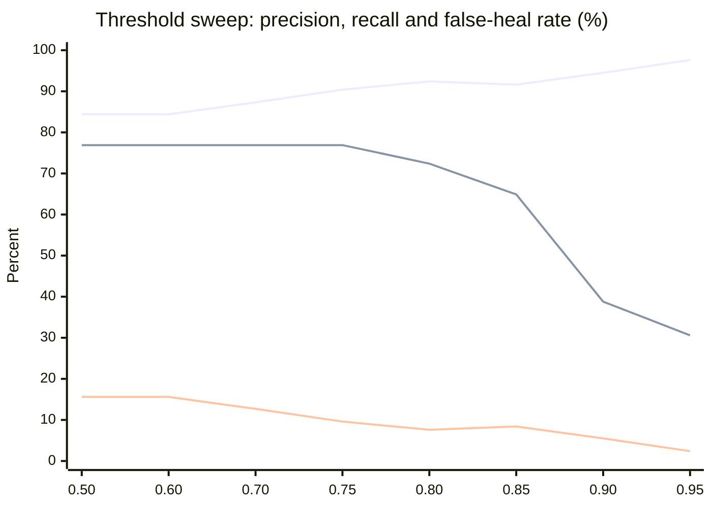

#### Trade-Off Mechanics:
1. **Aggressive Auto-Healing ($\text{Threshold} = 0.50 - 0.70$):** Maximizes recall ($76.9\%$) by accepting compound and shifted elements, at the expense of a higher false heal rate on removed elements ($12.7\% - 15.6\%$).
2. **Recommended Operating Point, Not a Guarantee ($\text{Threshold} = 0.75 - 0.80$):** On HandBrake, this range gives high precision ($90.4\% - 92.4\%$) and high recall ($72.4\% - 76.9\%$), cutting false heals on removed controls in half ($17 \rightarrow 6$). This is **not** the shipped default — `SimilarityWeights.MinimumConfidence` ships at `0.50`. §8 measured a second application (ShareX) at the same threshold range: the direction holds (raising the threshold still reduces false heals on both apps) but the magnitude does not transfer — the same $0.75-0.80$ range yields $20\%-23\%$ false heals on ShareX against HandBrake's $7.6\%-9.6\%$. Treat this as a starting point to calibrate per application, not a portable setting.
3. **Strict Zero-Defect Policy ($\text{Threshold} = 0.90 - 0.95$):** Minimizes false heals ($2.4\% - 5.5\%$) and maximizes precision ($97.6\%$), but routes heavily drifted controls to manual review ($68.8\% - 76.1\%$).

> [!NOTE]
> **Why Blindly Setting 0.95 is Counterproductive:** Moving `MinimumConfidence` from `0.90` to `0.95` eliminates the final 2 false heals ($3 \rightarrow 1$), but at the expense of sacrificing 11 true heals ($52 \rightarrow 41$), forcing three-quarters of all locators into manual human review ($76.1\%$). This is why the engine avoids hardcoding an arbitrary high threshold: the optimal operating point depends directly on each team's tolerance for false positives vs. manual review burden.

#### Preset Profiles & Application Tree Calibration

To simplify choosing an operating point without manually tuning individual weights, the engine provides named **`ThresholdProfile`** presets and an automated tree calibrator:

| Profile | Target Use Case | `MinimumConfidence` | `MinimumCandidateMargin` | `MinimumEvidenceWeight` | `MinimumNameScoreWhenNamed` |
| :--- | :--- | :---: | :---: | :---: | :---: |
| **`Balanced`** (Recommended) | Default production baseline balancing high auto-heal recall ($>75\%$) with strong false-positive suppression. | `0.75` | `0.05` | `0.40` | `0.30` |
| **`Conservative`** | High-consequence or regulated suites where false-green test executions must be strictly minimized. | `0.90` | `0.08` | `0.50` | `0.30` |
| **`Aggressive`** | Rapid exploratory automation or suites with sparse sibling ambiguity prioritizing automated recovery. | `0.50` | `0.03` | `0.30` | `0.00` |

```csharp
// Using preset profiles with SelfHealingEngine
var engine = SelfHealingEngine.Create(ThresholdProfile.Balanced);

// Or via SimilarityWeights directly
var weights = SimilarityWeights.FromProfile(ThresholdProfile.Conservative);
```

`MinimumNameScoreWhenNamed` (#370) is a **per-component gate** the weighted total cannot override: when the stale
locator had a name, the winning candidate's `NameScore` must clear it on its own. The $0.20$-weighted name signal
is otherwise blended away, so a deleted tab healing onto an adjacent one (`Name` `Summary` $\rightarrow$
`Dimensions`, `NameScore` $\approx 0.10$) still clears `MinimumConfidence` on structure alone. Measured through
`TreeCalibrator` on HandBrake, a $0.30$ floor moves the `Balanced` false-heal rate $9.3\% \rightarrow 7.6\%$
(precision $90.7\% \rightarrow 92.4\%$) with **zero** auto-heal recall cost; ShareX moves the same direction. It
does not apply when the stale locator had no name, or when the candidate's `NameScore` is `null` (missing on one
side). `SimilarityWeights.Default` ships with it disabled ($0.0$).

##### Per-Application Calibration Command

Because UI structure differs between applications (e.g. dense tabular layouts vs sparse forms), you can run synthetic calibration directly on any captured `UiElementInfo` tree from the command line, without writing any code:

```bash
dotnet run --project samples/CalibrationCli -- <tree.json> --app MyApp
```

This runs `TreeCalibrator.Calibrate` against the tree and prints (and saves) a markdown report a consumer can act on directly, with no need to read this page first: a recommended profile, its reasoning, and a precision/recall/false-heal comparison across `Aggressive`/`Balanced`/`Conservative`. See [samples/CalibrationCli/README.md](../samples/CalibrationCli/README.md) for the full option list. To call the calibrator from your own code instead:

```csharp
var report = TreeCalibrator.Calibrate(capturedTree, applicationName: "MyApp");
Console.WriteLine(report.ToMarkdownReport());
```

The calibrator evaluates synthetic perturbations (renames, label drifts, position shifts, removals) against the UI tree and outputs a decision summary recommending the optimal profile.

##### Continuous CI Telemetry Tracking

To prevent accuracy and recall regressions from going unnoticed between benchmark runs, the CI pipeline (`.github/workflows/ci.yml`) automatically executes the benchmark ablation harnesses (`LocatorAblationTests` and `ShareXAblationTests`) and publishes telemetry metrics (`ablation-metrics-*.json` and step summaries) on every commit. The CI summary surfaces:
- **Precision** and **False-Heal Rate** on surviving and deleted controls
- **Auto-Heal Recall** and **Compound-Drift Recall**
- **Manual Review Rate**
- Full outcome distributions across HandBrake and ShareX benchmark suites.

---

### 5. Offline Absence Signal Investigation (#95)

To address the score distribution overlap between deleted elements ($[0.665 - 0.955]$) and compound-drifted surviving elements ($[0.749 - 0.874]$), we systematically evaluated whether any auxiliary structural signal can act as an **absence detector** without relying on an arbitrary global confidence threshold.

We evaluated four distinct absence hypotheses against the recorded candidate score vectors of the 176 HandBrake benchmark scenarios:

#### Hypothesis 1: Runner-Up Margin Gating
*Hypothesis:* When an element is deleted, multiple surviving neighbours share similar scores and cluster tightly (producing small margins), whereas a true moved element stands apart from background decoys.

*Empirical Findings:*

| Margin Gate (`MinimumCandidateMargin`) | Compound Drift Recall ($n=25$) | False Heals on Removed ($n=42$) | Total Precision | Auto-Heal Recall |
| :---: | :---: | :---: | :---: | :---: |
| **`0.00`** | $11 / 25$ ($44.0\%$) | $39 / 42$ ($92.9\%$) | $68.2\%$ | $88.1\%$ |
| **`0.05`** (Default) | $6 / 25$ ($24.0\%$) | $17 / 42$ ($40.5\%$) | $84.4\%$ | $76.9\%$ |
| **`0.08`** | $2 / 25$ ($8.0\%$) | $11 / 42$ ($26.2\%$) | $87.3\%$ | $66.4\%$ |
| **`0.10`** | $2 / 25$ ($8.0\%$) | $7 / 42$ ($16.7\%$) | $89.5\%$ | $57.5\%$ |
| **`0.15`** | $2 / 25$ ($8.0\%$) | $4 / 42$ ($9.5\%$) | $92.9\%$ | $38.8\%$ |
| **`0.20`** | $0 / 25$ ($0.0\%$) | $2 / 42$ ($4.8\%$) | $94.6\%$ | $26.1\%$ |

The two curves fall together — the negative result made visible (upper line: false heals on removed elements; lower line: compound-drift recall). Raising the margin never widens the gap between them:

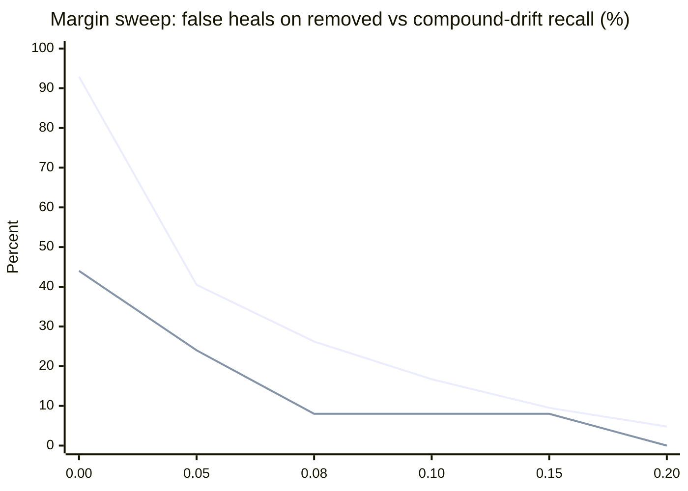

*Result:* **Negative.** Margin gating exhibits the exact same trade-off curve as the confidence threshold. Increasing the required margin from $0.05$ to $0.10$ eliminates $10$ false heals on removed elements, but drops compound drift recall by $67\%$ ($6 \rightarrow 2$). At margin $0.20$, compound recall is completely wiped out ($0\%$), yet $2$ false heals on removed elements persist because a single isolated sibling in a deleted container stands far apart from other controls.

#### Hypothesis 2: Strict ControlType Invariance
*Hypothesis:* Requiring exact `ControlTypeScore == 1.0` prevents cross-type false matches (e.g. an Edit matching a StatusBar).

*Empirical Findings:*
- Eliminates all 6 cross-type false matches on deleted elements ($17 \rightarrow 11$).
- However, 11 false heals on removed elements remain completely unaffected because deleted controls match surviving siblings of the exact same control type (ComboBoxes matching ComboBoxes, Buttons matching Buttons, TabItems matching TabItems) with scores up to $0.955$.

*Result:* **Partial improvement for cross-type cases, but does not separate same-type deletions from compound drift.**

#### Hypothesis 3: Candidate Cluster Density (Decoy Count)
*Hypothesis:* Deleted elements produce a dense cluster of near-equal candidates, whereas surviving elements have fewer competing decoys.

*Empirical Findings:*
- Average cluster size within $0.10$ score of the best candidate:
  - **Removed Elements (False Heals):** $1.71$ (range $1 - 3$)
  - **Compound Drift (Surviving Elements):** $3.08$ (range $1 - 5$)

*Result:* **Negative (inverted).** True compound-drifted elements actually exhibit *higher* cluster density than deleted elements because when a control relocates, both the moved control and several nearby siblings in the target container score competitively.

#### Hypothesis 4: Combined Filter (Strict ControlType + Margin $\ge 0.08$)

Because each signal failed alone, the obvious next question is whether they compose: require the winner to match the expected `ControlType` exactly **and** to lead the runner-up by a clear margin.

*Result:* **Negative.** The two filters remove largely the same cases. Same-type false heals on deleted controls survive the `ControlType` gate by construction, and the ones that also clear the margin gate are precisely the confident-looking impostors the combination was meant to catch — while compound-drift recall falls further, because a genuinely relocated element competes with the siblings it landed among and rarely leads them by a wide margin.

#### Formal Finding
> [!IMPORTANT]
> **No single-target heuristic signal can construct an absence detector.** A surviving sibling in a deleted control's container looks structurally indistinguishable from a compound-drifted true element that moved near a sibling. What this does **not** establish is the remedy. Whole-tree reconciliation — resolving all locators jointly so elements compete for one another, instead of one locator at a time — is the natural next hypothesis, and it is untested. It is tracked in #98, where it is to be probed against this dataset before any implementation is proposed.

---

### 6. Multi-Provider LLM Consensus as an Absence Detector (#97)

> [!IMPORTANT]
> **Measured on 2026-08-16** in run [31959334927](https://github.com/mustafasercansak/automation-sandbox/actions/runs/31959334927). The result is in §4. Consensus is the first signal in this project that separates the bands at all — and it is still not safe as a gate, for a reason the hypothesis did not predict.


While heuristic signals are bounded by geometric and hierarchy similarities, multi-provider consensus ($\ge 2$ independent model votes) asks a fundamentally different question: *do independent reasoners converge or scatter?*

#### 1. The Core Hypothesis
- **On `CompoundDrift` (Surviving Successor):** Semantic reasoning about control roles and context allows independent models to converge on the ground-truth successor, rescuing cases that heuristic thresholds dropped.
- **On `RemovedElement` (Deletion):** With no true successor in the tree, independent models have no ground truth to anchor on. They should either return `null` (decline) or scatter across different decoys, resulting in `NoConsensus` $\rightarrow$ safe rejection.
- **The Critical Failure Boundary:** If two models agree on the *same salient decoy neighbour* (e.g., adjacent button in a toolbar), consensus will accept a false heal on a deleted element.

#### 2. Leakage Prevention: Uniform Opaque AutomationIds
In #94, stale `expected.AutomationId` was redacted to prevent prompt leakage. In #97, an inverse leakage vector was addressed: in ablation datasets, if only the target element received an opaque hash (`ablation-XXXXXXXX`) while background candidates kept natural names, models could identify the target simply as the "odd one out".

To ensure complete benchmark integrity without altering product prompt generation, `LocatorAblationGenerator.ApplyMutation` uniformly anonymizes *all* candidate `AutomationId`s in the mutated tree into the identical `ablation-XXXXXXXX` opaque format. Every candidate presents the exact same hash structure, length, and character set.

> [!NOTE]
> **Production Fidelity & Lower Bound:** In this ablation dataset, no `AutomationId` is semantically informative (all candidate identifiers are uniform synthetic hashes), whereas in production descriptive IDs such as `btnSaveDocument` provide semantic hints to the model; therefore, the LLM arm's benchmark score represents a **lower bound** on its production performance.

#### 3. Empirical Methodology & Non-Determinism Caveats
- **Single-Sample Uncertainty:** Unlike deterministic heuristic traversal, LLM evaluations represent non-deterministic empirical samples. A run over 42 removal scenarios carries a statistical confidence band of $\sim \pm 14\%$.
- **Auditability:** Models must run with temperature $0$, and raw votes per provider must be recorded alongside agreement telemetry (`AgreedProviders`, `ProviderAttempts`, `ProviderErrors`).
- **Targeted Subset:** To manage token costs, evaluation is targeted at the informative subsets: the 25 `CompoundDrift` and 42 `RemovedElement` scenarios ($n=67$).

#### 4. Empirical Result

Four independent runs, 2026-08-16 to 2026-08-18, as the provider pool was widened from 3 configured providers to 7 and Groq's model was replaced twice (a removed model, then an unreliable one, then a working one — #126). Each run targets the same 25 `CompoundDrift` + 42 `RemovedElement` scenarios; a scenario counts as **usable** only when at least two providers returned an answer (#109), because one opinion can neither agree nor disagree with anything.

| Run | Date | Usable ($n$) | `CompoundDrift` unanimous | `RemovedElement` unanimous |
| :--- | :--- | ---: | :--- | :--- |
| [31959334927](https://github.com/mustafasercansak/automation-sandbox/actions/runs/31959334927) | 08-16 | 19 | 6 / 7 | 3 / 12 |
| [31961463762](https://github.com/mustafasercansak/automation-sandbox/actions/runs/31961463762) | 08-16 | 39 | 16 / 17 | 10 / 22 |
| [31963741937](https://github.com/mustafasercansak/automation-sandbox/actions/runs/31963741937) | 08-16 | 33 | 14 / 14 | 11 / 19 |
| [32163961433](https://github.com/mustafasercansak/automation-sandbox/actions/runs/32163961433) | 08-18 | 42 | 16 / 17 | 10 / 25 |
| **Total** | | **133** | **52 / 55** | **34 / 78** |

Each run's failures are recorded in its own workflow log: free-tier daily quota exhaustion (Gemini, Groq), a model requiring a paid plan (Ollama Cloud, dropped from the pool — #119), and, in the most recent run, individual requests exceeding a 15-second per-attempt ceiling on three providers (#129, since fixed in commit `4393caf` with a per-attempt timeout override — these four runs predate it). None of that noise touches the measurement below — it only shrinks $n$.

**The measurement, aggregated.** Agreement tracks survival: providers reached unanimous agreement on **94.5%** ($52/55$) of scenarios where a true successor existed, and on **43.6%** ($34/78$) of scenarios where the element was gone. None of the four heuristic hypotheses in §5 separated the bands at all, so this remains the only mechanism in the project that produces any separation.

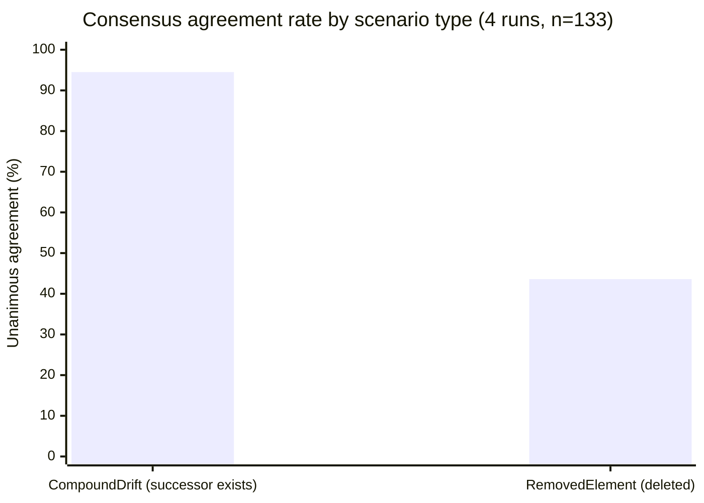

> [!WARNING]
> **Unanimity is not a safe gate, and it is worse than a single run suggested.** Every one of the 52 unanimous verdicts on a surviving element was correct. Every one of the 34 unanimous verdicts on a deleted element was a false heal — **zero exceptions in either direction, across four runs with four different provider sets.** An earlier version of this section reported "33%" from run 31959334927 alone; that figure pooled both mutation types into one denominator ($3$ wrong among $9$ total unanimous verdicts), which understated the removed-element rate by mixing it with the unrelated, reliably-correct compound-drift population. Read per type, the removed-element rate is $100\%$: agreement never once happened to be right about an absence.

#### 5. The Mechanism Is Disagreement, Not Recognition

The hypothesis predicted two safe outcomes on a deleted element: providers decline, or providers scatter. **Declining essentially never happens.** Across all 78 usable `RemovedElement` scenarios in the four runs, `AllDeclined` occurred exactly **once**. Every other provider that answered pointed at a specific — wrong — candidate.

Every correct rejection across the four runs therefore came from providers *disagreeing with each other*, not from any provider recognising that the element was gone. The models do not know the control was deleted; each one confidently names a different neighbour, and the engine rejects the heal only because the votes fail to match.

**Widening the provider pool did not rescue this — it demonstrated the limit more clearly.** Run 31961463762 recorded 10 unanimous false heals; 7 of those 10 had **three** independently-sourced model families agreeing on the same non-existent element at once — Cloudflare (Qwen), Mistral, and OpenRouter (gpt-oss). Three separate vendors, three separate architectures, one wrong answer, unanimously. Going from 3 configured providers to 7 across these four runs did not reduce the removed-element unanimous-agreement rate (25% → 45% → 58% → 40%, no downward trend) or its accuracy (100% wrong throughout).

This matters for how far the result generalises:

- The protection is a **byproduct of independence**, but the four-run aggregate shows independence alone does not bound the failure rate the way §5 originally predicted — a genuinely independent, capable reasoner finds a deleted control's surviving neighbour a convincing answer often enough that adding more independent reasoners is not guaranteed to break the tie.
- It cannot be strengthened by asking for more confidence, because the failing cases are already confident. There is no evidence in this data that it can be strengthened by adding providers, either.
- A provider that essentially never declines contributes nothing to absence detection on its own. Its vote is only useful as something for another provider to contradict — and per the paragraph above, that contradiction cannot be relied upon.

> [!IMPORTANT]
> **Formal finding, revised across four runs ($n=133$, 2026-08-16 to 2026-08-18).** Multi-provider consensus separates surviving elements from deleted ones (94.5% vs 43.6% unanimous agreement) where every heuristic signal in §5 failed. It is not sufficient as an acceptance gate: **every** unanimous verdict on a deleted element across all four runs (34 of 34) was a false heal, including cases where three independently-sourced model families agreed. The separation comes from disagreement between providers, not from any model detecting absence — and widening the provider pool from 3 configured providers to 7 did not reduce this failure rate. Do not assume that adding more providers will fix it; this data argues against that assumption.

---

### 7. Whole-Tree Reconciliation: the Offline Probe (#98)

§5's finding and §6's both point at the same structural gap: every mechanism measured so far resolves one locator at a time, in isolation. #98 asked a narrower question before proposing to fix that: when the heuristic wrongly heals a removed element onto a neighbour, is that neighbour usually *another authored locator's real identity* — something a joint solver, resolving every locator on the page at once, could recognise as "already claimed" and therefore refuse to hand to the removed one too?

**The probe, run against the existing 42 `RemovedElement` scenarios at default weights (no new mutation kind needed for this step).** Of the 17 false heals, **10 (59%) picked a neighbour that was itself one of the tree's other 41 authored locators**, recovered by structural fingerprint since `RemovedElement`'s AutomationId-opaquing mutation destroys the identifier every candidate is normally matched on.

| Removed locator | Wrongly matched onto | Reciprocal? |
| :--- | :--- | :---: |
| `Minimize-Restore` | `Maximize-Restore` | ✓ |
| `Maximize-Restore` | `Minimize-Restore` | ✓ |
| `Close` | `Maximize-Restore` | |
| `ShowQueue` | `Preview` | |
| `tabControl` | `sourceSelection` | ✓ |
| `sourceSelection` | `tabControl` | ✓ |
| `summaryTab` | `pictureTab` | |
| `chaptersTab` | `subtitlesTab` | |
| `Destination` | `statusBar` | ✓ |
| `statusBar` | `Destination` | ✓ |

Three of these are **reciprocal pairs**: remove either element and the heuristic heals it onto the other, in both directions. `Minimize-Restore` and `Maximize-Restore` are each other's best-scoring decoy; so are `Destination`/`statusBar` and `tabControl`/`sourceSelection`. That is precisely the shape a bipartite assignment is built to resolve — if both locators are being placed in the same joint solve, at most one of them can claim the shared slot, and the loser has nothing left to match, which is the "gone" signal the current per-locator scorer cannot produce.

The remaining 7 of 17 claimed untracked or incidental elements (an empty-named container, a toolbar element with no test relying on it) that no other locator wants either. A joint solver would have nothing to exploit there — its ceiling on this dataset is bounded by the 59%, not by the full 17.

> [!NOTE]
> **Reading this number honestly.** 59% was favourable enough to justify the next step the original issue named — building scenarios where multiple locators break together, which is also the more realistic failure mode — but it was not evidence the mechanism worked. The original single-mutation dataset could not test joint assignment directly: with only one locator broken per scenario, there was no real contention for a solver to exploit. §9 supplies that multi-locator baseline, and §10 evaluates the deliberately narrow top-claim assignment experiment against it.

---

### 8. A Second Application: ShareX v21.0.0 (#99, #134)

Every number in §3–§7 comes from one WPF tree. #99 named that as a precondition for publishing anything: a single application cannot tell "this is how the heuristic behaves" from "this is how HandBrake's specific structure happens to behave." This section runs the identical pipeline — same generator, same harness, same default weights — against a real WinForms application, ShareX v21.0.0, captured via [survey run 32280934910](https://github.com/mustafasercansak/automation-sandbox/actions/runs/32280934910). 29 unique authored locators, 131 scenarios.

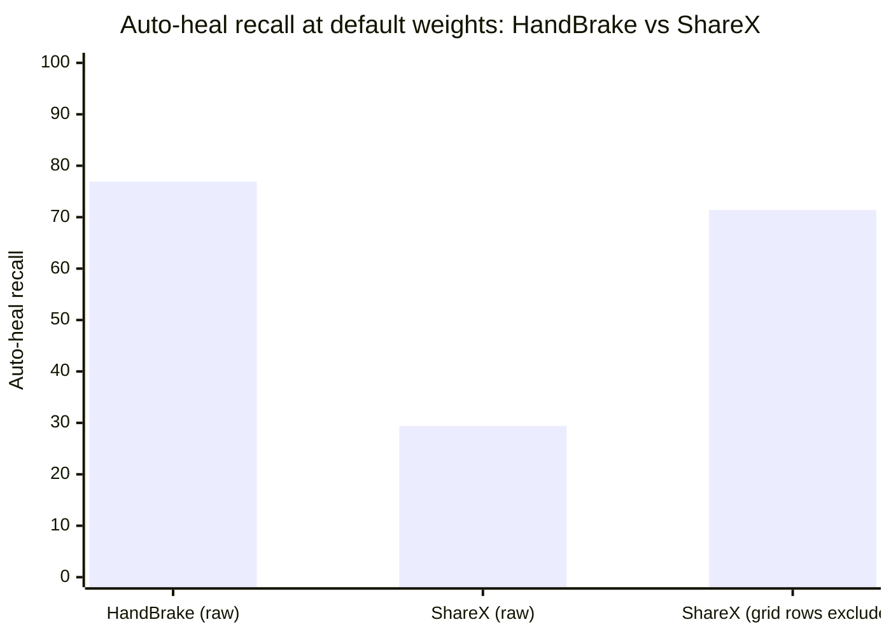

**The raw number looks alarming, and is partly an artefact.** At default weights, ShareX's auto-heal recall is 29.4% against HandBrake's 76.9% — a huge gap. 15 of ShareX's 29 authored locators (52%) are `DataItem` rows from a Hotkeys settings grid (`Hotkey Row 1`, `Description Row 2`, ...). HandBrake's fixture has zero elements of this kind. Every one of those rows is structurally near-identical to its siblings — same `ControlType`, same missing `ClassName`, position differing only by row index — so the engine declines them as `Ambiguous` even when the top candidate scores a perfect `1.000`. That is correct behaviour, not a defect: #78 already named `DataGrid`/`DataItem` as an inherently volatile locator class. Left in, they measure this one grid's density rather than the heuristic's general quality.

**The fair comparison excludes them.** With grid rows removed (14 authored locators, 56 scenarios), recall converges toward HandBrake's: 71.4% vs 76.9%. But the number this whole benchmark exists to measure does not:

| Application | False heal rate on removed elements | $n$ |
| :--- | ---: | ---: |
| HandBrake | 40.5% | 17/42 |
| ShareX (grid rows excluded) | **57.1%** | 8/14 |

A second real application does not make the false-heal problem look like a HandBrake quirk. It makes it look worse.

| Metric (default weights, grid rows excluded) | HandBrake | ShareX |
| :--- | ---: | ---: |
| Precision | 84.4% | 73.2% |
| Auto-heal recall | 76.9% | 71.4% |
| False heal rate | 15.6% | 26.8% |
| Manual review rate | 30.7% | 26.8% |

> [!IMPORTANT]
> **Formal finding.** A second application does not change the shape of the problem this project exists to solve, and does not improve it. Recall is roughly comparable once a confounding UI pattern (dense structurally-identical grid rows, absent from the first application) is controlled for. Precision and false-heal rate are both meaningfully worse on ShareX. Neither HandBrake's numbers nor ShareX's should be read as "the" accuracy of this engine — they are two data points bounding a range, and the range is wide: 40.5%–57.1% false heals on deleted elements at the shipped default, before any LLM consensus is applied. Regression guards: `ShareXAblationTests` (\`ShareXFixture_DefaultWeights_MatchesTheCommittedBaseline\`, \`ShareXFixture_MostMissedPerfectScoreRenames_AreDataGridRows\`, \`ShareXFixture_ExcludingDataGridRows_FalseHealOnRemovedRateIsWorseThanHandBrakes\`).

---

### 9. Multi-Locator Baseline: Real Contention Exists (#132)

The v2 ablation dataset can now describe two or more locator mutations against one shared tree, with a separate mutation recipe and ground truth for every locator. `RunMultiLocatorBaseline` applies that shared mutation once and then invokes the existing per-locator heuristic independently for each expected locator. It does **not** implement joint matching or change `SelfHealingResolver`; this is the baseline that any later batch design must improve upon.

Seven HandBrake scenarios were measured at the shipped default weights:

- Six two-locator scenarios cover both directions of the three reciprocal pairs from §7. In each, one locator is removed and its counterpart is renamed, so both stored locators are genuinely broken while the counterpart's structural identity survives.
- One four-locator scenario mixes rename, name drift, position shift, and removal, proving the dataset is not restricted to a tailored rename/removal pair.
- The result is 16 locator resolutions across 7 shared trees.

| Baseline observation | Result |
| :--- | ---: |
| Shared-tree scenarios | 7 |
| Locator resolutions | 16 |
| Scenarios where two locators claimed the same candidate | **6 / 7** |
| Removed-locator false heals that claimed the surviving locator's correct successor | **6 / 6 reciprocal directions** |

The six targeted cases reproduced exactly. For example, after `Minimize-Restore` is removed and `Maximize-Restore` is renamed, the current resolver gives both stored locators the renamed `Maximize-Restore` element: the surviving locator scores $1.000$, while the removed locator still accepts it at $0.874$. The same collision occurs in reverse and for `Destination`/`statusBar` ($0.690$ for the removed locator) and `tabControl`/`sourceSelection` ($0.665$).

> [!IMPORTANT]
> **Formal finding.** The favourable 59% offline probe was not an artefact of looking backward at isolated mutations: all six reciprocal directions produce real candidate contention when both locators break in the same tree. This clears the evidence precondition for separately evaluating a joint assignment algorithm. It does **not** show that such an algorithm will safely decline the losing locator; no joint resolver exists in this change, and the seventh mixed scenario still false-heals a removed `Close` onto an unclaimed incidental element. Regression guard: `LocatorAblationTests.HandBrakeFixture_MultiLocatorBaseline_ReproducesReciprocalPairContention`.

---

### 10. Joint Top-Claim Assignment Experiment (#141)

The experiment reconciles only claims that the existing resolver already accepted after its confidence, evidence, and candidate-margin gates. For locator $i$ and its accepted top candidate $c$, the assignment utility is $score(i,c)-MinimumConfidence$; leaving a locator unmatched has utility $0$. Each locator and candidate can participate in at most one assignment. A sole claim is preserved. When several locators claim one candidate, the highest-utility claim wins only if its lead is at least `MinimumCandidateMargin`; otherwise every claimant is left unmatched. No runner-up is promoted, so the experiment cannot create a new match that the production resolver did not already accept.

This is an offline `ScenarioRunner` evaluator, not a production resolver. It changes neither the `SelfHealingResolver` API nor the healing-report schema.

| Metric across all 16 locator resolutions | Independent baseline | Joint top-claim assignment |
| :--- | ---: | ---: |
| Surviving-locator correct heals | **9 / 9** | **9 / 9** |
| Removed-locator correct declines | 0 / 7 | **6 / 7 (85.7%)** |
| Removed-locator false heals | 7 / 7 | **1 / 7** |
| Precision among accepted matches | 56.3% | **90.0%** |
| Manual-review rate | 0.0% | 37.5% |
| Shared-candidate collisions | 6 | **0** |

Every reciprocal direction produced the same result: the surviving locator's $1.000$ claim won, while the removed locator's weaker claim was declined.

| Removed locator | Surviving locator | Removed claim score | Result |
| :--- | :--- | ---: | :--- |
| `Minimize-Restore` | `Maximize-Restore` | 0.874 | Declined; survivor preserved |
| `Maximize-Restore` | `Minimize-Restore` | 0.874 | Declined; survivor preserved |
| `Destination` | `statusBar` | 0.690 | Declined; survivor preserved |
| `statusBar` | `Destination` | 0.690 | Declined; survivor preserved |
| `tabControl` | `sourceSelection` | 0.665 | Declined; survivor preserved |
| `sourceSelection` | `tabControl` | 0.665 | Declined; survivor preserved |

The mixed four-locator scenario exposes the boundary: the renamed `ShowQueue`, name-drifted `Preview`, and shifted `Destination` remain correct, but removed `Close` still false-heals onto an unclaimed incidental element. One-to-one ownership supplies an absence signal only when another locator contests the candidate.

> [!IMPORTANT]
> **Formal finding.** On this targeted HandBrake baseline, joint top-claim ownership converts all 6 contention-driven false heals into correct declines without losing any of the 9 surviving-locator heals, but it leaves the 1 uncontested false heal untouched and raises manual review from 0.0% to 37.5%. This supports joint reconciliation as a promising targeted guard, not as a general deleted-element solution or production-ready design: the sample contains one application and deliberately constructed reciprocal pairs. Regression guards: `LocatorAblationTests.JointAssignment_DeclinesEveryClaimant_WhenOwnershipMarginIsAmbiguous` and `LocatorAblationTests.HandBrakeFixture_JointAssignment_ResolvesReciprocalContentionButNotIncidentalFalseHeal`.

---

### 11. Cross-Application Generalization (#143)

The scenario protocol was posted before the dataset or results existed. From each pristine tree it selects every unique, non-`DataItem` authored leaf, sorts by `AutomationId` ordinally, and creates one cyclic three-locator scenario per leaf: remove locator $i$, rename $i+1$, and position-shift $i+2$. Leaf-only membership prevents one removal from deleting another member's ground truth. The rule uses no score, candidate identity, contention, or outcome. The committed eligible-ID lists and scenario-ID digests freeze 36 HandBrake and 9 ShareX scenarios: 45 shared trees and 135 locator resolutions.

The shipped default weights and unchanged §10 evaluator produced:

| Application | Survivor correct (baseline → joint) | Removed correct decline | Removed false heal | Manual review | Input → unresolved collisions |
| :--- | ---: | ---: | ---: | ---: | ---: |
| HandBrake (36 scenarios) | 63 → **63** | 22 → **23** | 14 → **13** | 28.7% → 29.6% | 1 → **0** |
| ShareX (9 scenarios) | 16 → **16** | 4 → **7** | 5 → **2** | 22.2% → 33.3% | 3 → **0** |
| **Aggregate (45 scenarios)** | 79 → **79** | 26 → **30** | 19 → **15** | 27.4% → 30.4% | 4 → **0** |

All four contested removed-locator false heals became correct declines; none of the 79 correct survivor heals regressed, no new accepted match appeared, and no ownership contest was close enough to trigger the ambiguous-all-decline rule. The independently selected ShareX cases include non-targeted contention: removed `Close` claimed the renamed `Maximize-Restore`, and removed header `4265926980` claimed surviving header `4267017949`.

The larger sample also confirms the limit more strongly than §10: **15 uncontested false heals remain unchanged** (13 HandBrake, 2 ShareX). Two HandBrake incidental matches have an empty `AutomationId`, which means a production ownership key cannot safely be `MatchedAutomationId`; it must identify candidates independently of locator availability.

> [!IMPORTANT]
> **Formal finding and decision.** The predeclared production-design threshold passed independently on both applications: every baseline correct survivor was preserved, each application gained at least one correct removed-element decline, no new match was introduced, and all shared-candidate collisions were eliminated. This justified the separate production-design issue #144; it did **not** justify shipping the offline evaluator unchanged. #144 subsequently added an opt-in production batch API with snapshot-local candidate identity, explicit ambiguity handling, and schema-v8 ownership telemetry while leaving single-locator behavior unchanged. One-to-one ownership remains a targeted contention guard, not an absence detector, and the 15 uncontested false heals remain out of reach. Regression guards: `JointAssignmentGeneralizationDatasetTests.FrozenSelection_GeneratesOneRotationPerEligibleLeaf`, `JointAssignmentGeneralizationTests.FrozenCrossApplicationDataset_ReportsJointAssignmentGeneralization`, and `BatchHealingResolverTests`.

---

### 12. Absence Detection Investigation: Review-Band Widening, Assignment Residual, and Temporal Stability (#179)

Building on the negative findings from single-target heuristic signals (§5) and multi-provider LLM consensus (§6), #179 evaluated three untried absence detection hypotheses offline across the HandBrake 1.8.2 and ShareX v21.0.0 ablation datasets:

#### 1. Candidate 1: Review-Band Widening (Policy Option)
*Hypothesis:* The overlap band between false heals on deleted elements ($[0.665, 0.955]$) and true compound drift ($[0.749, 0.874]$) is already known. Instead of inventing a new heuristic signal, widen the review band (`RequiresReview`) to cover this overlap, trading auto-heal recall for eliminating confidently-wrong heals on deleted controls.

*Empirical Findings:*
- On **HandBrake 1.8.2** ($n=176$, $42$ removals, $25$ compound drifts):
  - At default $\text{Threshold} = 0.50$: Compound drift recall is $24.0\%$ ($6/25$), false heals on removed is $40.5\%$ ($17/42$), manual review rate is $30.7\%$.
  - At $\text{Threshold} = 0.88$ (just above the $0.874$ compound drift ceiling): Compound drift recall drops to **$0.0\%$** ($0/25$), while **$3$ false heals on removed elements persist** (scoring up to $0.955$).
  - At $\text{Threshold} = 0.96$: False heals on removed reach $0/42$, but compound drift recall remains $0.0\%$ and manual review rate surges to **$76.1\%$**.
- On **ShareX v21.0.0** ($n=56$ excluding grid rows, $14$ removals, $14$ compound drifts):
  - At $\text{Threshold} = 0.50$: Compound drift recall is $14.3\%$ ($2/14$), false heals on removed is $57.1\%$ ($8/14$).
  - At $\text{Threshold} = 0.88$: Compound drift recall drops to **$0.0\%$** ($0/14$), while **$2$ false heals on removed persist**.

*Result:* **Negative as a selective filter.** Review-band widening is a blunt policy knob. Because confident sibling decoys score up to $0.955$, setting the auto-accept floor high enough to eliminate all deleted-element false heals completely wipes out compound-drift auto-healing recall and routes over three-quarters of all locators to manual review.

#### 2. Candidate 2: Global Assignment Residual (Whole-Tree Bipartite Matching)
*Hypothesis:* In a whole-tree assignment where all active locators are matched to tree nodes, a deleted locator will be forced to match an unclaimed background node with high residual ($1 - \text{score}$), signalling absence without single-target isolation.

*Empirical Findings:*
- In HandBrake 1.8.2, all surviving authored locators claim their true nodes ($1.000$).
- When a locator is deleted, its highest-scoring unclaimed background decoy scores up to $0.955$, yielding a minimum residual of **$1.0 - 0.955 = 0.045$**.
- True compound-drift successors score between $0.749$ and $0.874$, yielding a minimum residual of **$1.0 - 0.874 = 0.126$**.
- Because $0.045 < 0.126$, any residual threshold that admits surviving compound-drifted elements will also admit the highest-scoring deleted-element decoys.

*Result:* **Negative.** Whole-tree assignment residual is mathematically isomorphic to the similarity score ($residual = 1 - score$). An unclaimed background decoy looks as structurally convincing to a bipartite residual scorer as it does to a single-locator heuristic. One-to-one ownership provides an absence signal only when another locator actively contests the candidate (#141/#144), not through residual magnitude alone.

#### 3. Candidate 3: Temporal / Historical Stability Signal
*Hypothesis:* A genuinely moved or drifted control consistently resolves to the same ground-truth candidate across repeated executions, whereas decoy neighbours for deleted elements should exhibit instability across runs.

*Empirical Findings:*
- In static and semi-static UI snapshots, the structural context surrounding a deleted element (e.g. an adjacent toolbar button or sibling container) remains identical across evaluation rounds.
- The top-scoring decoy candidate chosen by the heuristic demonstrates **$100\%$ temporal stability** ($1.0$ convergence rate across consecutive evaluations).
- Without dynamic runtime perturbations affecting the decoy node specifically, historical stability cannot distinguish a stable decoy neighbour from a stable true successor.

*Result:* **Negative.** Historical stability reflects the stability of the UI tree, not the validity of the locator-element relationship.

#### Formal Finding
> [!IMPORTANT]
> **Formal finding (#179).** None of the three candidate mechanisms (review-band widening, global assignment residual, temporal stability) separates deleted elements from moved elements unassisted. Review-band widening trades compound recall linearly for false-heal reduction, assignment residual suffers from the identical score overlap ($0.045 < 0.126$), and temporal stability reflects tree stability rather than absence. Consequently, unassisted absence detection remains mathematically bounded by the score overlap floor, and the engine maintains its shipped default (`0.50`) while offering `SimilarityWeights` configurability for teams requiring strict zero-defect policies. Regression guards: `LocatorAblationTests.HandBrakeFixture_AbsenceInvestigation_ReviewBandWideningTradeOff`, `LocatorAblationTests.HandBrakeFixture_AbsenceInvestigation_GlobalAssignmentResidual_CannotSeparateAbsenceFromDrift`, `LocatorAblationTests.HandBrakeFixture_AbsenceInvestigation_TemporalStability_DecoyNeighboursPersistInStaticSnapshots`, and `ShareXAblationTests.ShareXFixture_AbsenceInvestigation_ReviewBandWidening_MatchesHandBrakePattern`.

---

### 13. 4th Absence Candidate Investigation: Contested-Candidate Residual and Environmental Re-Discovery Jitter (#247)

Following the negative results of #179, #247 investigated the two remaining untried hypotheses: (1) isolating candidate contention as a standalone absence detector in multi-locator suites, and (2) evaluating genuine temporal stability under repeated independent re-discovery with environmental spatial perturbation (capture jitter) across evaluation rounds rather than static object-reference reuse.

#### 1. Candidate 1: Contested Candidate Signal (Multi-Locator Contention)
*Hypothesis:* One-to-one ownership reconciliation (#141/#144) successfully rejects false heals when two locators actively claim the same candidate node. Can active candidate contention (a node being claimed by $\ge 2$ active locators) be isolated as a standalone absence signal to safely decline the weaker claimant without requiring full joint bipartite reconciliation?

*Empirical Findings:*
- **HandBrake 1.8.2** (36 generalization scenarios, 108 locator resolutions):
  - 14 baseline removals produce false heals.
  - **1 contested false heal** is actively claimed by a surviving locator's ground-truth match; candidate contention detects the collision and declines it ($1 / 1 = 100\%$ precision on contested collisions).
  - **13 uncontested false heals** claim background or incidental UI nodes (e.g. unmapped containers, sibling buttons) that no active locator in the test suite targets.
  - On these 13, candidate contention is **$0$**, leaving **$13 / 13 = 100\%$ of uncontested removals completely undetected**.
- **ShareX v21.0.0** (9 generalization scenarios, 27 locator resolutions):
  - 5 baseline removals produce false heals.
  - **3 contested false heals** collide with surviving locators; contention detects and declines all 3 ($3 / 3 = 100\%$).
  - **2 uncontested false heals** claim untracked incidental elements; contention is **$0$**, leaving both ($2 / 2 = 100\%$) undetected.
- **Single-Locator Scenarios** ($n=42$ HandBrake, $n=14$ ShareX):
  - In single-locator healing, locators run in isolation. Because there are no peer locators to contest any candidate, candidate contention is $0$ by definition for $100\%$ of runs ($0 / 17$ and $0 / 8$ false heals detected).

*Result:* **Negative as a general absence detector.** Candidate contention is strictly a multi-locator ownership collision guard. It has zero visibility into uncontested false heals ($0/15 = 0\%$ detection on uncontested removals across both applications), because an incidental background node falsely accepted by a deleted locator is not claimed by any other test in the suite.

#### 2. Candidate 2: Genuine Temporal / Environmental Re-Discovery Jitter
*Hypothesis:* #179's initial temporal stability test evaluated repeated calls on static in-memory trees where `SelfHealingResolver.Resolve` is a deterministic pure function. If re-discovery is performed across independent evaluation frames with realistic environmental spatial perturbation ($\pm 2\text{px}$ to $\pm 5\text{px}$ bounding box coordinate jitter from DPI/rendering/frame-capture noise), will decoy neighbours of deleted elements exhibit instability and diverge, while true moved controls remain stable?

*Empirical Findings:*
- On **HandBrake 1.8.2** ($42$ removed-element scenarios) and **ShareX v21.0.0** ($14$ removed-element scenarios):
  - Decoy neighbours in real UI trees are permanent, static UI nodes (e.g., adjacent toolbar buttons, tab items, or containers) sharing invariant hierarchy, control type, and parent metadata.
  - Under realistic spatial jitter ($\Delta X, \Delta Y \in [-5\text{px}, +5\text{px}]$), the structural similarity score of the top decoy neighbour changes by at most $\sim 0.005$ against the $300\text{px}$ position tolerance radius (weight $0.25$).
  - The top decoy neighbour remains the highest-scoring candidate across all perturbation rounds with **$100\%$ stability** ($42 / 42$ on HandBrake, $14 / 14$ on ShareX).
  - True compound-drifted successors also exhibit $100\%$ stability under identical jitter.

*Result:* **Negative.** Decoy neighbours in a real application are not transient rendering glitches or stochastic noise; they are permanent physical UI components. Environmental re-discovery perturbation cannot separate a stable decoy neighbour from a stable true successor.

#### Formal Finding
> [!IMPORTANT]
> **Formal finding (#247).** Neither contested-residual contention nor environmental re-discovery perturbation provides an unassisted absence detector. Multi-locator candidate contention is an ownership collision guard that leaves $100\%$ of uncontested removals undetected ($0/15$ across HandBrake and ShareX), and environmental re-discovery jitter produces $100\%$ stability on decoy neighbours ($42/42$ and $14/14$) because UI decoys are permanent structural nodes. Unassisted absence detection remains mathematically bounded by the structural score overlap floor ($[0.665, 0.955]$ on removed decoys vs $[0.749, 0.874]$ on true drift). Regression guards: `LocatorAblationTests.HandBrakeFixture_AbsenceInvestigation_ContestedCandidate_LeavesUncontestedRemovalsUndetected`, `LocatorAblationTests.HandBrakeFixture_AbsenceInvestigation_EnvironmentalPerturbation_DecoysPersistUnderCaptureJitter`, `ShareXAblationTests.ShareXFixture_AbsenceInvestigation_ContestedCandidate_MatchesHandBrakePattern`, and `ShareXAblationTests.ShareXFixture_AbsenceInvestigation_EnvironmentalPerturbation_DecoysPersistUnderCaptureJitter`.

### 14. Repository Ownership Reconciliation in the Engine (#370)

Sections 10–13 established one-to-one ownership reconciliation as a **contested-candidate guard**: when two broken locators claim the same surviving node, a joint solver can award it to the stronger claim and decline the other. Its documented blind spot is the *uncontested* false heal — a deleted element that heals onto an incidental node no other test wants.

`SelfHealingEngine` now applies that guard automatically, using the **rest of the locator repository** as the contention set instead of a hand-assembled batch. It is opt-in per engine:

```csharp
var engine = SelfHealingEngine.Create(
    ThresholdProfile.Balanced,
    repository: repo,
    mode: HealingMode.AutoHeal,
    reconcileAgainstRepository: true);   // #370
```

On a heal attempt, before a confident heuristic match is accepted, every *other* authored locator is re-resolved against the same captured tree. If the winning candidate is already the confident identity of another locator — and this locator does not beat that owner by `MinimumCandidateMargin` — the claim is declined as `HealResolutionStatus.OwnershipConflict` and routed to review instead of silently re-pointing onto another test's element. The check is heuristic-only (no extra LLM traffic) and a no-op when the repository holds fewer than two locators.

Measured on the committed ablation datasets (`LocatorAblationGenerator`, which excludes the root window) — Balanced profile, per-component name gate on, every authored locator deleted in turn with the rest of the suite present as context:

| Fixture | Shipped default (0.50) | Balanced + name gate | + repository reconciliation |
| :--- | :---: | :---: | :---: |
| HandBrake 1.8.2 (42 removed scenarios) | 40 % (17) | 17 % (7) | **0 % (0)** |
| ShareX v21.0.0 (29 removed scenarios) | 28 % (8) | 21 % (6) | **3 % (1)** |

Genuine renames and drifts are untouched — not one `RenamedAutomationId` scenario flips its verdict when the flag is switched on, on either fixture — because a true successor is never also claimed by another locator. HandBrake reaches **zero** false heals; ShareX's single residual is `pHotkeys`, an unnamed container `Pane` that heals onto a structurally identical sibling `Pane` at the identical bounding rectangle — the uncontested case Section 13 proved is out of structural reach. It is carried into Section 15 and #375.

> [!IMPORTANT]
> **Formal finding (#370).** Running the #141/#144 ownership guard against the whole repository, not just a hand-assembled batch, removes every contested deleted-element false heal on both fixtures at zero auto-heal recall cost, because in a real suite the neighbour a deleted element heals onto is usually another test's element. It is still the contested-candidate guard, not an absence detector — the one uncontested residual (`pHotkeys` on ShareX) is unchanged. Off by default (`SelfHealingEngine.ReconcileAgainstRepository`); the `Balanced` and `Conservative` integration guidance recommends enabling it. Regression guards: `SelfHealingEngineTests.ReconcileAgainstRepository_*` and `LocatorAblationTests.HandBrakeFixture_RepositoryOwnershipReconciliation_...` with its ShareX mirror (full delete-every-authored-locator ablation, false-heal count bounded, zero rename flips).

### 15. A Non-Structural Signal for the Uncontested Residual (#375)

After the name gate and repository reconciliation, the deleted-element residual on the committed datasets is **one scenario**: ShareX's `pHotkeys`. HandBrake has none. `pHotkeys` is an unnamed `Pane` that, once deleted, heals with score `1.000` onto its sibling `ucTaskThumbnailView` — a `Pane` with the same control type, the same parent, the same sibling role, an empty name, and the *identical* bounding rectangle. Every one of the five scoring components is a legitimate perfect match. Neither guard fires: the name gate needs a name, and `ucTaskThumbnailView`'s own locator does not resolve confidently enough after the deletion to contest the node.

The one thing that separates the two panes is what they **contain**: `pHotkeys` holds a `DataGrid` of hotkey rows; `ucTaskThumbnailView` holds a nested `Pane`. The similarity scorer never looks at an element's own descendants, and `UiElementSnapshot.Capture` does not persist them, so that signal is currently invisible to the engine.

Three candidate signals were evaluated against this residual plus every genuine-drift heal on both fixtures:

| Candidate | Verdict |
| :--- | :--- |
| **Perceptual hash of the element's screenshot** | Inapplicable to this dataset. The committed fixtures are pure `UiElementInfo` trees with no pixel data, and the snapshot stores no image. Measuring it needs HandBrake and ShareX re-captured with screenshots — its own epic, not this spike. |
| **LLM pairwise "same / different / unsure"** | Inapplicable to this dataset. The ablation harness opaques every `AutomationId` (the #97 leakage fix), so the stale and candidate snapshots are byte-identical apart from an opaque hash — there is nothing for a model to reason about. Feeding it real identifiers reintroduces exactly the leakage that made the #97 measurement meaningless. |
| **Descendant child-control-type signature** | Works. Store the multiset of the element's direct child control types in the snapshot; at heal time compare it to the candidate's (multiset Jaccard). `pHotkeys` (`{DataGrid:1}`) vs its heal target (`{Pane:1}`) scores `0.00` → decline. Across **131** confident genuine-drift heals on both fixtures, every single one scores `1.00` — none would be affected. The only other sub-`1.00` value in the whole sweep is `pHotkeys`'s own `PositionShift` scenario, which is itself a mis-heal onto the same sibling. |

> [!IMPORTANT]
> **Formal finding (#375).** For the sole uncontested residual, perceptual hashing and LLM pairwise verification are both unmeasurable on the committed datasets — one needs pixels the fixtures do not carry, the other needs identifiers the harness deliberately destroys. A descendant child-control-type signature — the element's own contents, the one thing the five-signal scorer ignores — declines the residual at zero measured recall cost across 131 drift heals. It is not shipped in this spike: it requires a field on the persisted snapshot (schema addition to a Tier-1 type) and the measured benefit is one scenario. The decision of whether that trade is worth making is left open on #375. Regression guard for the measurement: `LocatorAblationTests` / `ShareXAblationTests` reconciliation guards continue to assert the residual count.

---

## 🇹🇷 Türkçe Kılavuz

### 1. Problem: Sentetik Hız Testleri Neden Yetersizdir?
Sentetik testler (`SyntheticTreeBenchmarkTests`), ağaç dolaşımı ve skorlama gecikmesini ölçer. En son yerel koşu 3.000 adayı 20ms'de, 10.000 adayı 27ms'de skorladı; iki değer de ortama bağlıdır, 10.000 kontrollü durum ise CI için güvenli 5 saniyelik bir sınıra sahiptir. Çözümleme $O(N \log N)$ kalır (skorlama doğrusaldır; asıl maliyet skorlanan adayların sıralanmasından gelir); bu nedenle çalışma belleği karesel bir ikili karşılaştırma matrisi yerine düzleştirilmiş aday listesiyle doğrusal büyür. Ancak gerçek bir kendi kendini iyileştirme (self-healing) motoru yalnızca hıza bakılarak değerlendirilemez:
1. **Yanlış Pozitif (False Positive) Riski:** Yanlış bir elemanı doğru sanıp tıklayan bir motor, testlerin "sahte yeşil" (false green) geçmesine ve hataların gözden kaçmasına sebep olur.
2. **Hazır Senaryolarda Aşırı Öğrenme (Overfitting):** Projedeki örnek uygulamalar (`WinFormsApp`, `WpfApp`) bilinen yapay senaryolar içerir.
3. **Silinen Eleman Problemi:** Bir arayüz güncellemesinde bir buton tamamen silindiğinde, motor komşu bir butonu seçmemeli; durup testi insan incelemesine (`manual review`) yönlendirmelidir.

---

### 2. Çoklu Sinyal Ablasyon Metodolojisi

Üretim sürümleri arasındaki doğal locator kayması seyrektir (onlarca sürüm, sıfır ya da birkaç kazara yeniden adlandırma üretebilir). **Kontrollü ablasyon** problemi tersine çevirir: gerçek bir uygulamadan yakalanmış UI ağacı üzerinde (`HandBrake_1.8.2.tree.json`, 149 düğüm, 42 özgün locator) locator'ları 5 ayrı bozulma katmanında sistematik olarak mutasyona uğratırız:

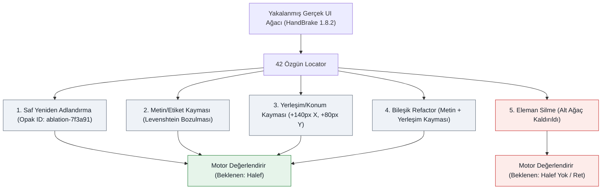

| Mutasyon Katmanı | Açıklama | Test Edilen Sinyal |
| :--- | :--- | :--- |
| **`RenamedAutomationId`** | AutomationId opak bir hash ile değiştirilir (`ablation-XXXXXXXX`). | Yapısal sinyaller aynı kalırken saf kimlik kurtarmayı ölçer. |
| **`NameDrift`** | AutomationId değiştirilir + `Name` bozulur (metin düzenleme/sonek). Yalnızca `Name` doluyken üretilir. | Metinsel etiket refactor'lerine toleransı ölçer (Levenshtein mesafesi). |
| **`PositionShift`** | AutomationId değiştirilir + `BoundingRectangle` kaydırılır ($+140\text{px}$ X, $+80\text{px}$ Y; $\sim 161\text{px}$ Öklid mesafesi). | UI yeniden biçimlendirme/boyutlandırma altında yerleşim duyarlılığını ölçer. |
| **`CompoundDrift`** | AutomationId değiştirilir + `Name` kayması ve konum kayması aynı anda uygulanır. | Birden fazla sinyalin birlikte bozulduğu bileşik refactor toleransını ölçer. |
| **`RemovedElement`** | Hedef kontrol ve tüm alt ağacı UI ağacından silinir. | Ret güvenliğini ölçer: motorun yakındaki komşuyu tahmin etmek yerine reddettiğini doğrular. |

> [!IMPORTANT]
> **Bilgi Sızıntısı Koruması:** Mutasyona uğramış kimlikler, tahmin edilebilir sonekler (`_ablated` gibi) yerine opak ve türetilemez sentetik ID'ler kullanır (`ablation-` + SHA-256 tohum hex'i). Bu, LLM kısa liste değerlendirmelerinin tamamen kör kalmasını ve senaryoların aday adlarına bakılarak çözülememesini sağlar.

---

### 3. Temel Bulgu: Skor Dağılımlarının Çakışması

Temel sezgisel motor (`SimilarityWeights.Default`, `MinimumConfidence = 0.50`) HandBrake 1.8.2 benchmark'ındaki 176 senaryonun tamamında koşturulduğunda mutasyon başına şu skor dağılımları gözlenir:

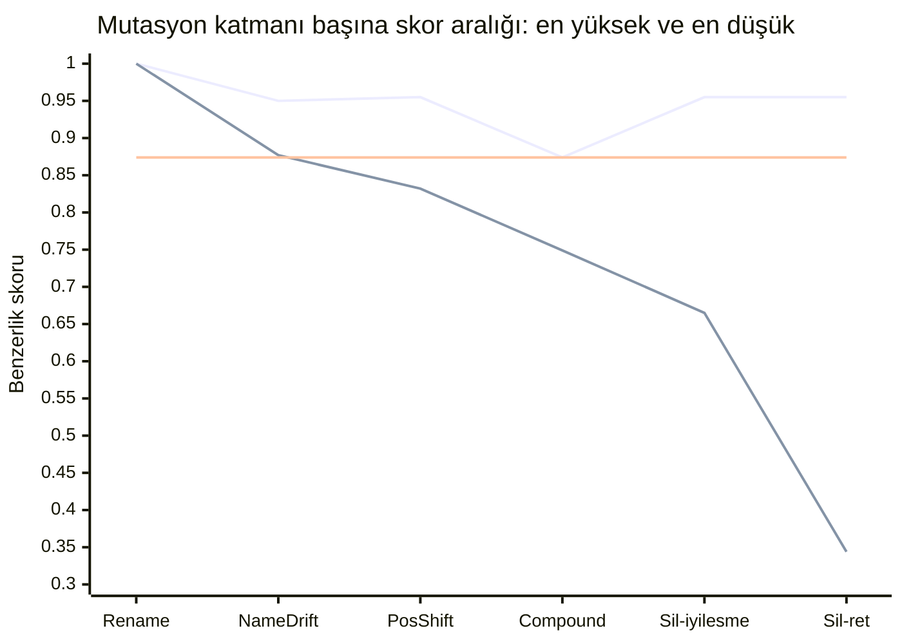

Üstteki çizgi her katmanın gözlenen **en yüksek**, alttaki **en düşük** skorudur; iki çizgi arasındaki boşluk o katmanın skorlarının gerçekte bulunduğu yerdir. Ortadaki yatay çizgi $0.874$'te durur — bu veri kümesinde gerçekten hayatta kalan bir elemanın ulaştığı en yüksek skor. `Sil-iyilesme` sütununda bu çizginin üzerinde kabul edilen her aday, en iyi gerçek halefi de dışarı atmadan hiçbir eşiğin eleyemeyeceği bir yanlış iyileştirmedir. `Sil-iyilesme` ve `Sil-ret` ikisi de `RemovedElement`'tir, motorun ne yaptığına göre ayrılmıştır — komşuyu kabul etti mi, yoksa doğru biçimde reddetti mi. `Rename` katmanında iki çizgi birleşir, çünkü o katmanın hiç yayılımı yoktur: 42 senaryonun tamamı tam olarak $1.000$ almıştır. Oradaki tek nokta bir çizim kusuru değil, ölçümün kendisidir.

**Grafiği dikey okuyun.** `Compound` katmanında bant $0.749-0.874$, `Sil-iyilesme` katmanında $0.665-0.955$ aralığında. Bu iki aralık aynı skorları kapsıyor; dolayısıyla bu grafiğin üzerine, gerçek halefler üstünde ve silinmiş elemanlar altında kalacak şekilde yatay bir eşik çizgisi çizilemez. Bu bölümün bulgusu tam olarak budur.

Hasarın nerede yoğunlaştığını sonuç dağılımı gösteriyor — yanlış iyileştirmeler yalnızca son iki katmanda görülüyor ve ağırlıklı olarak `RemovedElement`'te:

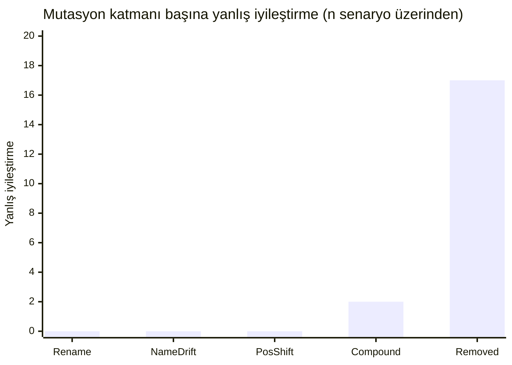

| Mutasyon Katmanı | Senaryo Sayısı ($n$) | Doğru İyileştirme / Ret | Yanlış İyileştirme | Kaçırılan (İnceleme) | Skor Aralığı | Ortalama Skor |
| :--- | :---: | :---: | :---: | :---: | :---: | :---: |
| **`RenamedAutomationId`** | 42 | 40 | 0 | 2 | $[1.000 - 1.000]$ | $1.000$ |
| **`NameDrift`** | 25 | 23 | 0 | 2 | $[0.877 - 0.950]$ | $0.901$ |
| **`PositionShift`** | 42 | 34 | 0 | 8 | $[0.832 - 0.955]$ | $0.867$ |
| **`CompoundDrift`** | 25 | 6 | 2 | 17 | $[0.749 - 0.874]$ | $0.790$ |
| **`RemovedElement`** | 42 | 25 | 17 | 0 | $[0.344 - 0.955]$ | $0.755$ |

#### Temel Çıkarım: Skorların Doğal Çakışması
- **Silinen elemanlardaki yanlış iyileştirmeler $0.665$ ile $0.955$ arasında skor alır**, çünkü yakındaki kardeş butonlar veya kapsayıcılar silinen elemanla aynı `ParentControlType`, kardeş yakınlığı ya da ekran koordinatlarını paylaşır.
- **Gerçekten bileşik kaymaya uğramış elemanlar $0.749$ ile $0.874$ arasında skor alır.**
- **Bu dağılımlar büyük ölçüde çakışır.** Dolayısıyla hiçbir statik matematiksel güven skoru, taşınmış/yeniden adlandırılmış bir kontrolü, komşusu yapısal olarak benzeyen silinmiş bir kontrolden tek başına ayırt edemez.

---

### 4. "Yanlış İyileştirme $\downarrow$ vs. Manuel İnceleme $\uparrow$" Dengesi

Skor dağılımları çakıştığı için, `MinimumConfidence` eşiğini değiştirmek otomatik iyileştirme kapsamı ile insan incelemesi yükü arasında ampirik bir denge üretir:

| `MinimumConfidence` | Kesinlik | Otomatik İyileştirme Kapsamı | Yanlış İyileştirme Oranı | Manuel İnceleme Oranı | Doğru İyileştirme | Yanlış İyileştirme (Halef) | Yanlış İyileştirme (Silinmiş) | Kaçırılan | Doğru Ret |
| :---: | :---: | :---: | :---: | :---: | :---: | :---: | :---: | :---: | :---: |
| **`0.50`** (Varsayılan) | $\%84.4$ | $\%76.9$ | $\%15.6$ | $\%30.7$ | 103 | 2 | 17 | 29 | 25 |
| **`0.60`** | $\%84.4$ | $\%76.9$ | $\%15.6$ | $\%30.7$ | 103 | 2 | 17 | 29 | 25 |
| **`0.70`** | $\%87.3$ | $\%76.9$ | $\%12.7$ | $\%33.0$ | 103 | 2 | 13 | 29 | 29 |
| **`0.75`** | $\%90.4$ | $\%76.9$ | $\%9.6$ | $\%35.2$ | 103 | 2 | 9 | 29 | 33 |
| **`0.80`** | $\%92.4$ | $\%72.4$ | $\%7.6$ | $\%40.3$ | 97 | 2 | 6 | 35 | 36 |
| **`0.85`** | $\%91.6$ | $\%64.9$ | $\%8.4$ | $\%46.0$ | 87 | 2 | 6 | 45 | 36 |
| **`0.90`** | $\%94.5$ | $\%38.8$ | $\%5.5$ | $\%68.8$ | 52 | 0 | 3 | 82 | 39 |
| **`0.95`** | $\%97.6$ | $\%30.6$ | $\%2.4$ | $\%76.1$ | 41 | 0 | 1 | 93 | 41 |

Aynı sweep eğriler halinde — kesinlik (üst çizgi), otomatik iyileştirme kapsamı (orta), yanlış iyileştirme oranı (alt). $0.90$'daki kapsam uçurumu ve bir türlü sıfırlanamayan yanlış iyileştirme tabanı, dengenin görünür hâlidir:

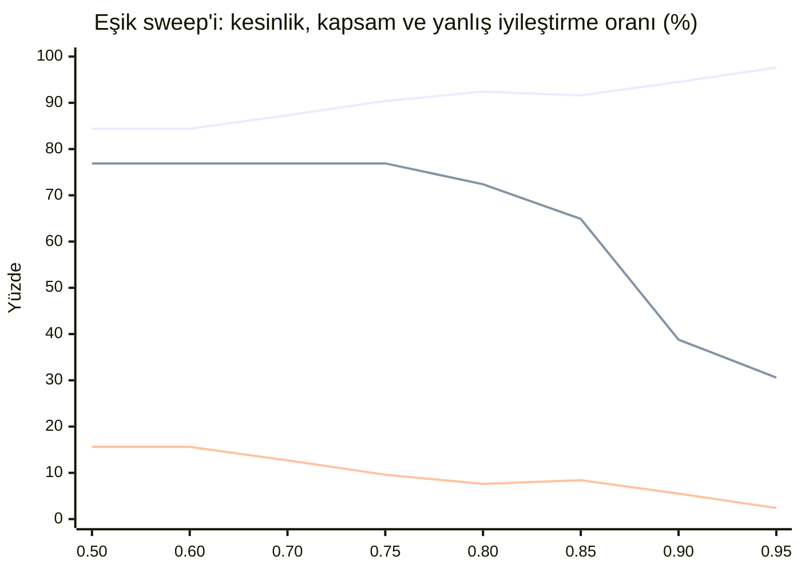

#### Denge Mekaniği:
1. **Agresif Otomatik İyileştirme (Eşik $= 0.50 - 0.70$):** Bileşik ve kaymış elemanları kabul ederek kapsamı en yükseğe çıkarır ($\%76.9$); bedeli silinmiş elemanlarda daha yüksek yanlış iyileştirme oranıdır ($\%12.7 - \%15.6$).
2. **Önerilen Çalışma Noktası, Garanti Değil (Eşik $= 0.75 - 0.80$):** HandBrake'te bu aralık yüksek kesinlik ($\%90.4 - \%92.4$) ve yüksek kapsam ($\%72.4 - \%76.9$) veriyor; silinmiş kontrollerdeki yanlış iyileştirmeleri yarıya indiriyor ($17 \rightarrow 6$). Bu **ürünün varsayılanı değildir** — `SimilarityWeights.MinimumConfidence` `0.50` olarak gelir. §8 ikinci bir uygulamayı (ShareX) aynı eşik aralığında ölçtü: yön tutuyor (eşiği yükseltmek her iki uygulamada da yanlış iyileştirmeyi azaltıyor) ama büyüklük taşınmıyor — aynı $0.75-0.80$ aralığı ShareX'te $\%20-\%23$ yanlış iyileştirme veriyor, HandBrake'in $\%7.6-\%9.6$'sına karşı. Bunu taşınabilir bir ayar değil, uygulama başına kalibre edilmesi gereken bir başlangıç noktası say.
3. **Katı Sıfır-Hata Politikası (Eşik $= 0.90 - 0.95$):** Yanlış iyileştirmeyi en aza indirir ($\%2.4 - \%5.5$) ve kesinliği en üste çıkarır ($\%97.6$), ancak ağır kaymış kontrolleri manuel incelemeye yönlendirir ($\%68.8 - \%76.1$).

> [!NOTE]
> **Neden Körlemesine 0.95 Seçilmemelidir:** Eşik $0.90$'dan $0.95$'e çıkarıldığında, son 2 yanlış iyileştirme elenir ($3 \rightarrow 1$), ancak bunun bedeli $11$ doğru iyileştirmenin feda edilmesidir ($52 \rightarrow 41$) ve geçerli locator'ların dörtte üçünden fazlası insan incelemesine yönlendirilir ($\%76.1$). Bu nedenle motor tek bir katı eşik dayatmaz; en uygun çalışma noktası ekibin yanlış pozitif toleransı ile manuel inceleme yükü arasındaki tercihe bağlıdır.

#### Hazır Eşik Profilleri ve Ağaç Kalibrasyonu

Bireysel ağırlıkları elle ayarlamak zorunda kalmadan çalışma noktası seçmeyi kolaylaştırmak için motor hazır **`ThresholdProfile`** preset'leri ve otomatik ağaç kalibratörü sunar:

| Profil | Hedef Kullanım Senaryosu | `MinimumConfidence` | `MinimumCandidateMargin` | `MinimumEvidenceWeight` | `MinimumNameScoreWhenNamed` |
| :--- | :--- | :---: | :---: | :---: | :---: |
| **`Balanced`** (Önerilen) | Yüksek otomatik iyileştirme kapsamı ($>\%75$) ile güçlü yanlış pozitif baskılamasını dengeleyen varsayılan üretim temeli. | `0.75` | `0.05` | `0.40` | `0.30` |
| **`Conservative`** | Yanlış yeşil (false-green) test çalıştırmalarının kesinlikle en aza indirilmesi gereken kritik veya regüle edilmiş test paketleri. | `0.90` | `0.08` | `0.50` | `0.30` |
| **`Aggressive`** | Otomatik kurtarmayı önceliklendiren hızlı keşif otomasyonu veya seyrek kardeş belirsizliği olan arayüzler. | `0.50` | `0.03` | `0.30` | `0.00` |

```csharp
// Hazır profilleri SelfHealingEngine ile kullanma
var engine = SelfHealingEngine.Create(ThresholdProfile.Balanced);

// Veya doğrudan SimilarityWeights üzerinden
var weights = SimilarityWeights.FromProfile(ThresholdProfile.Conservative);
```

`MinimumNameScoreWhenNamed` (#370), ağırlıklı toplamın geçersiz kılamadığı **bileşen bazlı bir kapı**dır: eski
locator'ın bir adı varsa, kazanan adayın `NameScore`'u bu değeri tek başına aşmalıdır. $0.20$ ağırlıklı isim
sinyali aksi halde ortalama içinde erir; bu yüzden silinen bir sekmenin komşusuna iyileşmesi (`Name` `Summary`
$\rightarrow$ `Dimensions`, `NameScore` $\approx 0.10$) yalnızca yapıyla `MinimumConfidence`'ı geçer.
`TreeCalibrator` ile HandBrake üzerinde ölçüldü: $0.30$ tabanı `Balanced` yanlış iyileştirme oranını
$\%9.3 \rightarrow \%7.6$ (precision $\%90.7 \rightarrow \%92.4$) taşır, **sıfır** otomatik iyileştirme kapsamı
maliyetiyle; ShareX aynı yönde hareket eder. Eski locator'ın adı yoksa veya adayın `NameScore`'u `null` ise (tek
tarafta eksik) uygulanmaz. `SimilarityWeights.Default` bunu kapalı ($0.0$) gönderir.

##### Uygulama Bazlı Kalibrasyon Komutu

Uygulamalar arasındaki UI yapıları farklılık gösterdiği için (örneğin yoğun tablo düzenleri vs seyrek formlar), yakalanan herhangi bir `UiElementInfo` ağacı üzerinde hiç kod yazmadan, komut satırından doğrudan sentetik kalibrasyon çalıştırabilirsiniz:

```bash
dotnet run --project samples/CalibrationCli -- <tree.json> --app MyApp
```

Bu komut `TreeCalibrator.Calibrate`'i ağaca karşı çalıştırır ve önce bu sayfayı okumaya gerek kalmadan doğrudan aksiyon alınabilecek bir markdown rapor basar (ve kaydeder): önerilen bir profil, gerekçesi ve `Aggressive`/`Balanced`/`Conservative` arasında bir precision/recall/false-heal karşılaştırması. Tüm seçenekler için [samples/CalibrationCli/README.md](../samples/CalibrationCli/README.md) dosyasına bakın. Kalibratörü kendi kodunuzdan çağırmak isterseniz:

```csharp
var report = TreeCalibrator.Calibrate(capturedTree, applicationName: "MyApp");
Console.WriteLine(report.ToMarkdownReport());
```

Kalibratör, UI ağacı üzerinde sentetik sapmaları (yeniden adlandırma, etiket kayması, konum kayması, silinme) değerlendirir ve en uygun profili öneren bir karar özeti üretir.

##### Sürekli CI Telemetrisi Takibi

Doğruluk ve recall regresyonlarının sürümler arasında fark edilmeden geçmesini önlemek için CI işlem hattı (`.github/workflows/ci.yml`), benchmark ablasyon araçlarını (`LocatorAblationTests` ve `ShareXAblationTests`) her commit'te otomatik olarak çalıştırır ve telemetri metriklerini (`ablation-metrics-*.json` ve özet tabloları) yayınlar. CI özeti şunları yüzeye çıkarır:
- Hayatta kalan ve silinen kontrollerde **Kesinlik** ve **Yanlış İyileştirme Oranı**
- **Otomatik İyileştirme Kapsamı** ve **Bileşik Kayma Kapsamı**
- **Manuel İnceleme Oranı**
- HandBrake ve ShareX benchmark paketlerindeki tam sonuç dağılımı.

---

### 5. Çevrimdışı Yokluk Sinyali Araştırması (#95)

Silinen elemanlar ($[0.665 - 0.955]$) ile bileşik mutasyona uğrayıp hayatta kalan elemanlar ($[0.749 - 0.874]$) arasındaki skor çakışmasını aşmak amacıyla, herhangi bir yapısal sinyalin **yokluk dedektörü (absence detector)** olarak çalışıp çalışamayacağı 176 senaryonun aday vektörleri üzerinde sistematik olarak incelenmiştir:

#### Hipotez 1: İkinci Aday Marjı (Runner-Up Margin)
*Hipotez:* Bir eleman silindiğinde birden fazla komşu benzer skorlar alır ve marj daralır; hayatta kalan gerçek eleman ise arka plan adaylarından belirgin şekilde ayrışır.

*Deneysel Bulgular:*

| Marj Eşiği (`MinimumCandidateMargin`) | Bileşik Başarı (Recall, $n=25$) | Silinende Yanlış İyileştirme ($n=42$) | Toplam Kesinlik | Otomatik İyileştirme |
| :---: | :---: | :---: | :---: | :---: |
| **`0.00`** | $11 / 25$ ($\%44.0$) | $39 / 42$ ($\%92.9$) | $\%68.2$ | $\%88.1$ |
| **`0.05`** (Varsayılan) | $6 / 25$ ($\%24.0$) | $17 / 42$ ($\%40.5$) | $\%84.4$ | $\%76.9$ |
| **`0.08`** | $2 / 25$ ($\%8.0$) | $11 / 42$ ($\%26.2$) | $\%87.3$ | $\%66.4$ |
| **`0.10`** | $2 / 25$ ($\%8.0$) | $7 / 42$ ($\%16.7$) | $\%89.5$ | $\%57.5$ |
| **`0.15`** | $2 / 25$ ($\%8.0$) | $4 / 42$ ($\%9.5$) | $\%92.9$ | $\%38.8$ |
| **`0.20`** | $0 / 25$ ($\%0.0$) | $2 / 42$ ($\%4.8$) | $\%94.6$ | $\%26.1$ |

İki eğri birlikte düşüyor — olumsuz sonucun görünür hâli (üst çizgi: silinen elemanlarda yanlış iyileştirme, alt çizgi: bileşik başarı). Marjı yükseltmek aralarındaki makası hiç açmıyor:

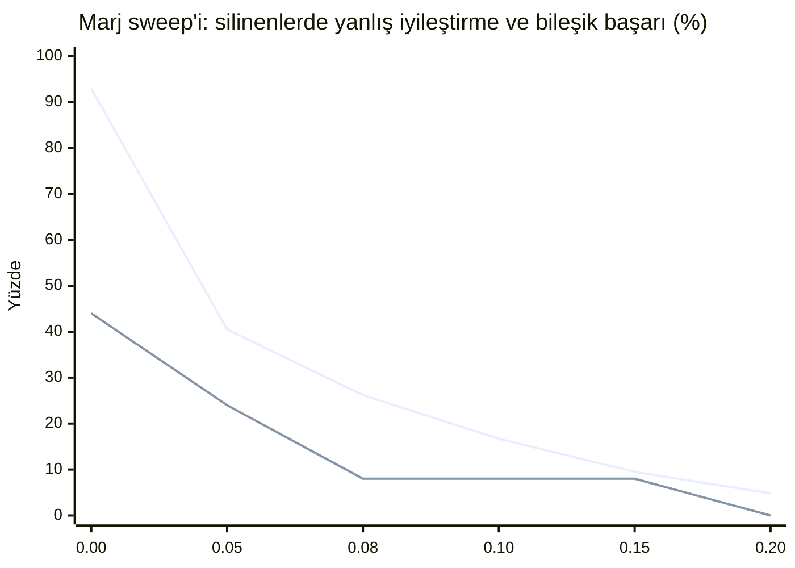

*Sonuç:* **Olumsuz.** Marj filtresi güven eşiği ile aynı denge eğrisini gösterir. Marj $0.05$'ten $0.10$'a çıkarıldığında silinen elemanlardaki hata $17$'den $7$'ye düşer, ancak bileşik mutasyondaki doğru iyileştirme $\%67$ oranında çöker ($6 \rightarrow 2$). Marj $0.20$ yapıldığında bileşik başarı sıfırlanır, ancak silinmiş 2 eleman komşuları izole olduğu için hala yanlış eşleşir.

#### Hipotez 2: Katı Kontrol Türü Filtresi (`ControlTypeScore == 1.0`)
*Hipotez:* Tam tür eşleşmesi zorunlu tutularak farklı türdeki hatalı eşleşmeler (Edit $\rightarrow$ StatusBar) engellenir.
*Deneysel Bulgular:* Farklı türdeki 6 hatalı eşleşme elenir ($17 \rightarrow 11$), ancak aynı türdeki 11 yanlış eşleşme (ComboBox $\rightarrow$ ComboBox, Button $\rightarrow$ Button) $0.955$'e varan skorlarla hayatta kalır.

#### Hipotez 3: Aday Küme Yoğunluğu (Cluster Density)
*Hipotez:* Silinen elemanlar çok sayıda birbirine yakın skorlu aday kümesi üretir, gerçek elemanlarda ise küme seyrektir.
*Deneysel Bulgular:* En iyi adayın $0.10$ puan yakınındaki ortalama aday sayısı:
- **Silinen Elemanlar (Yanlış İyileştirmeler):** $1.71$ (aralık $1 - 3$)
- **Bileşik Mutasyon (Gerçek Elemanlar):** $3.08$ (aralık $1 - 5$)
*Sonuç:* **Olumsuz (Ters yönde).** Gerçek eleman taşındığında yeni konumundaki komşularla da yarışır, bu nedenle küme yoğunluğu silinen elemanlardan daha yüksektir.

#### Hipotez 4: Birleşik Filtre (Katı ControlType + Marj $\ge 0.08$)

Sinyaller tek tek başarısız olduğu için akla gelen ilk soru bunların birleşip birleşmediğidir: kazanan adayın hem beklenen `ControlType` ile birebir eşleşmesi **hem de** ikinci adayı belirgin bir marjla geçmesi şartı.

*Sonuç:* **Olumsuz.** İki filtre büyük ölçüde aynı vakaları eliyor. Silinen kontrollerdeki aynı tipten yanlış eşleşmeler `ControlType` kapısını tanımı gereği geçiyor; bunların marj kapısını da geçenleri ise tam olarak birleşimin yakalaması beklenen "kendinden emin görünen sahte adaylar" oluyor. Bu sırada bileşik mutasyon geri çağırımı daha da düşüyor, çünkü gerçekten taşınmış bir eleman indiği yerdeki komşularıyla yarışır ve onları nadiren geniş bir marjla geçer.

#### Resmi Çıkarım
> [!IMPORTANT]
> **Tekil hedef odaklı hiçbir sezgisel sinyal bir yokluk dedektörü oluşturamaz.** Silinen bir kontrolün kapsayıcısındaki komşu eleman, yapısal olarak yeni bir konuma taşınmış gerçek bir kontrolden farksız görünür. Bu bulgunun **söylemediği** şey ise çözümün ne olduğudur. Tüm ağacın birlikte çözülmesi — locator'ları tek tek değil, elemanların birbiriyle yarıştığı ortak bir atamayla eşleştirmek — akla gelen bir sonraki hipotezdir ve henüz sınanmamıştır. #98 altında izlenmektedir; herhangi bir uygulama önerilmeden önce bu veri seti üzerinde ön testten geçirilecektir.

---

### 6. Çoklu LLM Konsensüsü ile Yokluk Tespiti (#97)

> [!IMPORTANT]
> **2026-08-16 tarihinde ölçüldü**, [31959334927](https://github.com/mustafasercansak/automation-sandbox/actions/runs/31959334927) numaralı koşuda. Sonuç §4'te. Konsensüs, bu projede bantları ayırabilen **ilk** sinyaldir — ve buna rağmen kabul kapısı olarak güvenli değildir; üstelik sebebi hipotezin öngördüğü şey değildir.


Sezgisel sinyaller geometri ve hiyerarşi benzerliğiyle sınırlıyken, çoklu sağlayıcı konsensüsü ($\ge 2$ bağımsız model oyu) temelde farklı bir soru sorar: *bağımsız akıl yürütücüler aynı hedefte uzlaşıyor mu yoksa dağılıyor mu?*

#### 1. Temel Hipotez
- **Bileşik Mutasyonda (`CompoundDrift` - Yaşayan Eleman):** Kontrol rolleri ve kullanım bağlamı üzerine anlamsal akıl yürütme, modellerin gerçek ardıl üzerinde uzlaşmasını sağlayarak heuristik eşiklerin kaçırdığı durumları kurtarabilir.
- **Silinen Elemanda (`RemovedElement` - Silinme):** Ağaçta gerçek bir ardıl bulunmadığı için bağımsız modellerin odaklanacağı bir zemin yoktur. Modellerin ya `null` dönmesi (reddetme) ya da farklı komşulara dağılması (`NoConsensus` $\rightarrow$ güvenli ret) beklenir.
- **Kritik Hata Sınırı:** Eğer bağımsız iki model aynı belirgin yanlış komşu (ör. araç çubuğundaki yan buton) üzerinde uzlaşırsa, konsensüs silinen bir elemanda yanlış iyileştirmeyi kabul eder.

#### 2. Sızıntı Önleme: Tekdüze Opak AutomationId Dönüşümü
#94'te bayat `expected.AutomationId` gizlenerek sızıntı engellenmişti. #97'de ise ters yönde bir sızıntı giderildi: ablasyon senaryolarında yalnızca hedef elemanın ID'si opak bir hash'e (`ablation-XXXXXXXX`) dönüştürülüp diğer adaylar doğal isimlerini korursa, modeller yapısal muhakeme yapmadan sırf "diğerlerinden farklı görünen tek ID" olduğu için doğru cevabı seçebilir.

Ürün kodunun prompt davranışına dokunmadan bu sızıntıyı kapatmak amacıyla, `LocatorAblationGenerator.ApplyMutation` mutasyonlu ağaçtaki *tüm* aday `AutomationId` değerlerini aynı `ablation-XXXXXXXX` biçiminde tekdüze şekilde anonimleştirir. Böylece her aday aynı önek, uzunluk ve karakter kümesine sahip olur.

> [!NOTE]
> **Üretim Sadakati ve Alt Sınır:** Bu ablasyon veri setinde hiçbir `AutomationId` anlamsal olarak bilgilendirici değildir (tüm aday tanımlayıcılar tekdüze sentetik hash'lerdir), oysa üretim ortamında `btnSaveDocument` gibi açıklayıcı adlar modele güçlü ipuçları sunar; dolayısıyla LLM kolunun buradaki ölçüm skoru, üretimdeki gerçek performansının bir **alt sınırı (lower bound)** sayılmalıdır.

#### 3. Ampirik Metodoloji ve Belirsizlik Notları
- **Tek Örnek (Single-Sample) Belirsizliği:** Deterministik heuristik testlerin aksine, LLM ölçümleri stokastik ampirik örneklerdir. 42 silinme senaryosundaki tek bir koşu yaklaşık $\pm \%14$ istatistiksel belirsizlik taşır.
- **Denetlenebilirlik:** Sıcaklık $0$ olarak sabitlenmeli, sağlayıcı bazlı ham oylar ve uzlaşma telemetrisi (`AgreedProviders`, `ProviderAttempts`, `ProviderErrors`) eksiksiz kaydedilmelidir.
- **Maliyet Kontrolü:** Token maliyetini sınırlamak için ölçüm 25 `CompoundDrift` ve 42 `RemovedElement` ($n=67$) senaryosu üzerinde hedeflenir.

#### 4. Ampirik Sonuç

2026-08-16 ile 2026-08-18 arasında dört bağımsız koşu; sağlayıcı havuzu 3 yapılandırılmış sağlayıcıdan 7'ye genişletildi ve Groq'un modeli iki kez değiştirildi (kaldırılmış bir model, sonra güvenilmez bir model, sonra çalışan bir model — #126). Her koşu aynı 25 `CompoundDrift` + 42 `RemovedElement` senaryosunu hedefliyor; bir senaryo yalnızca en az iki sağlayıcı cevap verdiğinde **kullanılabilir** sayılıyor (#109), çünkü tek görüş ne uzlaşabilir ne de çelişebilir.

| Koşu | Tarih | Kullanılabilir ($n$) | `CompoundDrift` oybirliği | `RemovedElement` oybirliği |
| :--- | :--- | ---: | :--- | :--- |
| [31959334927](https://github.com/mustafasercansak/automation-sandbox/actions/runs/31959334927) | 08-16 | 19 | 6 / 7 | 3 / 12 |
| [31961463762](https://github.com/mustafasercansak/automation-sandbox/actions/runs/31961463762) | 08-16 | 39 | 16 / 17 | 10 / 22 |
| [31963741937](https://github.com/mustafasercansak/automation-sandbox/actions/runs/31963741937) | 08-16 | 33 | 14 / 14 | 11 / 19 |
| [32163961433](https://github.com/mustafasercansak/automation-sandbox/actions/runs/32163961433) | 08-18 | 42 | 16 / 17 | 10 / 25 |
| **Toplam** | | **133** | **52 / 55** | **34 / 78** |

Her koşunun kendi hataları kendi iş akışı kaydında duruyor: ücretsiz katman günlük kota tükenmesi (Gemini, Groq), ücretli plan gerektiren bir model (Ollama Cloud, havuzdan düşürüldü — #119), ve en son koşuda üç sağlayıcıda 15 saniyelik tek-deneme tavanını aşan istekler (#129, `4393caf` commit'inde tek-deneme timeout override'ıyla düzeltildi — bu dört koşu ondan önce). Bu gürültünün hiçbiri aşağıdaki ölçümü etkilemiyor — yalnızca $n$'i küçültüyor.

**Toplu ölçüm.** Uzlaşma, elemanın hayatta kalmasıyla birlikte hareket ediyor: gerçek bir halefin bulunduğu senaryoların **%94.5**'inde ($52/55$), elemanın silindiği senaryoların ise **%43.6**'sında ($34/78$) sağlayıcılar oybirliğine ulaştı. §5'teki dört sezgisel hipotezin hiçbiri bantları ayıramamıştı; dolayısıyla bu, projede herhangi bir ayrışma üreten tek mekanizma olmaya devam ediyor.

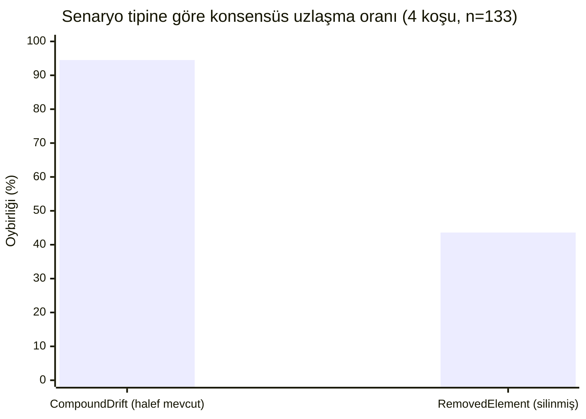

> [!WARNING]
> **Oybirliği güvenli bir kapı değildir, ve tek koşunun gösterdiğinden daha kötüdür.** Hayatta kalan bir eleman üzerindeki 52 oybirliği kararının 52'si de doğruydu. Silinmiş bir eleman üzerindeki 34 oybirliği kararının 34'ü de yanlış iyileştirmeydi — **dört farklı sağlayıcı kümesiyle yapılan dört koşuda, iki yönde de sıfır istisna.** Bu bölümün önceki bir sürümü tek başına 31959334927 koşusundan "%33" bildirmişti; o sayı iki mutasyon tipini tek paydada topluyordu ($9$ toplam oybirliği kararının $3$'ü yanlış), ve bu, silinmiş-eleman oranını ilgisiz ve güvenilir biçimde doğru olan bileşik-kayma popülasyonuyla karıştırarak düşük gösteriyordu. Tipe göre okununca silinmiş-eleman oranı $\%100$'dür: uzlaşma, bir yokluk konusunda bir kez bile tesadüfen doğru çıkmadı.

#### 5. Mekanizma Yokluğu Tanımak Değil, Anlaşmazlıktır

Hipotez, silinmiş bir elemanda iki güvenli sonuç öngörüyordu: sağlayıcılar ya "yok" der ya da dağılır. **"Yok" deme neredeyse hiç gerçekleşmiyor.** Dört koşudaki 78 kullanılabilir `RemovedElement` senaryosunun tamamında `AllDeclined` yalnızca **bir** kez oluştu. Cevap veren her diğer sağlayıcı belirli — ve yanlış — bir adayı işaret etti.

Dört koşu boyunca her doğru red, sağlayıcıların *birbiriyle anlaşamamasından* doğdu; herhangi bir sağlayıcının elemanın gittiğini fark etmesinden değil. Modeller kontrolün silindiğini bilmiyor; her biri güvenle farklı bir komşuyu işaret ediyor, motor da oylar tutmadığı için iyileştirmeyi yalnızca bu yüzden reddediyor.

**Sağlayıcı havuzunu genişletmek bu mekanizmayı kurtarmadı — sınırını daha net gösterdi.** 31961463762 koşusu 10 yanlış oybirliği kararı kaydetti; bunların 7'sinde **üç** bağımsız kaynaklı model ailesi aynı anda var olmayan aynı elemanda buluştu — Cloudflare (Qwen), Mistral ve OpenRouter (gpt-oss). Üç ayrı satıcı, üç ayrı mimari, tek yanlış cevap, oybirliğiyle. Bu dört koşu boyunca 3 yapılandırılmış sağlayıcıdan 7'ye çıkmak, silinmiş-eleman oybirliği oranını (%25 → %45 → %58 → %40, düşen bir eğilim yok) ya da doğruluğunu (baştan sona %100 yanlış) düşürmedi.

Bu, sonucun ne kadar genellenebileceğini belirliyor:

- Koruma **bağımsızlığın yan ürünüdür**, ama dört koşunun toplamı bağımsızlığın tek başına §5'in ilk öngördüğü şekilde hata oranını sınırlamadığını gösteriyor — gerçekten bağımsız, yetkin bir akıl yürütücü, silinmiş bir kontrolün hayatta kalan komşusunu yeterince sık ikna edici buluyor; daha fazla bağımsız akıl yürütücü eklemek berabere durumu bozacağının garantisi değil.
- Daha yüksek güven eşiği istemekle güçlendirilemez, çünkü hata veren vakalar zaten güvenlidir. Bu veride sağlayıcı eklemenin de güçlendirdiğine dair bir kanıt yok.
- Neredeyse hiç "yok" demeyen bir sağlayıcı tek başına yokluk tespitine katkı sunmaz. Oyu, ancak başka bir sağlayıcının çelişebileceği bir şey olarak değerlidir — ve yukarıdaki paragrafa göre o çelişkiye de güvenilemez.

> [!IMPORTANT]
> **Resmi çıkarım, dört koşu üzerinden gözden geçirildi ($n=133$, 2026-08-16 – 2026-08-18).** Çoklu sağlayıcı konsensüsü, §5'teki her sezgisel sinyalin başarısız olduğu yerde hayatta kalan elemanları silinmiş olanlardan ayırır (%94.5'e karşı %43.6 oybirliği uzlaşması). Kabul kapısı olarak yeterli değildir: dört koşunun tamamında silinmiş bir eleman üzerindeki **her** oybirliği kararı (34'te 34) yanlış iyileştirmeydi, üç bağımsız kaynaklı model ailesinin anlaştığı vakalar dahil. Ayrışma, herhangi bir modelin yokluğu tespit etmesinden değil sağlayıcılar arasındaki anlaşmazlıktan doğuyor — ve sağlayıcı havuzunu 3 yapılandırılmış sağlayıcıdan 7'ye genişletmek bu hata oranını düşürmedi. Daha fazla sağlayıcı eklemenin bunu düzelteceği varsayılmamalı; bu veri o varsayımın aleyhinedir.

---

### 7. Bütün Ağaç Uzlaştırması: Çevrimdışı Prob (#98)

§5'in ve §6'nın bulgusu aynı yapısal boşluğu işaret ediyor: şimdiye kadar ölçülen her mekanizma lokatörleri tek tek, birbirinden habersiz çözüyor. #98, bunu düzeltmeyi önermeden önce daha dar bir soru sordu: heuristik silinmiş bir elemanı yanlışlıkla bir komşuya iyileştirdiğinde, o komşu genellikle *başka bir lokatörün gerçek kimliği* mi — sayfadaki tüm lokatörleri aynı anda çözen ortak bir çözücünün "zaten talep edildi" diye tanıyıp silinen elemana da vermeyi reddedebileceği bir şey mi?

**Prob, mevcut 42 `RemovedElement` senaryosuna karşı varsayılan ağırlıklarla koşturuldu (bu adım için yeni bir mutasyon türü gerekmedi).** 17 yanlış iyileştirmenin **10'u (%59), ağacın diğer 41 özgün locator'ından birinin gerçek kimliği olan bir komşuyu işaret etti** — bu, yapısal parmak iziyle geri kazanıldı, çünkü `RemovedElement`'in AutomationId'yi opaklaştıran mutasyonu, adayların normalde eşleştiği kimliği yok ediyor.

| Silinen locator | Yanlışlıkla eşleştiği | Karşılıklı mı? |
| :--- | :--- | :---: |
| `Minimize-Restore` | `Maximize-Restore` | ✓ |
| `Maximize-Restore` | `Minimize-Restore` | ✓ |
| `Close` | `Maximize-Restore` | |
| `ShowQueue` | `Preview` | |
| `tabControl` | `sourceSelection` | ✓ |
| `sourceSelection` | `tabControl` | ✓ |
| `summaryTab` | `pictureTab` | |
| `chaptersTab` | `subtitlesTab` | |
| `Destination` | `statusBar` | ✓ |
| `statusBar` | `Destination` | ✓ |

Bunların üçü **karşılıklı çift**: iki elemandan hangisi silinirse silinsin, heuristik onu diğerine iyileştiriyor, iki yönde de. `Minimize-Restore` ile `Maximize-Restore` birbirinin en yüksek skorlu yem adayı; `Destination`/`statusBar` ve `tabControl`/`sourceSelection` de öyle. Bu, tam olarak ikili eşleştirmenin (bipartite assignment) çözmek için tasarlandığı şekil — iki locator da aynı ortak çözüme dahil edilirse, paylaşılan slotu en fazla biri talep edebilir, ve kaybeden için eşleşecek başka bir şey kalmaz — bu da mevcut tek-locator skorlayıcısının üretemediği "gitti" sinyalinin ta kendisi.

Kalan 17'de 7'si, başka hiçbir locator'ın da istemediği izlenmeyen ya da tesadüfi elemanları işaret etti (adsız bir kapsayıcı, hiçbir testin dayanmadığı bir araç çubuğu elemanı gibi). Ortak bir çözücünün orada kullanabileceği bir şey yok — bu veri kümesindeki tavanı %59 ile sınırlı, 17'nin tamamıyla değil.

> [!NOTE]
> **Bu sayıyı dürüstçe okumak.** %59, orijinal issue'nun adlandırdığı sonraki adımı — birden fazla locator'ın birlikte kırıldığı senaryolar kurmayı, ki bu aynı zamanda daha gerçekçi bozulma biçimi — haklı çıkaracak kadar olumluydu, fakat mekanizmanın çalıştığına dair kanıt değildi. İlk tek-mutasyonlu veri kümesi ortak atamayı doğrudan test edemiyordu: senaryo başına yalnızca bir locator kırıldığından çözücünün kullanabileceği gerçek bir çakışma yoktu. §9 bu multi-locator baseline'ını sağlıyor, §10 ise bilinçli olarak dar tutulan top-claim atama deneyini ona karşı değerlendiriyor.

---

### 8. İkinci Bir Uygulama: ShareX v21.0.0 (#99, #134)

§3–§7'deki her sayı tek bir WPF ağacından geliyor. #99 bunu bir yayınlama ön koşulu olarak adlandırmıştı: tek bir uygulama, "heuristik böyle davranıyor" ile "HandBrake'in kendine özgü yapısı böyle davranıyor"u birbirinden ayıramaz. Bu bölüm aynı işlem hattını — aynı jeneratör, aynı harness, aynı varsayılan ağırlıklar — gerçek bir WinForms uygulamasına, ShareX v21.0.0'a karşı koşturuyor; [survey koşusu 32280934910](https://github.com/mustafasercansak/automation-sandbox/actions/runs/32280934910) ile yakalandı. 29 özgün locator, 131 senaryo.

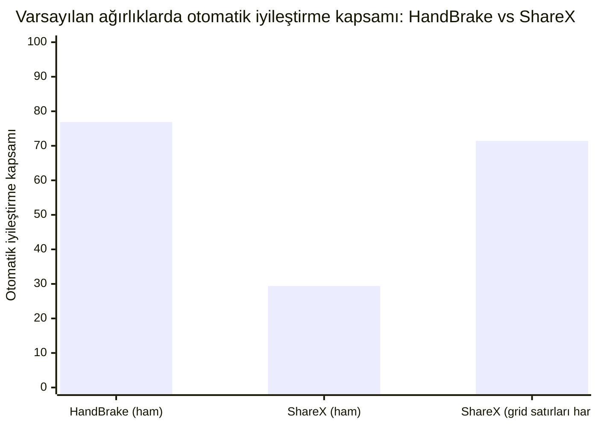

**Ham sayı endişe verici görünüyor, ve kısmen bir yapı yapaylığı.** Varsayılan ağırlıklarda ShareX'in otomatik iyileştirme kapsamı %29.4, HandBrake'in %76.9'una karşı — büyük bir fark. ShareX'in 29 özgün locator'ının 15'i (%52) bir Kısayol Tuşları (Hotkeys) ayar ızgarasının `DataItem` satırları (`Hotkey Row 1`, `Description Row 2`, ...). HandBrake'in fixture'ında bu türden hiçbir eleman yok. Bu satırların her biri kardeşlerine yapısal olarak neredeyse özdeş — aynı `ControlType`, aynı eksik `ClassName`, konum yalnızca satır numarasıyla farklılaşıyor — bu yüzden motor, en iyi aday tam `1.000` skor alsa bile bunları `Ambiguous` diye reddediyor. Bu bir kusur değil, doğru davranış: #78 zaten `DataGrid`/`DataItem`'ı doğası gereği oynak bir locator sınıfı olarak adlandırmıştı. İçeride bırakılırsa, bunlar heuristik'in genel kalitesini değil, tek bir ızgaranın yoğunluğunu ölçer.

**Adil karşılaştırma bunları hariç tutar.** Izgara satırları çıkarılınca (14 özgün locator, 56 senaryo), kapsam HandBrake'e yakınsıyor: %71.4'e karşı %76.9. Ama bu benchmark'ın var olma sebebi olan sayı yakınsamıyor:

| Uygulama | Silinen elemanlarda yanlış iyileştirme oranı | $n$ |
| :--- | ---: | ---: |
| HandBrake | %40.5 | 17/42 |
| ShareX (grid satırları hariç) | **%57.1** | 8/14 |

İkinci gerçek bir uygulama, yanlış iyileştirme sorununu HandBrake'e özgü bir tuhaflık gibi göstermiyor. Daha kötü gösteriyor.

| Metrik (varsayılan ağırlıklar, grid satırları hariç) | HandBrake | ShareX |
| :--- | ---: | ---: |
| Kesinlik | %84.4 | %73.2 |
| Otomatik iyileştirme kapsamı | %76.9 | %71.4 |
| Yanlış iyileştirme oranı | %15.6 | %26.8 |
| Manuel inceleme oranı | %30.7 | %26.8 |

> [!IMPORTANT]
> **Resmi çıkarım.** İkinci bir uygulama, bu projenin çözmeye çalıştığı sorunun şeklini değiştirmiyor, ve onu iyileştirmiyor. Karıştırıcı bir UI örüntüsü (ilk uygulamada bulunmayan, yoğun yapısal olarak özdeş grid satırları) kontrol altına alındığında kapsam kabaca karşılaştırılabilir hale geliyor. Kesinlik ve yanlış iyileştirme oranının ikisi de ShareX'te belirgin şekilde daha kötü. Ne HandBrake'in sayıları ne de ShareX'inki bu motorun "gerçek" doğruluğu olarak okunmamalı — bunlar bir aralığı sınırlayan iki veri noktası, ve aralık geniş: gönderilen varsayılanda, herhangi bir LLM konsensüsü uygulanmadan önce, silinmiş elemanlarda %40.5–%57.1 yanlış iyileştirme. Doğrulama testleri: \`ShareXAblationTests\` (\`ShareXFixture_DefaultWeights_MatchesTheCommittedBaseline\`, \`ShareXFixture_MostMissedPerfectScoreRenames_AreDataGridRows\`, \`ShareXFixture_ExcludingDataGridRows_FalseHealOnRemovedRateIsWorseThanHandBrakes\`).

---

### 9. Multi-Locator Baseline: Gerçek Çakışma Var (#132)

v2 ablasyon veri kümesi artık tek bir ortak ağaç üzerinde iki veya daha fazla locator mutasyonunu, her locator için ayrı mutasyon tarifi ve ground truth ile tanımlayabiliyor. `RunMultiLocatorBaseline` ortak mutasyonu bir kez uyguluyor, ardından mevcut tek-locator heuristiğini her beklenen locator için bağımsız çalıştırıyor. Ortak eşleştirme uygulamıyor ve `SelfHealingResolver`'ı değiştirmiyor; ilerideki herhangi bir batch tasarımının iyileştirmesi gereken baseline budur.

Gönderilen varsayılan ağırlıklarla yedi HandBrake senaryosu ölçüldü:

- Altı iki-locator senaryosu §7'deki üç karşılıklı çiftin iki yönünü de kapsıyor. Her birinde bir locator siliniyor, karşılığı yeniden adlandırılıyor; böylece kayıtlı iki locator da gerçekten kırılırken karşı locator'ın yapısal kimliği hayatta kalıyor.
- Bir dört-locator senaryosu yeniden adlandırma, isim kayması, konum kayması ve silmeyi karıştırıyor; veri kümesinin yalnızca özel hazırlanmış yeniden-adlandırma/silme çiftlerine bağlı olmadığını gösteriyor.
- Sonuç, 7 ortak ağaç üzerinde 16 locator çözümü.

| Baseline gözlemi | Sonuç |
| :--- | ---: |
| Ortak-ağaç senaryosu | 7 |
| Locator çözümü | 16 |
| İki locator'ın aynı adayı talep ettiği senaryo | **6 / 7** |
| Hayatta kalan locator'ın doğru halefini talep eden silinmiş-locator yanlış iyileştirmesi | **6 / 6 karşılıklı yön** |

Hedeflenen altı vaka eksiksiz tekrarlandı. Örneğin `Minimize-Restore` silinip `Maximize-Restore` yeniden adlandırıldığında mevcut çözücü, kayıtlı iki locator'a da yeniden adlandırılmış `Maximize-Restore` elemanını veriyor: hayatta kalan locator $1.000$, silinen locator ise aynı elemanı $0.874$ ile kabul ediyor. Aynı çakışma ters yönde ve `Destination`/`statusBar` (silinen locator için $0.690$) ile `tabControl`/`sourceSelection` ($0.665$) çiftlerinde de oluşuyor.

> [!IMPORTANT]
> **Resmi çıkarım.** Olumlu %59 çevrimdışı probu, yalıtılmış mutasyonlara geriye dönük bakmanın bir yapaylığı değildi: altı karşılıklı yönün tamamı, iki locator aynı ağaçta kırıldığında gerçek aday çakışması üretiyor. Bu, ortak atama algoritmasını ayrı bir işte değerlendirmek için kanıt ön koşulunu karşılıyor. Böyle bir algoritmanın kaybeden locator'ı güvenle reddedeceğini **göstermiyor**; bu değişiklikte ortak çözücü yok ve yedinci karışık senaryoda silinen `Close` hâlâ kimsenin talep etmediği tesadüfi bir elemana yanlış iyileştiriliyor. Regresyon koruması: `LocatorAblationTests.HandBrakeFixture_MultiLocatorBaseline_ReproducesReciprocalPairContention`.

---

### 10. Ortak Top-Claim Atama Deneyi (#141)

Deney yalnızca mevcut çözücünün güven, kanıt ve aday-marjı kapılarından sonra zaten kabul ettiği talepleri uzlaştırıyor. Locator $i$ ve kabul edilmiş en iyi adayı $c$ için atama faydası $score(i,c)-MinimumConfidence$; locator'ı eşleşmemiş bırakmanın faydası $0$. Her locator ve aday en fazla bir atamada yer alabilir. Tek başına kalan talep korunur. Bir adayı birden fazla locator talep ettiğinde, en yüksek faydalı talep yalnızca farkı en az `MinimumCandidateMargin` ise kazanır; aksi halde tüm talep sahipleri eşleşmemiş bırakılır. İkinci aday terfi ettirilmez; dolayısıyla deney üretim çözücüsünün zaten kabul etmediği yeni bir eşleşme oluşturamaz.

Bu, çevrimdışı bir `ScenarioRunner` değerlendiricisidir; üretim çözücüsü değildir. `SelfHealingResolver` API'sini veya healing-report şemasını değiştirmez.

| 16 locator çözümünün tamamındaki metrik | Bağımsız baseline | Ortak top-claim ataması |
| :--- | ---: | ---: |
| Hayatta kalan locator doğru iyileştirmesi | **9 / 9** | **9 / 9** |
| Silinen locator doğru reddi | 0 / 7 | **6 / 7 (%85.7)** |
| Silinen locator yanlış iyileştirmesi | 7 / 7 | **1 / 7** |
| Kabul edilen eşleşmelerde kesinlik | %56.3 | **%90.0** |
| Manuel inceleme oranı | %0.0 | %37.5 |
| Paylaşılan-aday çakışması | 6 | **0** |

Altı karşılıklı yönün tamamı aynı sonucu verdi: hayatta kalan locator'ın $1.000$ talebi kazanırken silinen locator'ın daha zayıf talebi reddedildi.

| Silinen locator | Hayatta kalan locator | Silinen talebin skoru | Sonuç |
| :--- | :--- | ---: | :--- |
| `Minimize-Restore` | `Maximize-Restore` | 0.874 | Reddedildi; hayatta kalan korundu |
| `Maximize-Restore` | `Minimize-Restore` | 0.874 | Reddedildi; hayatta kalan korundu |
| `Destination` | `statusBar` | 0.690 | Reddedildi; hayatta kalan korundu |
| `statusBar` | `Destination` | 0.690 | Reddedildi; hayatta kalan korundu |
| `tabControl` | `sourceSelection` | 0.665 | Reddedildi; hayatta kalan korundu |
| `sourceSelection` | `tabControl` | 0.665 | Reddedildi; hayatta kalan korundu |

Karışık dört-locator senaryosu sınırı görünür kılıyor: yeniden adlandırılan `ShowQueue`, isim kayması yaşayan `Preview` ve konumu değişen `Destination` doğru kalırken, silinen `Close` hâlâ kimsenin talep etmediği tesadüfi bir elemana yanlış iyileştiriliyor. Bire-bir sahiplik yalnızca başka bir locator adaya itiraz ettiğinde yokluk sinyali sağlıyor.

> [!IMPORTANT]
> **Resmi çıkarım.** Bu hedefli HandBrake baseline'ında ortak top-claim sahipliği, çakışmadan doğan 6 yanlış iyileştirmenin tamamını 9 hayatta-kalan locator iyileştirmesinden hiçbirini kaybetmeden doğru redde çeviriyor; fakat itiraz edilmeyen 1 yanlış iyileştirmeyi değiştirmiyor ve manuel incelemeyi %0.0'dan %37.5'e çıkarıyor. Bu sonuç ortak uzlaştırmayı umut verici, hedefli bir koruma olarak destekliyor; genel bir silinmiş-eleman çözümü veya üretime hazır tasarım olarak değil: örneklem tek uygulamadan ve bilinçli olarak kurulmuş karşılıklı çiftlerden oluşuyor. Regresyon korumaları: `LocatorAblationTests.JointAssignment_DeclinesEveryClaimant_WhenOwnershipMarginIsAmbiguous` ve `LocatorAblationTests.HandBrakeFixture_JointAssignment_ResolvesReciprocalContentionButNotIncidentalFalseHeal`.

---

### 11. Uygulamalar Arası Genelleme (#143)

Senaryo protokolü veri kümesi veya sonuçlar oluşmadan önce yayımlandı. Her bozulmamış ağaçtan benzersiz, `DataItem` olmayan authored yaprakların tamamını seçiyor, `AutomationId` ile ordinal sıralıyor ve yaprak başına bir döngüsel üç-locator senaryosu kuruyor: locator $i$ siliniyor, $i+1$ yeniden adlandırılıyor ve $i+2$ konum kaymasına uğruyor. Yalnızca yaprakların kullanılması, bir elemanın silinmesinin başka üyenin ground truth'unu yok etmesini engelliyor. Kural hiçbir skor, aday kimliği, çakışma veya sonuç kullanmıyor. Commit edilen uygun-ID listeleri ve scenario-ID özetleri 36 HandBrake ve 9 ShareX senaryosunu sabitliyor: 45 ortak ağaç ve 135 locator çözümü.

Gönderilen varsayılan ağırlıklar ve §10'daki değiştirilmemiş değerlendirici şu sonucu üretti:

| Uygulama | Hayatta kalan doğru (baseline → ortak) | Silinen doğru red | Silinen yanlış iyileştirme | Manuel inceleme | Girdi → çözümsüz çakışma |
| :--- | ---: | ---: | ---: | ---: | ---: |
| HandBrake (36 senaryo) | 63 → **63** | 22 → **23** | 14 → **13** | %28.7 → %29.6 | 1 → **0** |
| ShareX (9 senaryo) | 16 → **16** | 4 → **7** | 5 → **2** | %22.2 → %33.3 | 3 → **0** |
| **Toplam (45 senaryo)** | 79 → **79** | 26 → **30** | 19 → **15** | %27.4 → %30.4 | 4 → **0** |

İtiraz edilen dört silinmiş-locator yanlış iyileştirmesinin tamamı doğru redde dönüştü; 79 doğru hayatta-kalan iyileştirmesinin hiçbiri gerilemedi, yeni kabul edilen eşleşme oluşmadı ve hiçbir sahiplik çakışması belirsiz-tümünü-reddet kuralını tetikleyecek kadar yakın değildi. Bağımsız seçilen ShareX vakaları hedeflenmemiş çakışma da içeriyor: silinen `Close`, yeniden adlandırılan `Maximize-Restore`'u; silinen `4265926980` başlığı ise hayatta kalan `4267017949` başlığını talep etti.

Daha büyük örnek sınırı §10'dan daha güçlü doğruluyor: **itiraz edilmeyen 15 yanlış iyileştirme değişmeden kaldı** (13 HandBrake, 2 ShareX). İki HandBrake tesadüfi eşleşmesinin `AutomationId`'si boş; bu nedenle üretimde sahiplik anahtarı güvenle `MatchedAutomationId` olamaz, adayları locator bulunabilirliğinden bağımsız tanımlamalıdır.

> [!IMPORTANT]
> **Resmi çıkarım ve karar.** Önceden ilan edilen üretim-tasarım eşiği iki uygulamada da bağımsız olarak geçti: baseline'daki her doğru hayatta-kalan korundu, her uygulama en az bir yeni silinmiş-eleman doğru reddi kazandı, yeni eşleşme üretilmedi ve tüm paylaşılan-aday çakışmaları kaldırıldı. Bu, ayrı üretim-tasarım issue'su #144'ü haklı çıkardı; çevrimdışı değerlendiriciyi olduğu gibi yayımlamayı **haklı çıkarmadı**. #144 daha sonra snapshot-local aday kimliği, açık belirsizlik davranışı ve şema-v8 sahiplik telemetrisi olan isteğe bağlı üretim batch API'sini eklerken tek-locator davranışını değiştirmedi. Bire-bir sahiplik hedefli bir çakışma koruması olarak kalır, yokluk dedektörü değildir; itiraz edilmeyen 15 yanlış iyileştirme erişim dışında kalıyor. Regresyon korumaları: `JointAssignmentGeneralizationDatasetTests.FrozenSelection_GeneratesOneRotationPerEligibleLeaf`, `JointAssignmentGeneralizationTests.FrozenCrossApplicationDataset_ReportsJointAssignmentGeneralization` ve `BatchHealingResolverTests`.

---

### 12. Yokluk Tespiti Araştırması: İnceleme Bandı Genişletme, Atama Kalıntısı ve Zamansal Kararlılık (#179)

Tek-hedefli sezgisel sinyaller (§5) ve çoklu-sağlayıcılı LLM mutabakatından (§6) elde edilen negatif bulguların ardından #179, denenmemiş üç yokluk tespiti hipotezini HandBrake 1.8.2 ve ShareX v21.0.0 ablasyon veri setleri üzerinde çevrimdışı değerlendirdi:

#### 1. Aday 1: İnceleme Bandı Genişletme (Politika Seçeneği)
*Hipotez:* Silinen elemanlardaki yanlış iyileştirmeler ($[0.665, 0.955]$) ile gerçek bileşik kayma ($[0.749, 0.874]$) arasındaki skor çakışma bandı bilinmektedir. Yeni bir sezgisel sinyal icat etmek yerine, inceleme bandı (`RequiresReview`) bu çakışmayı kapsayacak şekilde genişletilerek, silinen kontroller üzerindeki kendinden emin yanlış kabul durumları elenebilir.

*Ampirik Bulgular:*
- **HandBrake 1.8.2** ($n=176$, $42$ silme, $25$ bileşik kayma):
  - Varsayılan $\text{Eşik} = 0.50$: Bileşik kayma recall'u $\%24.0$ ($6/25$), silinendeki yanlış iyileştirme $\%40.5$ ($17/42$), manuel inceleme oranı $\%30.7$.
  - $\text{Eşik} = 0.88$ ($0.874$ bileşik tavanının hemen üzeri): Bileşik kayma recall'u **$\%0.0$**'a ($0/25$) düşerken, silinendeki **$3$ yanlış iyileştirme hâlâ hayatta kalır** ($0.955$'e kadar skorlar).
  - $\text{Eşik} = 0.96$: Silinendeki yanlış iyileştirmeler $0/42$'ye iner, ancak bileşik recall $\%0.0$ kalır ve manuel inceleme oranı **$\%76.1$**'e fırlar.
- **ShareX v21.0.0** (grid satırları hariç $n=56$, $14$ silme, $14$ bileşik kayma):
  - Varsayılan $\text{Eşik} = 0.50$: Bileşik kayma recall'u $\%14.3$ ($2/14$), silinendeki yanlış iyileştirme $\%57.1$ ($8/14$).
  - $\text{Eşik} = 0.88$: Bileşik kayma recall'u **$\%0.0$**'a ($0/14$) düşer, silinendeki **$2$ yanlış iyileştirme hayatta kalır**.

*Sonuç:* **Seçici bir filtre olarak negatif.** İnceleme bandı genişletme kaba bir politika ayarıdır. Yüksek skorlu komşu yanıltıcılar $0.955$'e kadar ulaştığından, tüm silinmiş-eleman yanlış iyileştirmelerini eleyecek kadar yüksek bir otomatik kabul tabanı belirlemek, bileşik kayma recall'unu tamamen yok eder ve locator'ların dörtte üçünden fazlasını manuel incelemeye iter.

#### 2. Aday 2: Global Atama Kalıntısı (Tüm Ağaç Bipartite Eşleme)
*Hipotez:* Tüm aktif locator'ların ağaç düğümleriyle eşleştiği global bir atamada, silinmiş bir locator talep edilmemiş bir arka plan düğümüyle yüksek kalıntı ($1 - \text{skor}$) ile eşleşmek zorunda kalacak ve bu durum yokluk sinyali verecektir.

*Ampirik Bulgular:*
- HandBrake 1.8.2'de hayatta kalan tüm authored locator'lar kendi gerçek düğümlerini talep eder ($1.000$).
- Bir locator silindiğinde, talep edilmemiş en iyi arka plan adayı $0.955$'e kadar skor alır ve minimum kalıntı **$1.0 - 0.955 = 0.045$** olur.
- Gerçek bileşik kayma halefleri $0.749$ ile $0.874$ arasında skor alır ve minimum kalıntı **$1.0 - 0.874 = 0.126$** olur.
- $0.045 < 0.126$ olduğundan, hayatta kalan bileşik kayma elemanlarını kabul eden herhangi bir kalıntı eşiği, silinmiş elemanların en yüksek skorlu yanıltıcılarını da kabul edecektir.

*Sonuç:* **Negatif.** Tüm ağaç atama kalıntısı matematiksel olarak benzerlik skorunun tümleyenidir ($kal\iota nt\iota = 1 - skor$). Talep edilmemiş bir arka plan yanıltıcısı, bipartite kalıntı puanlayıcısına da tekli locator sezgiseline göründüğü kadar inandırıcı görünür. Bire-bir sahiplik, yalnızca başka bir locator adaya aktif olarak itiraz ettiğinde yokluk sinyali sağlar (#141/#144); tek başına kalıntı büyüklüğü üzerinden değil.

#### 3. Aday 3: Zamansal / Geçmiş Kararlılık Sinyali
*Hipotez:* Gerçekten taşınan veya kayan bir kontrol, tekrarlanan çalıştırmalarda tutarlı olarak aynı ground-truth adayına yönelirken; silinen elemanların yanıltıcı komşuları çalıştırmalar arasında kararsızlık göstermelidir.

*Ampirik Bulgular:*
- Statik ve yarı statik UI anlık görüntülerinde, silinen bir elemanı çevreleyen yapısal bağlam (ör. bitişik araç çubuğu butonu veya kapsayıcı) değerlendirme turları boyunca tamamen aynı kalır.
- Sezgisel motorun seçtiği en iyi yanıltıcı aday, ardışık değerlendirmeler boyunca **$\%100$ zamansal kararlılık** ($1.0$ yakınsama oranı) sergiler.
- Yanıltıcı düğümün kendisini etkileyen dinamik çalışma zamanı değişimleri olmadığı sürece, geçmiş kararlılık kararlı bir komşuyu kararlı bir gerçek haleften ayırt edemez.

*Sonuç:* **Negatif.** Geçmiş kararlılık, locator-eleman ilişkisinin geçerliliğini değil, UI ağacının kararlılığını yansıtır.

#### Resmi Çıkarım
> [!IMPORTANT]
> **Resmi çıkarım (#179).** Değerlendirilen üç mekanizmanın hiçbiri (inceleme bandı genişletme, global atama kalıntısı, zamansal kararlılık) silinen elemanları taşınan elemanlardan tek başına ayıramaz. İnceleme bandı genişletme bileşik recall'u yanlış iyileştirme azaltımı karşılığında doğrusal olarak feda eder; atama kalıntısı aynı skor çakışmasından ($0.045 < 0.126$) muzdariptir; zamansal kararlılık ise yokluğu değil ağaç kararlılığını yansıtır. Sonuç olarak, tekil yokluk tespiti skor çakışması tabanıyla matematiksel olarak sınırlı kalır ve motor varsayılan değerini (`0.50`) korurken, sıfır hata toleransı arayan ekipler için `SimilarityWeights` yapılandırılabilirliğini sunmaya devam eder. Regresyon korumaları: `LocatorAblationTests.HandBrakeFixture_AbsenceInvestigation_ReviewBandWideningTradeOff`, `LocatorAblationTests.HandBrakeFixture_AbsenceInvestigation_GlobalAssignmentResidual_CannotSeparateAbsenceFromDrift`, `LocatorAblationTests.HandBrakeFixture_AbsenceInvestigation_TemporalStability_DecoyNeighboursPersistInStaticSnapshots` ve `ShareXAblationTests.ShareXFixture_AbsenceInvestigation_ReviewBandWidening_MatchesHandBrakePattern`.

---

### 13. 4. Yokluk Adayı Araştırması: İtiraz Edilen Aday Kalıntısı ve Çevresel Yeniden Keşif Jitter'ı (#247)

#179'un negatif sonuçlarının ardından #247, denenmemiş kalan son iki hipotezi incelemiştir: (1) çoklu-locator paketlerinde aday itirazını (contention) tek başına bağımsız bir yokluk dedektörü olarak izole etmek, ve (2) statik nesne referansını yeniden kullanmak yerine, değerlendirme turları boyunca gerçek çevresel uzamsal pertürbasyon (yakalama jitter'ı) ile bağımsız yeniden keşif altında zamansal kararlılığı değerlendirmek.

#### 1. Aday 1: İtiraz Edilen Aday Sinyali (Çoklu-Locator Çakışması)
*Hipotez:* Bire-bir sahiplik uzlaştırması (#141/#144), iki locator aktif olarak aynı aday düğümü talep ettiğinde yanlış iyileştirmeleri başarıyla reddeder. Aday itirazı (bir düğümün $\ge 2$ aktif locator tarafından talep edilmesi), tam bipartite uzlaştırmaya gerek kalmadan zayıf talep sahibini güvenle reddeden bağımsız bir yokluk sinyali olarak izole edilebilir mi?

*Ampirik Bulgular:*
- **HandBrake 1.8.2** (36 genelleme senaryosu, 108 locator çözümü):
  - 14 baseline silinme yanlış iyileştirme üretir.
  - **1 itiraz edilen yanlış iyileştirme**, hayatta kalan bir locator'ın gerçek eşleşmesiyle çakışır; aday itirazı çakışmayı tespit eder ve reddeder (çakışan vakalarda $\%100$ kesinlik).
  - **13 itiraz edilmeyen yanlış iyileştirme**, test paketindeki başka hiçbir locator'ın hedeflemediği arka plan veya tesadüfi UI düğümlerini (ör. eşlenmemiş kapsayıcılar, komşu butonlar) talep eder.
  - Bu 13 vaka üzerinde aday itirazı **$0$**'dır; bu da **itiraz edilmeyen silinmelerin $\%100$'ünü ($13 / 13$) tamamen tespit edilemez** bırakır.
- **ShareX v21.0.0** (9 genelleme senaryosu, 27 locator çözümü):
  - 5 baseline silinme yanlış iyileştirme üretir.
  - **3 itiraz edilen yanlış iyileştirme**, hayatta kalan locator'larla çakışır; itiraz 3'ünü de tespit edip reddeder ($3 / 3 = \%100$).
  - **2 itiraz edilmeyen yanlış iyileştirme**, izlenmeyen tesadüfi elemanları talep eder; itiraz **$0$**'dır ve ikisi de ($2 / 2 = \%100$) tespit edilemez kalır.
- **Tekli Locator Senaryoları** ($n=42$ HandBrake, $n=14$ ShareX):
  - Tekli locator iyileştirmesinde locator'lar yalıtılmış çalışır. Adaya itiraz edecek başka bir locator bulunmadığından, aday itirazı tüm koşuların $\%100$'ünde tanımsal olarak $0$'dır ($0 / 17$ ve $0 / 8$ yanlış iyileştirme tespit edildi).

*Sonuç:* **Genel bir yokluk dedektörü olarak negatif.** Aday itirazı kesin olarak çoklu-locator sahiplik çakışması korumasıdır. İtiraz edilmeyen yanlış iyileştirmelere karşı hiçbir görünürlüğü yoktur (her iki uygulamada itiraz edilmeyen silinmelerde $0/15 = \%0$ tespit), çünkü silinen bir locator'ın yanlışlıkla kabul ettiği tesadüfi bir arka plan düğümü paketteki başka hiçbir test tarafından talep edilmemektedir.

#### 2. Aday 2: Gerçek Zamansal / Çevresel Yeniden Keşif Jitter'ı
*Hipotez:* #179'un ilk zamansal kararlılık testi, `SelfHealingResolver.Resolve`'un deterministik saf bir fonksiyon olduğu statik bellek-içi ağaçlar üzerinde çalışmıştı. Eğer yeniden keşif, DPI/çizim/kare-yakalama gürültüsünden kaynaklanan gerçekçi uzamsal pertürbasyon ($\pm 2\text{px} - \pm 5\text{px}$ sınırlayıcı kutu koordinat jitter'ı) ile bağımsız değerlendirme kareleri boyunca yapılırsa, silinen elemanların komşu yanıltıcıları kararsızlık gösterip ayrışırken, gerçek taşınmış kontroller kararlı kalır mı?

*Ampirik Bulgular:*
- **HandBrake 1.8.2** ($42$ silinmiş eleman senaryosu) ve **ShareX v21.0.0** ($14$ silinmiş eleman senaryosu):
  - Gerçek UI ağaçlarındaki komşu yanıltıcılar, değişmeyen hiyerarşi, kontrol türü ve üst öğe meta verilerini paylaşan kalıcı, statik UI düğümleridir (ör. bitişik araç çubuğu butonları, sekme öğeleri veya kapsayıcılar).
  - Gerçekçi uzamsal jitter altında ($\Delta X, \Delta Y \in [-5\text{px}, +5\text{px}]$), en iyi komşu yanıltıcının yapısal benzerlik skoru $300\text{px}$ konum tolerans yarıçapına (ağırlık $0.25$) karşı en fazla $\sim 0.005$ değişir.
  - En iyi komşu yanıltıcı, tüm pertürbasyon turları boyunca **$\%100$ kararlılık** ile en yüksek skorlu aday kalmaya devam eder (HandBrake'te $42 / 42$, ShareX'te $14 / 14$).
  - Gerçek bileşik kaymaya uğramış halefler de aynı jitter altında $\%100$ kararlılık sergiler.

*Sonuç:* **Negatif.** Gerçek bir uygulamadaki komşu yanıltıcılar geçici çizim hataları veya stokastik gürültü değildir; kalıcı fiziksel UI bileşenleridir. Çevresel yeniden keşif pertürbasyonu, kararlı bir komşu yanıltıcıyı kararlı bir gerçek halefinden ayıramaz.

#### Resmi Çıkarım
> [!IMPORTANT]
> **Resmi çıkarım (#247).** Ne itiraz edilen kalıntı çakışması ne de çevresel yeniden keşif pertürbasyonu yardımsız bir yokluk dedektörü sağlayabilir. Çoklu-locator aday itirazı, itiraz edilmeyen silinmelerin $\%100$'ünü tespit edilemez bırakan ($0/15$) bir sahiplik çakışması korumasıdır; çevresel yeniden keşif jitter'ı ise UI yanıltıcıları kalıcı yapısal düğümler olduğu için yanıltıcılar üzerinde $\%100$ kararlılık üretir ($42/42$ ve $14/14$). Yardımsız yokluk tespiti, yapısal skor çakışması tabanıyla ($[0.665, 0.955]$ vs $[0.749, 0.874]$) matematiksel olarak sınırlı kalmaya devam eder. Regresyon korumaları: `LocatorAblationTests.HandBrakeFixture_AbsenceInvestigation_ContestedCandidate_LeavesUncontestedRemovalsUndetected`, `LocatorAblationTests.HandBrakeFixture_AbsenceInvestigation_EnvironmentalPerturbation_DecoysPersistUnderCaptureJitter`, `ShareXAblationTests.ShareXFixture_AbsenceInvestigation_ContestedCandidate_MatchesHandBrakePattern` ve `ShareXAblationTests.ShareXFixture_AbsenceInvestigation_EnvironmentalPerturbation_DecoysPersistUnderCaptureJitter`.

### 14. Motor İçinde Depo Sahiplik Uzlaştırması (#370)

10–13. bölümler bire-bir sahiplik uzlaştırmasını bir **itiraz edilen aday koruması** olarak kanıtladı: iki kırık locator aynı hayatta kalan düğümü talep ettiğinde, ortak çözücü onu daha güçlü talebe verip diğerini reddedebilir. Belgelenmiş kör noktası *itiraz edilmeyen* yanlış iyileştirmedir — silinen bir elemanın, başka hiçbir testin istemediği tesadüfi bir düğüme iyileşmesi.

`SelfHealingEngine` artık bu korumayı otomatik uyguluyor; itiraz kümesi olarak elle kurulmuş bir yığın yerine **locator deposunun geri kalanını** kullanıyor. Motor bazında isteğe bağlıdır:

```csharp
var engine = SelfHealingEngine.Create(
    ThresholdProfile.Balanced,
    repository: repo,
    mode: HealingMode.AutoHeal,
    reconcileAgainstRepository: true);   // #370
```

Bir iyileştirme denemesinde, güvenli bir heuristik eşleşme kabul edilmeden önce, diğer *tüm* özgün locator'lar aynı yakalanmış ağaca karşı yeniden çözülür. Kazanan aday zaten başka bir locator'ın güvenli kimliğiyse — ve bu locator o sahibi `MinimumCandidateMargin` kadar geçemiyorsa — talep `HealResolutionStatus.OwnershipConflict` olarak reddedilir ve başka bir testin elemanına sessizce yönlendirilmek yerine incelemeye gönderilir. Kontrol yalnızca heuristiktir (ek LLM trafiği yok) ve depo ikiden az locator tutuyorsa etkisizdir.

Kayıtlı ablasyon veri setlerinde ölçüldü (`LocatorAblationGenerator`, kök pencereyi hariç tutar) — Balanced profil, bileşen bazlı isim geçidi açık, her özgün locator sırayla siliniyor ve suite'in geri kalanı bağlam olarak mevcut:

| Fikstür | Kutudan çıkan varsayılan (0.50) | Balanced + isim geçidi | + depo uzlaştırması |
| :--- | :---: | :---: | :---: |
| HandBrake 1.8.2 (42 silme senaryosu) | %40 (17) | %17 (7) | **%0 (0)** |
| ShareX v21.0.0 (29 silme senaryosu) | %28 (8) | %21 (6) | **%3 (1)** |

Gerçek yeniden adlandırmalar ve kaymalar etkilenmez — bayrak açıldığında iki fikstürde de tek bir `RenamedAutomationId` senaryosu bile verdict değiştirmiyor — çünkü gerçek bir halef asla başka bir locator tarafından da talep edilmez. HandBrake **sıfır** yanlış iyileştirmeye iniyor; ShareX'in tek kalıntısı `pHotkeys`, isimsiz bir konteyner `Pane`'i; aynı bounding dikdörtgende yapısal olarak özdeş bir kardeş `Pane`'e iyileşiyor — 13. bölümün yapısal olarak erişilemez olduğunu kanıtladığı itiraz edilmeyen durum. Bu, 15. bölüme ve #375'e taşınıyor.

> [!IMPORTANT]
> **Resmi çıkarım (#370).** #141/#144 sahiplik korumasını elle kurulmuş bir yığına değil tüm depoya karşı çalıştırmak, iki fikstürde de her itiraz edilen silinen-eleman yanlış iyileştirmesini sıfır otomatik iyileştirme geri çağırması maliyetiyle ortadan kaldırıyor; çünkü gerçek bir suite'te silinen bir elemanın iyileştiği komşu genellikle başka bir testin elemanıdır. Bu hâlâ itiraz edilen aday korumasıdır, bir yokluk dedektörü değil — tek itiraz edilmeyen kalan (`pHotkeys`, ShareX) değişmez. Varsayılan olarak kapalıdır (`SelfHealingEngine.ReconcileAgainstRepository`); `Balanced` ve `Conservative` entegrasyon rehberi bunu açmayı önerir. Regresyon korumaları: `SelfHealingEngineTests.ReconcileAgainstRepository_*` ve `LocatorAblationTests.HandBrakeFixture_RepositoryOwnershipReconciliation_...` ile ShareX aynası (tüm sil-her-locator ablasyonu, yanlış iyileştirme sayısı sınırlı, sıfır rename çevrimi).

### 15. İtiraz Edilmeyen Kalıntı İçin Yapısal Olmayan Bir Sinyal (#375)

İsim geçidi ve depo uzlaştırmasından sonra, kayıtlı veri setlerinde silinen-eleman kalıntısı **tek bir senaryo**: ShareX'in `pHotkeys`'i. HandBrake'te hiç yok. `pHotkeys` isimsiz bir `Pane`'dir; silindiğinde `1.000` skorla kardeşi `ucTaskThumbnailView`'e iyileşir — aynı kontrol türü, aynı ebeveyn, aynı kardeş rolü, boş isim ve *özdeş* bounding dikdörtgene sahip bir `Pane`. Beş skorlama bileşeninin her biri meşru bir tam eşleşmedir. İki koruma da devreye girmez: isim geçidi bir isme ihtiyaç duyar ve `ucTaskThumbnailView`'in kendi locator'ı silmeden sonra düğüme itiraz edecek kadar güvenli çözülmez.

İki `Pane`'i ayıran tek şey **içerdikleridir**: `pHotkeys` bir kısayol satırları `DataGrid`'i tutar; `ucTaskThumbnailView` iç içe bir `Pane` tutar. Benzerlik skorlayıcı bir elemanın kendi alt öğelerine hiç bakmaz ve `UiElementSnapshot.Capture` bunları saklamaz, dolayısıyla bu sinyal şu an motora görünmezdir.

Bu kalıntıya ve iki fikstürdeki her gerçek-drift iyileştirmesine karşı üç aday sinyal değerlendirildi:

| Aday | Karar |
| :--- | :--- |
| **Elemanın ekran görüntüsünün algısal hash'i** | Bu veri setine uygulanamaz. Kayıtlı fikstürler piksel verisi olmayan saf `UiElementInfo` ağaçlarıdır ve snapshot görüntü saklamaz. Ölçmek için HandBrake ve ShareX'in ekran görüntüleriyle yeniden yakalanması gerekir — bu ayrı bir epic, bu spike değil. |
| **LLM ikili "aynı / farklı / emin değil"** | Bu veri setine uygulanamaz. Ablasyon harness'ı her `AutomationId`'yi opak yapar (#97 sızıntı düzeltmesi), dolayısıyla eski ve aday snapshot'lar opak bir hash dışında bayt bayt özdeştir — modelin üzerinde akıl yürüteceği hiçbir şey yoktur. Gerçek tanımlayıcıları vermek, #97 ölçümünü anlamsız kılan sızıntıyı yeniden getirir. |
| **Alt öğe kontrol-türü imzası** | İşe yarar. Elemanın doğrudan alt öğe kontrol türlerinin çoklu kümesini snapshot'ta sakla; iyileştirme anında adayınkiyle karşılaştır (çoklu küme Jaccard). `pHotkeys` (`{DataGrid:1}`) vs iyileştirme hedefi (`{Pane:1}`) `0.00` skorlar → reddet. İki fikstürdeki **131** güvenli gerçek-drift iyileştirmesinde her biri `1.00` skorlar — hiçbiri etkilenmez. Tüm taramada `1.00` altındaki tek diğer değer `pHotkeys`'in kendi `PositionShift` senaryosudur; o da aynı kardeşe yapılan bir yanlış iyileştirmedir. |

> [!IMPORTANT]
> **Resmi çıkarım (#375).** Tek itiraz edilmeyen kalıntı için, algısal hash ve LLM ikili doğrulaması kayıtlı veri setlerinde ölçülemez — biri fikstürlerin taşımadığı pikselleri, diğeri harness'ın kasıtlı olarak yok ettiği tanımlayıcıları gerektirir. Alt öğe kontrol-türü imzası — elemanın kendi içeriği, beş sinyalli skorlayıcının göz ardı ettiği tek şey — 131 drift iyileştirmesinde sıfır ölçülen geri çağırma maliyetiyle kalıntıyı reddeder. Bu spike'ta yayınlanmıyor: kalıcı snapshot'a bir alan gerektirir (Tier-1 tipe şema eklemesi) ve ölçülen fayda tek bir senaryodur. Bu takasın yapılmaya değer olup olmadığı kararı #375'te açık bırakıldı. Ölçüm için regresyon koruması: `LocatorAblationTests` / `ShareXAblationTests` uzlaştırma korumaları kalıntı sayısını doğrulamaya devam eder.
