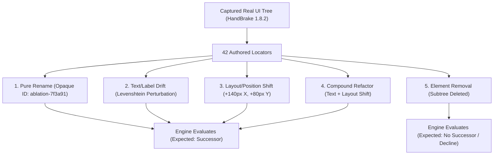

# 🔬 Real-World False-Positive Benchmark & Threshold Calibration / Gerçek Dünya Benchmarkı ve Eşik Kalibrasyonu

This guide provides a comprehensive technical overview of the real-world false-positive benchmark on organically evolved applications (HandBrake 1.8.2 WPF UI tree), the multi-signal locator ablation methodology, the empirical score distribution overlap findings, and the **"False Heal $\downarrow$ vs. Manual Review $\uparrow$"** trade-off dynamics.

> 💡 **Select Language / Dil Seçin:**
> - [🇬🇧 English Guide](#-english-guide)
> - [🇹🇷 Türkçe Kılavuz](#-türkçe-kılavuz)

---

## 🇬🇧 English Guide

### 1. Problem: Why Synthetic Speed Benchmarks Are Not Enough
Synthetic benchmarks (such as `SyntheticTreeBenchmarkTests`) measure tree traversal performance and scoring latency ($\sim 23\text{ms}$ across 3,000+ candidate nodes on developer hardware). However, a production-grade locator self-healing engine cannot be validated on execution speed alone:
1. **False-Positive Risk:** A healing engine that indiscriminately accepts incorrect elements produces "false green" tests that pass while exercising unintended UI components.
2. **Overfit in Bundled Case Studies:** Bundled demo apps (`WinFormsApp`, `WpfApp`) contain hand-crafted refactoring scenarios, creating a high risk of overfitting heuristics to specific known edge cases.
3. **The Disappearance Problem:** When a UI refactor completely deletes an element, the engine must decline and prompt a human for review rather than latching onto an adjacent button or container.

To establish ground-truth empirical metrics without relying on subjective human labelling, we apply **controlled multi-signal locator ablation** on real, organically evolved applications.

---

### 2. Multi-Signal Locator Ablation Methodology

Natural locator drift across production releases is sparse (e.g. dozens of version releases may yield zero or few accidental locator renames). **Controlled ablation** inverts the problem: we systematically mutate locators on a real captured application tree (`HandBrake_1.8.2.tree.json`, 149 nodes, 42 unique authored locators) across 5 distinct perturbation tiers:

| Mutation Tier | Description | Target Signal Tested |
| :--- | :--- | :--- |
| **`RenamedAutomationId`** | AutomationId replaced with an opaque hash (`ablation-XXXXXXXX`). | Tests pure identifier recovery when structural signals remain identical. |
| **`NameDrift`** | AutomationId replaced + `Name` perturbed (e.g. text edit/suffix). Generated only when `Name` is non-empty. | Tests tolerance to textual label refactors (Levenshtein distance). |
| **`PositionShift`** | AutomationId replaced + `BoundingRectangle` shifted ($+140\text{px}$ X, $+80\text{px}$ Y; $\sim 161\text{px}$ Euclidean distance). | Tests layout responsiveness under UI restyling / resizing. |
| **`CompoundDrift`** | AutomationId replaced + both `Name` drift and position shift applied simultaneously. | Tests compound refactoring tolerance where multiple signals degrade together. |
| **`RemovedElement`** | Target control and its entire subtree removed from the UI tree. | Tests rejection safety: ensuring the engine declines instead of guessing nearby neighbours. |

> [!IMPORTANT]
> **Information Leakage Protection:** Mutated identifiers use opaque, non-derivable synthetic IDs (`ablation-` + SHA-256 seed hex) rather than predictable suffixes (such as `_ablated`). This ensures that LLM shortlist evaluations remain strictly blind and cannot solve scenarios by inspecting candidate names.

---

### 3. Empirical Findings: Score Distribution Overlap

Running the baseline heuristic engine (`SimilarityWeights.Default`, `MinimumConfidence = 0.50`) across all 176 scenarios in the HandBrake 1.8.2 benchmark reveals the per-mutation score distributions:

```mermaid
gantt
    title Heuristic Score Distribution Ranges by Mutation Tier
    dateFormat X
    axisFormat %s
    section RenamedAutomationId
    [1.000 - 1.000] : 1000, 1000
    section NameDrift
    [0.877 - 0.950] : 877, 950
    section PositionShift
    [0.832 - 0.955] : 832, 955
    section CompoundDrift
    [0.749 - 0.874] : 749, 874
    section Removed (False Heals)
    [0.665 - 0.955] : 665, 955
    section Removed (Declines)
    [0.344 - 0.955] : 344, 955
```

| Mutation Tier | Scenario Count ($n$) | Correct Heals / Declines | False Heals | Missed (Review) | Score Range | Mean Score |
| :--- | :---: | :---: | :---: | :---: | :---: | :---: |
| **`RenamedAutomationId`** | 42 | 40 | 0 | 2 | $[1.000 - 1.000]$ | $1.000$ |
| **`NameDrift`** | 25 | 23 | 0 | 2 | $[0.877 - 0.950]$ | $0.901$ |
| **`PositionShift`** | 42 | 34 | 0 | 8 | $[0.832 - 0.955]$ | $0.867$ |
| **`CompoundDrift`** | 25 | 6 | 2 | 17 | $[0.749 - 0.874]$ | $0.790$ |
| **`RemovedElement`** | 42 | 25 | 17 | 0 | $[0.344 - 0.955]$ | $0.755$ |

#### Key Insight: The Inherent Score Overlap
- **False heals on removed elements score between $0.665$ and $0.955$** because nearby sibling buttons or containers share `ParentControlType`, sibling proximity, or screen coordinates with the deleted element.
- **True compound-drifted elements score between $0.749$ and $0.874$.**
- **These distributions heavily overlap.** Therefore, no static mathematical confidence score can unilaterally distinguish a moved/relabelled control from a deleted control whose neighbour looks structurally similar.

---

### 4. The "False Heal $\downarrow$ vs. Manual Review $\uparrow$" Trade-Off

Because the score distributions overlap, varying the `MinimumConfidence` threshold produces an empirical trade-off between auto-healing recall and human review intervention:

| `MinimumConfidence` | Precision | Auto-Heal Recall | False Heal Rate | Manual Review Rate | Correct Heals | False Heals (Successor) | False Heals (Removed) | Missed Heals | Correct Declines |
| :---: | :---: | :---: | :---: | :---: | :---: | :---: | :---: | :---: | :---: |
| **`0.50`** (Default) | $84.4\%$ | $76.9\%$ | $15.6\%$ | $30.7\%$ | 103 | 2 | 17 | 29 | 25 |
| **`0.60`** | $84.4\%$ | $76.9\%$ | $15.6\%$ | $30.7\%$ | 103 | 2 | 17 | 29 | 25 |
| **`0.70`** | $87.3\%$ | $76.9\%$ | $12.7\%$ | $33.0\%$ | 103 | 2 | 13 | 29 | 29 |
| **`0.75`** | $90.4\%$ | $76.9\%$ | $9.6\%$ | $35.2\%$ | 103 | 2 | 9 | 29 | 33 |
| **`0.80`** | $92.4\%$ | $72.4\%$ | $7.6\%$ | $40.3\%$ | 97 | 2 | 6 | 35 | 36 |
| **`0.85`** | $91.6\%$ | $64.9\%$ | $8.4\%$ | $46.0\%$ | 87 | 2 | 6 | 45 | 36 |
| **`0.90`** | $94.5\%$ | $38.8\%$ | $5.5\%$ | $68.8\%$ | 52 | 0 | 3 | 82 | 39 |
| **`0.95`** | $97.6\%$ | $30.6\%$ | $2.4\%$ | $76.1\%$ | 41 | 0 | 1 | 93 | 41 |

#### Trade-Off Mechanics:
1. **Aggressive Auto-Healing ($\text{Threshold} = 0.50 - 0.70$):** Maximizes recall ($76.9\%$) by accepting compound and shifted elements, at the expense of a higher false heal rate on removed elements ($12.7\% - 15.6\%$).
2. **Balanced Production Default ($\text{Threshold} = 0.75 - 0.80$):** High precision ($90.4\% - 92.4\%$) and high recall ($72.4\% - 76.9\%$), cutting false heals on removed controls in half ($17 \rightarrow 6$).
3. **Strict Zero-Defect Policy ($\text{Threshold} = 0.90 - 0.95$):** Minimizes false heals ($2.4\% - 5.5\%$) and maximizes precision ($97.6\%$), but routes heavily drifted controls to manual review ($68.8\% - 76.1\%$).

> [!NOTE]
> **Why Blindly Setting 0.95 is Counterproductive:** Moving `MinimumConfidence` from `0.90` to `0.95` eliminates the final 2 false heals ($3 \rightarrow 1$), but at the expense of sacrificing 11 true heals ($52 \rightarrow 41$), forcing three-quarters of all locators into manual human review ($76.1\%$). This is why the engine avoids hardcoding an arbitrary high threshold: the optimal operating point depends directly on each team's tolerance for false positives vs. manual review burden.

---

### 5. Offline Absence Signal Investigation (#95)

To address the score distribution overlap between deleted elements ($[0.665 - 0.955]$) and compound-drifted surviving elements ($[0.749 - 0.874]$), we systematically evaluated whether any auxiliary structural signal can act as an **absence detector** without relying on an arbitrary global confidence threshold.

We evaluated four distinct absence hypotheses against the recorded candidate score vectors of the 176 HandBrake benchmark scenarios:

#### Hypothesis 1: Runner-Up Margin Gating
*Hypothesis:* When an element is deleted, multiple surviving neighbours share similar scores and cluster tightly (producing small margins), whereas a true moved element stands apart from background decoys.

*Empirical Findings:*

| Margin Gate (`MinimumCandidateMargin`) | Compound Drift Recall ($n=25$) | False Heals on Removed ($n=42$) | Total Precision | Auto-Heal Recall |
| :---: | :---: | :---: | :---: | :---: |
| **`0.00`** | $11 / 25$ ($44.0\%$) | $39 / 42$ ($92.9\%$) | $68.2\%$ | $88.1\%$ |
| **`0.05`** (Default) | $6 / 25$ ($24.0\%$) | $17 / 42$ ($40.5\%$) | $84.4\%$ | $76.9\%$ |
| **`0.08`** | $2 / 25$ ($8.0\%$) | $11 / 42$ ($26.2\%$) | $87.3\%$ | $66.4\%$ |
| **`0.10`** | $2 / 25$ ($8.0\%$) | $7 / 42$ ($16.7\%$) | $89.5\%$ | $57.5\%$ |
| **`0.15`** | $2 / 25$ ($8.0\%$) | $4 / 42$ ($9.5\%$) | $92.9\%$ | $38.8\%$ |
| **`0.20`** | $0 / 25$ ($0.0\%$) | $2 / 42$ ($4.8\%$) | $94.6\%$ | $26.1\%$ |

*Result:* **Negative.** Margin gating exhibits the exact same trade-off curve as the confidence threshold. Increasing the required margin from $0.05$ to $0.10$ eliminates $10$ false heals on removed elements, but drops compound drift recall by $67\%$ ($6 \rightarrow 2$). At margin $0.20$, compound recall is completely wiped out ($0\%$), yet $2$ false heals on removed elements persist because a single isolated sibling in a deleted container stands far apart from other controls.

#### Hypothesis 2: Strict ControlType Invariance
*Hypothesis:* Requiring exact `ControlTypeScore == 1.0` prevents cross-type false matches (e.g. an Edit matching a StatusBar).

*Empirical Findings:*
- Eliminates all 6 cross-type false matches on deleted elements ($17 \rightarrow 11$).
- However, 11 false heals on removed elements remain completely unaffected because deleted controls match surviving siblings of the exact same control type (ComboBoxes matching ComboBoxes, Buttons matching Buttons, TabItems matching TabItems) with scores up to $0.955$.

*Result:* **Partial improvement for cross-type cases, but does not separate same-type deletions from compound drift.**

#### Hypothesis 3: Candidate Cluster Density (Decoy Count)
*Hypothesis:* Deleted elements produce a dense cluster of near-equal candidates, whereas surviving elements have fewer competing decoys.

*Empirical Findings:*
- Average cluster size within $0.10$ score of the best candidate:
  - **Removed Elements (False Heals):** $1.71$ (range $1 - 3$)
  - **Compound Drift (Surviving Elements):** $3.08$ (range $1 - 5$)

*Result:* **Negative (inverted).** True compound-drifted elements actually exhibit *higher* cluster density than deleted elements because when a control relocates, both the moved control and several nearby siblings in the target container score competitively.

#### Formal Finding
> [!IMPORTANT]
> **No single-target heuristic signal can construct an absence detector.** A surviving sibling in a deleted control's container looks structurally indistinguishable from a compound-drifted true element that moved near a sibling. Resolving this fundamental boundary requires holistic multi-element matching (e.g., whole-page bipartite locator graph reconciliation) rather than independent single-locator resolution.

---

### 6. Multi-Provider LLM Consensus as an Absence Detector (#97)

While heuristic signals are bounded by geometric and hierarchy similarities, multi-provider consensus ($\ge 2$ independent model votes) asks a fundamentally different question: *do independent reasoners converge or scatter?*

#### 1. The Core Hypothesis
- **On `CompoundDrift` (Surviving Successor):** Semantic reasoning about control roles and context allows independent models to converge on the ground-truth successor, rescuing cases that heuristic thresholds dropped.
- **On `RemovedElement` (Deletion):** With no true successor in the tree, independent models have no ground truth to anchor on. They should either return `null` (decline) or scatter across different decoys, resulting in `NoConsensus` $\rightarrow$ safe rejection.
- **The Critical Failure Boundary:** If two models agree on the *same salient decoy neighbour* (e.g., adjacent button in a toolbar), consensus will accept a false heal on a deleted element.

#### 2. Leakage Prevention: Uniform Opaque AutomationIds
In #94, stale `expected.AutomationId` was redacted to prevent prompt leakage. In #97, an inverse leakage vector was addressed: in ablation datasets, if only the target element received an opaque hash (`ablation-XXXXXXXX`) while background candidates kept natural names, models could identify the target simply as the "odd one out".

To ensure complete benchmark integrity without altering product prompt generation, `LocatorAblationGenerator.ApplyMutation` uniformly anonymizes *all* candidate `AutomationId`s in the mutated tree into the identical `ablation-XXXXXXXX` opaque format. Every candidate presents the exact same hash structure, length, and character set.

> [!NOTE]
> **Production Fidelity & Lower Bound:** In this ablation dataset, no `AutomationId` is semantically informative (all candidate identifiers are uniform synthetic hashes), whereas in production descriptive IDs such as `btnSaveDocument` provide semantic hints to the model; therefore, the LLM arm's benchmark score represents a **lower bound** on its production performance.

#### 3. Empirical Methodology & Non-Determinism Caveats
- **Single-Sample Uncertainty:** Unlike deterministic heuristic traversal, LLM evaluations represent non-deterministic empirical samples. A run over 42 removal scenarios carries a statistical confidence band of $\sim \pm 14\%$.
- **Auditability:** Models must run with temperature $0$, and raw votes per provider must be recorded alongside agreement telemetry (`AgreedProviders`, `ProviderAttempts`, `ProviderErrors`).
- **Targeted Subset:** To manage token costs, evaluation is targeted at the informative subsets: the 25 `CompoundDrift` and 42 `RemovedElement` scenarios ($n=67$).

---

## 🇹🇷 Türkçe Kılavuz

### 1. Problem: Sentetik Hız Testleri Neden Yetersizdir?
Sentetik testler (`SyntheticTreeBenchmarkTests`), ağaç dolaşımı ve skorlama gecikmesini ($\sim 23\text{ms}$ / 3.000+ kontrol) başarıyla doğrular. Ancak gerçek bir kendi kendini iyileştirme (self-healing) motoru yalnızca hıza bakılarak değerlendirilemez:
1. **Yanlış Pozitif (False Positive) Riski:** Yanlış bir elemanı doğru sanıp tıklayan bir motor, testlerin "sahte yeşil" (false green) geçmesine ve hataların gözden kaçmasına sebep olur.
2. **Hazır Senaryolarda Aşırı Öğrenme (Overfitting):** Projedeki örnek uygulamalar (`WinFormsApp`, `WpfApp`) bilinen yapay senaryolar içerir.
3. **Silinen Eleman Problemi:** Bir arayüz güncellemesinde bir buton tamamen silindiğinde, motor komşu bir butonu seçmemeli; durup testi insan incelemesine (`manual review`) yönlendirmelidir.

---

### 2. Çoklu Sinyal Ablasyon Metodolojisi

Gerçek WPF ağacında (`HandBrake 1.8.2`, 149 düğüm, 42 özgün locator) 5 farklı mutasyon katmanı ile 176 senaryo üretilir:

1. **`RenamedAutomationId`:** Sadece `AutomationId` opak bir hash ile değiştirilir (`ablation-XXXXXXXX`).
2. **`NameDrift`:** İsim/etiket metni değiştirilir (yalnızca `Name` değeri dolu olan elemanlara uygulanır).
3. **`PositionShift`:** Koordinatlar $+140\text{px}$ X ve $+80\text{px}$ Y kaydırılır ($\sim 161\text{px}$ Öklid mesafesi).
4. **`CompoundDrift`:** Hem metin hem konum aynı anda değiştirilerek bileşik refactor simüle edilir.
5. **`RemovedElement`:** Eleman ve alt ağacı tamamen silinir (motorun reddetmesi beklenir).

---

### 3. Temel Bulgu: Skor Dağılımlarının Çakışması

HandBrake 1.8.2 üzerinde yapılan ölçümlerde şu skor aralıkları gözlenmiştir:
- **Silinen elemanlarda yanlış eşleşen komşuların skoru:** $0.665 - 0.955$
- **Bileşik mutasyona uğramış gerçek elemanların skoru:** $0.749 - 0.874$
- **Konumu kaymış gerçek elemanların skoru:** $0.832 - 0.955$
- **Silinen elemanlarda doğru reddedilen durumlar:** $0.344 - 0.955$

**Sonuç:** Skor tek başına "bu eleman taşındı/yenilendi" ile "bu eleman silindi ve yanındaki komşu benziyor" ayrımını mükemmel şekilde yapamaz. Dağılımlar doğal olarak çakışmaktadır.

---

### 4. "Yanlış İyileştirme $\downarrow$ vs. Manuel İnceleme $\uparrow$" Dengesi

Eşik değeri (`MinimumConfidence`) artırıldıkça:
- Silinen elemanlardaki yanlış eşleşmeler $17$'den $1$'e düşer (Hata oranı $\%15.6 \rightarrow \%2.4$).
- Ancak ağır refactor geçirmiş elemanlar da insan onayına gönderilir (Manuel inceleme $\%30.7 \rightarrow \%76.1$).
- Projeler risk toleranslarına göre eşik değerini `SimilarityWeights` üzerinden ayarlayabilir ($0.75 - 0.80$ dengeli üretim önerisidir).

> [!NOTE]
> **Neden Körlemesine 0.95 Seçilmemelidir:** Eşik $0.90$'dan $0.95$'e çıkarıldığında, son 2 yanlış iyileştirme elenir ($3 \rightarrow 1$), ancak bunun bedeli $11$ doğru iyileştirmenin feda edilmesidir ($52 \rightarrow 41$) ve geçerli locator'ların dörtte üçünden fazlası insan incelemesine yönlendirilir ($\%76.1$). Bu nedenle motor tek bir katı eşik dayatmaz; en uygun çalışma noktası ekibin yanlış pozitif toleransı ile manuel inceleme yükü arasındaki tercihe bağlıdır.

---

### 5. Çevrimdışı Yokluk Sinyali Araştırması (#95)

Silinen elemanlar ($[0.665 - 0.955]$) ile bileşik mutasyona uğrayıp hayatta kalan elemanlar ($[0.749 - 0.874]$) arasındaki skor çakışmasını aşmak amacıyla, herhangi bir yapısal sinyalin **yokluk dedektörü (absence detector)** olarak çalışıp çalışamayacağı 176 senaryonun aday vektörleri üzerinde sistematik olarak incelenmiştir:

#### Hipotez 1: İkinci Aday Marjı (Runner-Up Margin)
*Hipotez:* Bir eleman silindiğinde birden fazla komşu benzer skorlar alır ve marj daralır; hayatta kalan gerçek eleman ise arka plan adaylarından belirgin şekilde ayrışır.

*Deneysel Bulgular:*

| Marj Eşiği (`MinimumCandidateMargin`) | Bileşik Başarı (Recall, $n=25$) | Silinende Yanlış İyileştirme ($n=42$) | Toplam Kesinlik | Otomatik İyileştirme |
| :---: | :---: | :---: | :---: | :---: |
| **`0.00`** | $11 / 25$ ($\%44.0$) | $39 / 42$ ($\%92.9$) | $\%68.2$ | $\%88.1$ |
| **`0.05`** (Varsayılan) | $6 / 25$ ($\%24.0$) | $17 / 42$ ($\%40.5$) | $\%84.4$ | $\%76.9$ |
| **`0.08`** | $2 / 25$ ($\%8.0$) | $11 / 42$ ($\%26.2$) | $\%87.3$ | $\%66.4$ |
| **`0.10`** | $2 / 25$ ($\%8.0$) | $7 / 42$ ($\%16.7$) | $\%89.5$ | $\%57.5$ |
| **`0.15`** | $2 / 25$ ($\%8.0$) | $4 / 42$ ($\%9.5$) | $\%92.9$ | $\%38.8$ |
| **`0.20`** | $0 / 25$ ($\%0.0$) | $2 / 42$ ($\%4.8$) | $\%94.6$) | $\%26.1$ |

*Sonuç:* **Olumsuz.** Marj filtresi güven eşiği ile aynı denge eğrisini gösterir. Marj $0.05$'ten $0.10$'a çıkarıldığında silinen elemanlardaki hata $17$'den $7$'ye düşer, ancak bileşik mutasyondaki doğru iyileştirme $\%67$ oranında çöker ($6 \rightarrow 2$). Marj $0.20$ yapıldığında bileşik başarı sıfırlanır, ancak silinmiş 2 eleman komşuları izole olduğu için hala yanlış eşleşir.

#### Hipotez 2: Katı Kontrol Türü Filtresi (`ControlTypeScore == 1.0`)
*Hipotez:* Tam tür eşleşmesi zorunlu tutularak farklı türdeki hatalı eşleşmeler (Edit $\rightarrow$ StatusBar) engellenir.
*Deneysel Bulgular:* Farklı türdeki 6 hatalı eşleşme elenir ($17 \rightarrow 11$), ancak aynı türdeki 11 yanlış eşleşme (ComboBox $\rightarrow$ ComboBox, Button $\rightarrow$ Button) $0.955$'e varan skorlarla hayatta kalır.

#### Hipotez 3: Aday Küme Yoğunluğu (Cluster Density)
*Hipotez:* Silinen elemanlar çok sayıda birbirine yakın skorlu aday kümesi üretir, gerçek elemanlarda ise küme seyrektir.
*Deneysel Bulgular:* En iyi adayın $0.10$ puan yakınındaki ortalama aday sayısı:
- **Silinen Elemanlar (Yanlış İyileştirmeler):** $1.71$
- **Bileşik Mutasyon (Gerçek Elemanlar):** $3.08$
*Sonuç:* **Olumsuz (Ters yönde).** Gerçek eleman taşındığında yeni konumundaki komşularla da yarışır, bu nedenle küme yoğunluğu silinen elemanlardan daha yüksektir.

#### Resmi Çıkarım
> [!IMPORTANT]
> **Tekil hedef odaklı hiçbir sezgisel sinyal bir yokluk dedektörü oluşturamaz.** Silinen bir kontrolün kapsayıcısındaki komşu eleman, yapısal olarak yeni bir konuma taşınmış gerçek bir kontrolden farksız görünür. Bu sınırın aşılması, tekil locator bağımsız çözümü yerine tüm sayfanın bütüncül graf eşleştirmesini (bipartite reconciliation) gerektirir.

---

### 6. Çoklu LLM Konsensüsü ile Yokluk Tespiti (#97)

Sezgisel sinyaller geometri ve hiyerarşi benzerliğiyle sınırlıyken, çoklu sağlayıcı konsensüsü ($\ge 2$ bağımsız model oyu) temelde farklı bir soru sorar: *bağımsız akıl yürütücüler aynı hedefte uzlaşıyor mu yoksa dağılıyor mu?*

#### 1. Temel Hipotez
- **Bileşik Mutasyonda (`CompoundDrift` - Yaşayan Eleman):** Kontrol rolleri ve kullanım bağlamı üzerine anlamsal akıl yürütme, modellerin gerçek ardıl üzerinde uzlaşmasını sağlayarak heuristik eşiklerin kaçırdığı durumları kurtarabilir.
- **Silinen Elemanda (`RemovedElement` - Silinme):** Ağaçta gerçek bir ardıl bulunmadığı için bağımsız modellerin odaklanacağı bir zemin yoktur. Modellerin ya `null` dönmesi (reddetme) ya da farklı komşulara dağılması (`NoConsensus` $\rightarrow$ güvenli ret) beklenir.
- **Kritik Hata Sınırı:** Eğer bağımsız iki model aynı belirgin yanlış komşu (ör. araç çubuğundaki yan buton) üzerinde uzlaşırsa, konsensüs silinen bir elemanda yanlış iyileştirmeyi kabul eder.

#### 2. Sızıntı Önleme: Tekdüze Opak AutomationId Dönüşümü
#94'te bayat `expected.AutomationId` gizlenerek sızıntı engellenmişti. #97'de ise ters yönde bir sızıntı giderildi: ablasyon senaryolarında yalnızca hedef elemanın ID'si opak bir hash'e (`ablation-XXXXXXXX`) dönüştürülüp diğer adaylar doğal isimlerini korursa, modeller yapısal muhakeme yapmadan sırf "diğerlerinden farklı görünen tek ID" olduğu için doğru cevabı seçebilir.

Ürün kodunun prompt davranışına dokunmadan bu sızıntıyı kapatmak amacıyla, `LocatorAblationGenerator.ApplyMutation` mutasyonlu ağaçtaki *tüm* aday `AutomationId` değerlerini aynı `ablation-XXXXXXXX` biçiminde tekdüze şekilde anonimleştirir. Böylece her aday aynı önek, uzunluk ve karakter kümesine sahip olur.

> [!NOTE]
> **Üretim Sadakati ve Alt Sınır:** Bu ablasyon veri setinde hiçbir `AutomationId` anlamsal olarak bilgilendirici değildir (tüm aday tanımlayıcılar tekdüze sentetik hash'lerdir), oysa üretim ortamında `btnSaveDocument` gibi açıklayıcı adlar modele güçlü ipuçları sunar; dolayısıyla LLM kolunun buradaki ölçüm skoru, üretimdeki gerçek performansının bir **alt sınırı (lower bound)** sayılmalıdır.

#### 3. Ampirik Metodoloji ve Belirsizlik Notları
- **Tek Örnek (Single-Sample) Belirsizliği:** Deterministik heuristik testlerin aksine, LLM ölçümleri stokastik ampirik örneklerdir. 42 silinme senaryosundaki tek bir koşu yaklaşık $\pm \%14$ istatistiksel belirsizlik taşır.
- **Denetlenebilirlik:** Sıcaklık $0$ olarak sabitlenmeli, sağlayıcı bazlı ham oylar ve uzlaşma telemetrisi (`AgreedProviders`, `ProviderAttempts`, `ProviderErrors`) eksiksiz kaydedilmelidir.
- **Maliyet Kontrolü:** Token maliyetini sınırlamak için ölçüm 25 `CompoundDrift` ve 42 `RemovedElement` ($n=67$) senaryosu üzerinde hedeflenir.

