# 🔬 Real-World False-Positive Benchmark & Threshold Calibration / Gerçek Dünya Benchmarkı ve Eşik Kalibrasyonu

This guide provides a comprehensive technical overview of the real-world false-positive benchmark on organically evolved applications (HandBrake 1.8.2 WPF UI tree), the multi-signal locator ablation methodology, the empirical score distribution overlap findings, and the **"False Heal $\downarrow$ vs. Manual Review $\uparrow$"** trade-off dynamics.

> 💡 **Select Language / Dil Seçin:**
> - [🇬🇧 English Guide](#-english-guide)
> - [🇹🇷 Türkçe Kılavuz](#-türkçe-kılavuz)

---

## 🇬🇧 English Guide

### 1. Problem: Why Synthetic Speed Benchmarks Are Not Enough
Synthetic benchmarks (such as `SyntheticTreeBenchmarkTests`) measure tree traversal performance and scoring latency ($\sim 23\text{ms}$ across 3,000+ candidate nodes on developer hardware). However, a production-grade locator self-healing engine cannot be validated on execution speed alone:
1. **False-Positive Risk:** A healing engine that indiscriminately accepts incorrect elements produces "false green" tests that pass while exercising unintended UI components.
2. **Overfit in Bundled Case Studies:** Bundled demo apps (`WinFormsApp`, `WpfApp`) contain hand-crafted refactoring scenarios, creating a high risk of overfitting heuristics to specific known edge cases.
3. **The Disappearance Problem:** When a UI refactor completely deletes an element, the engine must decline and prompt a human for review rather than latching onto an adjacent button or container.

To establish ground-truth empirical metrics without relying on subjective human labelling, we apply **controlled multi-signal locator ablation** on real, organically evolved applications.

---

### 2. Multi-Signal Locator Ablation Methodology

Natural locator drift across production releases is sparse (e.g. dozens of version releases may yield zero or few accidental locator renames). **Controlled ablation** inverts the problem: we systematically mutate locators on a real captured application tree (`HandBrake_1.8.2.tree.json`, 149 nodes, 42 unique authored locators) across 5 distinct perturbation tiers:

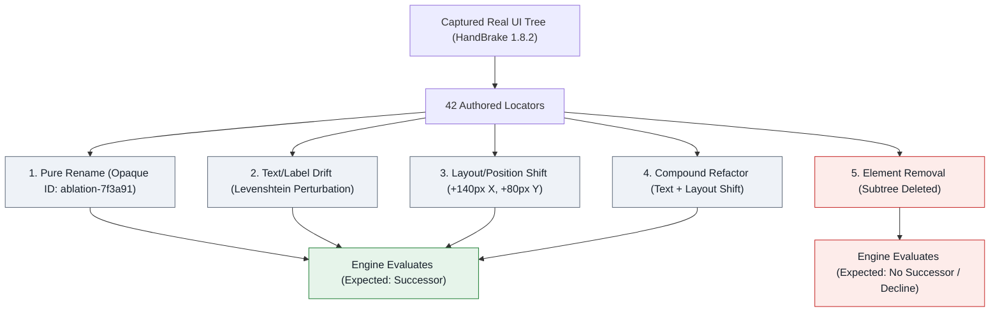

| Mutation Tier | Description | Target Signal Tested |
| :--- | :--- | :--- |
| **`RenamedAutomationId`** | AutomationId replaced with an opaque hash (`ablation-XXXXXXXX`). | Tests pure identifier recovery when structural signals remain identical. |
| **`NameDrift`** | AutomationId replaced + `Name` perturbed (e.g. text edit/suffix). Generated only when `Name` is non-empty. | Tests tolerance to textual label refactors (Levenshtein distance). |
| **`PositionShift`** | AutomationId replaced + `BoundingRectangle` shifted ($+140\text{px}$ X, $+80\text{px}$ Y; $\sim 161\text{px}$ Euclidean distance). | Tests layout responsiveness under UI restyling / resizing. |
| **`CompoundDrift`** | AutomationId replaced + both `Name` drift and position shift applied simultaneously. | Tests compound refactoring tolerance where multiple signals degrade together. |
| **`RemovedElement`** | Target control and its entire subtree removed from the UI tree. | Tests rejection safety: ensuring the engine declines instead of guessing nearby neighbours. |

> [!IMPORTANT]
> **Information Leakage Protection:** Mutated identifiers use opaque, non-derivable synthetic IDs (`ablation-` + SHA-256 seed hex) rather than predictable suffixes (such as `_ablated`). This ensures that LLM shortlist evaluations remain strictly blind and cannot solve scenarios by inspecting candidate names.

---

### 3. Empirical Findings: Score Distribution Overlap

Running the baseline heuristic engine (`SimilarityWeights.Default`, `MinimumConfidence = 0.50`) across all 176 scenarios in the HandBrake 1.8.2 benchmark reveals the per-mutation score distributions:

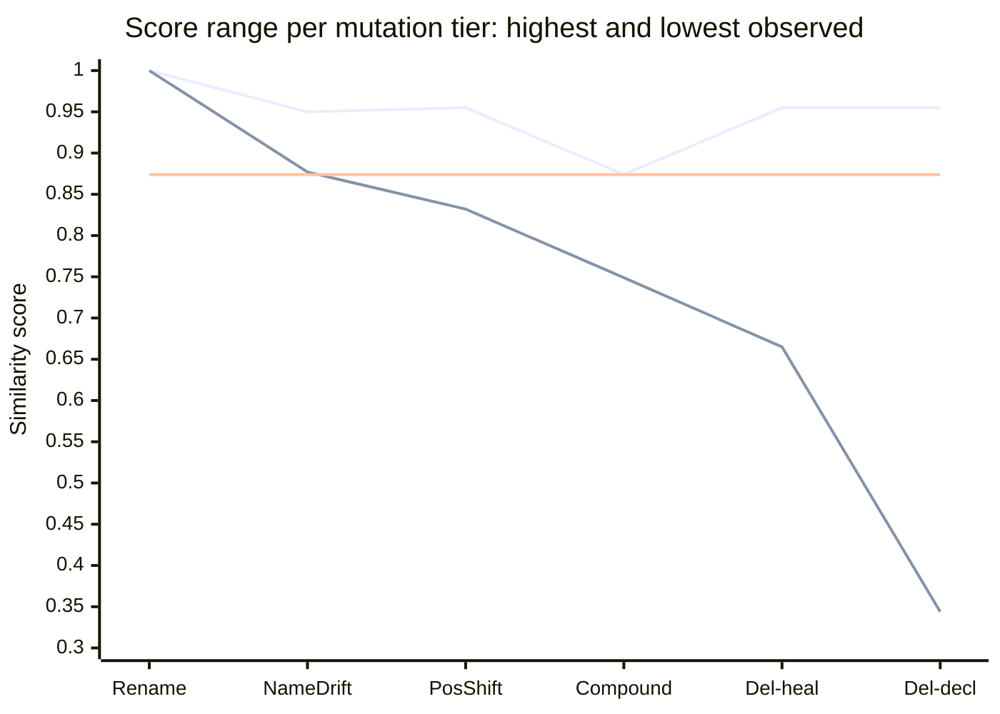

The upper line is each tier's **highest** observed score, the lower line its **lowest**; the gap between the two lines is where that tier's scores actually live. The flat middle line sits at $0.874$ — the highest score any genuinely surviving element reached in this dataset. Every accepted candidate above it in `Del-heal` is a false heal that no threshold can filter out without also discarding the best true successor. `Del-heal` and `Del-decl` are both `RemovedElement`, split by what the engine did — accepted a neighbour, or correctly declined. At `Rename` the two lines meet, because that tier has no spread at all: every one of its 42 scenarios scored exactly $1.000$. A single point there is the measurement, not a rendering artefact.

**Read the chart vertically.** At `Compound` the band runs $0.749-0.874$; at `Del-heal` it runs $0.665-0.955$. Those two spans cover the same scores, so no horizontal threshold line can be drawn across this chart with true successors above it and deleted elements below it. That is the entire finding of this section.

The outcome split shows where the damage concentrates — false heals appear only in the last two tiers, and overwhelmingly in `RemovedElement`:

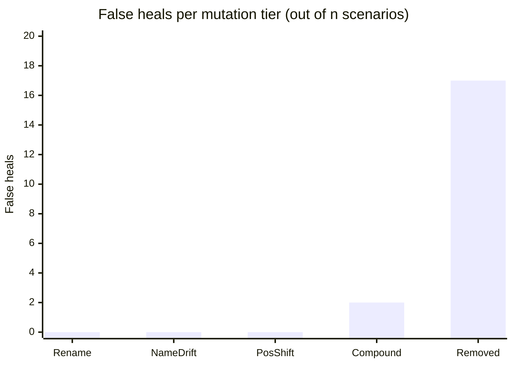

| Mutation Tier | Scenario Count ($n$) | Correct Heals / Declines | False Heals | Missed (Review) | Score Range | Mean Score |
| :--- | :---: | :---: | :---: | :---: | :---: | :---: |
| **`RenamedAutomationId`** | 42 | 40 | 0 | 2 | $[1.000 - 1.000]$ | $1.000$ |
| **`NameDrift`** | 25 | 23 | 0 | 2 | $[0.877 - 0.950]$ | $0.901$ |
| **`PositionShift`** | 42 | 34 | 0 | 8 | $[0.832 - 0.955]$ | $0.867$ |
| **`CompoundDrift`** | 25 | 6 | 2 | 17 | $[0.749 - 0.874]$ | $0.790$ |
| **`RemovedElement`** | 42 | 25 | 17 | 0 | $[0.344 - 0.955]$ | $0.755$ |

#### Key Insight: The Inherent Score Overlap
- **False heals on removed elements score between $0.665$ and $0.955$** because nearby sibling buttons or containers share `ParentControlType`, sibling proximity, or screen coordinates with the deleted element.
- **True compound-drifted elements score between $0.749$ and $0.874$.**
- **These distributions heavily overlap.** Therefore, no static mathematical confidence score can unilaterally distinguish a moved/relabelled control from a deleted control whose neighbour looks structurally similar.

---

### 4. The "False Heal $\downarrow$ vs. Manual Review $\uparrow$" Trade-Off

Because the score distributions overlap, varying the `MinimumConfidence` threshold produces an empirical trade-off between auto-healing recall and human review intervention:

| `MinimumConfidence` | Precision | Auto-Heal Recall | False Heal Rate | Manual Review Rate | Correct Heals | False Heals (Successor) | False Heals (Removed) | Missed Heals | Correct Declines |
| :---: | :---: | :---: | :---: | :---: | :---: | :---: | :---: | :---: | :---: |
| **`0.50`** (Default) | $84.4\%$ | $76.9\%$ | $15.6\%$ | $30.7\%$ | 103 | 2 | 17 | 29 | 25 |
| **`0.60`** | $84.4\%$ | $76.9\%$ | $15.6\%$ | $30.7\%$ | 103 | 2 | 17 | 29 | 25 |
| **`0.70`** | $87.3\%$ | $76.9\%$ | $12.7\%$ | $33.0\%$ | 103 | 2 | 13 | 29 | 29 |
| **`0.75`** | $90.4\%$ | $76.9\%$ | $9.6\%$ | $35.2\%$ | 103 | 2 | 9 | 29 | 33 |
| **`0.80`** | $92.4\%$ | $72.4\%$ | $7.6\%$ | $40.3\%$ | 97 | 2 | 6 | 35 | 36 |
| **`0.85`** | $91.6\%$ | $64.9\%$ | $8.4\%$ | $46.0\%$ | 87 | 2 | 6 | 45 | 36 |
| **`0.90`** | $94.5\%$ | $38.8\%$ | $5.5\%$ | $68.8\%$ | 52 | 0 | 3 | 82 | 39 |
| **`0.95`** | $97.6\%$ | $30.6\%$ | $2.4\%$ | $76.1\%$ | 41 | 0 | 1 | 93 | 41 |

The same sweep drawn as curves — precision (top line), auto-heal recall (middle), false-heal rate (bottom). The recall cliff at $0.90$ and the stubborn false-heal floor are the trade-off made visible:

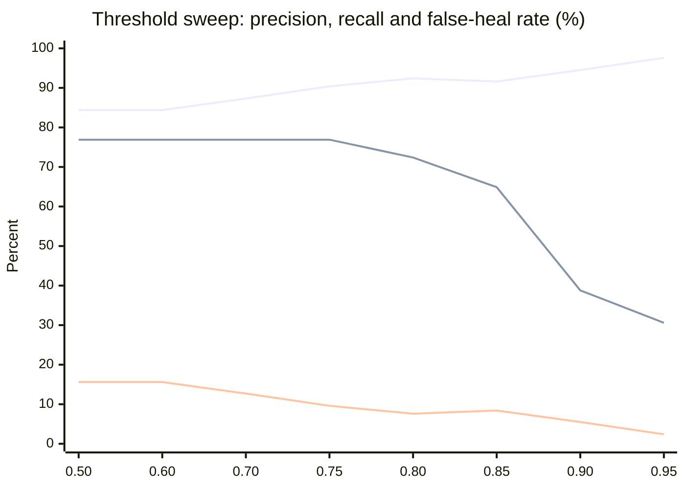

#### Trade-Off Mechanics:
1. **Aggressive Auto-Healing ($\text{Threshold} = 0.50 - 0.70$):** Maximizes recall ($76.9\%$) by accepting compound and shifted elements, at the expense of a higher false heal rate on removed elements ($12.7\% - 15.6\%$).
2. **Recommended Operating Point, Not a Guarantee ($\text{Threshold} = 0.75 - 0.80$):** On HandBrake, this range gives high precision ($90.4\% - 92.4\%$) and high recall ($72.4\% - 76.9\%$), cutting false heals on removed controls in half ($17 \rightarrow 6$). This is **not** the shipped default — `SimilarityWeights.MinimumConfidence` ships at `0.50`. §8 measured a second application (ShareX) at the same threshold range: the direction holds (raising the threshold still reduces false heals on both apps) but the magnitude does not transfer — the same $0.75-0.80$ range yields $20\%-23\%$ false heals on ShareX against HandBrake's $7.6\%-9.6\%$. Treat this as a starting point to calibrate per application, not a portable setting.
3. **Strict Zero-Defect Policy ($\text{Threshold} = 0.90 - 0.95$):** Minimizes false heals ($2.4\% - 5.5\%$) and maximizes precision ($97.6\%$), but routes heavily drifted controls to manual review ($68.8\% - 76.1\%$).

> [!NOTE]
> **Why Blindly Setting 0.95 is Counterproductive:** Moving `MinimumConfidence` from `0.90` to `0.95` eliminates the final 2 false heals ($3 \rightarrow 1$), but at the expense of sacrificing 11 true heals ($52 \rightarrow 41$), forcing three-quarters of all locators into manual human review ($76.1\%$). This is why the engine avoids hardcoding an arbitrary high threshold: the optimal operating point depends directly on each team's tolerance for false positives vs. manual review burden.

---

### 5. Offline Absence Signal Investigation (#95)

To address the score distribution overlap between deleted elements ($[0.665 - 0.955]$) and compound-drifted surviving elements ($[0.749 - 0.874]$), we systematically evaluated whether any auxiliary structural signal can act as an **absence detector** without relying on an arbitrary global confidence threshold.

We evaluated four distinct absence hypotheses against the recorded candidate score vectors of the 176 HandBrake benchmark scenarios:

#### Hypothesis 1: Runner-Up Margin Gating
*Hypothesis:* When an element is deleted, multiple surviving neighbours share similar scores and cluster tightly (producing small margins), whereas a true moved element stands apart from background decoys.

*Empirical Findings:*

| Margin Gate (`MinimumCandidateMargin`) | Compound Drift Recall ($n=25$) | False Heals on Removed ($n=42$) | Total Precision | Auto-Heal Recall |
| :---: | :---: | :---: | :---: | :---: |
| **`0.00`** | $11 / 25$ ($44.0\%$) | $39 / 42$ ($92.9\%$) | $68.2\%$ | $88.1\%$ |
| **`0.05`** (Default) | $6 / 25$ ($24.0\%$) | $17 / 42$ ($40.5\%$) | $84.4\%$ | $76.9\%$ |
| **`0.08`** | $2 / 25$ ($8.0\%$) | $11 / 42$ ($26.2\%$) | $87.3\%$ | $66.4\%$ |
| **`0.10`** | $2 / 25$ ($8.0\%$) | $7 / 42$ ($16.7\%$) | $89.5\%$ | $57.5\%$ |
| **`0.15`** | $2 / 25$ ($8.0\%$) | $4 / 42$ ($9.5\%$) | $92.9\%$ | $38.8\%$ |
| **`0.20`** | $0 / 25$ ($0.0\%$) | $2 / 42$ ($4.8\%$) | $94.6\%$ | $26.1\%$ |

The two curves fall together — the negative result made visible (upper line: false heals on removed elements; lower line: compound-drift recall). Raising the margin never widens the gap between them:

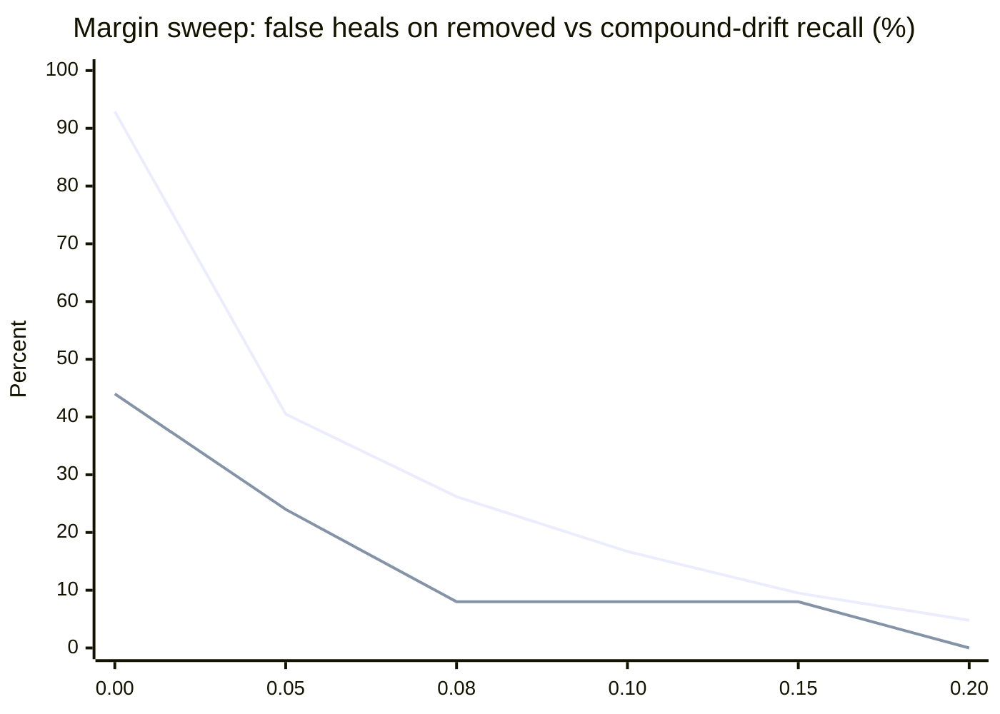

*Result:* **Negative.** Margin gating exhibits the exact same trade-off curve as the confidence threshold. Increasing the required margin from $0.05$ to $0.10$ eliminates $10$ false heals on removed elements, but drops compound drift recall by $67\%$ ($6 \rightarrow 2$). At margin $0.20$, compound recall is completely wiped out ($0\%$), yet $2$ false heals on removed elements persist because a single isolated sibling in a deleted container stands far apart from other controls.

#### Hypothesis 2: Strict ControlType Invariance
*Hypothesis:* Requiring exact `ControlTypeScore == 1.0` prevents cross-type false matches (e.g. an Edit matching a StatusBar).

*Empirical Findings:*
- Eliminates all 6 cross-type false matches on deleted elements ($17 \rightarrow 11$).
- However, 11 false heals on removed elements remain completely unaffected because deleted controls match surviving siblings of the exact same control type (ComboBoxes matching ComboBoxes, Buttons matching Buttons, TabItems matching TabItems) with scores up to $0.955$.

*Result:* **Partial improvement for cross-type cases, but does not separate same-type deletions from compound drift.**

#### Hypothesis 3: Candidate Cluster Density (Decoy Count)
*Hypothesis:* Deleted elements produce a dense cluster of near-equal candidates, whereas surviving elements have fewer competing decoys.

*Empirical Findings:*
- Average cluster size within $0.10$ score of the best candidate:
  - **Removed Elements (False Heals):** $1.71$ (range $1 - 3$)
  - **Compound Drift (Surviving Elements):** $3.08$ (range $1 - 5$)

*Result:* **Negative (inverted).** True compound-drifted elements actually exhibit *higher* cluster density than deleted elements because when a control relocates, both the moved control and several nearby siblings in the target container score competitively.

#### Hypothesis 4: Combined Filter (Strict ControlType + Margin $\ge 0.08$)

Because each signal failed alone, the obvious next question is whether they compose: require the winner to match the expected `ControlType` exactly **and** to lead the runner-up by a clear margin.

*Result:* **Negative.** The two filters remove largely the same cases. Same-type false heals on deleted controls survive the `ControlType` gate by construction, and the ones that also clear the margin gate are precisely the confident-looking impostors the combination was meant to catch — while compound-drift recall falls further, because a genuinely relocated element competes with the siblings it landed among and rarely leads them by a wide margin.

#### Formal Finding
> [!IMPORTANT]
> **No single-target heuristic signal can construct an absence detector.** A surviving sibling in a deleted control's container looks structurally indistinguishable from a compound-drifted true element that moved near a sibling. What this does **not** establish is the remedy. Whole-tree reconciliation — resolving all locators jointly so elements compete for one another, instead of one locator at a time — is the natural next hypothesis, and it is untested. It is tracked in #98, where it is to be probed against this dataset before any implementation is proposed.

---

### 6. Multi-Provider LLM Consensus as an Absence Detector (#97)

> [!IMPORTANT]
> **Measured on 2026-08-16** in run [31959334927](https://github.com/mustafasercansak/automation-sandbox/actions/runs/31959334927). The result is in §4. Consensus is the first signal in this project that separates the bands at all — and it is still not safe as a gate, for a reason the hypothesis did not predict.

While heuristic signals are bounded by geometric and hierarchy similarities, multi-provider consensus ($\ge 2$ independent model votes) asks a fundamentally different question: *do independent reasoners converge or scatter?*

#### 1. The Core Hypothesis
- **On `CompoundDrift` (Surviving Successor):** Semantic reasoning about control roles and context allows independent models to converge on the ground-truth successor, rescuing cases that heuristic thresholds dropped.
- **On `RemovedElement` (Deletion):** With no true successor in the tree, independent models have no ground truth to anchor on. They should either return `null` (decline) or scatter across different decoys, resulting in `NoConsensus` $\rightarrow$ safe rejection.
- **The Critical Failure Boundary:** If two models agree on the *same salient decoy neighbour* (e.g., adjacent button in a toolbar), consensus will accept a false heal on a deleted element.

#### 2. Leakage Prevention: Uniform Opaque AutomationIds
In #94, stale `expected.AutomationId` was redacted to prevent prompt leakage. In #97, an inverse leakage vector was addressed: in ablation datasets, if only the target element received an opaque hash (`ablation-XXXXXXXX`) while background candidates kept natural names, models could identify the target simply as the "odd one out".

To ensure complete benchmark integrity without altering product prompt generation, `LocatorAblationGenerator.ApplyMutation` uniformly anonymizes *all* candidate `AutomationId`s in the mutated tree into the identical `ablation-XXXXXXXX` opaque format. Every candidate presents the exact same hash structure, length, and character set.

> [!NOTE]
> **Production Fidelity & Lower Bound:** In this ablation dataset, no `AutomationId` is semantically informative (all candidate identifiers are uniform synthetic hashes), whereas in production descriptive IDs such as `btnSaveDocument` provide semantic hints to the model; therefore, the LLM arm's benchmark score represents a **lower bound** on its production performance.

#### 3. Empirical Methodology & Non-Determinism Caveats
- **Single-Sample Uncertainty:** Unlike deterministic heuristic traversal, LLM evaluations represent non-deterministic empirical samples. A run over 42 removal scenarios carries a statistical confidence band of $\sim \pm 14\%$.
- **Auditability:** Models must run with temperature $0$, and raw votes per provider must be recorded alongside agreement telemetry (`AgreedProviders`, `ProviderAttempts`, `ProviderErrors`).
- **Targeted Subset:** To manage token costs, evaluation is targeted at the informative subsets: the 25 `CompoundDrift` and 42 `RemovedElement` scenarios ($n=67$).

#### 4. Empirical Result

Four independent runs, 2026-08-16 to 2026-08-18, as the provider pool was widened from 3 configured providers to 7 and Groq's model was replaced twice (a removed model, then an unreliable one, then a working one — #126). Each run targets the same 25 `CompoundDrift` + 42 `RemovedElement` scenarios; a scenario counts as **usable** only when at least two providers returned an answer (#109), because one opinion can neither agree nor disagree with anything.

| Run | Date | Usable ($n$) | `CompoundDrift` unanimous | `RemovedElement` unanimous |
| :--- | :--- | ---: | :--- | :--- |
| [31959334927](https://github.com/mustafasercansak/automation-sandbox/actions/runs/31959334927) | 08-16 | 19 | 6 / 7 | 3 / 12 |
| [31961463762](https://github.com/mustafasercansak/automation-sandbox/actions/runs/31961463762) | 08-16 | 39 | 16 / 17 | 10 / 22 |
| [31963741937](https://github.com/mustafasercansak/automation-sandbox/actions/runs/31963741937) | 08-16 | 33 | 14 / 14 | 11 / 19 |
| [32163961433](https://github.com/mustafasercansak/automation-sandbox/actions/runs/32163961433) | 08-18 | 42 | 16 / 17 | 10 / 25 |
| **Total** | | **133** | **52 / 55** | **34 / 78** |

Each run's failures are recorded in its own workflow log: free-tier daily quota exhaustion (Gemini, Groq), a model requiring a paid plan (Ollama Cloud, dropped from the pool — #119), and, in the most recent run, individual requests exceeding a 15-second per-attempt ceiling on three providers (#129, unresolved as of this writing). None of that noise touches the measurement below — it only shrinks $n$.

**The measurement, aggregated.** Agreement tracks survival: providers reached unanimous agreement on **94.5%** ($52/55$) of scenarios where a true successor existed, and on **43.6%** ($34/78$) of scenarios where the element was gone. None of the four heuristic hypotheses in §5 separated the bands at all, so this remains the only mechanism in the project that produces any separation.

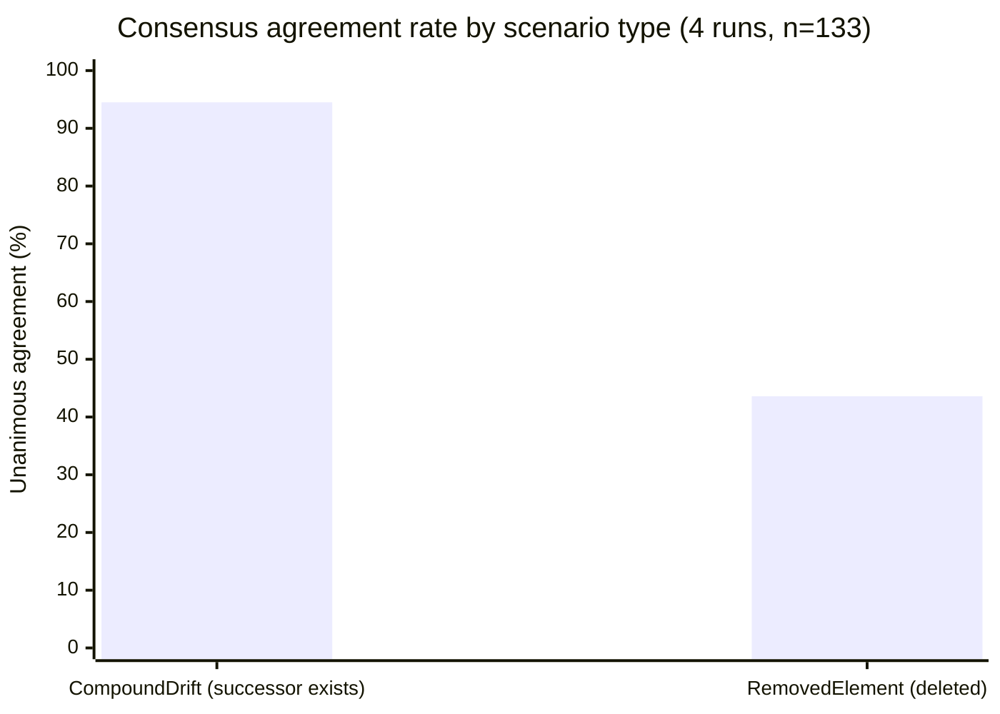

> [!WARNING]
> **Unanimity is not a safe gate, and it is worse than a single run suggested.** Every one of the 52 unanimous verdicts on a surviving element was correct. Every one of the 34 unanimous verdicts on a deleted element was a false heal — **zero exceptions in either direction, across four runs with four different provider sets.** An earlier version of this section reported "33%" from run 31959334927 alone; that figure pooled both mutation types into one denominator ($3$ wrong among $9$ total unanimous verdicts), which understated the removed-element rate by mixing it with the unrelated, reliably-correct compound-drift population. Read per type, the removed-element rate is $100\%$: agreement never once happened to be right about an absence.

#### 5. The Mechanism Is Disagreement, Not Recognition

The hypothesis predicted two safe outcomes on a deleted element: providers decline, or providers scatter. **Declining essentially never happens.** Across all 78 usable `RemovedElement` scenarios in the four runs, `AllDeclined` occurred exactly **once**. Every other provider that answered pointed at a specific — wrong — candidate.

Every correct rejection across the four runs therefore came from providers *disagreeing with each other*, not from any provider recognising that the element was gone. The models do not know the control was deleted; each one confidently names a different neighbour, and the engine rejects the heal only because the votes fail to match.

**Widening the provider pool did not rescue this — it demonstrated the limit more clearly.** Run 31961463762 recorded 10 unanimous false heals; 7 of those 10 had **three** independently-sourced model families agreeing on the same non-existent element at once — Cloudflare (Qwen), Mistral, and OpenRouter (gpt-oss). Three separate vendors, three separate architectures, one wrong answer, unanimously. Going from 3 configured providers to 7 across these four runs did not reduce the removed-element unanimous-agreement rate (25% → 45% → 58% → 40%, no downward trend) or its accuracy (100% wrong throughout).

This matters for how far the result generalises:

- The protection is a **byproduct of independence**, but the four-run aggregate shows independence alone does not bound the failure rate the way §5 originally predicted — a genuinely independent, capable reasoner finds a deleted control's surviving neighbour a convincing answer often enough that adding more independent reasoners is not guaranteed to break the tie.
- It cannot be strengthened by asking for more confidence, because the failing cases are already confident. There is no evidence in this data that it can be strengthened by adding providers, either.
- A provider that essentially never declines contributes nothing to absence detection on its own. Its vote is only useful as something for another provider to contradict — and per the paragraph above, that contradiction cannot be relied upon.

> [!IMPORTANT]
> **Formal finding, revised across four runs ($n=133$, 2026-08-16 to 2026-08-18).** Multi-provider consensus separates surviving elements from deleted ones (94.5% vs 43.6% unanimous agreement) where every heuristic signal in §5 failed. It is not sufficient as an acceptance gate: **every** unanimous verdict on a deleted element across all four runs (34 of 34) was a false heal, including cases where three independently-sourced model families agreed. The separation comes from disagreement between providers, not from any model detecting absence — and widening the provider pool from 3 configured providers to 7 did not reduce this failure rate. Do not assume that adding more providers will fix it; this data argues against that assumption.

---

### 7. Whole-Tree Reconciliation: the Offline Probe (#98)

§5's finding and §6's both point at the same structural gap: every mechanism measured so far resolves one locator at a time, in isolation. §98 asked a narrower question before proposing to fix that: when the heuristic wrongly heals a removed element onto a neighbour, is that neighbour usually *another authored locator's real identity* — something a joint solver, resolving every locator on the page at once, could recognise as "already claimed" and therefore refuse to hand to the removed one too?

**The probe, run against the existing 42 `RemovedElement` scenarios at default weights (no new mutation kind needed for this step).** Of the 17 false heals, **10 (59%) picked a neighbour that was itself one of the tree's other 41 authored locators**, recovered by structural fingerprint since `RemovedElement`'s AutomationId-opaquing mutation destroys the identifier every candidate is normally matched on.

| Removed locator | Wrongly matched onto | Reciprocal? |
| :--- | :--- | :---: |
| `Minimize-Restore` | `Maximize-Restore` | ✓ |
| `Maximize-Restore` | `Minimize-Restore` | ✓ |
| `Close` | `Maximize-Restore` | |
| `ShowQueue` | `Preview` | |
| `tabControl` | `sourceSelection` | ✓ |
| `sourceSelection` | `tabControl` | ✓ |
| `summaryTab` | `pictureTab` | |
| `chaptersTab` | `subtitlesTab` | |
| `Destination` | `statusBar` | ✓ |
| `statusBar` | `Destination` | ✓ |

Three of these are **reciprocal pairs**: remove either element and the heuristic heals it onto the other, in both directions. `Minimize-Restore` and `Maximize-Restore` are each other's best-scoring decoy; so are `Destination`/`statusBar` and `tabControl`/`sourceSelection`. That is precisely the shape a bipartite assignment is built to resolve — if both locators are being placed in the same joint solve, at most one of them can claim the shared slot, and the loser has nothing left to match, which is the "gone" signal the current per-locator scorer cannot produce.

The remaining 7 of 17 claimed untracked or incidental elements (an empty-named container, a toolbar element with no test relying on it) that no other locator wants either. A joint solver would have nothing to exploit there — its ceiling on this dataset is bounded by the 59%, not by the full 17.

> [!NOTE]
> **Reading this number honestly.** 59% was favourable enough to justify the next step the original issue named — building scenarios where multiple locators break together, which is also the more realistic failure mode — but it was not evidence the mechanism worked. The original single-mutation dataset could not test joint assignment directly: with only one locator broken per scenario, there was no real contention for a solver to exploit. §9 now supplies that multi-locator baseline; it confirms the predicted contention exists, while deliberately stopping before a matching-based resolver is built.

---

### 8. A Second Application: ShareX v21.0.0 (#99, #134)

Every number in §3–§7 comes from one WPF tree. #99 named that as a precondition for publishing anything: a single application cannot tell "this is how the heuristic behaves" from "this is how HandBrake's specific structure happens to behave." This section runs the identical pipeline — same generator, same harness, same default weights — against a real WinForms application, ShareX v21.0.0, captured via [survey run 32280934910](https://github.com/mustafasercansak/automation-sandbox/actions/runs/32280934910). 29 unique authored locators, 131 scenarios.

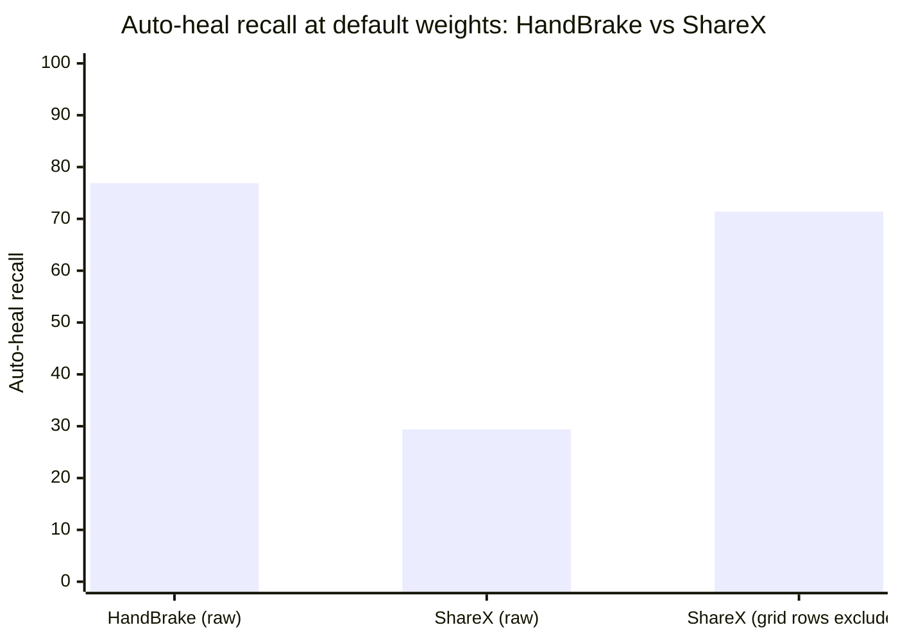

**The raw number looks alarming, and is partly an artefact.** At default weights, ShareX's auto-heal recall is 29.4% against HandBrake's 76.9% — a huge gap. 15 of ShareX's 29 authored locators (52%) are `DataItem` rows from a Hotkeys settings grid (`Hotkey Row 1`, `Description Row 2`, ...). HandBrake's fixture has zero elements of this kind. Every one of those rows is structurally near-identical to its siblings — same `ControlType`, same missing `ClassName`, position differing only by row index — so the engine declines them as `Ambiguous` even when the top candidate scores a perfect `1.000`. That is correct behaviour, not a defect: #78 already named `DataGrid`/`DataItem` as an inherently volatile locator class. Left in, they measure this one grid's density rather than the heuristic's general quality.

**The fair comparison excludes them.** With grid rows removed (14 authored locators, 56 scenarios), recall converges toward HandBrake's: 71.4% vs 76.9%. But the number this whole benchmark exists to measure does not:

| Application | False heal rate on removed elements | $n$ |
| :--- | ---: | ---: |
| HandBrake | 40.5% | 17/42 |
| ShareX (grid rows excluded) | **57.1%** | 8/14 |

A second real application does not make the false-heal problem look like a HandBrake quirk. It makes it look worse.

| Metric (default weights, grid rows excluded) | HandBrake | ShareX |
| :--- | ---: | ---: |
| Precision | 84.4% | 73.2% |
| Auto-heal recall | 76.9% | 71.4% |
| False heal rate | 15.6% | 26.8% |
| Manual review rate | 30.7% | 26.8% |

> [!IMPORTANT]
> **Formal finding.** A second application does not change the shape of the problem this project exists to solve, and does not improve it. Recall is roughly comparable once a confounding UI pattern (dense structurally-identical grid rows, absent from the first application) is controlled for. Precision and false-heal rate are both meaningfully worse on ShareX. Neither HandBrake's numbers nor ShareX's should be read as "the" accuracy of this engine — they are two data points bounding a range, and the range is wide: 40.5%–57.1% false heals on deleted elements at the shipped default, before any LLM consensus is applied. Regression guards: `ShareXAblationTests` (\`ShareXFixture_DefaultWeights_MatchesTheCommittedBaseline\`, \`ShareXFixture_MostMissedPerfectScoreRenames_AreDataGridRows\`, \`ShareXFixture_ExcludingDataGridRows_FalseHealOnRemovedRateIsWorseThanHandBrakes\`).

---

### 9. Multi-Locator Baseline: Real Contention Exists (#132)

The v2 ablation dataset can now describe two or more locator mutations against one shared tree, with a separate mutation recipe and ground truth for every locator. `RunMultiLocatorBaseline` applies that shared mutation once and then invokes the existing per-locator heuristic independently for each expected locator. It does **not** implement joint matching or change `SelfHealingResolver`; this is the baseline that any later batch design must improve upon.

Seven HandBrake scenarios were measured at the shipped default weights:

- Six two-locator scenarios cover both directions of the three reciprocal pairs from §7. In each, one locator is removed and its counterpart is renamed, so both stored locators are genuinely broken while the counterpart's structural identity survives.
- One four-locator scenario mixes rename, name drift, position shift, and removal, proving the dataset is not restricted to a tailored rename/removal pair.
- The result is 16 locator resolutions across 7 shared trees.

| Baseline observation | Result |
| :--- | ---: |
| Shared-tree scenarios | 7 |
| Locator resolutions | 16 |
| Scenarios where two locators claimed the same candidate | **6 / 7** |
| Removed-locator false heals that claimed the surviving locator's correct successor | **6 / 6 reciprocal directions** |

The six targeted cases reproduced exactly. For example, after `Minimize-Restore` is removed and `Maximize-Restore` is renamed, the current resolver gives both stored locators the renamed `Maximize-Restore` element: the surviving locator scores $1.000$, while the removed locator still accepts it at $0.874$. The same collision occurs in reverse and for `Destination`/`statusBar` ($0.690$ for the removed locator) and `tabControl`/`sourceSelection` ($0.665$).

> [!IMPORTANT]
> **Formal finding.** The favourable 59% offline probe was not an artefact of looking backward at isolated mutations: all six reciprocal directions produce real candidate contention when both locators break in the same tree. This clears the evidence precondition for separately evaluating a joint assignment algorithm. It does **not** show that such an algorithm will safely decline the losing locator; no joint resolver exists in this change, and the seventh mixed scenario still false-heals a removed `Close` onto an unclaimed incidental element. Regression guard: `LocatorAblationTests.HandBrakeFixture_MultiLocatorBaseline_ReproducesReciprocalPairContention`.

---

## 🇹🇷 Türkçe Kılavuz

### 1. Problem: Sentetik Hız Testleri Neden Yetersizdir?
Sentetik testler (`SyntheticTreeBenchmarkTests`), ağaç dolaşımı ve skorlama gecikmesini ($\sim 23\text{ms}$ / 3.000+ kontrol) başarıyla doğrular. Ancak gerçek bir kendi kendini iyileştirme (self-healing) motoru yalnızca hıza bakılarak değerlendirilemez:
1. **Yanlış Pozitif (False Positive) Riski:** Yanlış bir elemanı doğru sanıp tıklayan bir motor, testlerin "sahte yeşil" (false green) geçmesine ve hataların gözden kaçmasına sebep olur.
2. **Hazır Senaryolarda Aşırı Öğrenme (Overfitting):** Projedeki örnek uygulamalar (`WinFormsApp`, `WpfApp`) bilinen yapay senaryolar içerir.
3. **Silinen Eleman Problemi:** Bir arayüz güncellemesinde bir buton tamamen silindiğinde, motor komşu bir butonu seçmemeli; durup testi insan incelemesine (`manual review`) yönlendirmelidir.

---

### 2. Çoklu Sinyal Ablasyon Metodolojisi

Üretim sürümleri arasındaki doğal locator kayması seyrektir (onlarca sürüm, sıfır ya da birkaç kazara yeniden adlandırma üretebilir). **Kontrollü ablasyon** problemi tersine çevirir: gerçek bir uygulamadan yakalanmış UI ağacı üzerinde (`HandBrake_1.8.2.tree.json`, 149 düğüm, 42 özgün locator) locator'ları 5 ayrı bozulma katmanında sistematik olarak mutasyona uğratırız:

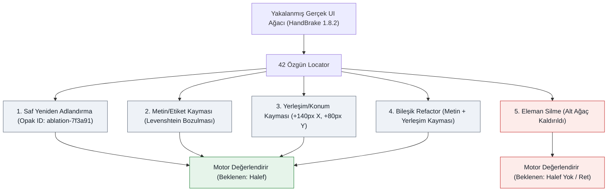

| Mutasyon Katmanı | Açıklama | Test Edilen Sinyal |
| :--- | :--- | :--- |
| **`RenamedAutomationId`** | AutomationId opak bir hash ile değiştirilir (`ablation-XXXXXXXX`). | Yapısal sinyaller aynı kalırken saf kimlik kurtarmayı ölçer. |
| **`NameDrift`** | AutomationId değiştirilir + `Name` bozulur (metin düzenleme/sonek). Yalnızca `Name` doluyken üretilir. | Metinsel etiket refactor'lerine toleransı ölçer (Levenshtein mesafesi). |
| **`PositionShift`** | AutomationId değiştirilir + `BoundingRectangle` kaydırılır ($+140\text{px}$ X, $+80\text{px}$ Y; $\sim 161\text{px}$ Öklid mesafesi). | UI yeniden biçimlendirme/boyutlandırma altında yerleşim duyarlılığını ölçer. |
| **`CompoundDrift`** | AutomationId değiştirilir + `Name` kayması ve konum kayması aynı anda uygulanır. | Birden fazla sinyalin birlikte bozulduğu bileşik refactor toleransını ölçer. |
| **`RemovedElement`** | Hedef kontrol ve tüm alt ağacı UI ağacından silinir. | Ret güvenliğini ölçer: motorun yakındaki komşuyu tahmin etmek yerine reddettiğini doğrular. |

> [!IMPORTANT]
> **Bilgi Sızıntısı Koruması:** Mutasyona uğramış kimlikler, tahmin edilebilir sonekler (`_ablated` gibi) yerine opak ve türetilemez sentetik ID'ler kullanır (`ablation-` + SHA-256 tohum hex'i). Bu, LLM kısa liste değerlendirmelerinin tamamen kör kalmasını ve senaryoların aday adlarına bakılarak çözülememesini sağlar.

---

### 3. Temel Bulgu: Skor Dağılımlarının Çakışması

Temel sezgisel motor (`SimilarityWeights.Default`, `MinimumConfidence = 0.50`) HandBrake 1.8.2 benchmark'ındaki 176 senaryonun tamamında koşturulduğunda mutasyon başına şu skor dağılımları gözlenir:

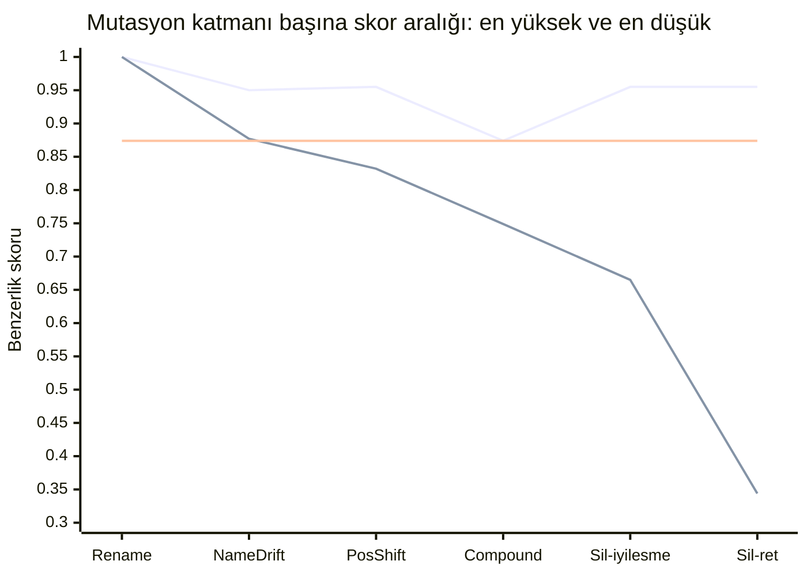

Üstteki çizgi her katmanın gözlenen **en yüksek**, alttaki **en düşük** skorudur; iki çizgi arasındaki boşluk o katmanın skorlarının gerçekte bulunduğu yerdir. Ortadaki yatay çizgi $0.874$'te durur — bu veri kümesinde gerçekten hayatta kalan bir elemanın ulaştığı en yüksek skor. `Sil-iyilesme` sütununda bu çizginin üzerinde kabul edilen her aday, en iyi gerçek halefi de dışarı atmadan hiçbir eşiğin eleyemeyeceği bir yanlış iyileştirmedir. `Sil-iyilesme` ve `Sil-ret` ikisi de `RemovedElement`'tir, motorun ne yaptığına göre ayrılmıştır — komşuyu kabul etti mi, yoksa doğru biçimde reddetti mi. `Rename` katmanında iki çizgi birleşir, çünkü o katmanın hiç yayılımı yoktur: 42 senaryonun tamamı tam olarak $1.000$ almıştır. Oradaki tek nokta bir çizim kusuru değil, ölçümün kendisidir.

**Grafiği dikey okuyun.** `Compound` katmanında bant $0.749-0.874$, `Sil-iyilesme` katmanında $0.665-0.955$ aralığında. Bu iki aralık aynı skorları kapsıyor; dolayısıyla bu grafiğin üzerine, gerçek halefler üstünde ve silinmiş elemanlar altında kalacak şekilde yatay bir eşik çizgisi çizilemez. Bu bölümün bulgusu tam olarak budur.

Hasarın nerede yoğunlaştığını sonuç dağılımı gösteriyor — yanlış iyileştirmeler yalnızca son iki katmanda görülüyor ve ağırlıklı olarak `RemovedElement`'te:

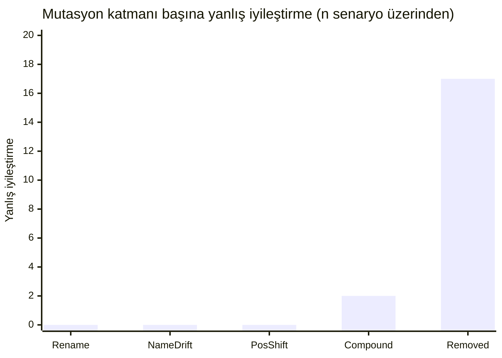

| Mutasyon Katmanı | Senaryo Sayısı ($n$) | Doğru İyileştirme / Ret | Yanlış İyileştirme | Kaçırılan (İnceleme) | Skor Aralığı | Ortalama Skor |
| :--- | :---: | :---: | :---: | :---: | :---: | :---: |
| **`RenamedAutomationId`** | 42 | 40 | 0 | 2 | $[1.000 - 1.000]$ | $1.000$ |
| **`NameDrift`** | 25 | 23 | 0 | 2 | $[0.877 - 0.950]$ | $0.901$ |
| **`PositionShift`** | 42 | 34 | 0 | 8 | $[0.832 - 0.955]$ | $0.867$ |
| **`CompoundDrift`** | 25 | 6 | 2 | 17 | $[0.749 - 0.874]$ | $0.790$ |
| **`RemovedElement`** | 42 | 25 | 17 | 0 | $[0.344 - 0.955]$ | $0.755$ |

#### Temel Çıkarım: Skorların Doğal Çakışması
- **Silinen elemanlardaki yanlış iyileştirmeler $0.665$ ile $0.955$ arasında skor alır**, çünkü yakındaki kardeş butonlar veya kapsayıcılar silinen elemanla aynı `ParentControlType`, kardeş yakınlığı ya da ekran koordinatlarını paylaşır.
- **Gerçekten bileşik kaymaya uğramış elemanlar $0.749$ ile $0.874$ arasında skor alır.**
- **Bu dağılımlar büyük ölçüde çakışır.** Dolayısıyla hiçbir statik matematiksel güven skoru, taşınmış/yeniden adlandırılmış bir kontrolü, komşusu yapısal olarak benzeyen silinmiş bir kontrolden tek başına ayırt edemez.

---

### 4. "Yanlış İyileştirme $\downarrow$ vs. Manuel İnceleme $\uparrow$" Dengesi

Skor dağılımları çakıştığı için, `MinimumConfidence` eşiğini değiştirmek otomatik iyileştirme kapsamı ile insan incelemesi yükü arasında ampirik bir denge üretir:

| `MinimumConfidence` | Kesinlik | Otomatik İyileştirme Kapsamı | Yanlış İyileştirme Oranı | Manuel İnceleme Oranı | Doğru İyileştirme | Yanlış İyileştirme (Halef) | Yanlış İyileştirme (Silinmiş) | Kaçırılan | Doğru Ret |
| :---: | :---: | :---: | :---: | :---: | :---: | :---: | :---: | :---: | :---: |
| **`0.50`** (Varsayılan) | $\%84.4$ | $\%76.9$ | $\%15.6$ | $\%30.7$ | 103 | 2 | 17 | 29 | 25 |
| **`0.60`** | $\%84.4$ | $\%76.9$ | $\%15.6$ | $\%30.7$ | 103 | 2 | 17 | 29 | 25 |
| **`0.70`** | $\%87.3$ | $\%76.9$ | $\%12.7$ | $\%33.0$ | 103 | 2 | 13 | 29 | 29 |
| **`0.75`** | $\%90.4$ | $\%76.9$ | $\%9.6$ | $\%35.2$ | 103 | 2 | 9 | 29 | 33 |
| **`0.80`** | $\%92.4$ | $\%72.4$ | $\%7.6$ | $\%40.3$ | 97 | 2 | 6 | 35 | 36 |
| **`0.85`** | $\%91.6$ | $\%64.9$ | $\%8.4$ | $\%46.0$ | 87 | 2 | 6 | 45 | 36 |
| **`0.90`** | $\%94.5$ | $\%38.8$ | $\%5.5$ | $\%68.8$ | 52 | 0 | 3 | 82 | 39 |
| **`0.95`** | $\%97.6$ | $\%30.6$ | $\%2.4$ | $\%76.1$ | 41 | 0 | 1 | 93 | 41 |

Aynı sweep eğriler halinde — kesinlik (üst çizgi), otomatik iyileştirme kapsamı (orta), yanlış iyileştirme oranı (alt). $0.90$'daki kapsam uçurumu ve bir türlü sıfırlanamayan yanlış iyileştirme tabanı, dengenin görünür hâlidir:

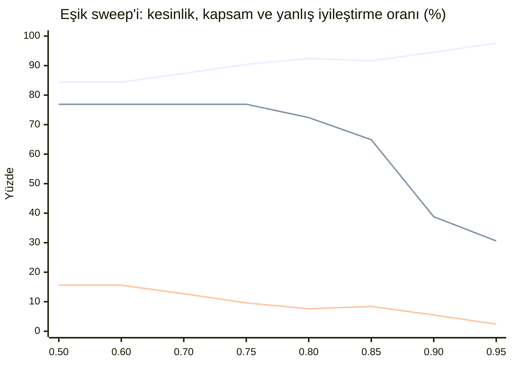

#### Denge Mekaniği:
1. **Agresif Otomatik İyileştirme (Eşik $= 0.50 - 0.70$):** Bileşik ve kaymış elemanları kabul ederek kapsamı en yükseğe çıkarır ($\%76.9$); bedeli silinmiş elemanlarda daha yüksek yanlış iyileştirme oranıdır ($\%12.7 - \%15.6$).
2. **Önerilen Çalışma Noktası, Garanti Değil (Eşik $= 0.75 - 0.80$):** HandBrake'te bu aralık yüksek kesinlik ($\%90.4 - \%92.4$) ve yüksek kapsam ($\%72.4 - \%76.9$) veriyor; silinmiş kontrollerdeki yanlış iyileştirmeleri yarıya indiriyor ($17 \rightarrow 6$). Bu **ürünün varsayılanı değildir** — `SimilarityWeights.MinimumConfidence` `0.50` olarak gelir. §8 ikinci bir uygulamayı (ShareX) aynı eşik aralığında ölçtü: yön tutuyor (eşiği yükseltmek her iki uygulamada da yanlış iyileştirmeyi azaltıyor) ama büyüklük taşınmıyor — aynı $0.75-0.80$ aralığı ShareX'te $\%20-\%23$ yanlış iyileştirme veriyor, HandBrake'in $\%7.6-\%9.6$'sına karşı. Bunu taşınabilir bir ayar değil, uygulama başına kalibre edilmesi gereken bir başlangıç noktası say.
3. **Katı Sıfır-Hata Politikası (Eşik $= 0.90 - 0.95$):** Yanlış iyileştirmeyi en aza indirir ($\%2.4 - \%5.5$) ve kesinliği en üste çıkarır ($\%97.6$), ancak ağır kaymış kontrolleri manuel incelemeye yönlendirir ($\%68.8 - \%76.1$).

> [!NOTE]
> **Neden Körlemesine 0.95 Seçilmemelidir:** Eşik $0.90$'dan $0.95$'e çıkarıldığında, son 2 yanlış iyileştirme elenir ($3 \rightarrow 1$), ancak bunun bedeli $11$ doğru iyileştirmenin feda edilmesidir ($52 \rightarrow 41$) ve geçerli locator'ların dörtte üçünden fazlası insan incelemesine yönlendirilir ($\%76.1$). Bu nedenle motor tek bir katı eşik dayatmaz; en uygun çalışma noktası ekibin yanlış pozitif toleransı ile manuel inceleme yükü arasındaki tercihe bağlıdır.

---

### 5. Çevrimdışı Yokluk Sinyali Araştırması (#95)

Silinen elemanlar ($[0.665 - 0.955]$) ile bileşik mutasyona uğrayıp hayatta kalan elemanlar ($[0.749 - 0.874]$) arasındaki skor çakışmasını aşmak amacıyla, herhangi bir yapısal sinyalin **yokluk dedektörü (absence detector)** olarak çalışıp çalışamayacağı 176 senaryonun aday vektörleri üzerinde sistematik olarak incelenmiştir:

#### Hipotez 1: İkinci Aday Marjı (Runner-Up Margin)
*Hipotez:* Bir eleman silindiğinde birden fazla komşu benzer skorlar alır ve marj daralır; hayatta kalan gerçek eleman ise arka plan adaylarından belirgin şekilde ayrışır.

*Deneysel Bulgular:*

| Marj Eşiği (`MinimumCandidateMargin`) | Bileşik Başarı (Recall, $n=25$) | Silinende Yanlış İyileştirme ($n=42$) | Toplam Kesinlik | Otomatik İyileştirme |
| :---: | :---: | :---: | :---: | :---: |
| **`0.00`** | $11 / 25$ ($\%44.0$) | $39 / 42$ ($\%92.9$) | $\%68.2$ | $\%88.1$ |
| **`0.05`** (Varsayılan) | $6 / 25$ ($\%24.0$) | $17 / 42$ ($\%40.5$) | $\%84.4$ | $\%76.9$ |
| **`0.08`** | $2 / 25$ ($\%8.0$) | $11 / 42$ ($\%26.2$) | $\%87.3$ | $\%66.4$ |
| **`0.10`** | $2 / 25$ ($\%8.0$) | $7 / 42$ ($\%16.7$) | $\%89.5$ | $\%57.5$ |
| **`0.15`** | $2 / 25$ ($\%8.0$) | $4 / 42$ ($\%9.5$) | $\%92.9$ | $\%38.8$ |
| **`0.20`** | $0 / 25$ ($\%0.0$) | $2 / 42$ ($\%4.8$) | $\%94.6$ | $\%26.1$ |

İki eğri birlikte düşüyor — olumsuz sonucun görünür hâli (üst çizgi: silinen elemanlarda yanlış iyileştirme, alt çizgi: bileşik başarı). Marjı yükseltmek aralarındaki makası hiç açmıyor:

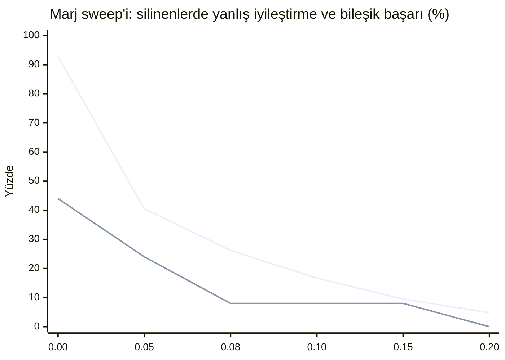

*Sonuç:* **Olumsuz.** Marj filtresi güven eşiği ile aynı denge eğrisini gösterir. Marj $0.05$'ten $0.10$'a çıkarıldığında silinen elemanlardaki hata $17$'den $7$'ye düşer, ancak bileşik mutasyondaki doğru iyileştirme $\%67$ oranında çöker ($6 \rightarrow 2$). Marj $0.20$ yapıldığında bileşik başarı sıfırlanır, ancak silinmiş 2 eleman komşuları izole olduğu için hala yanlış eşleşir.

#### Hipotez 2: Katı Kontrol Türü Filtresi (`ControlTypeScore == 1.0`)
*Hipotez:* Tam tür eşleşmesi zorunlu tutularak farklı türdeki hatalı eşleşmeler (Edit $\rightarrow$ StatusBar) engellenir.
*Deneysel Bulgular:* Farklı türdeki 6 hatalı eşleşme elenir ($17 \rightarrow 11$), ancak aynı türdeki 11 yanlış eşleşme (ComboBox $\rightarrow$ ComboBox, Button $\rightarrow$ Button) $0.955$'e varan skorlarla hayatta kalır.

#### Hipotez 3: Aday Küme Yoğunluğu (Cluster Density)
*Hipotez:* Silinen elemanlar çok sayıda birbirine yakın skorlu aday kümesi üretir, gerçek elemanlarda ise küme seyrektir.
*Deneysel Bulgular:* En iyi adayın $0.10$ puan yakınındaki ortalama aday sayısı:
- **Silinen Elemanlar (Yanlış İyileştirmeler):** $1.71$
- **Bileşik Mutasyon (Gerçek Elemanlar):** $3.08$
*Sonuç:* **Olumsuz (Ters yönde).** Gerçek eleman taşındığında yeni konumundaki komşularla da yarışır, bu nedenle küme yoğunluğu silinen elemanlardan daha yüksektir.

#### Hipotez 4: Birleşik Filtre (Katı ControlType + Marj $\ge 0.08$)

Sinyaller tek tek başarısız olduğu için akla gelen ilk soru bunların birleşip birleşmediğidir: kazanan adayın hem beklenen `ControlType` ile birebir eşleşmesi **hem de** ikinci adayı belirgin bir marjla geçmesi şartı.

*Sonuç:* **Olumsuz.** İki filtre büyük ölçüde aynı vakaları eliyor. Silinen kontrollerdeki aynı tipten yanlış eşleşmeler `ControlType` kapısını tanımı gereği geçiyor; bunların marj kapısını da geçenleri ise tam olarak birleşimin yakalaması beklenen "kendinden emin görünen sahte adaylar" oluyor. Bu sırada bileşik mutasyon geri çağırımı daha da düşüyor, çünkü gerçekten taşınmış bir eleman indiği yerdeki komşularıyla yarışır ve onları nadiren geniş bir marjla geçer.

#### Resmi Çıkarım
> [!IMPORTANT]
> **Tekil hedef odaklı hiçbir sezgisel sinyal bir yokluk dedektörü oluşturamaz.** Silinen bir kontrolün kapsayıcısındaki komşu eleman, yapısal olarak yeni bir konuma taşınmış gerçek bir kontrolden farksız görünür. Bu bulgunun **söylemediği** şey ise çözümün ne olduğudur. Tüm ağacın birlikte çözülmesi — locator'ları tek tek değil, elemanların birbiriyle yarıştığı ortak bir atamayla eşleştirmek — akla gelen bir sonraki hipotezdir ve henüz sınanmamıştır. #98 altında izlenmektedir; herhangi bir uygulama önerilmeden önce bu veri seti üzerinde ön testten geçirilecektir.

---

### 6. Çoklu LLM Konsensüsü ile Yokluk Tespiti (#97)

> [!IMPORTANT]
> **2026-08-16 tarihinde ölçüldü**, [31959334927](https://github.com/mustafasercansak/automation-sandbox/actions/runs/31959334927) numaralı koşuda. Sonuç §4'te. Konsensüs, bu projede bantları ayırabilen **ilk** sinyaldir — ve buna rağmen kabul kapısı olarak güvenli değildir; üstelik sebebi hipotezin öngördüğü şey değildir.

Sezgisel sinyaller geometri ve hiyerarşi benzerliğiyle sınırlıyken, çoklu sağlayıcı konsensüsü ($\ge 2$ bağımsız model oyu) temelde farklı bir soru sorar: *bağımsız akıl yürütücüler aynı hedefte uzlaşıyor mu yoksa dağılıyor mu?*

#### 1. Temel Hipotez
- **Bileşik Mutasyonda (`CompoundDrift` - Yaşayan Eleman):** Kontrol rolleri ve kullanım bağlamı üzerine anlamsal akıl yürütme, modellerin gerçek ardıl üzerinde uzlaşmasını sağlayarak heuristik eşiklerin kaçırdığı durumları kurtarabilir.
- **Silinen Elemanda (`RemovedElement` - Silinme):** Ağaçta gerçek bir ardıl bulunmadığı için bağımsız modellerin odaklanacağı bir zemin yoktur. Modellerin ya `null` dönmesi (reddetme) ya da farklı komşulara dağılması (`NoConsensus` $\rightarrow$ güvenli ret) beklenir.
- **Kritik Hata Sınırı:** Eğer bağımsız iki model aynı belirgin yanlış komşu (ör. araç çubuğundaki yan buton) üzerinde uzlaşırsa, konsensüs silinen bir elemanda yanlış iyileştirmeyi kabul eder.

#### 2. Sızıntı Önleme: Tekdüze Opak AutomationId Dönüşümü
#94'te bayat `expected.AutomationId` gizlenerek sızıntı engellenmişti. #97'de ise ters yönde bir sızıntı giderildi: ablasyon senaryolarında yalnızca hedef elemanın ID'si opak bir hash'e (`ablation-XXXXXXXX`) dönüştürülüp diğer adaylar doğal isimlerini korursa, modeller yapısal muhakeme yapmadan sırf "diğerlerinden farklı görünen tek ID" olduğu için doğru cevabı seçebilir.

Ürün kodunun prompt davranışına dokunmadan bu sızıntıyı kapatmak amacıyla, `LocatorAblationGenerator.ApplyMutation` mutasyonlu ağaçtaki *tüm* aday `AutomationId` değerlerini aynı `ablation-XXXXXXXX` biçiminde tekdüze şekilde anonimleştirir. Böylece her aday aynı önek, uzunluk ve karakter kümesine sahip olur.

> [!NOTE]
> **Üretim Sadakati ve Alt Sınır:** Bu ablasyon veri setinde hiçbir `AutomationId` anlamsal olarak bilgilendirici değildir (tüm aday tanımlayıcılar tekdüze sentetik hash'lerdir), oysa üretim ortamında `btnSaveDocument` gibi açıklayıcı adlar modele güçlü ipuçları sunar; dolayısıyla LLM kolunun buradaki ölçüm skoru, üretimdeki gerçek performansının bir **alt sınırı (lower bound)** sayılmalıdır.

#### 3. Ampirik Metodoloji ve Belirsizlik Notları
- **Tek Örnek (Single-Sample) Belirsizliği:** Deterministik heuristik testlerin aksine, LLM ölçümleri stokastik ampirik örneklerdir. 42 silinme senaryosundaki tek bir koşu yaklaşık $\pm \%14$ istatistiksel belirsizlik taşır.
- **Denetlenebilirlik:** Sıcaklık $0$ olarak sabitlenmeli, sağlayıcı bazlı ham oylar ve uzlaşma telemetrisi (`AgreedProviders`, `ProviderAttempts`, `ProviderErrors`) eksiksiz kaydedilmelidir.
- **Maliyet Kontrolü:** Token maliyetini sınırlamak için ölçüm 25 `CompoundDrift` ve 42 `RemovedElement` ($n=67$) senaryosu üzerinde hedeflenir.

#### 4. Ampirik Sonuç

2026-08-16 ile 2026-08-18 arasında dört bağımsız koşu; sağlayıcı havuzu 3 yapılandırılmış sağlayıcıdan 7'ye genişletildi ve Groq'un modeli iki kez değiştirildi (kaldırılmış bir model, sonra güvenilmez bir model, sonra çalışan bir model — #126). Her koşu aynı 25 `CompoundDrift` + 42 `RemovedElement` senaryosunu hedefliyor; bir senaryo yalnızca en az iki sağlayıcı cevap verdiğinde **kullanılabilir** sayılıyor (#109), çünkü tek görüş ne uzlaşabilir ne de çelişebilir.

| Koşu | Tarih | Kullanılabilir ($n$) | `CompoundDrift` oybirliği | `RemovedElement` oybirliği |
| :--- | :--- | ---: | :--- | :--- |
| [31959334927](https://github.com/mustafasercansak/automation-sandbox/actions/runs/31959334927) | 08-16 | 19 | 6 / 7 | 3 / 12 |
| [31961463762](https://github.com/mustafasercansak/automation-sandbox/actions/runs/31961463762) | 08-16 | 39 | 16 / 17 | 10 / 22 |
| [31963741937](https://github.com/mustafasercansak/automation-sandbox/actions/runs/31963741937) | 08-16 | 33 | 14 / 14 | 11 / 19 |
| [32163961433](https://github.com/mustafasercansak/automation-sandbox/actions/runs/32163961433) | 08-18 | 42 | 16 / 17 | 10 / 25 |
| **Toplam** | | **133** | **52 / 55** | **34 / 78** |

Her koşunun kendi hataları kendi iş akışı kaydında duruyor: ücretsiz katman günlük kota tükenmesi (Gemini, Groq), ücretli plan gerektiren bir model (Ollama Cloud, havuzdan düşürüldü — #119), ve en son koşuda üç sağlayıcıda 15 saniyelik tek-deneme tavanını aşan istekler (#129, bu yazı itibarıyla çözülmedi). Bu gürültünün hiçbiri aşağıdaki ölçümü etkilemiyor — yalnızca $n$'i küçültüyor.

**Toplu ölçüm.** Uzlaşma, elemanın hayatta kalmasıyla birlikte hareket ediyor: gerçek bir halefin bulunduğu senaryoların **%94.5**'inde ($52/55$), elemanın silindiği senaryoların ise **%43.6**'sında ($34/78$) sağlayıcılar oybirliğine ulaştı. §5'teki dört sezgisel hipotezin hiçbiri bantları ayıramamıştı; dolayısıyla bu, projede herhangi bir ayrışma üreten tek mekanizma olmaya devam ediyor.

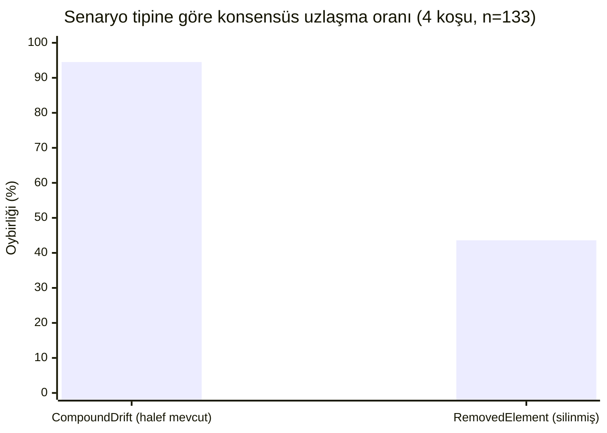

> [!WARNING]
> **Oybirliği güvenli bir kapı değildir, ve tek koşunun gösterdiğinden daha kötüdür.** Hayatta kalan bir eleman üzerindeki 52 oybirliği kararının 52'si de doğruydu. Silinmiş bir eleman üzerindeki 34 oybirliği kararının 34'ü de yanlış iyileştirmeydi — **dört farklı sağlayıcı kümesiyle yapılan dört koşuda, iki yönde de sıfır istisna.** Bu bölümün önceki bir sürümü tek başına 31959334927 koşusundan "%33" bildirmişti; o sayı iki mutasyon tipini tek paydada topluyordu ($9$ toplam oybirliği kararının $3$'ü yanlış), ve bu, silinmiş-eleman oranını ilgisiz ve güvenilir biçimde doğru olan bileşik-kayma popülasyonuyla karıştırarak düşük gösteriyordu. Tipe göre okununca silinmiş-eleman oranı $\%100$'dür: uzlaşma, bir yokluk konusunda bir kez bile tesadüfen doğru çıkmadı.

#### 5. Mekanizma Yokluğu Tanımak Değil, Anlaşmazlıktır

Hipotez, silinmiş bir elemanda iki güvenli sonuç öngörüyordu: sağlayıcılar ya "yok" der ya da dağılır. **"Yok" deme neredeyse hiç gerçekleşmiyor.** Dört koşudaki 78 kullanılabilir `RemovedElement` senaryosunun tamamında `AllDeclined` yalnızca **bir** kez oluştu. Cevap veren her diğer sağlayıcı belirli — ve yanlış — bir adayı işaret etti.

Dört koşu boyunca her doğru red, sağlayıcıların *birbiriyle anlaşamamasından* doğdu; herhangi bir sağlayıcının elemanın gittiğini fark etmesinden değil. Modeller kontrolün silindiğini bilmiyor; her biri güvenle farklı bir komşuyu işaret ediyor, motor da oylar tutmadığı için iyileştirmeyi yalnızca bu yüzden reddediyor.

**Sağlayıcı havuzunu genişletmek bu mekanizmayı kurtarmadı — sınırını daha net gösterdi.** 31961463762 koşusu 10 yanlış oybirliği kararı kaydetti; bunların 7'sinde **üç** bağımsız kaynaklı model ailesi aynı anda var olmayan aynı elemanda buluştu — Cloudflare (Qwen), Mistral ve OpenRouter (gpt-oss). Üç ayrı satıcı, üç ayrı mimari, tek yanlış cevap, oybirliğiyle. Bu dört koşu boyunca 3 yapılandırılmış sağlayıcıdan 7'ye çıkmak, silinmiş-eleman oybirliği oranını (%25 → %45 → %58 → %40, düşen bir eğilim yok) ya da doğruluğunu (baştan sona %100 yanlış) düşürmedi.

Bu, sonucun ne kadar genellenebileceğini belirliyor:

- Koruma **bağımsızlığın yan ürünüdür**, ama dört koşunun toplamı bağımsızlığın tek başına §5'in ilk öngördüğü şekilde hata oranını sınırlamadığını gösteriyor — gerçekten bağımsız, yetkin bir akıl yürütücü, silinmiş bir kontrolün hayatta kalan komşusunu yeterince sık ikna edici buluyor; daha fazla bağımsız akıl yürütücü eklemek berabere durumu bozacağının garantisi değil.
- Daha yüksek güven eşiği istemekle güçlendirilemez, çünkü hata veren vakalar zaten güvenlidir. Bu veride sağlayıcı eklemenin de güçlendirdiğine dair bir kanıt yok.
- Neredeyse hiç "yok" demeyen bir sağlayıcı tek başına yokluk tespitine katkı sunmaz. Oyu, ancak başka bir sağlayıcının çelişebileceği bir şey olarak değerlidir — ve yukarıdaki paragrafa göre o çelişkiye de güvenilemez.

> [!IMPORTANT]
> **Resmi çıkarım, dört koşu üzerinden gözden geçirildi ($n=133$, 2026-08-16 – 2026-08-18).** Çoklu sağlayıcı konsensüsü, §5'teki her sezgisel sinyalin başarısız olduğu yerde hayatta kalan elemanları silinmiş olanlardan ayırır (%94.5'e karşı %43.6 oybirliği uzlaşması). Kabul kapısı olarak yeterli değildir: dört koşunun tamamında silinmiş bir eleman üzerindeki **her** oybirliği kararı (34'te 34) yanlış iyileştirmeydi, üç bağımsız kaynaklı model ailesinin anlaştığı vakalar dahil. Ayrışma, herhangi bir modelin yokluğu tespit etmesinden değil sağlayıcılar arasındaki anlaşmazlıktan doğuyor — ve sağlayıcı havuzunu 3 yapılandırılmış sağlayıcıdan 7'ye genişletmek bu hata oranını düşürmedi. Daha fazla sağlayıcı eklemenin bunu düzelteceği varsayılmamalı; bu veri o varsayımın aleyhinedir.

---

### 7. Bütün Ağaç Uzlaştırması: Çevrimdışı Prob (#98)

§5'in ve §6'nın bulgusu aynı yapısal boşluğu işaret ediyor: şimdiye kadar ölçülen her mekanizma lokatörleri tek tek, birbirinden habersiz çözüyor. #98, bunu düzeltmeyi önermeden önce daha dar bir soru sordu: heuristik silinmiş bir elemanı yanlışlıkla bir komşuya iyileştirdiğinde, o komşu genellikle *başka bir lokatörün gerçek kimliği* mi — sayfadaki tüm lokatörleri aynı anda çözen ortak bir çözücünün "zaten talep edildi" diye tanıyıp silinen elemana da vermeyi reddedebileceği bir şey mi?

**Prob, mevcut 42 `RemovedElement` senaryosuna karşı varsayılan ağırlıklarla koşturuldu (bu adım için yeni bir mutasyon türü gerekmedi).** 17 yanlış iyileştirmenin **10'u (%59), ağacın diğer 41 özgün locator'ından birinin gerçek kimliği olan bir komşuyu işaret etti** — bu, yapısal parmak iziyle geri kazanıldı, çünkü `RemovedElement`'in AutomationId'yi opaklaştıran mutasyonu, adayların normalde eşleştiği kimliği yok ediyor.

| Silinen locator | Yanlışlıkla eşleştiği | Karşılıklı mı? |
| :--- | :--- | :---: |
| `Minimize-Restore` | `Maximize-Restore` | ✓ |
| `Maximize-Restore` | `Minimize-Restore` | ✓ |
| `Close` | `Maximize-Restore` | |
| `ShowQueue` | `Preview` | |
| `tabControl` | `sourceSelection` | ✓ |
| `sourceSelection` | `tabControl` | ✓ |
| `summaryTab` | `pictureTab` | |
| `chaptersTab` | `subtitlesTab` | |
| `Destination` | `statusBar` | ✓ |
| `statusBar` | `Destination` | ✓ |

Bunların üçü **karşılıklı çift**: iki elemandan hangisi silinirse silinsin, heuristik onu diğerine iyileştiriyor, iki yönde de. `Minimize-Restore` ile `Maximize-Restore` birbirinin en yüksek skorlu yem adayı; `Destination`/`statusBar` ve `tabControl`/`sourceSelection` de öyle. Bu, tam olarak ikili eşleştirmenin (bipartite assignment) çözmek için tasarlandığı şekil — iki locator da aynı ortak çözüme dahil edilirse, paylaşılan slotu en fazla biri talep edebilir, ve kaybeden için eşleşecek başka bir şey kalmaz — bu da mevcut tek-locator skorlayıcısının üretemediği "gitti" sinyalinin ta kendisi.

Kalan 17'de 7'si, başka hiçbir locator'ın da istemediği izlenmeyen ya da tesadüfi elemanları işaret etti (adsız bir kapsayıcı, hiçbir testin dayanmadığı bir araç çubuğu elemanı gibi). Ortak bir çözücünün orada kullanabileceği bir şey yok — bu veri kümesindeki tavanı %59 ile sınırlı, 17'nin tamamıyla değil.

> [!NOTE]
> **Bu sayıyı dürüstçe okumak.** %59, orijinal issue'nun adlandırdığı sonraki adımı — birden fazla locator'ın birlikte kırıldığı senaryolar kurmayı, ki bu aynı zamanda daha gerçekçi bozulma biçimi — haklı çıkaracak kadar olumluydu, fakat mekanizmanın çalıştığına dair kanıt değildi. İlk tek-mutasyonlu veri kümesi ortak atamayı doğrudan test edemiyordu: senaryo başına yalnızca bir locator kırıldığından çözücünün kullanabileceği gerçek bir çakışma yoktu. §9 artık bu multi-locator baseline'ını sağlıyor; öngörülen çakışmanın varlığını doğruluyor, fakat eşleştirme tabanlı bir çözücü kurmadan bilinçli olarak duruyor.

---

### 8. İkinci Bir Uygulama: ShareX v21.0.0 (#99, #134)

§3–§7'deki her sayı tek bir WPF ağacından geliyor. #99 bunu bir yayınlama ön koşulu olarak adlandırmıştı: tek bir uygulama, "heuristik böyle davranıyor" ile "HandBrake'in kendine özgü yapısı böyle davranıyor"u birbirinden ayıramaz. Bu bölüm aynı işlem hattını — aynı jeneratör, aynı harness, aynı varsayılan ağırlıklar — gerçek bir WinForms uygulamasına, ShareX v21.0.0'a karşı koşturuyor; [survey koşusu 32280934910](https://github.com/mustafasercansak/automation-sandbox/actions/runs/32280934910) ile yakalandı. 29 özgün locator, 131 senaryo.

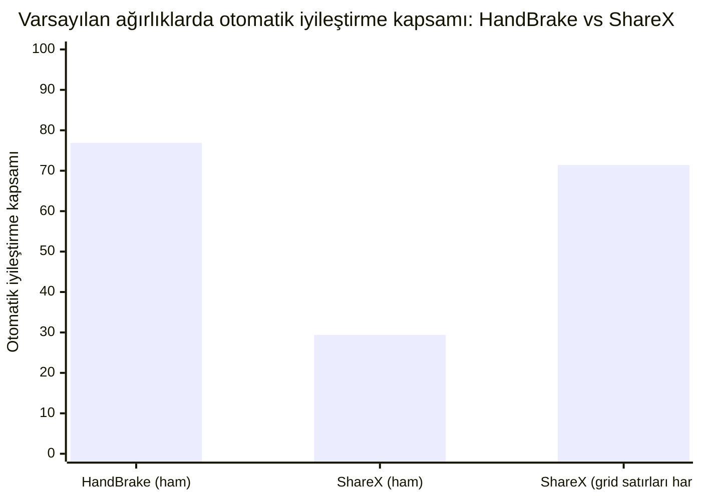

**Ham sayı endişe verici görünüyor, ve kısmen bir yapı yapaylığı.** Varsayılan ağırlıklarda ShareX'in otomatik iyileştirme kapsamı %29.4, HandBrake'in %76.9'una karşı — büyük bir fark. ShareX'in 29 özgün locator'ının 15'i (%52) bir Kısayol Tuşları (Hotkeys) ayar ızgarasının `DataItem` satırları (`Hotkey Row 1`, `Description Row 2`, ...). HandBrake'in fixture'ında bu türden hiçbir eleman yok. Bu satırların her biri kardeşlerine yapısal olarak neredeyse özdeş — aynı `ControlType`, aynı eksik `ClassName`, konum yalnızca satır numarasıyla farklılaşıyor — bu yüzden motor, en iyi aday tam `1.000` skor alsa bile bunları `Ambiguous` diye reddediyor. Bu bir kusur değil, doğru davranış: #78 zaten `DataGrid`/`DataItem`'ı doğası gereği oynak bir locator sınıfı olarak adlandırmıştı. İçeride bırakılırsa, bunlar heuristik'in genel kalitesini değil, tek bir ızgaranın yoğunluğunu ölçer.

**Adil karşılaştırma bunları hariç tutar.** Izgara satırları çıkarılınca (14 özgün locator, 56 senaryo), kapsam HandBrake'e yakınsıyor: %71.4'e karşı %76.9. Ama bu benchmark'ın var olma sebebi olan sayı yakınsamıyor:

| Uygulama | Silinen elemanlarda yanlış iyileştirme oranı | $n$ |
| :--- | ---: | ---: |
| HandBrake | %40.5 | 17/42 |
| ShareX (grid satırları hariç) | **%57.1** | 8/14 |

İkinci gerçek bir uygulama, yanlış iyileştirme sorununu HandBrake'e özgü bir tuhaflık gibi göstermiyor. Daha kötü gösteriyor.

| Metrik (varsayılan ağırlıklar, grid satırları hariç) | HandBrake | ShareX |
| :--- | ---: | ---: |
| Kesinlik | %84.4 | %73.2 |
| Otomatik iyileştirme kapsamı | %76.9 | %71.4 |
| Yanlış iyileştirme oranı | %15.6 | %26.8 |
| Manuel inceleme oranı | %30.7 | %26.8 |

> [!IMPORTANT]
> **Resmi çıkarım.** İkinci bir uygulama, bu projenin çözmeye çalıştığı sorunun şeklini değiştirmiyor, ve onu iyileştirmiyor. Karıştırıcı bir UI örüntüsü (ilk uygulamada bulunmayan, yoğun yapısal olarak özdeş grid satırları) kontrol altına alındığında kapsam kabaca karşılaştırılabilir hale geliyor. Kesinlik ve yanlış iyileştirme oranının ikisi de ShareX'te belirgin şekilde daha kötü. Ne HandBrake'in sayıları ne de ShareX'inki bu motorun "gerçek" doğruluğu olarak okunmamalı — bunlar bir aralığı sınırlayan iki veri noktası, ve aralık geniş: gönderilen varsayılanda, herhangi bir LLM konsensüsü uygulanmadan önce, silinmiş elemanlarda %40.5–%57.1 yanlış iyileştirme. Doğrulama testleri: \`ShareXAblationTests\` (\`ShareXFixture_DefaultWeights_MatchesTheCommittedBaseline\`, \`ShareXFixture_MostMissedPerfectScoreRenames_AreDataGridRows\`, \`ShareXFixture_ExcludingDataGridRows_FalseHealOnRemovedRateIsWorseThanHandBrakes\`).

---

### 9. Multi-Locator Baseline: Gerçek Çakışma Var (#132)

v2 ablasyon veri kümesi artık tek bir ortak ağaç üzerinde iki veya daha fazla locator mutasyonunu, her locator için ayrı mutasyon tarifi ve ground truth ile tanımlayabiliyor. `RunMultiLocatorBaseline` ortak mutasyonu bir kez uyguluyor, ardından mevcut tek-locator heuristiğini her beklenen locator için bağımsız çalıştırıyor. Ortak eşleştirme uygulamıyor ve `SelfHealingResolver`'ı değiştirmiyor; ilerideki herhangi bir batch tasarımının iyileştirmesi gereken baseline budur.

Gönderilen varsayılan ağırlıklarla yedi HandBrake senaryosu ölçüldü:

- Altı iki-locator senaryosu §7'deki üç karşılıklı çiftin iki yönünü de kapsıyor. Her birinde bir locator siliniyor, karşılığı yeniden adlandırılıyor; böylece kayıtlı iki locator da gerçekten kırılırken karşı locator'ın yapısal kimliği hayatta kalıyor.
- Bir dört-locator senaryosu yeniden adlandırma, isim kayması, konum kayması ve silmeyi karıştırıyor; veri kümesinin yalnızca özel hazırlanmış yeniden-adlandırma/silme çiftlerine bağlı olmadığını gösteriyor.
- Sonuç, 7 ortak ağaç üzerinde 16 locator çözümü.

| Baseline gözlemi | Sonuç |
| :--- | ---: |
| Ortak-ağaç senaryosu | 7 |
| Locator çözümü | 16 |
| İki locator'ın aynı adayı talep ettiği senaryo | **6 / 7** |
| Hayatta kalan locator'ın doğru halefini talep eden silinmiş-locator yanlış iyileştirmesi | **6 / 6 karşılıklı yön** |

Hedeflenen altı vaka eksiksiz tekrarlandı. Örneğin `Minimize-Restore` silinip `Maximize-Restore` yeniden adlandırıldığında mevcut çözücü, kayıtlı iki locator'a da yeniden adlandırılmış `Maximize-Restore` elemanını veriyor: hayatta kalan locator $1.000$, silinen locator ise aynı elemanı $0.874$ ile kabul ediyor. Aynı çakışma ters yönde ve `Destination`/`statusBar` (silinen locator için $0.690$) ile `tabControl`/`sourceSelection` ($0.665$) çiftlerinde de oluşuyor.

> [!IMPORTANT]
> **Resmi çıkarım.** Olumlu %59 çevrimdışı probu, yalıtılmış mutasyonlara geriye dönük bakmanın bir yapaylığı değildi: altı karşılıklı yönün tamamı, iki locator aynı ağaçta kırıldığında gerçek aday çakışması üretiyor. Bu, ortak atama algoritmasını ayrı bir işte değerlendirmek için kanıt ön koşulunu karşılıyor. Böyle bir algoritmanın kaybeden locator'ı güvenle reddedeceğini **göstermiyor**; bu değişiklikte ortak çözücü yok ve yedinci karışık senaryoda silinen `Close` hâlâ kimsenin talep etmediği tesadüfi bir elemana yanlış iyileştiriliyor. Regresyon koruması: `LocatorAblationTests.HandBrakeFixture_MultiLocatorBaseline_ReproducesReciprocalPairContention`.

