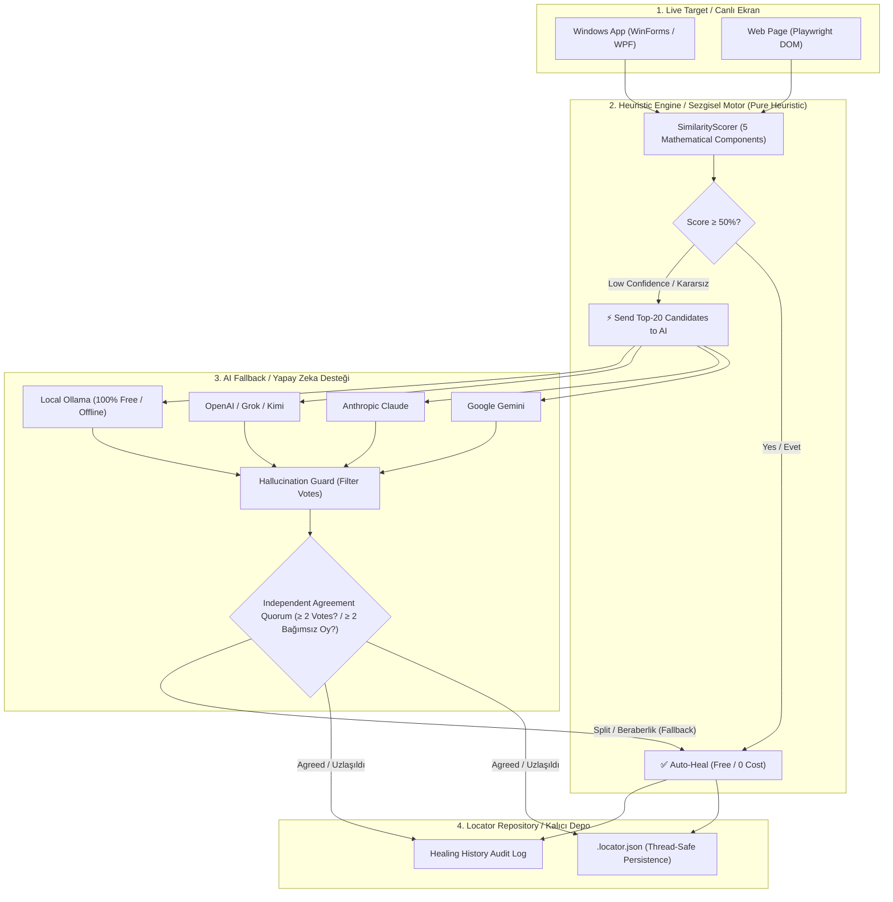

# 🚀 Automation Sandbox Documentation / Dökümantasyon

Welcome to **Automation Sandbox**! / **Automation Sandbox** projesine hoş geldiniz!

> 💡 **Select Language / Dil Seçin:**
> - [🇬🇧 English Documentation](#-english-overview)
> - [🇹🇷 Türkçe Dökümantasyon](#-türkçe-genel-bakış)

---

## 🇬🇧 English Overview

### 💡 What is Automation Sandbox? (Simple Explanation)
Imagine you write an automated test that clicks a button called `"Submit"`. One day, the developers rename that button to `"Complete Registration"`. Standard test tools (like Selenium or Appium) will crash because they can no longer find `"Submit"`.

**Automation Sandbox is like a smart GPS for your software tests:**
1. It remembers what the button looked like (size, location, parent window, role).
2. When the ID or name breaks, it calculates a **similarity score** ($0\% - 100\%$) across all elements on the screen.
3. If it is confident ($\ge 50\%$), it automatically picks the right element and heals your test **without any AI cost** (pure heuristic, sub-50ms for 3,000 controls on developer hardware).
4. If it is unsure, it collects independent votes from providers such as Gemini, Claude, OpenAI, or local Ollama; an LLM pick is permitted when at least two votes name the same candidate. This agreement is not a correctness guarantee: all 34 unanimous deleted-element verdicts in the measured runs were false heals.

---

### 📚 Documentation Index

| Guide | Description |
| :--- | :--- |
| 🚀 [**Getting Started**](getting-started.md) | Step-by-step installation, core concepts, and copy-paste code examples. |
| 💻 [**Desktop Automation**](desktop-automation.md) | How to test Windows desktop applications (WinForms, WPF, WinUI). |
| 🌐 [**Web Automation**](web-automation.md) | How to test Web applications with Playwright (Shadow DOM & iframe support). |
| 🎯 [**Intent-Aware Healing**](intent-aware-healing.md) | Using `TestIntent` to explain *why* a test step is being performed. |
| 📊 [**Healing Reports & Dashboard**](healing-reports.md) | JSON and HTML telemetry for accepted, declined, and failed locator-resolution attempts. |
| 🧭 [**Intent-Driven Automation**](intent-driven-automation.md) | M6: intent planning (deterministic + LLM-backed), DOM/desktop matching, locator recording, Playwright/FlaUI test generation, intent flow reports, pipeline orchestration, and live page exploration. |
| 🔬 [**Benchmark & Calibration**](benchmark-calibration.md) | Multi-signal locator ablation benchmark on real organic apps, score overlap findings, and threshold trade-off analysis. |
| 🔗 [**Joint Locator Reconciliation**](joint-locator-reconciliation.md) | Opt-in batch ownership guard for independently accepted locator heals, including deterministic assignment and limitations. |
| 🤖 [**LLM Providers**](llm-providers.md) | Setting up AI providers (Gemini, Claude, OpenAI, and 100% free local Ollama). |
| 🔐 [**LLM Security Model**](llm-security-model.md) | Trust boundaries, disclosed fields, prompt-injection and PII limitations, provider retention, and local report handling. |
| 📄 [**JSON Schema Reference**](json-schema.md) | Field-by-field breakdown of the `.locator.json` repository file. |
| 📦 [**NuGet Packaging**](nuget-packaging.md) | Creating preview `.nupkg` artifacts and preparing a publish checklist. |

---

## 🇹🇷 Türkçe Genel Bakış

### 💡 Automation Sandbox Nedir? (En Basit Anlatım)
Yazılım testinizde `"Kaydet"` adlı bir butona tıklayan otomatik bir test yazdığınızı hayal edin. Bir gün yazılımcılar bu butonun adını `"Değişiklikleri Onayla"` olarak değiştirdi. Standart test araçları (Selenium, Appium vb.) eski butonu bulamadığı için test **hata verir ve çöker**.

**Automation Sandbox, testleriniz için akıllı bir navigasyon (GPS) gibidir:**
1. Butonun eski halini (boyutunu, ekrandaki yerini, penceresini, türünü) hafızasına kaydeder.
2. Adı veya ID'si değiştiğinde, ekrandaki tüm elemanları inceleyerek bir **benzerlik skoru** ($\%0 - \%100$) hesaplar.
3. Eminse ($\ge \%50$), doğru butonu otomatik bulur ve testinizi **yapay zeka maliyeti olmadan** iyileştirir (heal eder) — saf sezgisel; geliştirici donanımında 3.000 kontrol için 50 milisaniyenin altında.
4. Kararsız kalırsa Gemini, Claude, OpenAI veya yerel Ollama gibi sağlayıcılardan bağımsız oylar toplar; en az iki oy aynı adayı gösterirse LLM seçimine izin verir. Bu uzlaşma bir doğruluk garantisi değildir: silinmiş eleman ölçümlerindeki 34 oybirliği kararının tamamı yanlış iyileştirmeydi.

---

### 📚 Döküman Haritası

| Rehber | Açıklama |
| :--- | :--- |
| 🚀 [**Başlangıç Rehberi**](getting-started.md) | Adım adım kurulum, temel mantık ve kopyala-yapıştır kod örnekleri. |
| 💻 [**Masaüstü Testleri**](desktop-automation.md) | Windows masaüstü (WinForms, WPF) uygulamalarını test etme. |
| 🌐 [**Web Testleri**](web-automation.md) | Playwright ile web sitelerini test etme (Shadow DOM ve iframe dahil). |
| 🎯 [**Intent-Aware Healing**](intent-aware-healing.md) | `TestIntent` ile test adımının amacını yapay zekaya anlatma. |
| 📊 [**İyileştirme Raporları & Panel**](healing-reports.md) | Kabul edilen, reddedilen ve başarısız locator çözüm denemeleri için JSON ve HTML telemetrisi. |
| 🧭 [**Intent Tabanlı Otomasyon**](intent-driven-automation.md) | M6: intent planlama (deterministic + LLM destekli), DOM/masaüstü eşleştirme, locator kaydı, Playwright/FlaUI test üretimi, intent raporu, pipeline orkestrasyonu ve canlı sayfa keşfi. |
| 🔬 [**Benchmark ve Kalibrasyon**](benchmark-calibration.md) | Gerçek uygulamalarda çoklu sinyal ablasyon testi, skor çakışması bulguları ve eşik denge analizi. |
| 🔗 [**Birleşik Locator Uzlaştırması**](joint-locator-reconciliation.md) | Bağımsız kabul edilen locator iyileştirmeleri için deterministik, isteğe bağlı batch sahiplik koruması ve sınırları. |
| 🤖 [**Yapay Zeka Kurulumu**](llm-providers.md) | Gemini, Claude, OpenAI ve 0 TL maliyetli yerel Ollama kurulumu. |
| 🔐 [**LLM Güvenlik Modeli**](llm-security-model.md) | Güven sınırları, açıklanan alanlar, prompt injection ve PII sınırları, sağlayıcı retention ve yerel rapor güvenliği. |
| 📄 [**JSON Şema Rehberi**](json-schema.md) | `.locator.json` kayıt dosyasının alan alan detaylı açıklaması. |
| 📦 [**NuGet Paketleme**](nuget-packaging.md) | Preview `.nupkg` artifact üretimi ve yayın kontrol listesi. |

---

## 🏛️ System Architecture Diagram / Mimari Şema

> **Independent model agreement is not a correctness guarantee / Bağımsız model uzlaşması doğruluk garantisi değildir.**
> **EN:** This quorum rule blocks a single model from deciding, but multiple models can select the same wrong neighbour. In four live runs, all 34 unanimous deleted-element verdicts were false heals.
> **TR:** Bu quorum kuralı tek modelin seçimini engeller, fakat birden fazla model aynı yanlış komşuya oy verebilir. Dört canlı koşuda silinmiş elemanlar için verilen 34 oybirliği kararının tamamı yanlış iyileştirmeydi.
> [Full finding / Resmi bulgu](benchmark-calibration.md#6-multi-provider-llm-consensus-as-an-absence-detector-97)
