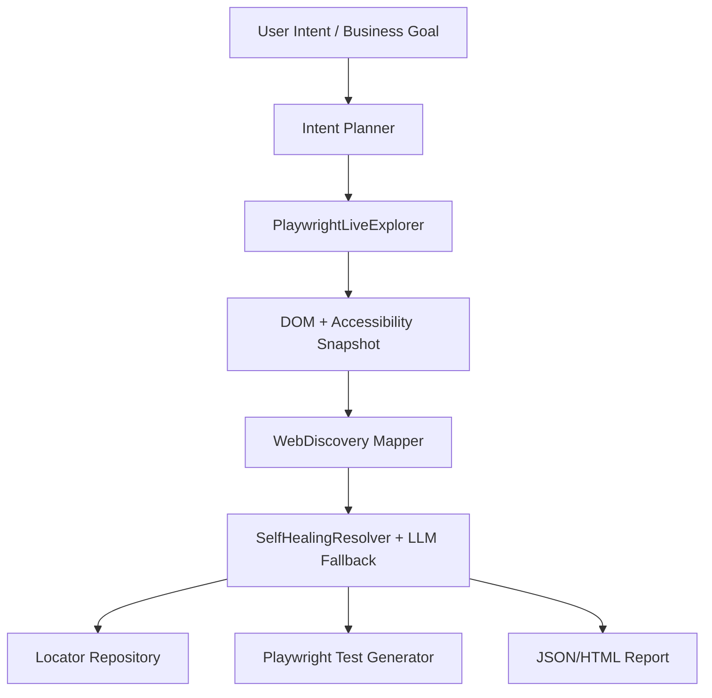

# Intent-Driven Automation / Intent Tabanlı Otomasyon

This page documents the **M6** direction: moving from intent-aware self-healing
to intent-driven test exploration, locator recording, and test generation.

Today, `TestIntent` is metadata used by the healing engine. It explains why a
test step exists, helps LLM providers choose between shortlisted candidates, and
is persisted into locator repositories and healing reports.

M6 extends that idea: the user describes the business goal, the system can plan
steps, match those steps to a Web DOM snapshot, record accepted locators, generate
Playwright C#/TypeScript test skeletons, and render a reviewable intent flow report.

## Current Capability

| Capability | Status |
| :--- | :--- |
| Persist `TestIntent` in locator snapshots | Implemented |
| Include `TestIntent` in LLM healing prompts | Implemented |
| Preserve intent across healed locator updates | Implemented |
| Report healing source, confidence, and review status | Implemented |
| Deterministic intent planner skeleton | Implemented |
| Match intent steps to visible `WebDiscovery` DOM candidates | Implemented |
| Record accepted intent candidates into locator repositories | Implemented |
| Generate Playwright C# test skeletons from recorded intent locators | Implemented |
| Run planning, matching, recording, and generation through one pipeline API | Implemented |
| Generate Playwright TypeScript test skeletons from recorded intent locators | Implemented |
| Render intent flow JSON/HTML reports | Implemented |
| Generate full tests from natural-language intent | Implemented (`LlmIntentPlanner`, opt-in, guarded fallback to the deterministic planner) |
| Match intent steps to a live Windows desktop `UiElementInfo` tree | Implemented (`IntentDesktopExplorationBridge`) |
| Generate xUnit + FlaUI test skeletons from recorded desktop intent locators | Implemented (`FlaUiCSharpTestGenerator`) |
| Run desktop planning, matching, recording, and generation through one pipeline API | Implemented (`IntentDesktopAutomationPipeline`) |
| Explore a live page via the Playwright .NET SDK (not MCP - see below) | Implemented (`PlaywrightLiveExplorer`) |

## M6 Target Architecture



## Planned Building Blocks

### 1. Intent Contract

Structured representation of what the user wants:

```csharp
public sealed class IntentScenario
{
    public string Name { get; set; } = "";
    public string Goal { get; set; } = "";
    public string TargetUrl { get; set; } = "";
    public List<IntentStep> Steps { get; set; } = new();
}
```

Each step can carry:

- `ActionType`: `Navigate`, `Fill`, `Click`, `Select`, `Check`, `Uncheck`, `Hover`, `UploadFile`, `PressKey`, `Wait`, `Assert`
- `TestIntent`
- `TargetDescription`
- `Value`
- `ExpectedOutcome`
- `AssertionKind`: `Visible`, `NotVisible`, `TextEquals`, `TextContains`, `ValueEquals`, `UrlEquals`, `UrlContains`
- `ExpectedValue`: Target value for value-checked assertions (e.g. `"$125"`)

For `UploadFile`, `Value` is the file path. For `PressKey`, it is a Playwright-style
key name such as `Enter` or `ArrowDown`. For `Wait`, it is an optional positive timeout
in milliseconds (default `5000`); wait generation polls for the target element to become
visible/present instead of emitting a fixed sleep. Web upload matching requires a captured
`<input type="file">`; desktop generation drives a real file dialog (invoking the trigger button,
setting the file path in the dialog, and confirming the Open button) or emits an explicit failure
marker if manual handling is required. Desktop key generation supports Enter, Tab, Escape, Space, navigation/editing keys,
and single letters or digits; unsupported names produce an explicit failing review marker.

`Check`/`Uncheck` target checkboxes and radio buttons - a radio button can only be
checked, never unchecked, so it never matches `Uncheck`. `Select` is reserved for real
dropdown/select/combobox elements only: the generators emit select-only calls for it
(`selectOption` / `SelectOptionAsync` / `AsComboBox().Select(...)`), which the target
frameworks reject on checkboxes, radios, or list/tab controls.

`TargetDescription` is the authoritative free-text field for element matching.
`TestIntent` explains the business reason for the step and is preserved in generated
tests, reports, locator snapshots, and LLM healing context; `ExpectedOutcome` describes
the state after the action for reporting and assertion generation. Those two narrative
fields do not influence candidate ranking, so conflicting prose cannot redirect a step
away from its declared target. `IntentStep` is decoupled from locator repository storage;
repository keys (`Field.*`, `Action.*`, `Assert.*`) are synthesized deterministically
by `IntentLocatorKeySynthesizer` during exploration and recording.

Assert generation behavior across all generators is configured via `AssertGenerationMode`:
- `Strict` (default): Emits real assertions for mapped `AssertionKind`s; emits inconclusive review checks (`Assert.Inconclusive` / `test.skip` / `Assert.True(false, ...)`) for unmapped kinds.
- `Lenient`: Emits real assertions for mapped kinds; emits presence checks with a `// TODO` review comment for unmapped kinds.
- `Fallback`: Emits presence/visibility checks for unmapped kinds.

### 2. Intent Planner

The planner turns a business goal into stable automation steps:

```text
Goal: Create a corporate customer record

Steps:
1. Fill first name
2. Fill last name
3. Fill email
4. Select corporate record type
5. Fill company name
6. Click save
7. Assert that a grid row exists
```

The first implementation is deterministic and testable (`DeterministicIntentPlanner`):
it derives steps from a fixed vocabulary of verbs in the goal text (save/submit/create/...)
and sets `RequiresReview` when it can't confidently do so.

`LlmIntentPlanner` implements the same `IIntentPlanner` interface and asks a model to
read the goal directly instead of pattern-matching keywords, so goals phrased outside
that fixed vocabulary still produce a complete plan. It never trusts the model's output
blindly: a structurally invalid response (unparseable `ActionType`, empty steps array),
a missing `ANTHROPIC_API_KEY`, or an HTTP failure all degrade to
`DeterministicIntentPlanner`'s own result rather than surfacing malformed steps. It is
a drop-in `IIntentPlanner`, so it can be passed directly to `IntentAutomationPipeline`:

```csharp
var pipeline = new IntentAutomationPipeline(planner: new LlmIntentPlanner());
```

### 3. Live Page Exploration

`PlaywrightLiveExplorer` (`AutomationSandbox.PlaywrightLiveExploration`) opens a browser
page, navigates to a URL, and returns a `WebElementInfo` snapshot - including Shadow DOM
and same-origin iframe content, with hidden/offscreen elements marked, via the same
`PlaywrightDomCaptureScript` the manual capture workflow uses:

```csharp
using PlaywrightLiveExploration;

await using var explorer = await PlaywrightLiveExplorer.LaunchAsync();
WebElementInfo dom = await explorer.CaptureAsync("https://example.test/customers");
```

**Why the Playwright .NET SDK instead of a real MCP bridge:** the canonical Playwright MCP
server (`@playwright/mcp`) is a Node.js process - connecting to it from C# would mean
spawning and talking JSON-RPC to an external Node.js runtime, the first such dependency in
an otherwise pure C#/.NET codebase (see AGENTS.md). `Microsoft.Playwright`, by contrast, is
a fully managed .NET client with no Node.js requirement at runtime, and reaches the same
functional outcome (open a page, capture a DOM/accessibility-flavored snapshot) that this
capability actually needs. This was a deliberate scope decision, not an oversight - if a
literal MCP integration is wanted later (e.g. to reuse MCP-based tooling beyond Playwright),
it should be scoped and evaluated as a separate, explicit addition.

### 4. Locator Selection and Exploration Gates

For each intent step, the exploration bridges (`IntentExplorationBridge` for Web and `IntentDesktopExplorationBridge` for Desktop) shortlist candidate elements using:

- role and tag semantics (Action Compatibility)
- accessible name / label text / AutomationId (Semantic Overlap)
- placeholder and test id
- authoritative `TargetDescription`
- locator confidence suggestions

#### Safety Gates and Manual Review

To prevent unrelated or ambiguous element matches from silently succeeding:

1. **Semantic Score Gate (`MinimumSemanticScore = 0.01`):** Action compatibility alone is not sufficient. An element (e.g. an "Export Report" button) matching an unrelated intent step (e.g. "Delete customer") receives `semanticScore = 0.00 < 0.01` and is flagged with `RequiresReview = true`, preventing unreviewed locator persistence.
2. **Runner-Up Margin Check (`MinimumCandidateMargin = 0.05`):** If the top candidate barely beats the runner-up (`best - runnerUp < 0.05`), the match is marked ambiguous with `RequiresReview = true` rather than guessing.
3. **Threshold Review (`ReviewThreshold = 0.35`):** Candidates whose combined score is below the review threshold require manual review.

When a step requires review, candidates remain in the exploration result and report document with diagnostic explanations, but `IntentLocatorRepositoryRecorder` avoids persisting them without explicit human approval.

> **Known limitation / Benchmark calibration note:**
> `MinimumSemanticScore = 0.01` is an empirical baseline calibrated to require at least one non-zero semantic token overlap between the intent target and the element. Because `TokenOverlap` divides by the total target tokens, single-token matches (e.g. "Save" with ~0.043) clear this gate, while completely unrelated elements (0.00) are caught and flagged for review. However, coincidental single-token overlaps may still pass this minimum gate. This threshold ships as a baseline estimate and will be recalibrated against a broader real-world dataset under benchmark issue #15.

### 5. Test Generation

The generator can output:

- Playwright C# test code
- locator repository JSON
- healing report JSON/HTML
- Playwright TypeScript snippets for npm users

## Pipeline Usage

```csharp
var request = new IntentPlanningRequest
{
    Name = "Create customer",
    Goal = "Create a customer record with valid email",
    TargetUrl = "https://example.test/customers",
    TestData = new Dictionary<string, string>
    {
        ["email"] = "jane.doe@example.com",
    },
};

WebElementInfo dom = CaptureDomSnapshotSomehow();
var repository = new LocatorRepository("web.locators.json");
var pipeline = new IntentAutomationPipeline();

IntentAutomationPipelineResult result = pipeline.Run(request, dom, repository);

File.WriteAllText("generated.spec.ts", result.PlaywrightTypeScriptTestCode);
new IntentFlowReportFileSink("intent-flow-report.json").Write(result.Report);
```

## Generated Playwright C# Example

```csharp
using System.Threading.Tasks;
using Microsoft.Playwright;
using Microsoft.Playwright.NUnit;
using NUnit.Framework;

namespace GeneratedTests
{
    public class CreateCustomer : PageTest
    {
        [Test]
        public async Task CreateACustomerRecord()
        {
            await Page.GotoAsync("https://example.test/customers");
            await Page.GetByTestId("email-input").FillAsync("jane.doe@example.com");
            await Page.GetByTestId("save-button").ClickAsync();
            await Expect(Page.GetByTestId("customer-records")).ToBeVisibleAsync();
        }
    }
}
```

## Generated Playwright TypeScript Example

```typescript
import { test, expect } from '@playwright/test';

test('Create customer', async ({ page }) => {
  await page.goto('https://example.test/customers');
  await page.getByTestId('email-input').fill('jane.doe@example.com');
  await page.getByTestId('save-button').click();
  await expect(page.getByTestId('customer-records')).toBeVisible();
});
```

## Desktop Pipeline Usage

`IntentDesktopAutomationPipeline` is the Windows desktop counterpart: the same
`IIntentPlanner` plans steps, but they are matched against a live `UiElementInfo` tree
(captured via `Discovery.UiTreeWalker`) instead of a `WebDiscovery` DOM snapshot, and the
generator emits an xUnit + FlaUI test instead of Playwright C#/TypeScript.

```csharp
UiElementInfo window = UiTreeWalker.BuildTree(connector.GetMainWindow());
var repository = new LocatorRepository("desktop.locators.json");
var pipeline = new IntentDesktopAutomationPipeline();

IntentDesktopAutomationPipelineResult result = pipeline.Run(request, window, repository);

File.WriteAllText("GeneratedCustomerDesktopTest.cs", result.FlaUiCSharpTestCode);
```

Note: `IntentDesktopAutomationPipelineResult` does not currently produce an
`IntentFlowReportDocument` - flow report rendering is web-pipeline-only for now.

## Generated FlaUI C# Example

```csharp
using System;
using Discovery;
using FlaUI.Core.AutomationElements;
using Xunit;

namespace GeneratedTests
{
    public class CreateCustomer : IDisposable
    {
        private readonly ApplicationConnector _connector;

        public CreateCustomer()
        {
            _connector = ApplicationConnector.Launch(@"TODO: path to the compiled application executable");
        }

        [Fact]
        public void CreateACustomerRecord()
        {
            var window = _connector.GetMainWindow();
            window.FindFirstDescendant(cf => cf.ByAutomationId("txtEmail"))!.AsTextBox().Text = "jane.doe@example.com";
            window.FindFirstDescendant(cf => cf.ByAutomationId("btnSave"))!.AsButton().Invoke();
            Assert.NotNull(window.FindFirstDescendant(cf => cf.ByAutomationId("dgvRecords")));
        }

        public void Dispose() => _connector.Dispose();
    }
}
```

Locator resolution favors `AutomationId`, falling back to `Name` and then bare
`ControlType` - the same tiering `MainFormScenarioTests` uses by hand for `panel1`, whose
`AutomationId` is deliberately meaningless (see
[Framework Case Studies](https://github.com/mustafasercansak/automation-sandbox#-framework-case-studies-winforms-vs-wpf)). The
generated code calls FlaUI directly rather than going through `SelfHealingEngine`: codegen
output and self-healing are separate, already-implemented concerns.

## Intent Flow Report

`IntentFlowReportFileSink` writes a JSON report plus an HTML sibling by default.
The report explains each step's intent, candidate count, best locator expression,
review status, recording result, and generated C#/TypeScript code. This currently covers
the web pipeline only (see note above).

Schema v3 adds `AssertionKind` and `ExpectedValue` per step, so a reviewer can tell from
the report alone whether a step generated a real assertion (e.g. `TextEquals` / `"$125"`)
or only a review marker (`None`) — without opening the generated test file. Schema v2
added `BestCandidateSemanticScore` and `RunnerUpScore`.

## Proposed Milestone Plan

| Milestone | Scope |
| :--- | :--- |
| M6.1 | Intent scenario and step model, deterministic planner skeleton, unit tests. Implemented. |
| M6.2 | Playwright exploration bridge prototype using existing `WebDiscovery` mapping. Implemented. |
| M6.3 | Intent-to-candidate matching and locator repository recording. Implemented. |
| M6.4 | Playwright C# test skeleton generation from recorded intent locators. Implemented. |
| M6.5 | End-to-end intent automation pipeline API. Implemented. |
| M6.6 | Playwright TypeScript test skeleton generation. Implemented. |
| M6.7 | Intent flow JSON/HTML report rendering. Implemented. |
| M6.8 | LLM-backed natural-language intent planner (`LlmIntentPlanner`), guarded with fallback to the deterministic planner. Implemented. |
| M6.9 | Desktop intent automation: `IntentDesktopExplorationBridge`, `IntentDesktopLocatorRepositoryRecorder`, `FlaUiCSharpTestGenerator`, `IntentDesktopAutomationPipeline`. Implemented. |
| M6.10 | Live page exploration via the Playwright .NET SDK (`PlaywrightLiveExplorer`), superseding the originally planned Node.js-based MCP bridge. Implemented. |
| M6.11 | Optional npm adapter for direct Playwright/TypeScript users. |

---

# Türkçe Özet

Bugün `TestIntent`, kırılan locator'ı iyileştirirken test adımının amacını anlatan
metadata'dır. M6 ile hedef bunu bir üst seviyeye taşımaktır: kullanıcı iş hedefini
yazar, sistem sayfayı keşfeder, aday elementleri bulur, locator deposuna kaydeder ve
çalıştırılabilir test adımları üretir.

M6.1-M6.10 tamamlandı. Sistem artık tek pipeline çağrısıyla intent adımlarını
planlayabilir, DOM adaylarıyla eşleştirebilir, review gerekmeyen locator'ları
repository'ye kaydedebilir, Playwright C#/TypeScript test iskeleti üretebilir ve
intent flow raporunu JSON/HTML olarak dışa verebilir (flow raporu üretimi şimdilik yalnızca web hattı içindir). `LlmIntentPlanner` ile hedef
metni sabit bir anahtar kelime kümesine bağlı kalmadan, doğal dilden doğrudan
planlanabilir; API anahtarı yoksa veya model çıktısı bozuksa sistem otomatik olarak
`DeterministicIntentPlanner`'a düşer. `IntentDesktopAutomationPipeline` ile aynı akış
Windows masaüstü uygulamaları (WinForms/WPF) için de çalışır: intent adımları canlı bir
`UiElementInfo` ağacıyla eşleştirilir ve xUnit + FlaUI test iskeleti üretilir (masaüstü hattı henüz `IntentFlowReportDocument` üretmez).
`PlaywrightLiveExplorer` ile canlı sayfa keşfi de tamamlandı - bu, Node.js tabanlı bir
MCP sunucusu yerine doğrudan Playwright .NET SDK'sını kullanır, projeyi saf C#/.NET
olarak tutar.

Intent adımlarında element eşleştirmesi için yetkili serbest metin alanı
`TargetDescription`'dır. `TestIntent` adımın iş gerekçesini anlatır ve üretilen
testlerde, raporlarda, locator snapshot'larında ve LLM healing bağlamında korunur;
`ExpectedOutcome` ise eylem sonrasındaki beklenen durumu raporlama ve assertion üretimi
için tanımlar. Bu iki anlatı alanı aday sıralamasını etkilemez; böylece çelişkili bir
metin adımı bildirilen hedeften başka bir elemente yönlendiremez. `IntentStep` locator
repository depolama formatından tamamen ayrıştırılmıştır; repository anahtarları (`Field.*`,
`Action.*`, `Assert.*`) keşif ve kayıt aşamasında `IntentLocatorKeySynthesizer` tarafından
deterministik olarak sentezlenir.

Eylem sözlüğü artık `Navigate`, `Fill`, `Click`, `Select`, `Check`, `Uncheck`, `Hover`,
`UploadFile`, `PressKey`, `Wait` ve `Assert` değerlerini kapsar. `UploadFile` için `Value` dosya yolu,
`PressKey` için `Enter`/`ArrowDown` gibi tuş adı, `Wait` içinse isteğe bağlı pozitif
milisaniye timeout değeridir (varsayılan `5000`). `Wait` sabit uyku üretmez; hedef
elementin görünür/var olmasını poll eder. Web upload eşleştirmesi yakalanmış
`<input type="file">` sinyalini zorunlu tutar; desktop üretimi gerçek bir dosya diyaloğunu
yönetir (tetikleyici butonu tıklar, diyalogdaki dosya yolu alanını doldurur ve Aç butonunu onaylar)
veya manuel müdahale gerekiyorsa açık bir hata işareti üretir. `Check`/`Uncheck` onay kutuları ve radyo düğmeleri
içindir - bir radyo düğmesi yalnızca işaretlenebilir, işareti kaldırılamaz; bu yüzden
`Uncheck` ile eşleşmez. `Select` yalnızca gerçek açılır liste/select/combobox
elementlerine ayrılmıştır: üreteçler bu eylem için yalnızca select çağrıları üretir
(`selectOption` / `SelectOptionAsync` / `AsComboBox().Select(...)`), bu da hedef
çatılarca onay kutularında, radyo düğmelerinde ve liste/sekme kontrollerinde reddedilir.

**Güvenlik Kapıları ve Bilinen Sınır:**
Eşleştiricilerde iki temel koruma mekanizması devrededir:
1. **Semantik Kapı (`MinimumSemanticScore = 0.01`):** Yalnızca eylem uyumu (ör. buton olması) yeterli sayılmaz; niyet ile hedef eleman arasında en az bir anlamlı token örtüşmesi aranır. "Delete customer" niyetine karşı "Export Report" gibi alakasız eşleşmeler (`0.00`) otomatik olarak manuel incelemeye (`RequiresReview = true`) sevk edilir. *Bilinen sınır:* 0.01 eşiği "en az bir token örtüşsün" anlamına geldiğinden, tesadüfi tek token eşleşmeleri kapıyı geçebilir. Bu değer bir temel tahmindir ve #15 kıyaslama veri setiyle yeniden kalibre edilecektir.
2. **Runner-Up Marj Kontrolü (`MinimumCandidateMargin = 0.05`):** En iyi iki aday arasındaki fark 0.05'in altındaysa sistem tahmin yürütmek yerine adımı incelemeye düşürür.
