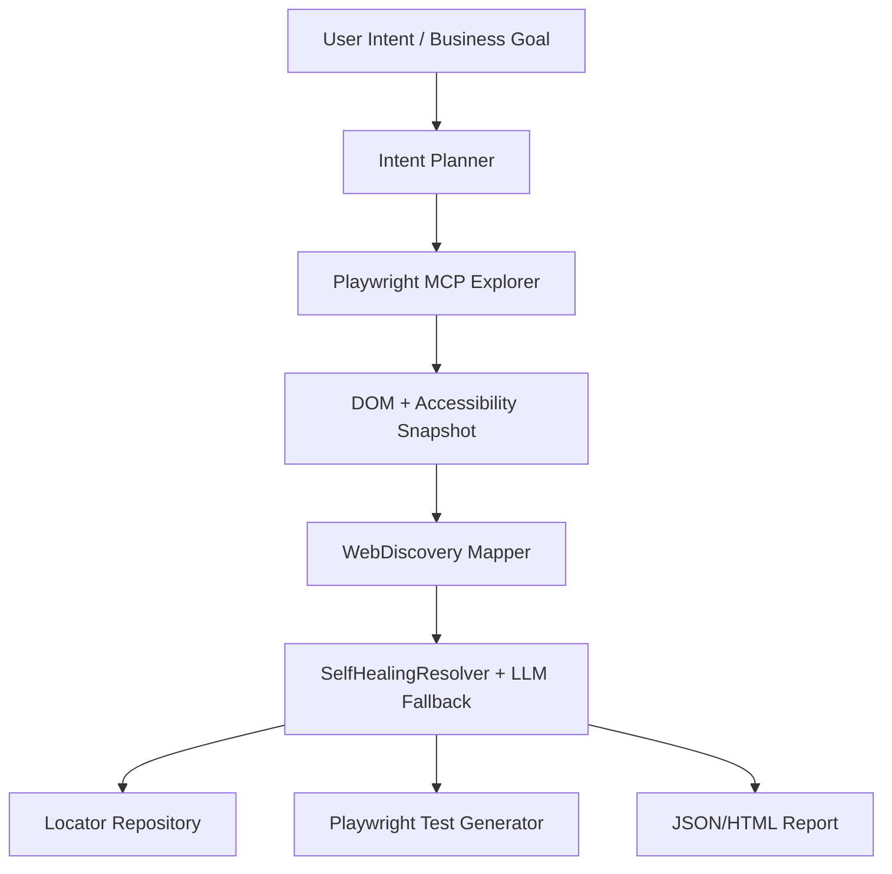

# Intent-Driven Automation & MCP Exploration / Intent Tabanlı Otomasyon ve MCP Keşfi

This page documents the **M6** direction: moving from intent-aware self-healing
to intent-driven test exploration, locator recording, and test generation.

Today, `TestIntent` is metadata used by the healing engine. It explains why a
test step exists, helps LLM providers choose between shortlisted candidates, and
is persisted into locator repositories and healing reports.

M6 extends that idea: the user describes the business goal, the system can plan
steps, match those steps to a Web DOM snapshot, record accepted locators, generate
Playwright C#/TypeScript test skeletons, and render a reviewable intent flow report.

## Current Capability

| Capability | Status |
| :--- | :--- |
| Persist `TestIntent` in locator snapshots | Implemented |
| Include `TestIntent` in LLM healing prompts | Implemented |
| Preserve intent across healed locator updates | Implemented |
| Report healing source, confidence, and review status | Implemented |
| Deterministic intent planner skeleton | Implemented |
| Match intent steps to visible `WebDiscovery` DOM candidates | Implemented |
| Record accepted intent candidates into locator repositories | Implemented |
| Generate Playwright C# test skeletons from recorded intent locators | Implemented |
| Run planning, matching, recording, and generation through one pipeline API | Implemented |
| Generate Playwright TypeScript test skeletons from recorded intent locators | Implemented |
| Render intent flow JSON/HTML reports | Implemented |
| Generate full tests from natural-language intent | Planned |
| Explore a live Playwright page through MCP | Planned |

## M6 Target Architecture



## Planned Building Blocks

### 1. Intent Contract

Structured representation of what the user wants:

```csharp
public sealed class IntentScenario
{
    public string Name { get; set; } = "";
    public string Goal { get; set; } = "";
    public string TargetUrl { get; set; } = "";
    public List<IntentStep> Steps { get; set; } = new();
}
```

Each step can carry:

- `ActionType`: `Fill`, `Click`, `Select`, `Assert`
- `TestIntent`
- `TargetDescription`
- `Value`
- `ExpectedOutcome`

### 2. Intent Planner

The planner turns a business goal into stable automation steps:

```text
Goal: Create a corporate customer record

Steps:
1. Fill first name
2. Fill last name
3. Fill email
4. Select corporate record type
5. Fill company name
6. Click save
7. Assert that a grid row exists
```

The first implementation should be deterministic and testable. LLM planning can
be added later behind a guarded interface.

### 3. Playwright MCP Exploration

The planned MCP bridge should be able to:

- open a browser page
- navigate to a URL
- capture DOM and accessibility snapshots
- include Shadow DOM and same-origin iframe content
- mark hidden/offscreen elements
- return the snapshot to the C# engine as `UiElementInfo`

### 4. Locator Selection

For each intent step, the engine can shortlist candidate elements using:

- role and tag semantics
- accessible name / label text
- placeholder and test id
- parent/sibling structure
- `TestIntent`
- optional LLM fallback with hallucination guard

### 5. Test Generation

The generator can output:

- Playwright C# test code
- locator repository JSON
- healing report JSON/HTML
- Playwright TypeScript snippets for npm users

## Pipeline Usage

```csharp
var request = new IntentPlanningRequest
{
    Name = "Create customer",
    Goal = "Create a customer record with valid email",
    TargetUrl = "https://example.test/customers",
    TestData = new Dictionary<string, string>
    {
        ["email"] = "jane.doe@example.com",
    },
};

WebElementInfo dom = CaptureDomSnapshotSomehow();
var repository = new LocatorRepository("web.locators.json");
var pipeline = new IntentAutomationPipeline();

IntentAutomationPipelineResult result = pipeline.Run(request, dom, repository);

File.WriteAllText("generated.spec.ts", result.PlaywrightTypeScriptTestCode);
new IntentFlowReportFileSink("intent-flow-report.json").Write(result.Report);
```

## Generated Playwright C# Example

```csharp
using System.Threading.Tasks;
using Microsoft.Playwright;
using Microsoft.Playwright.NUnit;
using NUnit.Framework;

namespace GeneratedTests
{
    public class CreateCustomer : PageTest
    {
        [Test]
        public async Task CreateACustomerRecord()
        {
            await Page.GotoAsync("https://example.test/customers");
            await Page.GetByTestId("email-input").FillAsync("jane.doe@example.com");
            await Page.GetByTestId("save-button").ClickAsync();
            await Expect(Page.GetByTestId("customer-records")).ToBeVisibleAsync();
        }
    }
}
```

## Generated Playwright TypeScript Example

```typescript
import { test, expect } from '@playwright/test';

test('Create customer', async ({ page }) => {
  await page.goto('https://example.test/customers');
  await page.getByTestId('email-input').fill('jane.doe@example.com');
  await page.getByTestId('save-button').click();
  await expect(page.getByTestId('customer-records')).toBeVisible();
});
```

## Intent Flow Report

`IntentFlowReportFileSink` writes a JSON report plus an HTML sibling by default.
The report explains each step's intent, candidate count, best locator expression,
review status, recording result, and generated C#/TypeScript code.

## Proposed Milestone Plan

| Milestone | Scope |
| :--- | :--- |
| M6.1 | Intent scenario and step model, deterministic planner skeleton, unit tests. Implemented. |
| M6.2 | Playwright exploration bridge prototype using existing `WebDiscovery` mapping. Implemented. |
| M6.3 | Intent-to-candidate matching and locator repository recording. Implemented. |
| M6.4 | Playwright C# test skeleton generation from recorded intent locators. Implemented. |
| M6.5 | End-to-end intent automation pipeline API. Implemented. |
| M6.6 | Playwright TypeScript test skeleton generation. Implemented. |
| M6.7 | Intent flow JSON/HTML report rendering. Implemented. |
| M6.8 | Optional npm adapter for direct Playwright/TypeScript users. |

---

# Türkçe Özet

Bugün `TestIntent`, kırılan locator'ı iyileştirirken test adımının amacını anlatan
metadata'dır. M6 ile hedef bunu bir üst seviyeye taşımaktır: kullanıcı iş hedefini
yazar, sistem Playwright/MCP ile sayfayı keşfeder, aday elementleri bulur, locator
deposuna kaydeder ve çalıştırılabilir test adımları üretir.

M6.1-M6.7 tamamlandı. Sistem artık tek pipeline çağrısıyla intent adımlarını
planlayabilir, DOM adaylarıyla eşleştirebilir, review gerekmeyen locator'ları
repository'ye kaydedebilir, Playwright C#/TypeScript test iskeleti üretebilir ve
intent flow raporunu JSON/HTML olarak dışa verebilir.
