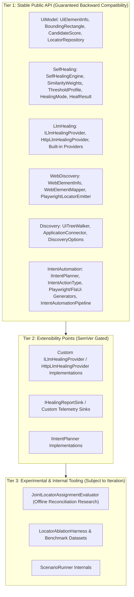
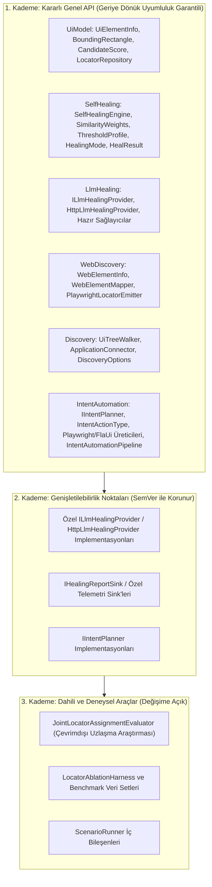

# 🛡️ API Stability, Versioning & Beta-Exit Criteria / API Kararlılığı, Sürüm Politikası ve Beta Çıkış Kriterleri

This document formally defines the public API stability guarantees, the semantic versioning policy across pre-1.0 and post-1.0 lifecycles, and the concrete, checkable exit criteria required for graduating **Automation Sandbox** from beta to `1.0.0` GA (General Availability).

> 💡 **Select Language / Dil Seçin:**
> - [🇬🇧 English Guide](#-english-guide)
> - [🇹🇷 Türkçe Kılavuz](#-türkçe-kılavuz)

---

## 🇬🇧 English Guide

### 1. Public API Surface & Stability Tiers

Automation Sandbox distinguishes between stable public contracts, extensible provider surfaces, and experimental/internal subsystems.

#### Tier 1: Stable Public API
The following NuGet packages and their core types represent the committed public contract. As of the namespace migration (#399), the C# namespace for each package matches its NuGet `PackageId` (e.g. `using AutomationSandbox.UiModel;`) — earlier previews used the unprefixed short name (`using UiModel;`); that was a collision-prone surface for a mature SDK and is now a breaking change, called out in the release notes for the version that ships it:
- **`AutomationSandbox.UiModel`** (namespace `AutomationSandbox.UiModel`): `UiElementInfo`, `BoundingRectangle`, `CandidateScore`, `ScoreComponents`, `LocatorRepository`, `LocatorRecord`, `LocatorHealingHistoryEntry`, `UiTreeSerializer`.
- **`AutomationSandbox.SelfHealing`** (namespace `AutomationSandbox.SelfHealing`): `SelfHealingEngine`, `SelfHealingResolver`, `SimilarityWeights`, `ThresholdProfile`, `TreeCalibrator`, `HealingMode`, `HealResult`, `HealingReportDocument`.
- **`AutomationSandbox.LlmHealing`** (namespace `AutomationSandbox.LlmHealing`): `ILlmHealingProvider`, `HttpLlmHealingProvider`, `ClaudeHealingProvider`, `GeminiHealingProvider`, `OpenAiHealingProvider`, `OllamaHealingProvider`, `LlmHealingResult`.
- **`AutomationSandbox.WebDiscovery`** (namespace `AutomationSandbox.WebDiscovery`): `WebElementInfo`, `WebElementMapper`, `PlaywrightDomCaptureScript`, `PlaywrightLocatorEmitter`.
- **`AutomationSandbox.Discovery`** (namespace `AutomationSandbox.Discovery`): `UiTreeWalker`, `ApplicationConnector`, `DiscoveryOptions`, `DiscoveryResult`.
- **`AutomationSandbox.IntentAutomation`** (namespace `AutomationSandbox.IntentAutomation`): `IIntentPlanner`, `DeterministicIntentPlanner`, `LlmIntentPlanner`, `IntentActionType`, `PlaywrightCSharpTestGenerator`, `PlaywrightTypeScriptTestGenerator`, `FlaUiCSharpTestGenerator`, `IntentAutomationPipeline`, `IntentDesktopAutomationPipeline`, `IntentDesktopExplorationBridge`.
- **`AutomationSandbox.PlaywrightLiveExploration`** (namespace `AutomationSandbox.PlaywrightLiveExploration`): `PlaywrightLiveExplorer`, `PlaywrightWebSession`.
- **`AutomationSandbox.ContentAnalysis`** (namespace `AutomationSandbox.ContentAnalysis`): `ContentAnalyzer`, `ContentIssue`, `IContentAnalysisProvider`, `ClaudeContentAnalysisProvider`.

#### Tier 2: Extensibility Points
Interfaces intended for consumer extension (`ILlmHealingProvider`, `IHealingReportSink`, `IIntentPlanner`, `IContentAnalysisProvider`) are protected against breaking changes post-1.0. Any additive default methods will provide default implementations or non-breaking base templates.

#### Tier 3: Internal & Experimental
Types in `ScenarioRunner` (such as `JointLocatorAssignmentEvaluator` and `LocatorAblationHarness`) are research or benchmark tools and do not constitute a public NuGet API contract.

---

### 2. Semantic Versioning & Breaking Change Policy

Automation Sandbox adheres to [Semantic Versioning 2.0.0](https://semver.org/):

#### Pre-1.0 Lifecycle (`0.x.y`)
- **Prerelease Tags (`v0.2.0-beta.x` / `preview.x`):** Published preview artifacts for early validation.
- **Minor Bumps (`0.2.x` $\rightarrow$ `0.3.0`):** May introduce necessary architectural refinements or breaking changes. Any breaking change must be highlighted with migration instructions in the release notes (`docs/release-notes/`).
- **Patch Bumps (`0.2.0` $\rightarrow$ `0.2.1`):** Strictly backwards-compatible bug fixes, performance improvements, and non-breaking additions.

#### Post-1.0 Lifecycle (`1.0.0+`)
- **Major Releases (`X.0.0`):** Reserved for breaking API changes, deprecation removals, or runtime target shifts.
- **Minor Releases (`1.X.0`):** Backwards-compatible features, new provider integrations, or additive scoring signals.
- **Patch Releases (`1.0.X`):** Backwards-compatible bug fixes, security patches, and documentation updates.
- **Deprecation Grace Period:** Any public API slated for removal must be marked with `[Obsolete]` for at least one minor release cycle prior to deletion.

---

### 3. Concrete Beta-Exit Criteria (1.0 GA Checklist)

To exit beta and release `1.0.0`, all of the following conditions must be satisfied. **This list is the live burn-down** — the box is checked when the maintainer confirms the criterion at release-decision time; the *Status* line records where it stands now.

- [ ] **Benchmark Safety Bound:** Heuristic false-heal rate $\le 10.0\%$ on the HandBrake 1.8.2 benchmark suite under `ThresholdProfile.Balanced` (`0.75` confidence threshold).
  - *Status: met.* ~7.6% (per-component name gate, #370). Locked by `ThresholdProfileAndCalibrationTests.HandBrakeFixture_BalancedProfile_FalseHealRate_MeetsThe1_0SafetyBound`. Deleted-element false heals are 0% on both fixtures (#370/#375).
- [ ] **Multi-Application Verification:** Proven calibration and telemetry across both HandBrake (WPF) and ShareX (WinForms) fixtures without unexplained variance.
  - *Status: met.* §8 and §14/§15 of the benchmark guide; `ShareXAblationTests` and `LocatorAblationTests` carry committed baselines.
- [ ] **Zero Open P0/P1 Safety Issues:** No open issues labeled `safety`, `security`, or `correctness` with P0 or P1 priority.
  - *Status: met.* Re-confirmed 2026-09-19: zero open issues labeled `safety`, `security`, or `correctness` (`gh issue list --state open --label safety,security,correctness`). Re-confirm again at release-decision time.
- [ ] **Independent External Validation ([#401](https://github.com/mustafasercansak/automation-sandbox/issues/401)):** Three independent FlaUI test projects have completed integrations with written feedback, and two real applications each have a committed dataset from two genuine versions with measured locator drift. Publish broken-locator counts, correct heals, review referrals, false heals, and estimated maintenance time saved for each integration.
  - *Status: not met.* No external integration or organic drift dataset is verified. Synthetic mutations and repository-owned quickstarts do not qualify. Follow the [evidence collection plan](external-validation.md); release notes for 1.0 must link the completed evidence and this checklist.
- [ ] **Cross-Platform CI Stability:** 100% passing tests across the Windows (`net48`) and Linux (`net8.0`) CI matrix legs with zero unhandled flaky retries.
  - *Status: met* for the core `CI` matrix. The nightly consensus gate's reasoning-model regression (#378) is fixed (`OpenAiHealingProvider` folds in `message.reasoning`, the parser recovers a truncated answer object); confirmed with 5 consecutive green scheduled `Nightly Multi-Provider Consensus Evaluation` runs, 2026-09-14 through 2026-09-18.
- [ ] **Supply Chain Security:** Zero High or Critical advisories under `dotnet list package --vulnerable` / `NuGetAudit` across all target frameworks.
  - *Status: met.* `NuGetAudit` (`NU1903`/`NU1904`) is a CI build error; no advisories outstanding. Re-confirmed 2026-09-19 via `dotnet list package --vulnerable --include-transitive` across all eight packable projects (including the new ContentAnalysis package): zero vulnerable packages.
- [ ] **Bilingual Documentation Parity (guides):** 100% structural and conceptual parity between the English and Turkish sections of every **numbered guide** at `docs/*.md` — same `###` heading sequence and fenced-code-block count, enforced by `DocumentationSiteIntegrityTests.BilingualDocumentation_HasMatchingEnglishAndTurkishStructure`. Blog posts under `docs/blog/**` and `*-research.md` notes are English-primary with a Turkish abstract (`> **TR:**` or `## Türkçe Özet`) by deliberate convention and are exempt.
  - *Status: met.* Criterion scoped (#369); `comparison.md` and `integration-existing-suite.md` are fully bilingual and enforced by the test.
- [ ] **Verified Consumer Quickstarts:** Automated CI execution of both standalone sample projects: `HeuristicHealingQuickstart` restoring purely from nuget.org / published artifacts, and `PlaywrightEndToEndQuickstart` built and run in CI against the current source tree.
  - *Status: met.* `PlaywrightEndToEndQuickstart` builds and runs against current source on every `ci.yml` run. `HeuristicHealingQuickstart`'s nuget.org-only restore was previously verified only once per release (`release.yml`'s `verify-published.ps1`) - `ci.yml`'s `sample-source-compat` job swaps in a `ProjectReference` and proves nothing about the published package, so this criterion's "automated CI execution ... restoring purely from nuget.org" was not actually an ongoing guarantee (see #415, where exactly that drift shipped undetected). Closed by a dedicated nightly `nuget-consumer-verify.yml` workflow that runs the same nuget.org-only check independent of the release cycle.

**Release trigger.** The prerelease → `1.0.0` transition is **condition-based, not date-based**: `1.0.0` is cut once every box above is checked, no open issue is labeled `release-blocker`, and the current release notes carry no `Known Limitation` that blocks a use case the README claims support for. Until then, minor bumps (`0.2` → `0.3`) continue under the pre-1.0 policy in §2. Every criterion's *Status* line above is the live tracker; the mechanical next step is the next preview release, which proves the publish flow end to end.

---

## 🇹🇷 Türkçe Kılavuz

### 1. Genel API Yüzeyi ve Kararlılık Kademeleri

Automation Sandbox, kararlı genel sözleşmeler, genişletilebilir sağlayıcı yüzeyleri ve deneysel/dahili alt sistemler arasında ayrım yapar.

#### 1. Kademe: Kararlı Genel API
Aşağıdaki NuGet paketleri ve temel türleri taahhüt edilen genel sözleşmeyi temsil eder. Ad alanı geçişinden (#399) itibaren her paketin C# ad alanı, NuGet `PackageId`'siyle eşleşir (örn. `using AutomationSandbox.UiModel;`) — önceki önizlemeler önek almamış kısa adı kullanıyordu (`using UiModel;`); bu, olgun bir SDK için çakışmaya açık bir yüzeydi ve artık bunu taşıyan sürümün release notlarında belirtilen kırıcı bir değişikliktir:
- **`AutomationSandbox.UiModel`** (ad alanı `AutomationSandbox.UiModel`): `UiElementInfo`, `BoundingRectangle`, `CandidateScore`, `ScoreComponents`, `LocatorRepository`, `LocatorRecord`, `LocatorHealingHistoryEntry`, `UiTreeSerializer`.
- **`AutomationSandbox.SelfHealing`** (ad alanı `AutomationSandbox.SelfHealing`): `SelfHealingEngine`, `SelfHealingResolver`, `SimilarityWeights`, `ThresholdProfile`, `TreeCalibrator`, `HealingMode`, `HealResult`, `HealingReportDocument`.
- **`AutomationSandbox.LlmHealing`** (ad alanı `AutomationSandbox.LlmHealing`): `ILlmHealingProvider`, `HttpLlmHealingProvider`, `ClaudeHealingProvider`, `GeminiHealingProvider`, `OpenAiHealingProvider`, `OllamaHealingProvider`, `LlmHealingResult`.
- **`AutomationSandbox.WebDiscovery`** (ad alanı `AutomationSandbox.WebDiscovery`): `WebElementInfo`, `WebElementMapper`, `PlaywrightDomCaptureScript`, `PlaywrightLocatorEmitter`.
- **`AutomationSandbox.Discovery`** (ad alanı `AutomationSandbox.Discovery`): `UiTreeWalker`, `ApplicationConnector`, `DiscoveryOptions`, `DiscoveryResult`.
- **`AutomationSandbox.IntentAutomation`** (ad alanı `AutomationSandbox.IntentAutomation`): `IIntentPlanner`, `DeterministicIntentPlanner`, `LlmIntentPlanner`, `IntentActionType`, `PlaywrightCSharpTestGenerator`, `PlaywrightTypeScriptTestGenerator`, `FlaUiCSharpTestGenerator`, `IntentAutomationPipeline`, `IntentDesktopAutomationPipeline`, `IntentDesktopExplorationBridge`.
- **`AutomationSandbox.PlaywrightLiveExploration`** (ad alanı `AutomationSandbox.PlaywrightLiveExploration`): `PlaywrightLiveExplorer`, `PlaywrightWebSession`.
- **`AutomationSandbox.ContentAnalysis`** (ad alanı `AutomationSandbox.ContentAnalysis`): `ContentAnalyzer`, `ContentIssue`, `IContentAnalysisProvider`, `ClaudeContentAnalysisProvider`.

#### 2. Kademe: Genişletilebilirlik Noktaları
Tüketici eklentileri için tasarlanan arayüzler (`ILlmHealingProvider`, `IHealingReportSink`, `IIntentPlanner`, `IContentAnalysisProvider`), 1.0 sonrasında kırıcı değişikliklere karşı korunur.

#### 3. Kademe: Dahili ve Deneysel Araçlar
`ScenarioRunner` içindeki araştırma amaçlı sınıflar (`JointLocatorAssignmentEvaluator`, `LocatorAblationHarness` vb.) genel NuGet API sözleşmesine dahil değildir.

---

### 2. Semantik Sürümleme ve Değişiklik Politikası

Automation Sandbox [Semantic Versioning 2.0.0](https://semver.org/) standardını uygular:

#### 1.0 Öncesi Yaşam Döngüsü (`0.x.y`)
- **Ön sürüm etiketleri (`v0.2.0-beta.x` / `preview.x`):** Erken doğrulama için yayımlanan önizleme artifact'ları.
- **Minör sürüm artışları (`0.2.x` $\rightarrow$ `0.3.0`):** Gerekli mimari iyileştirmeler veya kırıcı değişiklikler içerebilir. Her kırıcı değişiklik, sürüm notlarında (`docs/release-notes/`) geçiş yönergeleriyle belirtilmelidir.
- **Yama sürüm artışları (`0.2.0` $\rightarrow$ `0.2.1`):** Kesinlikle geriye dönük uyumlu hata düzeltmeleri, performans iyileştirmeleri ve kırıcı olmayan eklemeler.

#### 1.0 Sonrası Yaşam Döngüsü (`1.0.0+`)
- **Majör sürümler (`X.0.0`):** Kırıcı API değişiklikleri, deprecation kaldırmaları veya çalışma zamanı hedefi değişiklikleri için ayrılmıştır.
- **Minör sürümler (`1.X.0`):** Geriye dönük uyumlu özellikler, yeni sağlayıcı entegrasyonları veya ek skor sinyalleri.
- **Yama sürümleri (`1.0.X`):** Geriye dönük uyumlu hata düzeltmeleri, güvenlik yamaları ve dokümantasyon güncellemeleri.
- **Kullanımdan kaldırma süresi:** Kaldırılması planlanan her genel API, silinmeden önce en az bir minör sürüm döngüsü boyunca `[Obsolete]` ile işaretlenmelidir.

---

### 3. Somut Beta Çıkış Kriterleri (1.0 GA Kontrol Listesi)

Beta sürecini tamamlayıp `1.0.0` genel sürümüne geçmek için aşağıdaki tüm koşulların sağlanması gerekir. **Bu liste canlı burn-down'dur** — kutu, bakımcı sürüm-kararı anında kriteri doğruladığında işaretlenir; *Durum* satırı şu anki halini kaydeder.

- [ ] **Benchmark Güvenlik Sınırı:** HandBrake 1.8.2 benchmark paketinde `ThresholdProfile.Balanced` (`0.75` güven eşiği) altında sezgisel yanlış iyileştirme oranı $\le \%10.0$ olmalıdır.
  - *Durum: sağlandı.* ~%7.6 (bileşen bazlı isim geçidi, #370). `ThresholdProfileAndCalibrationTests.HandBrakeFixture_BalancedProfile_FalseHealRate_MeetsThe1_0SafetyBound` ile kilitli. Silinen-eleman yanlış iyileştirmeleri iki fikstürde de %0 (#370/#375).
- [ ] **Çoklu Uygulama Doğrulaması:** HandBrake (WPF) ve ShareX (WinForms) veri setlerinde tutarlı ve doğrulanmış kalibrasyon.
  - *Durum: sağlandı.* Benchmark kılavuzu §8 ve §14/§15; `ShareXAblationTests` ve `LocatorAblationTests` kayıtlı baseline'lar taşır.
- [ ] **Sıfır Açık P0/P1 Güvenlik Hatası:** `safety`, `security` veya `correctness` etiketli hiçbir açık P0/P1 sorun kalmamalıdır.
  - *Durum: sağlandı.* 2026-09-19'da yeniden doğrulandı: `safety`, `security` veya `correctness` etiketli sıfır açık sorun (`gh issue list --state open --label safety,security,correctness`). Sürüm-kararı anında tekrar doğrulanmalı.
- [ ] **Bağımsız Dış Doğrulama ([#401](https://github.com/mustafasercansak/automation-sandbox/issues/401)):** Üç bağımsız FlaUI test projesinde entegrasyon tamamlanmalı ve yazılı geri bildirim alınmalıdır. İki gerçek uygulamanın her biri için iki gerçek sürüm arasında ölçülmüş locator değişim veri seti depoya eklenmelidir. Her entegrasyon için bozulan locator, doğru iyileştirme, incelemeye yönlendirme, yanlış iyileştirme sayıları ve tahmini bakım süresi tasarrufu yayımlanmalıdır.
  - *Durum: sağlanmadı.* Henüz doğrulanmış dış entegrasyon veya doğal değişim veri seti yoktur. Sentetik değişimler ve bu depoya ait örnekler sayılmaz. [Kanıt toplama planı](external-validation.md) izlenmeli; 1.0 sürüm notları tamamlanan kanıtlara ve bu kontrol listesine bağlanmalıdır.
- [ ] **Çapraz Platform CI Kararlılığı:** Windows (`net48`) ve Linux (`net8.0`) CI iş hatlarında, ele alınmamış kararsız (flaky) yeniden denemeler olmaksızın $\%100$ başarı.
  - *Durum: çekirdek `CI` matrisi için sağlandı.* Nightly konsensüs gate'inin reasoning-model regresyonu (#378) düzeltildi (`OpenAiHealingProvider` `message.reasoning`'i katıyor, ayrıştırıcı kesilmiş yanıt nesnesini kurtarıyor); 2026-09-14 ile 2026-09-18 arasında art arda 5 yeşil zamanlanmış `Nightly Multi-Provider Consensus Evaluation` koşusuyla doğrulandı.
- [ ] **Tedarik Zinciri Güvenliği:** Tüm hedef framework'lerde `NuGetAudit` / `dotnet list package --vulnerable` taramasında sıfır Yüksek/Kritik güvenlik açığı.
  - *Durum: sağlandı.* `NuGetAudit` (`NU1903`/`NU1904`) bir CI derleme hatasıdır; bekleyen güvenlik açığı yok. 2026-09-19'da `dotnet list package --vulnerable --include-transitive` ile paketlenebilir sekiz projenin tamamında (yeni ContentAnalysis paketi dahil) yeniden doğrulandı: sıfır güvenlik açıklı paket.
- [ ] **Çift Dilli Belge Uyumu (rehberler):** `docs/*.md` altındaki her **numaralı rehberin** İngilizce ve Türkçe bölümleri arasında $\%100$ yapısal ve kavramsal uyum — aynı `###` başlık sırası ve kod bloğu sayısı, `DocumentationSiteIntegrityTests.BilingualDocumentation_HasMatchingEnglishAndTurkishStructure` tarafından denetlenir. `docs/blog/**` altındaki blog yazıları ve `*-research.md` notları, bilinçli bir kural gereği İngilizce-öncelikli olup Türkçe bir özet (`> **TR:**` veya `## Türkçe Özet`) taşır ve bu kriterden muaftır.
  - *Durum: sağlandı.* Kriter kapsamlandı (#369); `comparison.md` ve `integration-existing-suite.md` tam çift dilli ve test tarafından denetleniyor.
- [ ] **Doğrulanmış Başlangıç Örnekleri:** Bağımsız örnek projelerin CI üzerinde otomatik çalıştırılması: `HeuristicHealingQuickstart` doğrudan nuget.org / yayımlanmış paketlerden restore edilerek, `PlaywrightEndToEndQuickstart` ise mevcut kaynak ağacına karşı derlenip çalıştırılarak.
  - *Durum: sağlandı.* `PlaywrightEndToEndQuickstart`, her `ci.yml` koşusunda mevcut kaynağa karşı derlenip çalıştırılıyor. `HeuristicHealingQuickstart`'ın yalnızca nuget.org'dan restore edilmesi daha önce sadece sürüm başına bir kez doğrulanıyordu (`release.yml`'in `verify-published.ps1`'i) - `ci.yml`'deki `sample-source-compat` job'ı bir `ProjectReference` kullanır ve yayımlanan paket hakkında hiçbir şey kanıtlamaz, yani bu kriterin "nuget.org'dan restore edilerek otomatik CI çalıştırması" ifadesi sürekli bir garanti değildi (bkz. #415, tam olarak bu sapmanın fark edilmeden yayınlandığı yer). Sürüm döngüsünden bağımsız olarak aynı nuget.org-only kontrolü çalıştıran özel bir gece zamanlanmış `nuget-consumer-verify.yml` workflow'u ile kapatıldı.

**Sürüm tetikleyicisi.** Ön sürümden `1.0.0`'a geçiş **tarihe değil koşula bağlıdır**: yukarıdaki her kutu işaretlendiğinde, `release-blocker` etiketli açık bir sorun kalmadığında ve mevcut sürüm notları README'nin desteklediğini iddia ettiği bir kullanım senaryosunu engelleyen bir `Known Limitation` taşımadığında `1.0.0` kesilir. O zamana kadar minör sürüm artışları (`0.2` → `0.3`) §2'deki 1.0 öncesi politika altında devam eder. Yukarıdaki her kriterin *Durum* satırı canlı takipçidir; mekanik sonraki adım, yayın akışını uçtan uca kanıtlayan bir sonraki ön sürümdür.
