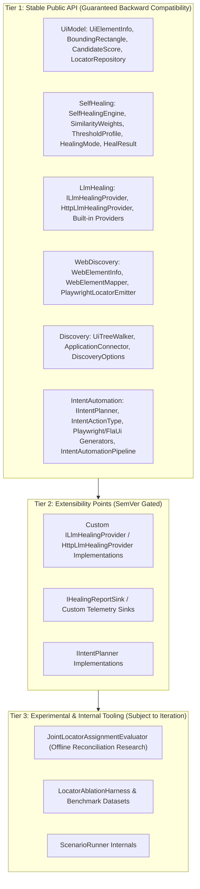
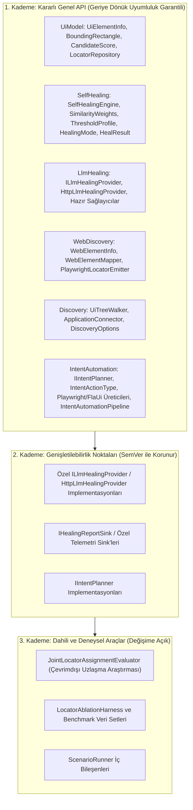

# 🛡️ API Stability, Versioning & Beta-Exit Criteria / API Kararlılığı, Sürüm Politikası ve Beta Çıkış Kriterleri

This document formally defines the public API stability guarantees, the semantic versioning policy across pre-1.0 and post-1.0 lifecycles, and the concrete, checkable exit criteria required for graduating **Automation Sandbox** from beta to `1.0.0` GA (General Availability).

> 💡 **Select Language / Dil Seçin:**
> - [🇬🇧 English Guide](#-english-guide)
> - [🇹🇷 Türkçe Kılavuz](#-türkçe-kılavuz)

---

## 🇬🇧 English Guide

### 1. Public API Surface & Stability Tiers

Automation Sandbox distinguishes between stable public contracts, extensible provider surfaces, and experimental/internal subsystems.

#### Tier 1: Stable Public API
The following NuGet packages and their core types represent the committed public contract. The C# namespace for each package is its unprefixed short name (e.g. `using UiModel;`, not `using AutomationSandbox.UiModel;`):
- **`AutomationSandbox.UiModel`** (namespace `UiModel`): `UiElementInfo`, `BoundingRectangle`, `CandidateScore`, `ScoreComponents`, `LocatorRepository`, `LocatorRecord`, `LocatorHealingHistoryEntry`, `UiTreeSerializer`.
- **`AutomationSandbox.SelfHealing`** (namespace `SelfHealing`): `SelfHealingEngine`, `SelfHealingResolver`, `SimilarityWeights`, `ThresholdProfile`, `TreeCalibrator`, `HealingMode`, `HealResult`, `HealingReportDocument`.
- **`AutomationSandbox.LlmHealing`** (namespace `LlmHealing`): `ILlmHealingProvider`, `HttpLlmHealingProvider`, `ClaudeHealingProvider`, `GeminiHealingProvider`, `OpenAiHealingProvider`, `OllamaHealingProvider`, `LlmHealingResult`.
- **`AutomationSandbox.WebDiscovery`** (namespace `WebDiscovery`): `WebElementInfo`, `WebElementMapper`, `PlaywrightDomCaptureScript`, `PlaywrightLocatorEmitter`.
- **`AutomationSandbox.Discovery`** (namespace `Discovery`): `UiTreeWalker`, `ApplicationConnector`, `DiscoveryOptions`, `DiscoveryResult`.
- **`AutomationSandbox.IntentAutomation`** (namespace `IntentAutomation`): `IIntentPlanner`, `DeterministicIntentPlanner`, `LlmIntentPlanner`, `IntentActionType`, `PlaywrightCSharpTestGenerator`, `PlaywrightTypeScriptTestGenerator`, `FlaUiCSharpTestGenerator`, `IntentAutomationPipeline`, `IntentDesktopAutomationPipeline`, `IntentDesktopExplorationBridge`.
- **`AutomationSandbox.PlaywrightLiveExploration`** (namespace `PlaywrightLiveExploration`): `PlaywrightLiveExplorer`.

#### Tier 2: Extensibility Points
Interfaces intended for consumer extension (`ILlmHealingProvider`, `IHealingReportSink`, `IIntentPlanner`) are protected against breaking changes post-1.0. Any additive default methods will provide default implementations or non-breaking base templates.

#### Tier 3: Internal & Experimental
Types in `ScenarioRunner` (such as `JointLocatorAssignmentEvaluator` and `LocatorAblationHarness`) are research or benchmark tools and do not constitute a public NuGet API contract.

---

### 2. Semantic Versioning & Breaking Change Policy

Automation Sandbox adheres to [Semantic Versioning 2.0.0](https://semver.org/):

#### Pre-1.0 Lifecycle (`0.x.y`)
- **Prerelease Tags (`v0.2.0-beta.x` / `preview.x`):** Published preview artifacts for early validation.
- **Minor Bumps (`0.2.x` $\rightarrow$ `0.3.0`):** May introduce necessary architectural refinements or breaking changes. Any breaking change must be highlighted with migration instructions in the release notes (`docs/release-notes/`).
- **Patch Bumps (`0.2.0` $\rightarrow$ `0.2.1`):** Strictly backwards-compatible bug fixes, performance improvements, and non-breaking additions.

#### Post-1.0 Lifecycle (`1.0.0+`)
- **Major Releases (`X.0.0`):** Reserved for breaking API changes, deprecation removals, or runtime target shifts.
- **Minor Releases (`1.X.0`):** Backwards-compatible features, new provider integrations, or additive scoring signals.
- **Patch Releases (`1.0.X`):** Backwards-compatible bug fixes, security patches, and documentation updates.
- **Deprecation Grace Period:** Any public API slated for removal must be marked with `[Obsolete]` for at least one minor release cycle prior to deletion.

---

### 3. Concrete Beta-Exit Criteria (1.0 GA Checklist)

To exit beta and release `1.0.0`, all of the following conditions must be satisfied. **This list is the live burn-down** — the box is checked when the maintainer confirms the criterion at release-decision time; the *Status* line records where it stands now.

- [ ] **Benchmark Safety Bound:** Heuristic false-heal rate $\le 10.0\%$ on the HandBrake 1.8.2 benchmark suite under `ThresholdProfile.Balanced` (`0.75` confidence threshold).
  - *Status: met.* ~7.6% (per-component name gate, #370). Locked by `ThresholdProfileAndCalibrationTests.HandBrakeFixture_BalancedProfile_FalseHealRate_MeetsThe1_0SafetyBound`. Deleted-element false heals are 0% on both fixtures (#370/#375).
- [ ] **Multi-Application Verification:** Proven calibration and telemetry across both HandBrake (WPF) and ShareX (WinForms) fixtures without unexplained variance.
  - *Status: met.* §8 and §14/§15 of the benchmark guide; `ShareXAblationTests` and `LocatorAblationTests` carry committed baselines.
- [ ] **Zero Open P0/P1 Safety Issues:** No open issues labeled `safety`, `security`, or `correctness` with P0 or P1 priority.
  - *Status: met* at time of writing. Re-confirm at release-decision time.
- [ ] **Cross-Platform CI Stability:** 100% passing tests across the Windows (`net48`) and Linux (`net8.0`) CI matrix legs with zero unhandled flaky retries.
  - *Status: met* for the core `CI` matrix. The nightly consensus gate's reasoning-model regression (#378) is fixed (`OpenAiHealingProvider` folds in `message.reasoning`, the parser recovers a truncated answer object); confirm one green scheduled `Nightly Multi-Provider Consensus Evaluation` run.
- [ ] **Supply Chain Security:** Zero High or Critical advisories under `dotnet list package --vulnerable` / `NuGetAudit` across all target frameworks.
  - *Status: met.* `NuGetAudit` (`NU1903`/`NU1904`) is a CI build error; no advisories outstanding.
- [ ] **Bilingual Documentation Parity (guides):** 100% structural and conceptual parity between the English and Turkish sections of every **numbered guide** at `docs/*.md` — same `###` heading sequence and fenced-code-block count, enforced by `DocumentationSiteIntegrityTests.BilingualDocumentation_HasMatchingEnglishAndTurkishStructure`. Blog posts under `docs/blog/**` and `*-research.md` notes are English-primary with a Turkish abstract (`> **TR:**` or `## Türkçe Özet`) by deliberate convention and are exempt.
  - *Status: met.* Criterion scoped (#369); `comparison.md` and `integration-existing-suite.md` are fully bilingual and enforced by the test.
- [ ] **Verified Consumer Quickstarts:** Automated CI execution of both standalone sample projects: `HeuristicHealingQuickstart` restoring purely from nuget.org / published artifacts, and `PlaywrightEndToEndQuickstart` built and run in CI against the current source tree.
  - *Status: met.* Both run in CI (`Sample Compiles Against Source` and the release workflow's `verify-published.ps1`; `PlaywrightEndToEndQuickstart` in `ci.yml`).

**Release trigger.** The prerelease → `1.0.0` transition is **condition-based, not date-based**: `1.0.0` is cut once every box above is checked, no open issue is labeled `release-blocker`, and the current release notes carry no `Known Limitation` that blocks a use case the README claims support for. Until then, minor bumps (`0.2` → `0.3`) continue under the pre-1.0 policy in §2. Every criterion's *Status* line above is the live tracker; the mechanical next step is the next preview release, which proves the publish flow end to end.

---

## 🇹🇷 Türkçe Kılavuz

### 1. Genel API Yüzeyi ve Kararlılık Kademeleri

Automation Sandbox, kararlı genel sözleşmeler, genişletilebilir sağlayıcı yüzeyleri ve deneysel/dahili alt sistemler arasında ayrım yapar.

#### 1. Kademe: Kararlı Genel API
Aşağıdaki NuGet paketleri ve temel türleri taahhüt edilen genel sözleşmeyi temsil eder. Her paketin C# ad alanı, önek almamış kısa adıdır (örn. `using AutomationSandbox.UiModel;` değil, `using UiModel;`):
- **`AutomationSandbox.UiModel`** (ad alanı `UiModel`): `UiElementInfo`, `BoundingRectangle`, `CandidateScore`, `ScoreComponents`, `LocatorRepository`, `LocatorRecord`, `LocatorHealingHistoryEntry`, `UiTreeSerializer`.
- **`AutomationSandbox.SelfHealing`** (ad alanı `SelfHealing`): `SelfHealingEngine`, `SelfHealingResolver`, `SimilarityWeights`, `ThresholdProfile`, `TreeCalibrator`, `HealingMode`, `HealResult`, `HealingReportDocument`.
- **`AutomationSandbox.LlmHealing`** (ad alanı `LlmHealing`): `ILlmHealingProvider`, `HttpLlmHealingProvider`, `ClaudeHealingProvider`, `GeminiHealingProvider`, `OpenAiHealingProvider`, `OllamaHealingProvider`, `LlmHealingResult`.
- **`AutomationSandbox.WebDiscovery`** (ad alanı `WebDiscovery`): `WebElementInfo`, `WebElementMapper`, `PlaywrightDomCaptureScript`, `PlaywrightLocatorEmitter`.
- **`AutomationSandbox.Discovery`** (ad alanı `Discovery`): `UiTreeWalker`, `ApplicationConnector`, `DiscoveryOptions`, `DiscoveryResult`.
- **`AutomationSandbox.IntentAutomation`** (ad alanı `IntentAutomation`): `IIntentPlanner`, `DeterministicIntentPlanner`, `LlmIntentPlanner`, `IntentActionType`, `PlaywrightCSharpTestGenerator`, `PlaywrightTypeScriptTestGenerator`, `FlaUiCSharpTestGenerator`, `IntentAutomationPipeline`, `IntentDesktopAutomationPipeline`, `IntentDesktopExplorationBridge`.
- **`AutomationSandbox.PlaywrightLiveExploration`** (ad alanı `PlaywrightLiveExploration`): `PlaywrightLiveExplorer`.

#### 2. Kademe: Genişletilebilirlik Noktaları
Tüketici eklentileri için tasarlanan arayüzler (`ILlmHealingProvider`, `IHealingReportSink`, `IIntentPlanner`), 1.0 sonrasında kırıcı değişikliklere karşı korunur.

#### 3. Kademe: Dahili ve Deneysel Araçlar
`ScenarioRunner` içindeki araştırma amaçlı sınıflar (`JointLocatorAssignmentEvaluator`, `LocatorAblationHarness` vb.) genel NuGet API sözleşmesine dahil değildir.

---

### 2. Semantik Sürümleme ve Değişiklik Politikası

Automation Sandbox [Semantic Versioning 2.0.0](https://semver.org/) standardını uygular:

#### 1.0 Öncesi Yaşam Döngüsü (`0.x.y`)
- **Ön sürüm etiketleri (`v0.2.0-beta.x` / `preview.x`):** Erken doğrulama için yayımlanan önizleme artifact'ları.
- **Minör sürüm artışları (`0.2.x` $\rightarrow$ `0.3.0`):** Gerekli mimari iyileştirmeler veya kırıcı değişiklikler içerebilir. Her kırıcı değişiklik, sürüm notlarında (`docs/release-notes/`) geçiş yönergeleriyle belirtilmelidir.
- **Yama sürüm artışları (`0.2.0` $\rightarrow$ `0.2.1`):** Kesinlikle geriye dönük uyumlu hata düzeltmeleri, performans iyileştirmeleri ve kırıcı olmayan eklemeler.

#### 1.0 Sonrası Yaşam Döngüsü (`1.0.0+`)
- **Majör sürümler (`X.0.0`):** Kırıcı API değişiklikleri, deprecation kaldırmaları veya çalışma zamanı hedefi değişiklikleri için ayrılmıştır.
- **Minör sürümler (`1.X.0`):** Geriye dönük uyumlu özellikler, yeni sağlayıcı entegrasyonları veya ek skor sinyalleri.
- **Yama sürümleri (`1.0.X`):** Geriye dönük uyumlu hata düzeltmeleri, güvenlik yamaları ve dokümantasyon güncellemeleri.
- **Kullanımdan kaldırma süresi:** Kaldırılması planlanan her genel API, silinmeden önce en az bir minör sürüm döngüsü boyunca `[Obsolete]` ile işaretlenmelidir.

---

### 3. Somut Beta Çıkış Kriterleri (1.0 GA Kontrol Listesi)

Beta sürecini tamamlayıp `1.0.0` genel sürümüne geçmek için aşağıdaki tüm koşulların sağlanması gerekir. **Bu liste canlı burn-down'dur** — kutu, bakımcı sürüm-kararı anında kriteri doğruladığında işaretlenir; *Durum* satırı şu anki halini kaydeder.

- [ ] **Benchmark Güvenlik Sınırı:** HandBrake 1.8.2 benchmark paketinde `ThresholdProfile.Balanced` (`0.75` güven eşiği) altında sezgisel yanlış iyileştirme oranı $\le \%10.0$ olmalıdır.
  - *Durum: sağlandı.* ~%7.6 (bileşen bazlı isim geçidi, #370). `ThresholdProfileAndCalibrationTests.HandBrakeFixture_BalancedProfile_FalseHealRate_MeetsThe1_0SafetyBound` ile kilitli. Silinen-eleman yanlış iyileştirmeleri iki fikstürde de %0 (#370/#375).
- [ ] **Çoklu Uygulama Doğrulaması:** HandBrake (WPF) ve ShareX (WinForms) veri setlerinde tutarlı ve doğrulanmış kalibrasyon.
  - *Durum: sağlandı.* Benchmark kılavuzu §8 ve §14/§15; `ShareXAblationTests` ve `LocatorAblationTests` kayıtlı baseline'lar taşır.
- [ ] **Sıfır Açık P0/P1 Güvenlik Hatası:** `safety`, `security` veya `correctness` etiketli hiçbir açık P0/P1 sorun kalmamalıdır.
  - *Durum: yazım anında sağlandı.* Sürüm-kararı anında yeniden doğrulanmalı.
- [ ] **Çapraz Platform CI Kararlılığı:** Windows (`net48`) ve Linux (`net8.0`) CI iş hatlarında, ele alınmamış kararsız (flaky) yeniden denemeler olmaksızın $\%100$ başarı.
  - *Durum: çekirdek `CI` matrisi için sağlandı.* Nightly konsensüs gate'inin reasoning-model regresyonu (#378) düzeltildi (`OpenAiHealingProvider` `message.reasoning`'i katıyor, ayrıştırıcı kesilmiş yanıt nesnesini kurtarıyor); bir yeşil zamanlanmış `Nightly Multi-Provider Consensus Evaluation` koşusu doğrulanmalı.
- [ ] **Tedarik Zinciri Güvenliği:** Tüm hedef framework'lerde `NuGetAudit` / `dotnet list package --vulnerable` taramasında sıfır Yüksek/Kritik güvenlik açığı.
  - *Durum: sağlandı.* `NuGetAudit` (`NU1903`/`NU1904`) bir CI derleme hatasıdır; bekleyen güvenlik açığı yok.
- [ ] **Çift Dilli Belge Uyumu (rehberler):** `docs/*.md` altındaki her **numaralı rehberin** İngilizce ve Türkçe bölümleri arasında $\%100$ yapısal ve kavramsal uyum — aynı `###` başlık sırası ve kod bloğu sayısı, `DocumentationSiteIntegrityTests.BilingualDocumentation_HasMatchingEnglishAndTurkishStructure` tarafından denetlenir. `docs/blog/**` altındaki blog yazıları ve `*-research.md` notları, bilinçli bir kural gereği İngilizce-öncelikli olup Türkçe bir özet (`> **TR:**` veya `## Türkçe Özet`) taşır ve bu kriterden muaftır.
  - *Durum: sağlandı.* Kriter kapsamlandı (#369); `comparison.md` ve `integration-existing-suite.md` tam çift dilli ve test tarafından denetleniyor.
- [ ] **Doğrulanmış Başlangıç Örnekleri:** Bağımsız örnek projelerin CI üzerinde otomatik çalıştırılması: `HeuristicHealingQuickstart` doğrudan nuget.org / yayımlanmış paketlerden restore edilerek, `PlaywrightEndToEndQuickstart` ise mevcut kaynak ağacına karşı derlenip çalıştırılarak.
  - *Durum: sağlandı.* İkisi de CI'da çalışır (`Sample Compiles Against Source` ve sürüm workflow'unun `verify-published.ps1`'i; `PlaywrightEndToEndQuickstart` `ci.yml`'de).

**Sürüm tetikleyicisi.** Ön sürümden `1.0.0`'a geçiş **tarihe değil koşula bağlıdır**: yukarıdaki her kutu işaretlendiğinde, `release-blocker` etiketli açık bir sorun kalmadığında ve mevcut sürüm notları README'nin desteklediğini iddia ettiği bir kullanım senaryosunu engelleyen bir `Known Limitation` taşımadığında `1.0.0` kesilir. O zamana kadar minör sürüm artışları (`0.2` → `0.3`) §2'deki 1.0 öncesi politika altında devam eder. Yukarıdaki her kriterin *Durum* satırı canlı takipçidir; mekanik sonraki adım, yayın akışını uçtan uca kanıtlayan bir sonraki ön sürümdür.
