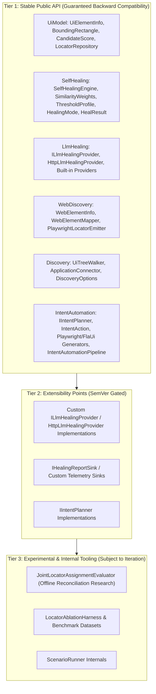

# 🛡️ API Stability, Versioning & Beta-Exit Criteria / API Kararlılığı, Sürüm Politikası ve Beta Çıkış Kriterleri

This document formally defines the public API stability guarantees, the semantic versioning policy across pre-1.0 and post-1.0 lifecycles, and the concrete, checkable exit criteria required for graduating **Automation Sandbox** from beta to `1.0.0` GA (General Availability).

> 💡 **Select Language / Dil Seçin:**
> - [🇬🇧 English Guide](#-english-guide)
> - [🇹🇷 Türkçe Kılavuz](#-türkçe-kılavuz)

---

## 🇬🇧 English Guide

### 1. Public API Surface & Stability Tiers

Automation Sandbox distinguishes between stable public contracts, extensible provider surfaces, and experimental/internal subsystems.

#### Tier 1: Stable Public API
The following packages, namespaces, and core types represent the committed public contract:
- **`AutomationSandbox.UiModel`**: `UiElementInfo`, `BoundingRectangle`, `CandidateScore`, `ScoreComponents`, `LocatorRepository`, `LocatorRecord`, `LocatorHealingHistoryEntry`, `UiTreeSerializer`.
- **`AutomationSandbox.SelfHealing`**: `SelfHealingEngine`, `SelfHealingResolver`, `SimilarityWeights`, `ThresholdProfile`, `TreeCalibrator`, `HealingMode`, `HealResult`, `HealingReportDocument`.
- **`AutomationSandbox.LlmHealing`**: `ILlmHealingProvider`, `HttpLlmHealingProvider`, `ClaudeHealingProvider`, `GeminiHealingProvider`, `OpenAiHealingProvider`, `OllamaHealingProvider`, `LlmHealingResult`.
- **`AutomationSandbox.WebDiscovery`**: `WebElementInfo`, `WebElementMapper`, `PlaywrightDomCaptureScript`, `PlaywrightLocatorEmitter`.
- **`AutomationSandbox.Discovery`**: `UiTreeWalker`, `ApplicationConnector`, `DiscoveryOptions`, `DiscoveryResult`.
- **`AutomationSandbox.IntentAutomation`**: `IIntentPlanner`, `DeterministicIntentPlanner`, `LlmIntentPlanner`, `IntentAction`, `IntentActionType`, `PlaywrightCSharpTestGenerator`, `PlaywrightTypeScriptTestGenerator`, `FlaUiCSharpTestGenerator`, `IntentAutomationPipeline`.
- **`AutomationSandbox.PlaywrightLiveExploration`**: `PlaywrightLiveExplorer`.

#### Tier 2: Extensibility Points
Interfaces intended for consumer extension (`ILlmHealingProvider`, `IHealingReportSink`, `IIntentPlanner`) are protected against breaking changes post-1.0. Any additive default methods will provide default implementations or non-breaking base templates.

#### Tier 3: Internal & Experimental
Types in `ScenarioRunner` (such as `JointLocatorAssignmentEvaluator` and `LocatorAblationHarness`) are research or benchmark tools and do not constitute a public NuGet API contract.

---

### 2. Semantic Versioning & Breaking Change Policy

Automation Sandbox adheres to [Semantic Versioning 2.0.0](https://semver.org/):

#### Pre-1.0 Lifecycle (`0.x.y`)
- **Prerelease Tags (`v0.2.0-beta.x` / `preview.x`):** Published preview artifacts for early validation.
- **Minor Bumps (`0.2.x` $\rightarrow$ `0.3.0`):** May introduce necessary architectural refinements or breaking changes. Any breaking change must be highlighted with migration instructions in the release notes (`docs/release-notes/`).
- **Patch Bumps (`0.2.0` $\rightarrow$ `0.2.1`):** Strictly backwards-compatible bug fixes, performance improvements, and non-breaking additions.

#### Post-1.0 Lifecycle (`1.0.0+`)
- **Major Releases (`X.0.0`):** Reserved for breaking API changes, deprecation removals, or runtime target shifts.
- **Minor Releases (`1.X.0`):** Backwards-compatible features, new provider integrations, or additive scoring signals.
- **Patch Releases (`1.0.X`):** Backwards-compatible bug fixes, security patches, and documentation updates.
- **Deprecation Grace Period:** Any public API slated for removal must be marked with `[Obsolete]` for at least one minor release cycle prior to deletion.

---

### 3. Concrete Beta-Exit Criteria (1.0 GA Checklist)

To exit beta and release `1.0.0`, all of the following conditions must be satisfied:

- [ ] **Benchmark Safety Bound:** Heuristic false-heal rate $\le 10.0\%$ on the HandBrake 1.8.2 benchmark suite under `ThresholdProfile.Balanced` (`0.75` confidence threshold).
- [ ] **Multi-Application Verification:** Proven calibration and telemetry across both HandBrake (WPF) and ShareX (WinForms) fixtures without unexplained variance.
- [ ] **Zero Open P0/P1 Safety Issues:** No open issues labeled `safety`, `security`, or `correctness` with P0 or P1 priority.
- [ ] **Cross-Platform CI Stability:** 100% passing tests across Windows (`net48`, `net8.0`) and Linux (`net8.0`) matrix with zero unhandled flaky retries.
- [ ] **Supply Chain Security:** Zero High or Critical advisories under `dotnet list package --vulnerable` / `NuGetAudit` across all target frameworks.
- [ ] **Complete Bilingual Documentation Parity:** 100% structural and conceptual parity between English and Turkish documentation across all guides in `docs/`.
- [ ] **Verified Consumer Quickstarts:** Automated CI execution of both standalone sample projects (`HeuristicHealingQuickstart` and `PlaywrightEndToEndQuickstart`) restoring purely from nuget.org / published artifacts.

---

## 🇹🇷 Türkçe Kılavuz

### 1. Genel API Yüzeyi ve Kararlılık Kademeleri

Automation Sandbox, kararlı genel sözleşmeler, genişletilebilir sağlayıcı yüzeyleri ve deneysel/dahili alt sistemler arasında ayrım yapar.

#### 1. Kademe: Kararlı Genel API
Aşağıdaki paketler, ad alanları ve temel türler taahhüt edilen genel sözleşmeyi temsil eder:
- **`AutomationSandbox.UiModel`**: `UiElementInfo`, `BoundingRectangle`, `CandidateScore`, `ScoreComponents`, `LocatorRepository`, `LocatorRecord`, `LocatorHealingHistoryEntry`, `UiTreeSerializer`.
- **`AutomationSandbox.SelfHealing`**: `SelfHealingEngine`, `SelfHealingResolver`, `SimilarityWeights`, `ThresholdProfile`, `TreeCalibrator`, `HealingMode`, `HealResult`, `HealingReportDocument`.
- **`AutomationSandbox.LlmHealing`**: `ILlmHealingProvider`, `HttpLlmHealingProvider`, `ClaudeHealingProvider`, `GeminiHealingProvider`, `OpenAiHealingProvider`, `OllamaHealingProvider`, `LlmHealingResult`.
- **`AutomationSandbox.WebDiscovery`**: `WebElementInfo`, `WebElementMapper`, `PlaywrightDomCaptureScript`, `PlaywrightLocatorEmitter`.
- **`AutomationSandbox.Discovery`**: `UiTreeWalker`, `ApplicationConnector`, `DiscoveryOptions`, `DiscoveryResult`.
- **`AutomationSandbox.IntentAutomation`**: `IIntentPlanner`, `DeterministicIntentPlanner`, `LlmIntentPlanner`, `IntentAction`, `IntentActionType`, `PlaywrightCSharpTestGenerator`, `PlaywrightTypeScriptTestGenerator`, `FlaUiCSharpTestGenerator`, `IntentAutomationPipeline`.
- **`AutomationSandbox.PlaywrightLiveExploration`**: `PlaywrightLiveExplorer`.

#### 2. Kademe: Genişletilebilirlik Noktaları
Tüketici eklentileri için tasarlanan arayüzler (`ILlmHealingProvider`, `IHealingReportSink`, `IIntentPlanner`), 1.0 sonrasında kırıcı değişikliklere karşı korunur.

#### 3. Kademe: Dahili ve Deneysel Araçlar
`ScenarioRunner` içindeki araştırma amaçlı sınıflar (`JointLocatorAssignmentEvaluator`, `LocatorAblationHarness` vb.) genel NuGet API sözleşmesine dahil değildir.

---

### 2. Semantik Sürümleme ve Değişiklik Politikası

Automation Sandbox [Semantic Versioning 2.0.0](https://semver.org/) standardını uygular:

- **1.0 Öncesi (`0.x.y`):** `0.X.0` sürümleri mimari iyileştirmeler veya kırıcı değişiklikler içerebilir; tüm değişiklikler sürüm notlarında açıkça belgelenir. `0.X.Y` yama sürümleri geriye dönük uyumludur.
- **1.0 Sonrası (`1.0.0+`):** `X.0.0` kırıcı değişiklikler içindir. `1.X.0` geriye dönük uyumlu yeni özellikler ekler. `1.0.X` hata düzeltmelerini kapsar.
- **Kullanımdan Kaldırma (Deprecation):** Kaldırılması planlanan genel API'ler silinmeden önce en az bir minör sürüm boyunca `[Obsolete]` ile işaretlenir.

---

### 3. Somut Beta Çıkış Kriterleri (1.0 GA Kontrol Listesi)

Beta sürecini tamamlayıp `1.0.0` genel sürümüne geçmek için aşağıdaki tüm koşulların sağlanması gerekir:

- [ ] **Benchmark Güvenlik Sınırı:** HandBrake 1.8.2 benchmark paketinde `ThresholdProfile.Balanced` altında sezgisel yanlış iyileştirme oranı $\le \%10.0$ olmalıdır.
- [ ] **Çoklu Uygulama Doğrulaması:** HandBrake (WPF) ve ShareX (WinForms) veri setlerinde tutarlı ve doğrulanmış kalibrasyon.
- [ ] **Sıfır Açık P0/P1 Güvenlik Hatası:** `safety`, `security` veya `correctness` etiketli hiçbir açık P0/P1 sorun kalmamalıdır.
- [ ] **Çapraz Platform CI Kararlılığı:** Windows (`net48`, `net8.0`) ve Linux (`net8.0`) CI iş hatlarında $\%100$ başarı.
- [ ] **Tedarik Zinciri Güvenliği:** `NuGetAudit` / `dotnet list package --vulnerable` taramasında sıfır Yüksek/Kritik güvenlik açığı.
- [ ] **Tam Çift Dilli Belge Uyumu:** `docs/` altındaki tüm rehberlerde İngilizce ve Türkçe içerikler arasında $\%100$ yapısal ve kavramsal uyum.
- [ ] **Doğrulanmış Başlangıç Örnekleri:** Bağımsız `HeuristicHealingQuickstart` ve `PlaywrightEndToEndQuickstart` örneklerinin CI üzerinde doğrudan nuget.org paketleriyle başarıyla çalışması.
