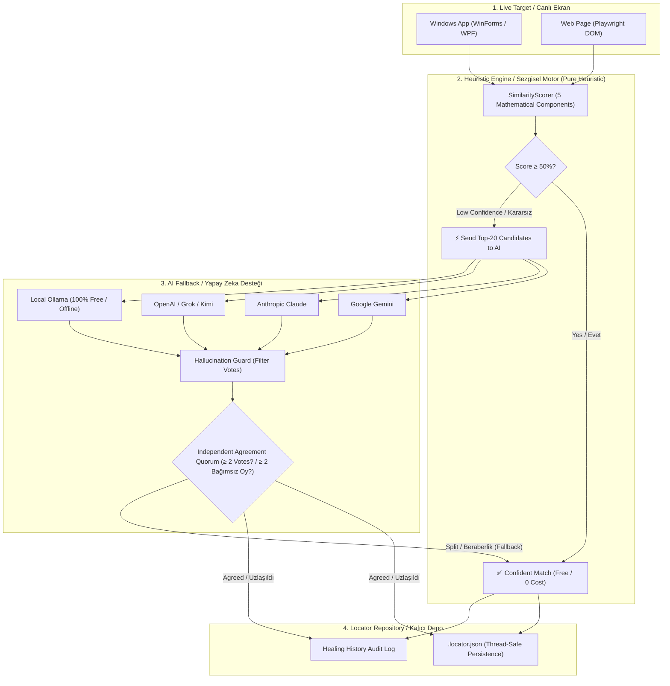

# 🚀 Automation Sandbox Documentation / Dökümantasyon

Welcome to **Automation Sandbox**! / **Automation Sandbox** projesine hoş geldiniz!

> 💡 **Select Language / Dil Seçin:**
> - [🇬🇧 English Documentation](#-english-overview)
> - [🇹🇷 Türkçe Dökümantasyon](#-türkçe-genel-bakış)

---

## 🇬🇧 English Overview

### 💡 What is Automation Sandbox? (Simple Explanation)
Imagine you write an automated test that clicks a button called `"Submit"`. One day, the developers rename that button to `"Complete Registration"`. Standard test tools (like Selenium or Appium) will crash because they can no longer find `"Submit"`.

**Automation Sandbox is like a smart GPS for your software tests:**
1. It remembers what the button looked like (size, location, parent window, role).
2. When the ID or name breaks, it calculates a **similarity score** (0% - 100%) across all elements on the screen.
3. If it is confident (>= 50%), it identifies the right element **without any AI cost** (pure heuristic, sub-50ms for 3,000 controls on developer hardware). By default (`HealingMode.Review`) the candidate is routed to report telemetry for approval rather than applied automatically; opt into `HealingMode.AutoHeal` to have it retry the action and persist the healed locator automatically.
4. If it is unsure, it collects independent votes from providers such as Gemini, Claude, OpenAI, or local Ollama; an LLM pick is permitted when at least two votes name the same candidate. This agreement is not a correctness guarantee: all 34 unanimous deleted-element verdicts in the measured runs were false heals.

---

### 📚 Documentation Index

| Guide | Description |
| :--- | :--- |
| 🚀 [**Getting Started**](docs/getting-started.md) | Step-by-step installation, core concepts, and copy-paste code examples. |
| 📦 [**Published Package Quickstart**](docs/consumer-quickstart.md) | First run from `dotnet add package` to a verified heuristic heal using the maintained NuGet consumer sample. |
| 🔌 [**Add Self-Healing to an Existing Suite**](docs/integration-existing-suite.md) | Wiring the engine into a suite you already have (Playwright, NUnit, xUnit, Reqnroll) and a first-week `Observe` → `AutoHeal` rollout. |
| ⚖️ [**How It Compares**](docs/comparison.md) | Honest comparison with Healenium and commercial healers (Testim, Mabl, Ranorex, Functionize), including when another tool is the better fit. |
| 📋 [**Release Notes**](https://github.com/mustafasercansak/automation-sandbox/releases) | Latest release notes, breaking changes, and artifact downloads on GitHub. |
| 💻 [**Desktop Automation**](docs/desktop-automation.md) | How to test Windows desktop applications (WinForms, WPF, WinUI). |
| 🐧 [**Linux Desktop via AT-SPI (Research)**](docs/linux-desktop-atspi-research.md) | Findings on an AT-SPI2 desktop discovery backend: what maps cleanly, the `AutomationId` gap, and a backend sketch. No production code. |
| 🌐 [**Web Automation**](docs/web-automation.md) | How to test Web applications with Playwright (Shadow DOM & iframe support). |
| 🎯 [**Intent-Aware Healing**](docs/intent-aware-healing.md) | Using `TestIntent` to explain *why* a test step is being performed. |
| 📊 [**Healing Reports & Dashboard**](docs/healing-reports.md) | JSON and HTML telemetry for accepted, declined, and failed locator-resolution attempts. |
| 🧭 [**Intent-Driven Automation**](docs/intent-driven-automation.md) | M6: intent planning (deterministic + LLM-backed), DOM/desktop matching, locator recording, Playwright/FlaUI test generation, intent flow reports, pipeline orchestration, and live page exploration. |
| 🔬 [**Benchmark & Calibration**](docs/benchmark-calibration.md) | Multi-signal locator ablation benchmark on real organic apps, score overlap findings, and threshold trade-off analysis. |
| 📝 [**Can You Trust an LLM to Fix a Broken Locator?**](docs/blog/llm-false-heal-study.md) | Standalone write-up of the multi-provider consensus study: 34/34 unanimous verdicts on deleted elements were false heals, why, and how the design responds. |
| 🧪 [**Case Study: Healing HandBrake's Real UI Tree**](docs/blog/case-study-handbrake.md) | Two real refactors on a captured HandBrake window: a rename that heals at score 1.000, and a deleted tab that false-heals at the default threshold but is declined after calibration. |
| 🔗 [**Joint Locator Reconciliation**](docs/joint-locator-reconciliation.md) | Opt-in batch ownership guard for independently accepted locator heals, including deterministic assignment and limitations. |
| 🤖 [**LLM Providers**](docs/llm-providers.md) | Setting up AI providers (Gemini, Claude, OpenAI, Ollama) and implementing custom `ILlmHealingProvider`s. |
| 🔐 [**LLM Security Model**](docs/llm-security-model.md) | Trust boundaries, disclosed fields, prompt-injection and PII limitations, provider retention, and local report handling. |
| 📄 [**JSON Schema Reference**](docs/json-schema.md) | Field-by-field breakdown of the `.locator.json` repository file. |
| 📦 [**NuGet Packaging**](docs/nuget-packaging.md) | Creating preview `.nupkg` artifacts and preparing a publish checklist. |
| 🛡️ [**API Stability & Beta-Exit Criteria**](docs/versioning-and-stability.md) | Public API contracts, semantic versioning policy, and concrete checkable beta-exit criteria for 1.0. |

---

## 🇹🇷 Türkçe Genel Bakış

### 💡 Automation Sandbox Nedir? (En Basit Anlatım)
Yazılım testinizde `"Kaydet"` adlı bir butona tıklayan otomatik bir test yazdığınızı hayal edin. Bir gün yazılımcılar bu butonun adını `"Değişiklikleri Onayla"` olarak değiştirdi. Standart test araçları (Selenium, Appium vb.) eski butonu bulamadığı için test **hata verir ve çöker**.

**Automation Sandbox, testleriniz için akıllı bir navigasyon (GPS) gibidir:**
1. Butonun eski halini (boyutunu, ekrandaki yerini, penceresini, türünü) hafızasına kaydeder.
2. Adı veya ID'si değiştiğinde, ekrandaki tüm elemanları inceleyerek bir **benzerlik skoru** (%0 - %100) hesaplar.
3. Eminse (>= %50), doğru elemanı **yapay zeka maliyeti olmadan** belirler (saf sezgisel; geliştirici donanımında 3.000 kontrol için 50 milisaniyenin altında). Varsayılan modda (`HealingMode.Review`) aday, otomatik uygulanmak yerine onay için rapor telemetrisine yönlendirilir; eylemi otomatik yeniden deneyip iyileştirilen locator'ı otomatik kaydetmek için `HealingMode.AutoHeal` moduna geçebilirsiniz.
4. Kararsız kalırsa Gemini, Claude, OpenAI veya yerel Ollama gibi sağlayıcılardan bağımsız oylar toplar; en az iki oy aynı adayı gösterirse LLM seçimine izin verir. Bu uzlaşma bir doğruluk garantisi değildir: silinmiş eleman ölçümlerindeki 34 oybirliği kararının tamamı yanlış iyileştirmeydi.

---

### 📚 Döküman Haritası

| Rehber | Açıklama |
| :--- | :--- |
| 🚀 [**Başlangıç Rehberi**](docs/getting-started.md) | Adım adım kurulum, temel mantık ve kopyala-yapıştır kod örnekleri. |
| 📦 [**Yayınlanmış Paket Hızlı Başlangıcı**](docs/consumer-quickstart.md) | `dotnet add package` komutundan bakımı yapılan NuGet consumer örneğiyle doğrulanmış sezgisel healing'e ilk çalıştırma. |
| 🔌 [**Mevcut Test Paketine Self-Healing Ekleme**](docs/integration-existing-suite.md) | Hâlihazırda çalışan bir pakete (Playwright, NUnit, xUnit, Reqnroll) motoru bağlama ve ilk hafta `Observe` → `AutoHeal` geçişi. |
| ⚖️ [**Karşılaştırma**](docs/comparison.md) | Healenium ve ticari healer'larla (Testim, Mabl, Ranorex, Functionize) dürüst karşılaştırma; başka bir aracın daha uygun olduğu durumlar dahil. |
| 📋 [**Sürüm Notları**](https://github.com/mustafasercansak/automation-sandbox/releases) | GitHub üzerindeki en güncel sürüm notları, değişiklikler ve artifact indirmeleri. |
| 💻 [**Masaüstü Testleri**](docs/desktop-automation.md) | Windows masaüstü (WinForms, WPF) uygulamalarını test etme. |
| 🐧 [**AT-SPI ile Linux Masaüstü (Araştırma)**](docs/linux-desktop-atspi-research.md) | AT-SPI2 tabanlı bir masaüstü keşif backend'i üzerine bulgular: nesi temiz eşleşiyor, `AutomationId` boşluğu ve backend taslağı. Üretim kodu yok. |
| 🌐 [**Web Testleri**](docs/web-automation.md) | Playwright ile web sitelerini test etme (Shadow DOM ve iframe dahil). |
| 🎯 [**Intent-Aware Healing**](docs/intent-aware-healing.md) | `TestIntent` ile test adımının amacını yapay zekaya anlatma. |
| 📊 [**İyileştirme Raporları & Panel**](docs/healing-reports.md) | Kabul edilen, reddedilen ve başarısız locator çözüm denemeleri için JSON ve HTML telemetrisi. |
| 🧭 [**Intent Tabanlı Otomasyon**](docs/intent-driven-automation.md) | M6: intent planlama (deterministic + LLM destekli), DOM/masaüstü eşleştirme, locator kaydı, Playwright/FlaUI test üretimi, intent raporu, pipeline orkestrasyonu ve canlı sayfa keşfi. |
| 🔬 [**Benchmark ve Kalibrasyon**](docs/benchmark-calibration.md) | Gerçek uygulamalarda çoklu sinyal ablasyon testi, skor çakışması bulguları ve eşik denge analizi. |
| 📝 [**Bir LLM'e Kırık Locator'ı Düzelttirebilir misiniz?**](docs/blog/llm-false-heal-study.md) | Çok-sağlayıcılı konsensüs çalışmasının bağımsız yazısı: silinmiş elemanlarda 34/34 oybirliği yanlış iyileştirmeydi — nedeni ve tasarıma yansıması. |
| 🧪 [**Vaka Çalışması: HandBrake'in Gerçek UI Ağacını İyileştirme**](docs/blog/case-study-handbrake.md) | Yakalanmış bir HandBrake penceresinde iki gerçek refactor: 1.000 skorla iyileşen bir yeniden adlandırma ve varsayılan eşikte yanlış iyileşen ama kalibrasyon sonrası reddedilen silinmiş bir sekme. |
| 🔗 [**Birleşik Locator Uzlaştırması**](docs/joint-locator-reconciliation.md) | Bağımsız kabul edilen locator iyileştirmeleri için deterministik, isteğe bağlı batch sahiplik koruması ve sınırları. |
| 🤖 [**Yapay Zeka Kurulumu**](docs/llm-providers.md) | Gemini, Claude, OpenAI, yerel Ollama ve özel `ILlmHealingProvider` geliştirme. |
| 🔐 [**LLM Güvenlik Modeli**](docs/llm-security-model.md) | Güven sınırları, açıklanan alanlar, prompt injection ve PII sınırları, sağlayıcı retention ve yerel rapor güvenliği. |
| 📄 [**JSON Şema Rehberi**](docs/json-schema.md) | `.locator.json` kayıt dosyasının alan alan detaylı açıklaması. |
| 📦 [**NuGet Paketleme**](docs/nuget-packaging.md) | Preview `.nupkg` artifact üretimi ve yayın kontrol listesi. |
| 🛡️ [**API Kararlılığı & Beta Çıkış Kriterleri**](docs/versioning-and-stability.md) | Genel API sözleşmeleri, semantik sürümleme politikası ve 1.0 için somut kontrol listesi. |

---

## 🏛️ System Architecture Diagram / Mimari Şema

> **Independent model agreement is not a correctness guarantee / Bağımsız model uzlaşması doğruluk garantisi değildir.**
> **EN:** This quorum rule blocks a single model from deciding, but multiple models can select the same wrong neighbour. In four live runs, all 34 unanimous deleted-element verdicts were false heals.
> **TR:** Bu quorum kuralı tek modelin seçimini engeller, fakat birden fazla model aynı yanlış komşuya oy verebilir. Dört canlı koşuda silinmiş elemanlar için verilen 34 oybirliği kararının tamamı yanlış iyileştirmeydi.
> [Full finding / Resmi bulgu](docs/benchmark-calibration.md#6-multi-provider-llm-consensus-as-an-absence-detector-97)
